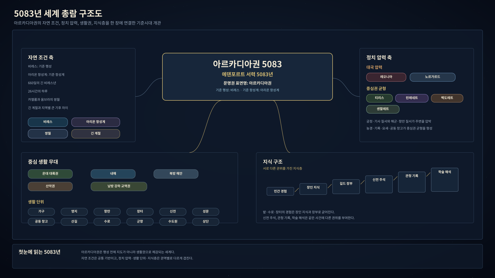
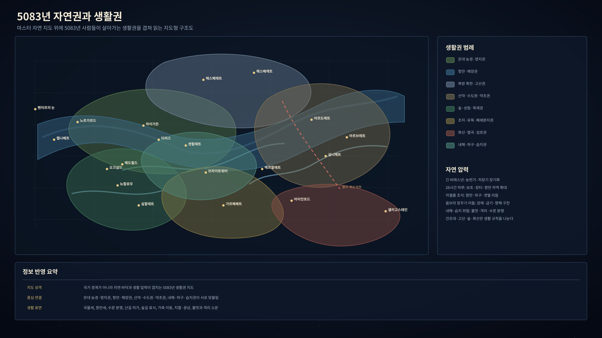
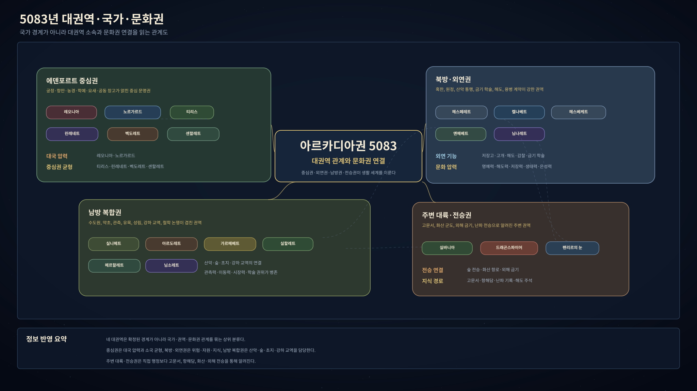
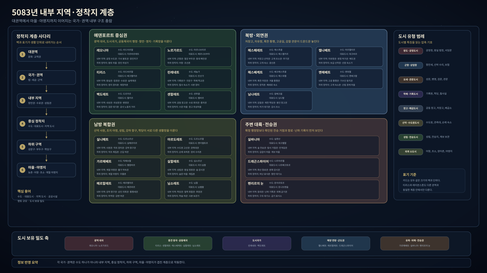
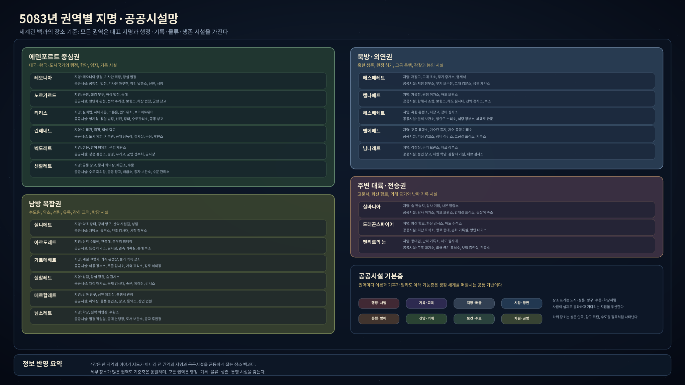

# 아르카디아 기준시대 5083 객관정보 제2판

에덴포르트 서력 5083년의 아르카디아는 비레스 북반구 여러 대륙권과 내해, 항만, 산악, 초지, 숲, 화산섬, 외해가 느슨하게 맞물린 문명권이다. 국가, 권역, 종족, 언어, 달력, 장소, 제도, 생업, 생활 환경이 각자의 속도로 겹치며, 같은 시대 안에서도 궁정·항만·영지·접경·산악·강하 교역권의 생활 조건은 크게 다르다.

## 1. 5083년 세계 총람

그림: 5083년 아르카디아권을 자연 조건, 정치 압력, 중심 생활 무대, 지식 구조로 나누어 정리한 세계 총람 도식이다. 이 도식은 행성 전체 지도가 아니라 기준시대 사람들이 실제로 살아가는 문명권의 작동 구조를 보여준다.

그림: 5083년 아르카디아권의 생활권 표면 설정화. 성문과 장터, 항만과 수로, 신전길, 공동 창고, 산길, 상단 이동이 한 시야에 배치되어 있으며, 온대 대륙권·내해·북방 해안·산악권·남방 강하 교역권이 작은 인물에게 어떤 생활 환경으로 닿는지 보여준다.

| 항목 | 내용 |
|---|---|
| 기준 행성 | 비레스 |
| 기준 항성계 | 아리온 항성계 |
| 문명권 표면명 | 아르카디아권 |
| 중심 생활 무대 | 비레스 북반구의 온대 대륙권, 내해, 북방 해안, 산악권, 남방 강하 교역권 |
| 시대 성격 | 저기술 전근대 사회. 금속, 성채, 선박, 장부, 신전, 길드, 관측표는 있으나 현대 과학 체계는 없다. |
| 자연 조건 | 660일의 긴 비레스년, 26시간의 하루, 카엘룸과 움브라의 쌍월, 긴 계절, 지역별 큰 기후 차이 |
| 정치 조건 | 레오니아와 노르가르드가 대국 압력을 형성하고, 티리스·린레네트·벡도레트·센할레트가 중심권 균형을 이룬다. |
| 지식 구조 | 민간 경험, 장인 지식, 길드 장부, 신전 주석, 관청 기록, 학술 해석이 서로 다른 권위를 가진다. |
| 생활 단위 | 가구, 영지, 항만, 장터, 신전, 성문, 공동 창고, 산길, 수로, 군항, 수도원, 상단 |

5083년 사람들의 일상 세계 인식은 행성 단위보다 생활권 단위에 가깝다. 농민에게 세계는 밭과 수로와 장터일이고, 선원에게 세계는 조석과 항만세와 해도이며, 피난민에게 세계는 이름패와 배급 줄과 닫힌 성문이다. 그러나 이 모든 생활 표면은 같은 자연 조건과 같은 기준시대 위에서 작동한다.

## 2. 자연권과 생활권

그림: 5083년 아르카디아권의 자연 바닥과 생활권이 겹치는 방식을 정리한 지도형 구조도. 이 그림은 국가 경계도가 아니라 온대 농경·영지권, 항만·해양권, 북방 혹한·고산권, 산악·수도원·약초권, 숲·성림·목재권, 초지·유목·폐쇄분지권, 화산·열곡·섬호권, 내해·하구·습지권이 서로 맞물리는 생활 압력 지도를 보여준다.

그림: 5083년 자연권과 생활권을 여덟 장면으로 나누어 펼친 환경 설정화. 온대 농경·영지권의 곡물세와 공동 창고, 항만·해양권의 선박 수리와 해도, 북방 혹한·고산권의 저장고와 전사 회의, 산악·수도원·약초권의 관측표와 약초 건조대, 숲·성림·목재권의 숲길 표식과 사냥권, 초지·유목·폐쇄분지권의 가축 표식과 물권, 화산·열곡·섬호권의 흑석과 화산가스, 내해·하구·습지권의 수문과 격리 표식이 각각 다른 생활 환경으로 드러난다.

| 생활권 | 자연 바닥 | 중심 권역 | 생활에 보이는 모습 |
|---|---|---|---|
| 온대 농경·영지권 | 북서 대륙핵, 내해 저지대, 대하천 유역, 긴 생장기 | 티리스, 센할레트, 하이가든, 메도필드, 뉴할로우 | 곡물세, 수로, 종자 보관, 장터일, 겨울 저장, 공동 창고 |
| 항만·해양권 | 내해, 북방 외해, 서부 열대 대양, 조석과 안개 | 노르가르드, 켈나베트, 메르할레트, 펜리르의 눈 주변 | 항만세, 선박 수리, 보험, 선원 명부, 해도, 등대와 난파 소문 |
| 북방 혹한·고산권 | 냉대 육괴, 고개, 빙권 경계, 적설과 해빙 | 헤스페레트, 헤스베케트, 프로스트홀드, 북방 고개 초소 | 저장고, 혹한 통행소, 방한구, 고개 폐쇄, 전사 회의, 용병 계약 |
| 산악·수도원·약초권 | 동부 장산계, 고산권, 산악 유역, 눈선과 협곡 | 아르도레트, 님소레트, 실니메트, 선스파이어 | 산길 허가, 관측표, 약초 건조대, 수도원 필사, 물맛 논쟁 |
| 숲·성림·목재권 | 온대 산림, 습윤 산림, 숲 경계, 고립 생태구 | 실할레트, 오크실드, 실바니아 전승권 | 목재 허가, 숲길 표식, 사냥권, 성림 의례, 벌목 금기 |
| 초지·유목·폐쇄분지권 | 반건조 초지, 염호, 비그늘 고원, 계절 물가 | 가르메베트, 헤스페레트 일부 초지, 메도필드 주변 | 가축 표식, 물권, 계절 야영지, 젖나눔, 천막 이동 |
| 화산·열곡·섬호권 | 화산섬호, 지열, 열곡, 화산재 토양 | 드래곤스파이어, 아이언포드, 스톤홀, 남서 열곡권 | 흑석, 현무암, 화산가스 경고, 지열수, 광상, 유리질 암석 |
| 내해·하구·습지권 | 얕은 바다, 삼각주, 하구 저산소수, 늪지 | 센할레트 수로권, 브라이트워터, 메르할레트 강하권 | 물맛, 격리 표식, 수문 분쟁, 물길 장부, 병자 소문 |

자연권은 국가 경계와 딱 맞지 않는다. 같은 티리스 안에서도 하이가든의 곡물길, 오크실드의 숲길, 브라이트워터의 물길, 레이븐스톤의 성문선은 서로 다른 생활 압력을 만든다. 같은 북방권 안에서도 헤스베케트 저장고와 켈나베트 원정 허가소는 완전히 다른 하루를 만든다.

### 2.1 5083년 자연 압력

| 자연 압력 | 실제 생활 결과 | 대표 장소·권역 |
|---|---|---|
| 긴 비레스년 | 농번기와 저장기가 길고, 절기 오차가 장부와 신앙 논쟁이 된다. | 티리스 농경권, 센할레트, 아르도레트 관측권 |
| 26시간 하루 | 보초 교대, 장터 준비, 야간 이동, 항만 하역 시간이 길게 늘어진다. | 레이븐스톤, 노르가르드 군항, 벡도레트 성문 |
| 카엘룸의 강한 조석 | 항만, 내해, 하구, 갯벌, 밀수로, 난파 기억을 좌우한다. | 노르가르드, 켈나베트, 메르할레트, 펜리르의 눈 |
| 움브라의 장주기 어둠 | 장례, 금기, 항해자 구전, 법정 비유와 결합한다. | 티리스 법정권, 신전권, 외해 항로 |
| 고산·빙권 경계 | 고개 폐쇄, 동상, 산길 허가, 약초 채집 시기, 관측소 접근권을 만든다. | 헤스베케트, 아르도레트, 헤스페레트 고개 |
| 내해·습지 위험 | 물맛 변화, 격리 의심, 하구 병원체, 수문 분쟁이 생긴다. | 브라이트워터, 센할레트 수로, 메르할레트 하구 |
| 화산·지열권 | 지열수, 흑석, 화산재 토양, 가스 위험, 궁정 신화 물자를 낳는다. | 드래곤스파이어, 아이언포드, 남서 열곡권 |
| 건조대와 비그늘 고원 | 물권, 초지 약속, 가축 이동, 먼지와 염류 문제가 생활 규칙이 된다. | 가르메베트, 헤스페레트 초지 |
| 산림·성림 경계 | 벌목 허가, 사냥권, 숲길 증언, 장례 기억, 전승을 낳는다. | 실할레트, 오크실드, 실바니아 |

## 3. 대륙권·국가·문화권 백과

### 3.1 대권역

| 대권역 | 포함 국가·권역 | 성격 |
|---|---|---|
| 에덴포르트 중심권 | 레오니아, 노르가르드, 티리스, 린레네트, 벡도레트, 센할레트 | 궁정, 항만, 농경, 학예, 요새, 공동 창고가 얽힌 중심 문명권 |
| 북방·외연권 | 헤스페레트, 켈나베트, 헤스베케트, 옌메베트, 님나레트 | 혹한, 원정, 산악 통행, 금기 학술, 해도, 용병 계약이 강한 권역 |
| 남방 복합권 | 실니메트, 아르도레트, 가르메베트, 실할레트, 메르할레트, 님소레트 | 수도원, 약초, 관측, 유목, 성림, 강하 교역, 철학 논쟁이 겹친 권역 |
| 주변 대륙·전승권 | 실바니아, 드래곤스파이어, 펜리르의 눈 | 고문서, 화산 군도, 외해 금기, 난파 전승, 항해담으로 알려진 주변 권역 |

### 3.2 국가·권역 상세

| 이름 | 분류 | 지리·환경 | 통치·제도 | 생업·물자 | 언어·달력 | 주요 장소 |
|---|---|---|---|---|---|---|
| 레오니아 | 중앙집권 왕국 | 온대 내륙, 궁정 도시권, 기사 봉토 | 왕권, 기사단, 서임문, 용 상징, 궁정 외교 | 궁정 공예, 고급 장인, 의례 물자, 기사 장비 | 궁정어, 용관력 | 레오니아 궁정, 기사단 회랑, 왕실 법정 |
| 노르가르드 | 해군·철강 팽창 왕국 | 북방 해안, 군항, 철강 부두, 조석 강한 항만 | 왕과 상인 길드의 이중 체제, 해상 법원, 항만세 관청 | 선박, 철강, 소금, 항만세, 보험, 해군 병참 | 항만어, 조류력 | 노르가르드 군항, 철강 부두, 해상 법정, 등대 |
| 티리스 | 농경·목축 기반 군주국 | 온대 농경 영지, 숲 경계, 서부 접경, 내륙 장터길 | 국왕과 귀족, 왕실 법정, 영지 재판, 낮은 율례, 녹색 신앙 | 곡물, 양모, 목재, 채석재, 물길 관리, 피난민 구휼 | 농경·법정어, 녹지절력 | 실버킵, 레이븐스톤, 하이가든, 그린할로우, 뉴할로우 |
| 린레네트 | 학예 공화 도시국가 | 도시·학술권, 극장과 기록원이 밀집한 도심 | 선출 지도자, 도시 의회, 극장 기록자, 후원 계약 | 필사본, 공연, 후원 경제, 공개 낭독, 학술 교류 | 학예권 지역어, 예술력 | 린레네트 기록원, 극장, 학예 학교 |
| 벡도레트 | 요새 군사 도시국가 | 성문, 방벽, 병영, 군사지구 | 방어 평의회, 군법 재판, 성문 규칙, 중립 외교 | 무기고, 방어 기술, 성벽 보수, 공사 동원 | 요새권 지역어, 철문력 | 벡도레트 성문, 방어 평의회, 군법 재판소 |
| 센할레트 | 공동체 농업 국가 | 수로, 공동 창고, 농경 저지대, 내해 수권 | 대표 의회, 수로 회의, 공동 창고 규례 | 종자 보관, 배급, 수로 관리, 구휼, 재정착 농업 | 공동체 장부어, 공동력 | 공동 창고, 종자 회의장, 배급소, 수문 |
| 헤스페레트 | 북방 복합 권역 | 산악, 혹한, 광산, 고개, 초지 일부 | 전사 서약권, 용병 계약, 맹세석, 저장고 공동체 | 무기, 갑옷, 보존품, 모피, 용병 중개, 산악 통행 | 북방권 집단어, 명예력 | 저장고, 고개 초소, 무기 중개소, 맹세석 |
| 켈나베트 | 항해·탐험 연방 | 자유항, 외해 항로, 해도 보관소 | 연합 의회, 항해자 조합, 원정 허가 | 해도, 선박, 발견물 신고, 사설 무장 물자, 보험 | 항해권 지역어, 해도력 | 원정 허가소, 자유항, 해도 창고 |
| 헤스베케트 | 혹한 생존 군주국 | 북방 고위도, 눈길, 빙권 접경, 겨울 통행소 | 군주, 전사 회의, 저장 의무, 혹한 통행 규칙 | 방한구, 보존식, 저장고, 겨울 장비, 사냥 나눔 | 혹한권 지역어, 저장력 | 헤스베케트 저장고, 혹한 통행소 |
| 옌메베트 | 고공·자연 동맹 군주국 | 산악 고공길, 숲 경계, 기상 변화가 큰 고지 | 기수단, 자연 동맹 기록, 경계 윤리 | 고공 통행, 산악 안내, 숲 경계 관리, 장비 손질 | 고공·숲 경계어, 생태력 | 고공 통행소, 기수단 둥지, 자연 동맹 기록소 |
| 님나레트 | 비밀 학술·연성 국가 | 북방 외연의 제한 학술권, 재료 보관지 | 연성 학술 의회, 폐쇄 군주제, 외부 감찰 | 연성 재료, 금기 학술 조사, 봉인 기록, 감찰 장부 | 제한 학술어, 은성력 | 금기 학술 보관소, 감찰실, 재료 장부소 |
| 실니메트 | 남방 복합 권역 | 산악, 숲, 강하 교역, 초지, 약초권 | 외부 학술 분류명. 내부는 여러 국가와 생활권으로 갈린다. | 약초, 향, 관측표, 필사본, 유목 물자, 강하 교역 | 남방권 복합어, 관측력·이동력·시장력 병존 | 약초 장터, 강하 항구, 산악 사원길, 성림 |
| 아르도레트 | 산악 신정 왕국 | 고산 수도원, 관측대, 봉우리 의례장 | 수도사, 산악 전사, 왕실 의례, 천상 법원 | 관측표, 광물, 약초, 필사본, 등정 허가 | 산악 관측어, 관측력 | 산악 수도원, 관측대, 봉우리 의례장 |
| 가르메베트 | 유목 부족 연합 | 초지, 물가, 계절 이동로, 비그늘 고원 | 족장 회의, 이동 규약, 혼인·가축 분쟁 | 가축, 젖, 양모, 가죽, 이동 장부, 물권 | 유목어, 이동력 | 계절 야영지, 가축 분쟁장, 물가 약속 장소 |
| 실할레트 | 숲 신정 군주국 | 성림, 왕실 정원, 숲 경계, 습윤 산림 | 왕권, 자연 수호자, 성림 의례, 숲 감시 | 목재 관리, 약초, 수공예, 정원 미술, 숲길 허가 | 성림어, 생태력 | 실할레트 성림, 왕실 정원, 숲 감시소 |
| 메르할레트 | 강하 상업 공화국 | 강하 항구, 수로, 하구, 통행세 관청 | 상인 의회, 통행세, 상단 경쟁, 상업 법원 | 향, 직물, 진주, 강하 운송, 항구 장부 | 강하 상업어, 시장력 | 강하 항구, 상인 의회장, 통행세 관청 |
| 님소레트 | 학문·종교 군주국 | 학당, 철학 회합장, 종교 후원지 | 왕권, 학자, 종교·철학 집단, 지혜의 법정 | 서적, 향신료, 직물, 건축 후원, 논쟁 기록 | 학술·종교어, 관측력 | 님소레트 학당, 철학 회합장, 후원소 |
| 실바니아 | 주변 대륙권 | 숲, 늪, 오래된 기록권, 안개 많은 탐사로 | 직접 행정보다 고문서와 전승으로 알려진다. | 탐사 기록, 계보 사본, 숲 전승, 후원 장비 | 고문서 외명과 숲기록계 언어층 | 숲 전승지, 탐사 거점, 사본 열람소 |
| 드래곤스파이어 | 화산 군도권 | 화산섬, 외해 항로, 위험 해역, 화산석 지대 | 용 신화와 항해 보고가 겹친 주변 권역 | 화산석, 항해 보고, 왕실 신화 유물, 보험 말 | 화산 항해어와 궁정 신화어 | 화산 항로, 항해 보고소, 궁정 신화 장소 |
| 펜리르의 눈 | 외해 금기권 | 등대 소실 해역, 위험 항로, 난파 기록권 | 해양 전승과 항해 금기가 강한 권역 | 해도, 난파목, 보험, 항해 금기, 외해 물품 | 외해 항해어와 선원 구전 | 등대권, 난파 기록소, 해도 필사대 |

### 3.3 내부 지역·정착지 계층

5083년의 국가는 하나의 수도와 몇 개의 대표 장소만으로 구성되지 않는다. 각 국가는 자연권, 세금권, 성문권, 항만권, 수로권, 신전권, 장터권, 산길권처럼 여러 내부 지역을 갖고, 그 아래에 마을, 항만구, 장터구, 창고구, 병영구, 학당구, 야영지, 초소가 붙는다.

| 계층 | 백과 표기 | 실제 생활에서 보이는 단위 | 주 기록 |
|---|---|---|---|
| 대권역 | 에덴포르트 중심권, 북방·외연권, 남방 복합권, 주변 대륙·전승권 | 서로 왕래와 전승을 공유하는 넓은 문화·교역권 | 궁정 지도, 학술 지리서, 외교 문서 |
| 국가·권역 | 레오니아, 노르가르드, 티리스, 실니메트 등 | 법, 군역, 세금, 신앙 권위가 크게 갈리는 단위 | 조약문, 왕실 문서, 항만 장부 |
| 내부 지역 | 궁정권, 군항권, 영지권, 접경권, 수로권, 성림권, 고공길권 등 | 같은 국가 안에서도 생활 압력과 권위가 달라지는 지방 단위 | 영지 장부, 항만세 장부, 수로 회의록, 신전 주석 |
| 중심 정착지 | 수도, 군항, 자유항, 성채, 수도원, 학당, 공동 창고촌 | 인구와 물자가 모이고 외부자가 먼저 닿는 장소 | 출입 명부, 시장 장부, 창고 목패, 필사 기록 |
| 하위 구역 | 성문구, 장터구, 부두구, 병영구, 공방가, 신전 앞, 기록원가 | 작은 인물이 실제로 기다리고 묻고 검문받는 구역 | 고지문, 표식, 보초 기록, 납품서 |
| 마을·야영지 | 농촌 마을, 목축 야영지, 숲 경계 정착지, 해안 어항, 산길 숙소 | 가구, 생업, 부채, 혼인, 피난, 장례가 직접 걸리는 낮은 공동체 | 가구 장부, 혼인 기록, 장례 명부, 구전 |

### 3.4 국가별 내부 지역·마을 단위

| 국가·권역 | 내부 지역 | 하위 정착지·구역 유형 | 흔한 공공시설 |
|---|---|---|---|
| 레오니아 | 궁정 수도권, 기사 봉토권, 왕실 직할 장인지구, 외교 접견권 | 궁정구, 기사단 회랑가, 장인 공방가, 봉토 마을, 납품장 | 궁정청, 왕실 법정, 서임문, 장인 납품소, 궁정 신전 |
| 노르가르드 | 군항권, 철강 부두권, 등대 해안권, 선원 숙박권 | 군항구, 철강 야적장, 선원 숙소가, 어항, 등대촌 | 항만세 관청, 선박 수리장, 해상 법정, 보험소, 군항 창고 |
| 티리스 | 실버킵 왕실권, 서부 접경권, 곡물·목축 영지권, 수로·정화권, 숲·목재권, 신전·관측권 | 왕실구, 영지 마을, 장터촌, 접경 성문구, 피난 정착촌, 숲 경계 마을, 채석촌, 수로 마을 | 영지청, 왕실 법정, 장터, 공동 창고, 수로관리소, 신전, 성문 검문소 |
| 린레네트 | 기록원구, 극장구, 학예 학교권, 후원자 주거권, 필사·출판 거리 | 필사실가, 극장 앞 광장, 학생 숙소, 후원 저택가, 사본 장터 | 도시 의회, 기록원, 공개 낭독장, 필사실, 극장, 후원소 |
| 벡도레트 | 내성권, 외성문권, 병영권, 성벽 공사권, 민간 거주권 | 성문 대기열, 병영구, 무기 보관구, 공사장, 방벽 아래 시장 | 성문 검문소, 병영, 무기고, 군법 접수처, 방어 공사장 |
| 센할레트 | 공동 창고권, 수로 회의권, 종자 보관권, 농촌 공동체권, 재정착 마을권 | 창고촌, 수문 마을, 배급소 앞, 종자 회의장, 관개로 마을 | 공동 창고, 배급소, 수문 관리소, 종자 보관소, 수로 회의장 |
| 헤스페레트 | 저장고 산악권, 고개 초소권, 무기 중개권, 맹세석 회의권, 초지 접경권 | 저장고 고을, 고개 숙소, 무기 보수촌, 맹세석 광장, 계절 초지 야영지 | 저장 장부소, 고개 검문소, 무기 보수장, 용병 계약소, 장례 각문소 |
| 켈나베트 | 자유항권, 원정 허가권, 해도 보관권, 선원 숙박권, 외해 출항권 | 자유항구, 해도 필사대 거리, 선원 숙소가, 보험소 골목, 외해 선착장 | 항해자 조합, 원정 허가소, 해도 창고, 선박 검사소, 보험소 |
| 헤스베케트 | 혹한 저장권, 겨울 통행권, 불씨 공동주거권, 사냥·눈길 초소권 | 저장고 마을, 혹한 통행소, 불가 공동주거, 사냥 초소, 폐쇄로 관문 | 불씨 보관소, 방한구 수리소, 식량 장부소, 겨울 통행관청 |
| 옌메베트 | 고공 통행권, 기수단 둥지권, 산림 경계권, 자연 동맹 기록권 | 고공길 표식소, 기수단 대기처, 산림 경계 마을, 장비 점검소 | 기상 경고소, 고공길 기록소, 장비 점검소, 경계 중재소 |
| 님나레트 | 감찰권, 제한 학당권, 봉인 창고권, 재료 장부권, 외부자 대기권 | 감찰 대기실, 학당 뒷문, 재료 장부소, 봉인 창고가, 허가 대기구 | 감찰실, 제한 학당, 재료 검사소, 봉인 기록실 |
| 실니메트 | 산악 사원권, 약초 장터권, 강하 항구권, 성림 접촉권, 초지 교역권 | 약초 마을, 통역 장터, 산길 여관, 강하 부두, 숲 경계 정착지 | 약초 검사대, 처방소, 통역소, 상단 장부소, 산길 허가소 |
| 아르도레트 | 수도원 고산권, 관측대권, 봉우리 의례권, 등정 허가권, 순례 숙박권 | 수도원 마을, 관측대 앞 숙소, 순례길 쉼터, 광물 보관촌 | 산악 수도원, 관측 기록실, 등정 허가소, 필사실, 순례 숙소 |
| 가르메베트 | 계절 야영권, 물가 약속권, 가축 분쟁권, 우물 감시권, 이동 장부권 | 계절 야영지, 물가 회의장, 가축 표식장, 우물 옆 장터, 이동길 숙소 | 이동 장부소, 우물 감시소, 가축 표식소, 장로 회의장 |
| 실할레트 | 성림권, 왕실 정원권, 숲 감시권, 목재 검사권, 채집 허가권 | 성림 입구, 숲문 마을, 왕실 정원가, 목재 검사대, 채집 제한촌 | 성림 의례장, 숲 감시소, 채집 허가소, 목재 검사대 |
| 메르할레트 | 강하 항구권, 상인 의회권, 통행세권, 창고·하역권, 상업 법정권 | 강하 부두, 하역장, 창고 거리, 통행세 관문, 상인 여관가 | 상인 의회장, 통행세 관청, 항구 장부실, 상업 법원, 물품 봉인소 |
| 님소레트 | 학당권, 철학 회합권, 종교 후원권, 필경 작업권, 사본 교환권 | 학당 마당, 회합장 바깥, 필경 작업실, 도서 보관소, 학술 여관 | 학당, 지혜의 법정, 공개 논쟁장, 도서 보관소, 종교 후원청 |
| 실바니아 | 숲 전승권, 탐사 거점권, 사본 열람권, 안개길권 | 탐사 거점, 숲길 숙소, 안개길 표식소, 길잡이 마을 | 탐사 허가소, 계보 보관소, 사본 열람소, 길잡이 숙소 |
| 드래곤스파이어 | 화산 항로권, 분화 감시권, 해도 주석권, 항만 대기권 | 화산 항로 표식소, 항만 대기소, 피난 표식촌, 해도 주석소 | 분화 기록실, 피난 표식소, 항로 등대, 항해 보고소 |
| 펜리르의 눈 | 등대권, 난파 기록권, 외해 금기권, 구조 대기권 | 등대권, 난파 기록소, 해도 필사대, 구조 대기소, 금기 표식소 | 난파 기록소, 외해 관측소, 보험 증언실, 해도 필사대 |

### 3.5 내부 지역명 표기

내부 지역명은 공용서기어식 정본 발음 표기와 지역별 생활 설명명이 함께 쓰인다. 관청 지도, 조약문, 항만 장부, 학술 지리서는 정본 발음명을 쓰고, 민간 생활에서는 설명명이 더 자주 쓰인다.

| 국가·권역 | 주 언어층 | 정본 발음 지역명 | 설명명 |
|---|---|---|---|
| 레오니아 | 궁정어·공용서기어 | 라드아르할, 지르바르에트, 팔테쿰가, 렘다트움 | 궁정 수도권, 기사 봉토권, 왕실 직할 장인지구, 외교 접견권 |
| 노르가르드 | 항만어·조류력 장부어 | 마르나브미르, 페르나브부두, 아르마르토르, 나브할가 | 군항권, 철강 부두권, 등대 해안권, 선원 숙박권 |
| 티리스 | 농경·법정어 | 라드바르할, 베크켈카르, 가르메브에트, 벨소르엘, 실테크에트, 소르이엘토르, 그린할로우, 뉴할로우 | 실버킵 왕실권, 서부 접경권, 곡물·목축 영지권, 수로·정화권, 숲·목재권, 신전·관측권, 상실지, 재정착지 |
| 린레네트 | 학예권 지역어 | 레눔가, 린산가, 님렌할, 다트킨할, 렘렌가 | 기록원구, 극장구, 학예 학교권, 후원자 주거권, 필사·출판 거리 |
| 벡도레트 | 요새권 지역어 | 도르카르, 켈카르, 베크할, 도르테쿰, 엔할가 | 내성권, 외성문권, 병영권, 성벽 공사권, 민간 거주권 |
| 센할레트 | 공동체 장부어 | 센푸쿰, 벨바르, 센푸크에트, 가르센에트, 벱렌할 | 공동 창고권, 수로 회의권, 종자 보관권, 농촌 공동체권, 재정착 마을권 |
| 헤스페레트 | 북방권 집단어 | 헤스푸쿰, 헤스켈카르, 페르바르, 람지르바르, 메브켈에트 | 저장고 산악권, 고개 초소권, 무기 중개권, 맹세석 회의권, 초지 접경권 |
| 켈나베트 | 항해권 지역어 | 마르켈미르, 워크바르, 마르렌움, 나브할, 움마르켈 | 자유항권, 원정 허가권, 해도 보관권, 선원 숙박권, 외해 출항권 |
| 헤스베케트 | 혹한권 지역어 | 베크헤스푸쿰, 헤스워켈, 나르할, 메브헤스베크 | 혹한 저장권, 겨울 통행권, 불씨 공동주거권, 사냥·눈길 초소권 |
| 옌메베트 | 고공·숲 경계어 | 옌워켈, 옌베크할, 실베크에트, 실람렌움 | 고공 통행권, 기수단 둥지권, 산림 경계권, 자연 동맹 기록권 |
| 님나레트 | 제한 학술어 | 얄베크움, 님나할, 푸크나움, 헤드렌움, 엔켈할 | 감찰권, 제한 학당권, 봉인 창고권, 재료 장부권, 외부자 대기권 |
| 실니메트 | 남방권 복합어 | 도르소르산, 실메르미르, 벨마르미르, 실소르켈, 메브메르켈 | 산악 사원권, 약초 장터권, 강하 항구권, 성림 접촉권, 초지 교역권 |
| 아르도레트 | 산악 관측어 | 도르소르할, 옌이엘토르, 아르소르산, 도르켈바르, 소르할 | 수도원 고산권, 관측대권, 봉우리 의례권, 등정 허가권, 순례 숙박권 |
| 가르메베트 | 유목어 | 틱메브할, 벨람바르, 메브바르, 벨베크엘, 워크렌움 | 계절 야영권, 물가 약속권, 가축 분쟁권, 우물 감시권, 이동 장부권 |
| 실할레트 | 성림어 | 실소르산, 라드실할, 실베크엘, 실테크엘, 실다트바르 | 성림권, 왕실 정원권, 숲 감시권, 목재 검사권, 채집 허가권 |
| 메르할레트 | 강하 상업어 | 메르벨마르, 메르바르, 헤드켈바르, 푸크테쿰, 메르님바르 | 강하 항구권, 상인 의회권, 통행세권, 창고·하역권, 상업 법정권 |
| 님소레트 | 학술·종교어 | 님할, 님렘할, 소르다트움, 렌테쿰, 렌메르미르 | 학당권, 철학 회합권, 종교 후원권, 필경 작업권, 사본 교환권 |
| 실바니아 | 고문서 외명·숲기록계 | 실렌산, 워크켈할, 렌얄움, 움켈산 | 숲 전승권, 탐사 거점권, 사본 열람권, 안개길권 |
| 드래곤스파이어 | 화산 항해어·궁정 신화어 | 나르마르켈, 나르베크토르, 나르마르렌움, 마르모스할 | 화산 항로권, 분화 감시권, 해도 주석권, 항만 대기권 |
| 펜리르의 눈 | 외해 항해어·선원 구전 | 둔아르토르, 둔나브렌움, 움마르소르, 벱나브할 | 등대권, 난파 기록권, 외해 금기권, 구조 대기권 |

### 3.6 수도·대표도시·지역 도시

5083년의 국가·권역은 중심 도시 하나와 몇 개의 대표 장소만으로 설명되지 않는다. 왕국은 왕도와 지방 도시를 갖고, 도시국가는 도심 기능구와 외성권을 갖고, 연방·부족연합·외해권은 회의 거점, 자유항, 저장고, 등대권처럼 수도와 다른 성격의 중심지를 둔다. 아래 표의 지명은 공용서기어식 정본 발음명을 우선하고, 이미 널리 쓰이는 한국어 통용명은 함께 적는다.

| 국가·권역 | 수도·중심도시 | 대표도시 | 지역 도시·거점 | 도시 성격 |
|---|---|---|---|---|
| 레오니아 | 라드아르할 | 지르바르에트 | 팔테쿰가, 렘다트움 | 라드아르할은 궁정·왕실 법정·서임문이 모인 왕도이고, 지르바르에트는 기사 봉토와 군사 후원망의 중심이다. 팔테쿰가는 왕실 직할 장인도시, 렘다트움은 외교 접견과 사절 체류가 많은 관문 도시다. |
| 노르가르드 | 마르나브미르 | 페르나브부두 | 아르마르토르, 나브할가 | 마르나브미르는 군항과 왕실 해군 장부가 붙은 항만 수도이고, 페르나브부두는 철강 부두와 선박 수리장이 밀집한 공업 항구다. 아르마르토르는 등대 해안 도시, 나브할가는 선원 숙박과 항해자 계약이 모이는 항구 거점이다. |
| 티리스 | 라드바르할, 실버킵 | 베크켈카르, 레이븐스톤 | 가르메브에트, 벨소르엘, 실테크에트, 소르이엘토르, 그린할로우, 뉴할로우 | 라드바르할은 실버킵 왕실권의 정본명이고, 베크켈카르는 레이븐스톤 성문권의 정본명이다. 가르메브에트는 곡물·목축 영지권, 벨소르엘은 수로·정화권, 실테크에트는 숲·목재권, 소르이엘토르는 신전·관측권이다. 그린할로우와 뉴할로우는 상실지와 재정착지로 따로 기억된다. |
| 린레네트 | 레눔가 | 린산가 | 님렌할, 다트킨할, 렘렌가 | 레눔가는 기록원과 도시 의회가 있는 도심이고, 린산가는 극장과 공개 낭독장이 모인 학예 거리다. 님렌할은 학예 학교권, 다트킨할은 후원자 주거권, 렘렌가는 필사·출판 거리다. |
| 벡도레트 | 도르카르 | 켈카르 | 베크할, 도르테쿰, 엔할가 | 도르카르는 내성과 방어 평의회가 있는 요새 중심도시이고, 켈카르는 외성문과 검문 대기열이 붙은 관문 도시다. 베크할은 병영권, 도르테쿰은 성벽 공사권, 엔할가는 성벽 아래 민간 거주권이다. |
| 센할레트 | 센푸쿰 | 벨바르 | 센푸크에트, 가르센에트, 벱렌할 | 센푸쿰은 공동 창고와 배급 장부가 모인 창고 중심도시이고, 벨바르는 수로 회의가 열리는 물길 도시다. 센푸크에트는 종자 보관권, 가르센에트는 농촌 공동체권, 벱렌할은 재정착 마을권이다. |
| 헤스페레트 | 헤스푸쿰 | 헤스켈카르 | 페르바르, 람지르바르, 메브켈에트 | 헤스푸쿰은 저장고 산악권의 중심 고을이고, 헤스켈카르는 고개 초소와 산길 숙박이 붙은 관문 도시다. 페르바르는 무기 중개권, 람지르바르는 맹세석 회의권, 메브켈에트는 초지 접경권이다. |
| 켈나베트 | 마르켈미르 | 워크바르 | 마르렌움, 나브할, 움마르켈 | 마르켈미르는 자유항과 항해자 조합이 있는 연방 중심항이고, 워크바르는 원정 허가와 발견물 신고가 모이는 행정 항구다. 마르렌움은 해도 보관권, 나브할은 선원 숙박권, 움마르켈은 외해 출항권이다. |
| 헤스베케트 | 베크헤스푸쿰 | 헤스워켈 | 나르할, 메브헤스베크 | 베크헤스푸쿰은 혹한 저장권의 중심 저장도시이고, 헤스워켈은 겨울 통행권의 관문 도시다. 나르할은 불씨 공동주거권, 메브헤스베크는 사냥·눈길 초소권이다. |
| 옌메베트 | 옌워켈 | 옌베크할 | 실베크에트, 실람렌움 | 옌워켈은 고공 통행권의 중심 표식도시이고, 옌베크할은 기수단 둥지와 장비 점검이 붙은 산악 거점이다. 실베크에트는 산림 경계권, 실람렌움은 자연 동맹 기록권이다. |
| 님나레트 | 얄베크움 | 님나할 | 푸크나움, 헤드렌움, 엔켈할 | 얄베크움은 감찰권과 외부자 대기권이 붙은 폐쇄 중심도시이고, 님나할은 제한 학당권의 학술 중심지다. 푸크나움은 봉인 창고권, 헤드렌움은 재료 장부권, 엔켈할은 외부자 대기와 허가 심사가 집중되는 관문이다. |
| 실니메트 | 도르소르산 | 실메르미르 | 벨마르미르, 실소르켈, 메브메르켈 | 도르소르산은 산악 사원권과 사원길의 중심지이고, 실메르미르는 약초 장터권의 거래 도시다. 벨마르미르는 강하 항구권, 실소르켈은 성림 접촉권, 메브메르켈은 초지 교역권이다. |
| 아르도레트 | 도르소르할 | 옌이엘토르 | 아르소르산, 도르켈바르, 소르할 | 도르소르할은 산악 수도원과 천상 법원이 있는 신정 중심도시이고, 옌이엘토르는 관측대권의 기록 도시다. 아르소르산은 봉우리 의례권, 도르켈바르는 등정 허가권, 소르할은 순례 숙박권이다. |
| 가르메베트 | 틱메브할 | 벨람바르 | 메브바르, 벨베크엘, 워크렌움 | 틱메브할은 계절 야영권의 회의 거점이고, 벨람바르는 물가 약속권의 중심지다. 메브바르는 가축 분쟁권, 벨베크엘은 우물 감시권, 워크렌움은 이동 장부권이다. |
| 실할레트 | 실소르산 | 라드실할 | 실베크엘, 실테크엘, 실다트바르 | 실소르산은 성림권의 의례 중심지이고, 라드실할은 왕실 정원권과 숲 신정 권위가 붙은 도시다. 실베크엘은 숲 감시권, 실테크엘은 목재 검사권, 실다트바르는 채집 허가권이다. |
| 메르할레트 | 메르벨마르 | 메르바르 | 헤드켈바르, 푸크테쿰, 메르님바르 | 메르벨마르는 강하 항구권의 중심 항구이고, 메르바르는 상인 의회권의 회의 도시다. 헤드켈바르는 통행세권, 푸크테쿰은 창고·하역권, 메르님바르는 상업 법정권이다. |
| 님소레트 | 님할 | 님렘할 | 소르다트움, 렌테쿰, 렌메르미르 | 님할은 학당권의 중심도시이고, 님렘할은 철학 회합권의 공개 논쟁 도시다. 소르다트움은 종교 후원권, 렌테쿰은 필경 작업권, 렌메르미르는 사본 교환권이다. |
| 실바니아 | 실렌산 | 워크켈할 | 렌얄움, 움켈산 | 실렌산은 숲 전승권의 중심 전승지이고, 워크켈할은 탐사 거점권의 외부 접촉지다. 렌얄움은 사본 열람권, 움켈산은 안개길권의 길잡이 거점이다. |
| 드래곤스파이어 | 나르마르켈 | 나르베크토르 | 나르마르렌움, 마르모스할 | 나르마르켈은 화산 항로권의 기준 항만이고, 나르베크토르는 분화 감시권의 화산 관측 도시다. 나르마르렌움은 해도 주석권, 마르모스할은 항만 대기권과 피난 표식촌이 붙은 거점이다. |
| 펜리르의 눈 | 둔아르토르 | 둔나브렌움 | 움마르소르, 벱나브할 | 둔아르토르는 등대권의 중심 표식지이고, 둔나브렌움은 난파 기록권의 기록 거점이다. 움마르소르는 외해 금기권, 벱나브할은 구조 대기권의 해안 거점이다. |

### 3.7 영토 규모와 도시 보유 밀도

국가와 문화권의 영토 규모, 인구 밀도, 통치 방식이 다르기 때문에 도시 보유수도 같지 않다. 아래 표의 수는 문서에 이름을 올리는 대표 도시 수가 아니라, 5083년 기준으로 해당 권역이 품고 있는 도시층의 밀도를 나타낸다. 도시국가의 여러 구역은 대국의 지방 도시와 같은 단위가 아니며, 유목권·외해권·전승권은 고정 도시보다 야영지, 항구, 초소, 기록 거점이 더 중요하게 작동한다.

| 규모층 | 기준 | 도시 보유 양상 | 해당 국가·권역 |
|---|---|---|---|
| 광역 대국 | 넓은 영토, 다수 지방권, 군사·세금·교역망이 모두 발달 | 왕도 또는 군항 수도 1곳, 핵심 대표도시 여러 곳, 지방 도시와 외곽 소도시 다수 | 레오니아, 노르가르드 |
| 중견 영토국 | 뚜렷한 수도와 여러 생활권을 가진 왕국·농경국 | 수도 1곳, 대표도시 1~3곳, 지역 도시 여러 곳, 영지 마을 다수 | 티리스, 센할레트, 헤스베케트, 실할레트, 님소레트 |
| 도시국가 | 하나의 중심도시가 국가 기능 대부분을 품음 | 중심도시 1곳, 내부 기능구 여러 곳, 주변 소도시와 하위 마을 소수 | 린레네트, 벡도레트 |
| 연방·항해권 | 연속 영토보다 항구·허가소·해도 거점의 연결이 중요 | 자유항 또는 회의항 1곳, 항로별 대표항 여러 곳, 작은 선착장 다수 | 켈나베트, 메르할레트 |
| 산악·북방 분산권 | 영토는 넓거나 험하지만 인구와 도시 밀도가 낮음 | 저장고 도시, 고개 도시, 관측·통행 거점이 띄엄띄엄 놓임 | 헤스페레트, 옌메베트, 아르도레트 |
| 복합 문화권 | 하나의 국가보다 여러 생활권과 소국이 겹친 분류권 | 권역 중심지 여러 곳, 하위 국가·사원·항구·초지 거점이 병존 | 실니메트 |
| 유목·초지권 | 고정 도시보다 계절 이동로와 물가가 중심 | 고정 회의 거점 소수, 물가 장터와 계절 야영지 다수 | 가르메베트 |
| 폐쇄 학술권 | 통제된 영토와 제한된 출입구를 가진 권역 | 중심 감찰도시 1곳, 보관·학당·검사 도시 소수 | 님나레트 |
| 주변 대륙·전승권 | 직접 행정 지도가 제한되고 외부 기록으로 알려짐 | 확인된 거점만 문서화되며, 실제 하위 정착지는 불완전하게 알려짐 | 실바니아, 드래곤스파이어, 펜리르의 눈 |

| 국가·권역 | 영토·인구 밀도 | 정본에 먼저 올리는 도시층 | 추가로 존재하는 낮은 도시층 |
|---|---|---|---|
| 레오니아 | 광역 내륙 대국, 궁정과 봉토가 넓게 퍼짐 | 왕도, 기사 봉토도시, 장인도시, 외교 관문도시 | 봉토 장터도시, 세금 집산지, 사냥 별궁촌, 장인 위성도시 |
| 노르가르드 | 긴 해안과 군항을 가진 해양 대국 | 군항 수도, 철강 부두, 등대 해안도시, 선원 숙박항 | 어항, 조선촌, 보급 선착장, 세금 초소 항구 |
| 티리스 | 중견 농경 왕국, 영지와 접경이 넓음 | 왕실 수도, 접경 관문도시, 곡물·수로·숲·신전권 도시, 상실지와 재정착지 | 영지 장터도시, 목축 소도시, 채석촌, 피난 정착촌 |
| 린레네트 | 조밀한 도시국가 | 기록원 도심, 극장구, 학교권, 후원자 구역, 필사 거리 | 외곽 숙박구, 학생 임대가, 작은 사본 장터 |
| 벡도레트 | 요새 도시국가 | 내성, 외성문, 병영권, 공사권, 민간 거주권 | 방벽 아래 시장, 보급 숙소, 공사 노동자 거리 |
| 센할레트 | 중견 공동체 농업국, 마을 밀도가 높음 | 공동 창고도시, 수로 도시, 종자 보관도시, 농촌 공동체 도시, 재정착 도시 | 수문 마을, 관개로 소도시, 창고 위성마을 |
| 헤스페레트 | 넓고 험한 북방 분산권, 도시 밀도 낮음 | 저장고 고을, 고개 관문도시, 무기 중개도시, 맹세석 도시, 초지 접경도시 | 산길 숙소, 광산촌, 겨울 야영지, 용병 주둔촌 |
| 켈나베트 | 항로로 연결된 해양 연방 | 자유항, 원정 허가항, 해도 보관항, 선원 숙박항, 외해 끝항구 | 작은 선착장, 보험소 거리, 보급섬, 사설 무장 정박지 |
| 헤스베케트 | 혹한권 중견 왕국, 낮은 도시 밀도 | 저장도시, 겨울 통행도시, 공동주거 도시, 사냥 초소권 | 눈길 숙소, 장작촌, 보존식 작업촌 |
| 옌메베트 | 산악·숲 경계 동맹권, 선형 정착 | 고공 표식도시, 기수단 거점, 숲문 도시, 기록 도시 | 고개 초소, 장비 점검소, 산림 경계 마을 |
| 님나레트 | 폐쇄 학술국, 제한된 도시망 | 감찰 중심도시, 제한 학당도시, 봉인 창고도시, 재료 검사도시, 외부자 대기 관문 | 허가 숙소, 감시 초소, 봉인 창고 위성구 |
| 실니메트 | 넓은 남방 복합권, 하위 문화권이 많음 | 사원도시, 약초 장터도시, 강하 항구, 성림 접촉도시, 초지 교역도시 | 통역 장터, 사원 숙소, 숲 경계 마을, 초지 야영 장터 |
| 아르도레트 | 산악 신정 왕국, 험지형 저밀도 | 수도원 중심도시, 관측 도시, 봉우리 의례도시, 등정 관문도시, 순례 숙박도시 | 암자촌, 광물 보관촌, 고산 숙소 |
| 가르메베트 | 넓은 유목 초지권, 고정 도시 적음 | 계절 회의 거점, 물가 중심지, 가축 분쟁 장터, 우물 소도시, 이동 장부 거점 | 이동 야영지, 천막 시장, 계절 우물촌 |
| 실할레트 | 숲 신정 중견국, 숲 때문에 도시망이 성김 | 성림 중심지, 왕실 정원도시, 숲 감시도시, 목재 검사도시, 채집 허가도시 | 숲문 마을, 벌목 숙소, 약초 채집촌 |
| 메르할레트 | 작은 영토에 밀도가 높은 강하 상업 공화국 | 중심 항구, 상인 의회도시, 통행세 관문, 창고·하역 도시, 상업 법정도시 | 창고 거리, 강변 여관, 하역 노동자 거리 |
| 님소레트 | 학술·종교 중견국, 도시 기능이 전문화됨 | 학당 중심도시, 논쟁 도시, 종교 후원도시, 필경 작업도시, 사본 교환도시 | 학술 여관, 작은 신전촌, 필사 작업가 |
| 실바니아 | 주변 대륙권, 외부에 확인된 거점만 제한적으로 알려짐 | 전승지, 탐사 거점, 사본 열람지, 안개길 거점 | 길잡이 마을, 숲 숙소, 미확인 계보촌 |
| 드래곤스파이어 | 화산 군도권, 항만과 피난지가 점처럼 놓임 | 기준 항만, 화산 관측도시, 해도 주석항, 항만 대기항 | 피난 표식촌, 화산석 작업촌, 보급 선착장 |
| 펜리르의 눈 | 외해 금기권, 정주보다 기록·구조 거점 중심 | 등대 표식지, 난파 기록지, 금기 해안, 구조 대기거점 | 작은 등대촌, 유품 보관소, 선원 피난 숙소 |

### 3.8 도시 유형과 도시별 특징

5083년의 도시는 모두 독특한 대도시가 아니다. 왕도, 군항, 자유항, 요새, 학예 도시처럼 권역 전체를 대표하는 도시가 있는 한편, 장터와 여관, 창고, 세무소, 초소만 갖춘 외곽 소도시도 많다. 외곽 소도시는 백과에서 긴 고유사를 갖지 않지만, 작은 인물이 숙박하고 세금을 내고 소문을 듣고 검문을 받는 실제 생활 접점이다.

| 도시 유형 | 기본 규모 | 흔한 시설 | 대표 권역 |
|---|---|---|---|
| 왕도·궁정도시 | 왕실, 귀족, 사절, 장인, 법정이 밀집한 중심도시 | 궁정청, 왕실 법정, 서임문, 장인 납품소, 신전, 외교 접견소 | 레오니아, 티리스, 실할레트 |
| 군항·상업항 | 선박, 창고, 항만세, 보험, 선원 숙소가 붙은 항구도시 | 항만세 관청, 선박 수리장, 보험소, 해도 창고, 군항 창고 | 노르가르드, 켈나베트, 메르할레트 |
| 요새·관문도시 | 성문, 검문, 병영, 공사장, 피난 대기열이 붙은 방어도시 | 성문 검문소, 병영, 무기고, 공사장, 통행 명부소 | 벡도레트, 레이븐스톤, 헤스켈카르 |
| 학예·기록도시 | 기록원, 학당, 극장, 필사실, 후원자 저택이 모인 도시 | 기록원, 공개 낭독장, 필사실, 학당, 후원소, 도서 보관소 | 린레네트, 님소레트, 님나레트 |
| 창고·배급도시 | 종자, 식량, 공동 노동, 저장 장부가 도시 기능의 중심인 곳 | 공동 창고, 배급소, 종자 보관소, 저장고, 수문 관리소 | 센할레트, 헤스베케트, 헤스페레트 |
| 산악·수도원도시 | 고산 통행, 관측, 순례, 약초, 필사본이 붙은 도시 | 산길 허가소, 수도원, 관측 기록실, 순례 숙소, 약초 검사대 | 아르도레트, 실니메트, 옌메베트 |
| 성림·전승도시 | 숲길, 계보, 장례, 금기 장소, 자연 권위가 붙은 도시 | 성림 의례장, 숲 감시소, 사본 열람소, 길잡이 숙소 | 실할레트, 실바니아 |
| 외곽 소도시 | 지역 장터와 숙박, 세금, 초소 기능만 갖춘 낮은 도시 | 여관, 장터, 세무소, 마구간, 우물, 목패 게시판, 작은 신전 | 모든 권역 |

| 국가·권역 | 도시 | 입지·도시 성격 | 주요 기능 | 외부자가 먼저 마주치는 표면 |
|---|---|---|---|---|
| 레오니아 | 라드아르할 | 온대 내륙 왕도, 궁정 언덕과 장인 거리로 이루어진 궁정도시 | 왕실 재판, 기사 서임, 고급 공예, 외교 접견 | 추천장 확인, 납품 대기, 말투와 복장 예법 |
| 레오니아 | 지르바르에트 | 기사 봉토권의 군사 후원도시 | 기사단 훈련, 봉토 계약, 전마 거래, 무장 수행원 배치 | 마구간 줄, 서임문 앞 대기, 수행원 신분 확인 |
| 레오니아 | 팔테쿰가 | 왕실 직할 장인지구가 도시화된 공방도시 | 장신구, 갑주 장식, 의례 물자, 궁정 납품 | 납품장, 품질 검사, 장인 보증인 |
| 레오니아 | 렘다트움 | 사절과 외부 상단이 머무는 접견 관문도시 | 외교 숙소, 통역, 선물 검수, 통행 허가 | 사절 명부, 통역료, 선물 봉인 |
| 노르가르드 | 마르나브미르 | 북방 군항 수도, 깊은 항만과 해군 창고가 붙은 도시 | 해군 병참, 군항세, 선박 징발, 항만 법정 | 젖은 목재 냄새, 선원 명부, 항만세 줄 |
| 노르가르드 | 페르나브부두 | 철강 부두와 조선소가 붙은 공업 항구 | 철강 하역, 선박 수리, 무기 부품, 공구 거래 | 부두 검표, 철 냄새, 선박 수리 대기 |
| 노르가르드 | 아르마르토르 | 등대 해안권의 항로 표식도시 | 등대 관리, 해무 경고, 난파 보고, 연안 구조 | 등대 불침번, 해무 소문, 구조 기부함 |
| 노르가르드 | 나브할가 | 선원 숙박권의 항만 소도시 | 선원 숙소, 단기 계약, 술집 정보, 하급 보험 | 침상값, 선원 다툼, 짐 표식 확인 |
| 티리스 | 라드바르할, 실버킵 | 왕실권의 성채 수도 | 왕실 법정, 귀족 회의, 영지 문서, 신전 봉납 | 판결 대기열, 세금 문서, 기사 수행원 |
| 티리스 | 베크켈카르, 레이븐스톤 | 서부 접경 관문과 방어 성문도시 | 검문, 피난민 분류, 병참, 접경 법정 | 성문 줄, 무기 보관, 보증인 요구 |
| 티리스 | 가르메브에트 | 곡물·목축 영지권의 지방 장터도시 | 곡물세, 목축 거래, 수레 수리, 겨울 저장 | 장터일, 곡물 계량, 가축 표식 |
| 티리스 | 벨소르엘 | 수로·정화권의 물길 도시 | 수문 관리, 하천 분쟁, 정화 의례, 물맛 기록 | 수문 대기, 물통 검사, 병자 소문 |
| 티리스 | 실테크에트 | 숲·목재권의 목재 도시 | 벌목 허가, 목재 검사, 숲길 증언, 사냥권 | 나무 표식, 숲 감시자, 목재세 |
| 티리스 | 소르이엘토르 | 신전·관측권의 의례 도시 | 신전 일정, 관측표, 장례 기록, 의례 해석 | 종소리, 관측표 낭독, 봉납줄 |
| 티리스 | 그린할로우 | 상실지 기억이 남은 폐허·농경 재건지 | 잔존 농지, 장례 기억, 소유권 분쟁, 신앙 흔적 | 무너진 방앗간, 잃어버린 이름표, 경작권 말싸움 |
| 티리스 | 뉴할로우 | 피난민과 재정착민이 모인 새 정착도시 | 공동 창고, 새 영지 장부, 피난민 노동, 약초 처방 | 배급줄, 새 이름패, 낯선 이웃 |
| 린레네트 | 레눔가 | 기록원과 도시 의회가 모인 도심 | 기록 보존, 도시 행정, 사본 인증, 공개 증언 | 열람료, 사본 대기, 말의 출처 확인 |
| 린레네트 | 린산가 | 극장과 공개 낭독장이 모인 학예 도시 | 공연, 후원 계약, 공개 반론, 여론 형성 | 공연표, 후원자 이름, 박수와 야유 |
| 린레네트 | 님렌할 | 학예 학교권의 교육 도시 | 수사학, 필사 교육, 학생 숙소, 교재 거래 | 학생 숙소, 필기구 장터, 스승 추천 |
| 린레네트 | 다트킨할 | 후원자 저택과 예술가 거처가 모인 주거도시 | 후원 계약, 사교 모임, 초상화, 사본 주문 | 문지기, 초대장, 후원자 평판 |
| 린레네트 | 렘렌가 | 필사·출판 거리가 길게 이어진 상업도시 | 필사본 제작, 대본 거래, 악보 주석, 검열 전 사본 | 잉크 냄새, 가격 흥정, 표절 시비 |
| 벡도레트 | 도르카르 | 내성과 방어 평의회가 있는 요새 중심도시 | 군사 행정, 방어 계획, 무기고, 비상 동원 | 성벽 그늘, 무기 반납, 통행 목적 질문 |
| 벡도레트 | 켈카르 | 외성문권의 관문도시 | 성문 개폐, 외부자 분류, 세관, 피난 대기 | 대기열, 보초 질문, 짐 검사 |
| 벡도레트 | 베크할 | 병영권의 군사 거주도시 | 병영, 훈련장, 식량 배급, 군법 접수 | 북소리, 군복 수선, 병영 배급줄 |
| 벡도레트 | 도르테쿰 | 성벽 공사권의 작업도시 | 석재 운반, 성벽 보수, 공사 동원, 임금 장부 | 먼지, 공사 표식, 동원 명부 |
| 벡도레트 | 엔할가 | 민간 거주권의 외곽 소도시 | 숙박, 작은 시장, 성벽 노동자 가구, 물자 보관 | 값싼 여관, 세금 고지, 공사 소문 |
| 센할레트 | 센푸쿰 | 공동 창고가 중심인 창고도시 | 종자 보관, 배급, 공동 노동 기록, 구휼 | 목패, 배급줄, 창고 열쇠 |
| 센할레트 | 벨바르 | 수로 회의가 열리는 물길 도시 | 수문 조정, 관개 분쟁, 물길 장부, 둑 보수 | 물맛 논쟁, 수문 대기, 농부 대표 |
| 센할레트 | 센푸크에트 | 종자 보관권의 보존 도시 | 종자 항아리, 봄 배분, 품종 기록, 곡물 검사 | 씨앗 봉인, 배분 순서, 저장고 냄새 |
| 센할레트 | 가르센에트 | 농촌 공동체권의 지방 소도시 | 공동 경작, 수레 수리, 노동일 배정, 마을 대표 회의 | 장터 앞 목패, 노동 명단, 수레 바퀴 수리 |
| 센할레트 | 벱렌할 | 재정착 마을권의 낮은 도시 | 외부자 수용, 새 경작권, 새 창고, 거주 명부 | 새 이름패, 배급 이의, 낯선 억양 |
| 헤스페레트 | 헤스푸쿰 | 산악 저장고가 도시 중심인 북방 고을 | 겨울 저장, 장례 각문, 보존품 거래, 전사 회의 | 저장품 냄새, 맹세석, 무기 손질 |
| 헤스페레트 | 헤스켈카르 | 고개 초소와 산길 숙소가 붙은 관문도시 | 고개 통행, 용병 계약, 눈길 경고, 숙박 | 동행 요구, 통행료, 날씨 소문 |
| 헤스페레트 | 페르바르 | 무기 중개권의 장인·계약 도시 | 무기 보수, 갑옷 거래, 용병 납품, 품질 보증 | 칼날 검사, 보증 각문, 손상 보상 |
| 헤스페레트 | 람지르바르 | 맹세석 회의권의 의례 도시 | 맹세, 결투 중재, 장례 각문, 보호 계약 | 맹세석 광장, 증인 대기, 결투 소문 |
| 헤스페레트 | 메브켈에트 | 초지 접경권의 외곽 소도시 | 계절 초지, 모피 교역, 물자 교환, 철마다 서는 야영 | 바람막이 천막, 가죽 냄새, 초지 약속 |
| 켈나베트 | 마르켈미르 | 자유항과 연합 의회가 있는 항해 중심도시 | 원정 후원, 해도 거래, 보험, 외해 물자 | 항해자 조합, 해도 가격, 사설 무장 검사 |
| 켈나베트 | 워크바르 | 원정 허가권의 행정 항구 | 출항 허가, 발견물 신고, 선박 검사, 귀속 분쟁 | 허가서 줄, 발견물 봉인, 항해 증인 |
| 켈나베트 | 마르렌움 | 해도 보관권의 기록 항구 | 해도 필사, 항로 주석, 난파 위치, 금기 표식 | 해도 열람료, 조류 주석, 밀봉 지도 |
| 켈나베트 | 나브할 | 선원 숙박권의 항만 소도시 | 여관, 선원 중개, 단기 승선, 하역 일거리 | 침상 흥정, 선원 명부, 주점 소문 |
| 켈나베트 | 움마르켈 | 외해 출항권의 끝항구 | 외해 출항, 마지막 보급, 풍향 확인, 사설 무장 | 닻줄, 보급품 검사, 돌아오지 못한 배 이야기 |
| 헤스베케트 | 베크헤스푸쿰 | 혹한 저장권의 중심 저장도시 | 식량 보존, 겨울 장부, 방한구 수리, 약자 보호 | 불씨 확인, 저장품 점검, 닫힌 문 |
| 헤스베케트 | 헤스워켈 | 겨울 통행권의 관문도시 | 길 폐쇄, 통행 허가, 눈길 안내, 구조 대기 | 폐쇄 표식, 방한구 검사, 눈길 경고 |
| 헤스베케트 | 나르할 | 불씨 공동주거권의 낮은 도시 | 공동 난방, 장작 배분, 공동 취침, 노약자 돌봄 | 연기 냄새, 장작 몫, 따뜻한 자리 다툼 |
| 헤스베케트 | 메브헤스베크 | 사냥·눈길 초소권의 외곽 거점 | 사냥 초소, 덫 점검, 눈길 표식, 보존육 | 덫 신고, 말린고기, 눈길 자국 |
| 옌메베트 | 옌워켈 | 고공 통행권의 표식도시 | 산악 통행, 고공 기상 기록, 짐승길 안내, 장비 점검 | 바람 종, 고공 표식, 날씨 대기 |
| 옌메베트 | 옌베크할 | 기수단 둥지권의 산악 거점 | 기수단 대기, 전령, 산악 구조, 장비 손질 | 안장 수리, 전령 새벽 출발, 경계 기록 |
| 옌메베트 | 실베크에트 | 산림 경계권의 숲문 도시 | 숲 경계 중재, 채집 제한, 산림 감시, 길 표식 | 숲문 표식, 채집 허가, 외부자 질문 |
| 옌메베트 | 실람렌움 | 자연 동맹 기록권의 문서 도시 | 생태 기록, 동맹 조약, 산림 경계 주석, 분쟁 중재 | 기록 목패, 경계 지도, 사냥권 말싸움 |
| 님나레트 | 얄베크움 | 감찰권의 폐쇄 중심도시 | 감찰, 외부자 심문, 봉인 명령, 출입 허가 | 닫힌 문, 감찰 인장, 재료 출처 질문 |
| 님나레트 | 님나할 | 제한 학당권의 학술 도시 | 제한 교육, 금기 주석, 학술 서약, 비공개 강의 | 학당 뒷문, 서약문, 낮은 목소리 |
| 님나레트 | 푸크나움 | 봉인 창고권의 보관 도시 | 위험 재료 보관, 봉인 기록, 감시 근무, 재고 대조 | 봉인끈, 냄새 없는 창고, 이중 명부 |
| 님나레트 | 헤드렌움 | 재료 장부권의 검사 도시 | 재료 검사, 반입 기록, 후원 물자 확인, 압류 | 무게 재기, 성분 의심, 장부 대조 |
| 님나레트 | 엔켈할 | 외부자 대기권의 관문 소도시 | 허가 대기, 숙박 제한, 동행 감시, 물품 보관 | 이름 확인, 기다림, 감시자 시선 |
| 실니메트 | 도르소르산 | 산악 사원권의 사원도시 | 산길 허가, 사원 의례, 필사본, 순례 숙박 | 통역자, 향 냄새, 산길 표식 |
| 실니메트 | 실메르미르 | 약초 장터권의 거래 도시 | 약초 검사, 처방 거래, 건조 재료, 통역 장터 | 약초 냄새, 처방 논쟁, 가격 흥정 |
| 실니메트 | 벨마르미르 | 강하 항구권의 물류 도시 | 강하 운송, 상단 장부, 향료 거래, 항구 보관 | 하역장, 통행세 말, 젖은 밧줄 |
| 실니메트 | 실소르켈 | 성림 접촉권의 숲 경계 도시 | 성림 접촉, 의례 통역, 숲길 허가, 채집 제한 | 숲길 안내, 금기 설명, 성림 입구 |
| 실니메트 | 메브메르켈 | 초지 교역권의 외곽 교역도시 | 유목 물자, 약초 교환, 가축 거래, 계절 상단 | 천막 장터, 가죽 냄새, 물가 약속 |
| 아르도레트 | 도르소르할 | 산악 신정의 수도원 중심도시 | 천상 법원, 관측표, 필사본, 등정 허가 | 고산 피로, 조용한 계단, 관측표 대기 |
| 아르도레트 | 옌이엘토르 | 관측대권의 기록 도시 | 구름 기록, 별 주석, 산법, 관측자 숙소 | 낮은 구름표, 관측자 논쟁, 차가운 돌바닥 |
| 아르도레트 | 아르소르산 | 봉우리 의례권의 의례 도시 | 봉우리 의례, 순례 통제, 제물 보관, 산악 전사 배치 | 순례 줄, 의례 시간, 눈길 폐쇄 |
| 아르도레트 | 도르켈바르 | 등정 허가권의 관문 도시 | 등정 허가, 장비 확인, 안내인 계약, 구조 준비 | 장비 검사, 안내인 흥정, 고산 경고 |
| 아르도레트 | 소르할 | 순례 숙박권의 외곽 소도시 | 순례 여관, 식량 보급, 작은 신전, 사본 판매 | 얇은 이불, 순례 목패, 말린 약초차 |
| 가르메베트 | 틱메브할 | 계절 야영권의 회의 거점 | 족장 회의, 이동 장부, 천막 배치, 혼인 증언 | 천막 원, 가축 울음, 이동 일정 |
| 가르메베트 | 벨람바르 | 물가 약속권의 중심지 | 물권 중재, 우물 순서, 계절 만남, 가축 급수 | 물가 줄, 우물 감시, 약속 증인 |
| 가르메베트 | 메브바르 | 가축 분쟁권의 장터도시 | 가축 표식, 젖나눔, 질병 확인, 보상 협상 | 표식 다툼, 냄새, 장로 판단 |
| 가르메베트 | 벨베크엘 | 우물 감시권의 외곽 소도시 | 우물 관리, 순번 기록, 먼지길 숙박, 작은 장터 | 물값, 먼지, 순번 목패 |
| 가르메베트 | 워크렌움 | 이동 장부권의 기록 거점 | 이동로 기록, 통역, 계절 계약, 상단 동행 | 길 이름, 이동 장부, 낯선 부족명 |
| 실할레트 | 실소르산 | 성림권의 의례 중심지 | 성림 의례, 숲 신정 권위, 장례 기억, 금기 고지 | 낮은 목소리, 숲문, 의례 표식 |
| 실할레트 | 라드실할 | 왕실 정원권의 정원 도시 | 왕실 정원, 수공예, 식물 관리, 신정 외교 | 정원 담장, 향기, 외부자 동선 |
| 실할레트 | 실베크엘 | 숲 감시권의 경계 도시 | 숲 감시, 벌목 제한, 사냥권 확인, 외부자 동행 | 감시자, 나무 표식, 숲길 질문 |
| 실할레트 | 실테크엘 | 목재 검사권의 실무 도시 | 목재 검사, 수레 적재, 장인 납품, 벌목세 | 목재 표식, 톱밥, 검사 대기 |
| 실할레트 | 실다트바르 | 채집 허가권의 낮은 도시 | 약초 채집 허가, 계절 채집, 작은 시장, 숲길 숙박 | 허가 목패, 바구니 검사, 숲길 소문 |
| 메르할레트 | 메르벨마르 | 강하 항구권의 중심 항구 | 하역, 통행세, 강하 운송, 상단 숙박 | 통행세 줄, 물품 봉인, 강물 냄새 |
| 메르할레트 | 메르바르 | 상인 의회권의 회의 도시 | 상인 의회, 가격 합의, 독점권, 계약 낭독 | 회의장 앞 대기, 도장, 상단 깃발 |
| 메르할레트 | 헤드켈바르 | 통행세권의 관문 도시 | 세금 산정, 물품 분류, 통행 보증, 압류 | 물품 재검표, 세금 이의, 봉인끈 |
| 메르할레트 | 푸크테쿰 | 창고·하역권의 작업 도시 | 창고, 하역장, 물품 보관, 손실 책임 | 삐걱대는 도르래, 창고 번호, 손실 장부 |
| 메르할레트 | 메르님바르 | 상업 법정권의 법정 도시 | 계약 분쟁, 보관 손실 재판, 상단 중재, 증언 | 계약 낭독, 보증인, 법정 여관 |
| 님소레트 | 님할 | 학당권의 중심도시 | 학당, 왕실 후원, 종교 강의, 공개 시험 | 학당 마당, 후원자 명단, 논쟁 공고 |
| 님소레트 | 님렘할 | 철학 회합권의 논쟁 도시 | 공개 논쟁, 철학 회합, 종교 해석, 필사 | 말다툼, 사본 판매, 후원자 눈치 |
| 님소레트 | 소르다트움 | 종교 후원권의 후원 도시 | 후원청, 의례 자금, 종교 건축, 신전 기록 | 봉납명단, 후원자 문장, 의례 비용 |
| 님소레트 | 렌테쿰 | 필경 작업권의 작업 도시 | 필경, 주석 정리, 사본 수리, 잉크 거래 | 필사실, 잉크 냄새, 손목 붕대 |
| 님소레트 | 렌메르미르 | 사본 교환권의 시장 도시 | 사본 교환, 학술 여관, 외부 학자 숙박, 번역 | 책값 흥정, 번역 시비, 숙박 명부 |
| 실바니아 | 실렌산 | 숲 전승권의 중심 전승지 | 계보, 숲 전승, 장례 기억, 오래된 표식 | 흐린 길, 계보명, 낡은 목패 |
| 실바니아 | 워크켈할 | 탐사 거점권의 외부 접촉도시 | 탐사 허가, 길잡이 계약, 장비 보관, 후원 기록 | 길잡이 숙소, 안개 경고, 장비 점검 |
| 실바니아 | 렌얄움 | 사본 열람권의 기록 거점 | 고문서 열람, 계보 사본, 주석 비교, 외명 정리 | 사본 열람료, 조용한 방, 낯선 글자 |
| 실바니아 | 움켈산 | 안개길권의 길잡이 도시 | 길 표식, 안개길 숙박, 실종 기록, 통행 안내 | 축축한 망토, 길 표식, 돌아오지 않은 이름 |
| 드래곤스파이어 | 나르마르켈 | 화산 항로권의 기준 항만 | 화산 항로, 보험, 피난 표식, 화산석 거래 | 검은 모래, 보험 말, 항로 경고 |
| 드래곤스파이어 | 나르베크토르 | 분화 감시권의 화산 관측 도시 | 분화 기록, 화산가스 경고, 피난 신호, 등대 | 매캐한 공기, 붉은 경고 깃발, 관측자 |
| 드래곤스파이어 | 나르마르렌움 | 해도 주석권의 항해 기록 도시 | 해도 주석, 화산섬 위치, 위험 해역 기록, 항해 보고 | 주석 많은 해도, 선장 증언, 흔들리는 항만 |
| 드래곤스파이어 | 마르모스할 | 항만 대기권의 외곽 항구 | 대기 선박, 피난 표식촌, 단기 보급, 수리 | 피난 표식, 대기 창고, 재 냄새 |
| 펜리르의 눈 | 둔아르토르 | 등대권의 중심 표식지 | 등대 기록, 외해 관측, 구조 신호, 금기 고지 | 등대 그림자, 바람 소리, 끊긴 등불 이야기 |
| 펜리르의 눈 | 둔나브렌움 | 난파 기록권의 기록 거점 | 난파 명부, 해도 필사, 보험 증언, 유품 보관 | 젖은 명부, 유품 상자, 낮은 목소리 |
| 펜리르의 눈 | 움마르소르 | 외해 금기권의 위험 해안 | 금기 표식, 출항 보류, 실종 기록, 선원 구전 | 금기 말, 닫힌 선착장, 오래된 밧줄 |
| 펜리르의 눈 | 벱나브할 | 구조 대기권의 해안 거점 | 구조 대기, 선박 수리, 피난 숙소, 외해 경보 | 구조 종, 소금 묻은 담요, 보상 논쟁 |

### 3.9 도시·마을 지도 좌표와 규모 DB

5083년 정본 지도는 비레스 북반구 아르카디아권을 `X 0~100`, `Y 0~100` 격자로 표기한다. `X`는 서쪽에서 동쪽으로, `Y`는 북쪽에서 남쪽으로 증가한다. 좌표는 도식과 설정화가 공유하는 지도 중심점이며, 성벽·항만·마을망 전체의 실제 면적과 같지 않다.

| 규모층 | 정본 기호 | 상주 인구 기준 | 밀집지 규모 | 생활권 반경 | 지도 표기 |
|---|---|---:|---|---|---|
| 광역 중심도시 | C1 | 8만 이상 | 성벽·항만·궁정구가 여러 구역으로 나뉜다. | 80~160킬로미터 | 국가명과 도시명을 함께 노출 |
| 대도시·중심항 | C2 | 4만~8만 | 큰 시장, 관청, 병영, 항만 또는 학당권이 붙는다. | 50~100킬로미터 | 도시명 우선 노출 |
| 지역 도시 | C3 | 1만5천~4만 | 장터, 창고, 신전, 초소, 공방 중 둘 이상이 도시 기능을 이룬다. | 25~60킬로미터 | 확대 지도에서 노출 |
| 외곽 소도시·거점 | C4 | 5천~1만5천 | 숙박, 장터, 세무, 초소, 물가, 창고 같은 낮은 기능이 중심이다. | 10~30킬로미터 | 생활권 지도에서 노출 |
| 마을·작업촌 | V1 | 80~2천 | 가구, 생업, 저장, 의례, 장터일이 이어진다. | 3~12킬로미터 | 점 또는 작은 집합 기호 |
| 야영지·초소·계절 거점 | V2 | 계절 변동 | 천막, 초소, 물가, 등대, 산길 숙소가 기능을 나누어 가진다. | 1~8킬로미터 | 계절 표식 또는 속이 빈 기호 |

| 권역 | 지도 중심 X/Y | 권역 폭 | 도시 배치축 | 대표 지형 |
|---|---|---|---|---|
| 레오니아 | 43, 43 | 넓음 | 내륙 왕도와 봉토 도시가 완만한 평야·구릉축을 따라 놓인다. | 온대 내륙 평야, 궁정 언덕, 장인 도시 |
| 노르가르드 | 49, 22 | 넓음 | 북방 해안과 깊은 군항을 따라 선형으로 이어진다. | 냉대 해안, 군항, 철강 부두, 등대 |
| 티리스 | 47, 49 | 중간 | 왕실 수도에서 서부 접경과 수로·숲·신전권으로 갈라진다. | 온대 농경지, 숲 경계, 접경 성문, 수로 |
| 린레네트 | 57, 45 | 좁음 | 하나의 조밀한 도시권 안에서 기록·극장·학교·출판가가 나뉜다. | 내륙 도시국가, 광장, 필사 거리 |
| 벡도레트 | 62, 44 | 좁음 | 내성에서 외성문·병영·공사권이 방사형으로 붙는다. | 요새 구릉, 성벽, 방어 공사장 |
| 센할레트 | 56, 58 | 중간 | 수문과 공동 창고를 잇는 농경 저지대 축이 중심이다. | 관개 평야, 공동 창고, 수로 |
| 헤스페레트 | 34, 31 | 넓음 | 저장고 고을과 고개 도시가 산길과 초지 경계에 흩어진다. | 북방 산악, 고개, 저장고, 초지 접경 |
| 켈나베트 | 29, 57 | 넓음 | 자유항과 외해 출항지, 보급섬이 항로로 연결된다. | 서부 해양, 자유항, 해도 보관항 |
| 헤스베케트 | 65, 22 | 중간 | 혹한 저장도시와 겨울 통행 관문이 눈길을 따라 놓인다. | 냉대·아한대, 저장고, 폐쇄로 |
| 옌메베트 | 74, 43 | 중간 | 고공길, 기수단 둥지, 숲문 도시가 산림 경계를 따라 선형으로 이어진다. | 산악 고개, 숲 경계, 고공길 |
| 님나레트 | 68, 55 | 좁음 | 감찰 중심도시와 봉인 창고·재료 검사 도시가 좁은 출입권 안에 묶인다. | 폐쇄 고원, 감찰 관문, 봉인 창고 |
| 실니메트 | 61, 75 | 넓음 | 산악 사원, 약초 장터, 강하 항구, 성림 접촉권이 남방 생활권을 이룬다. | 남방 산지, 강하 항구, 성림, 초지 |
| 아르도레트 | 78, 62 | 중간 | 수도원·관측대·등정 관문이 고산 능선에 층을 이룬다. | 고산, 관측대, 봉우리 의례권 |
| 가르메베트 | 48, 76 | 넓음 | 물가와 계절 야영지가 초지·반건조 지대에 넓게 흩어진다. | 초지, 우물, 이동로, 계절 야영지 |
| 실할레트 | 72, 67 | 중간 | 성림 중심지와 왕실 정원·숲 감시 도시가 습윤 산림 안에 놓인다. | 성림, 왕실 정원, 숲문 |
| 메르할레트 | 67, 83 | 좁음 | 강하 항구와 통행세 관문, 창고·법정 도시가 강변에 밀집한다. | 하구, 강하 항구, 창고 거리 |
| 님소레트 | 57, 68 | 중간 | 학당·논쟁·후원·필경 도시가 내륙 교역로와 종교 후원망에 붙는다. | 학당 도시, 후원청, 사본 시장 |
| 실바니아 | 90, 57 | 불완전 | 외부 기록에 확인된 숲 전승지와 탐사 거점만 드문드문 남는다. | 주변 대륙 숲, 안개길, 고문서 거점 |
| 드래곤스파이어 | 91, 79 | 점상 | 화산섬 항로와 피난 표식촌이 외해에 점처럼 놓인다. | 화산 군도, 검은 해안, 분화 감시 |
| 펜리르의 눈 | 18, 24 | 점상 | 등대, 난파 기록소, 구조 대기 거점이 위험 해역 둘레에 희박하게 놓인다. | 외해 금기권, 등대, 난파 해안 |

| 권역 | 도시·거점 | 좌표 X/Y | 입지 | 규모층 | 연결 마을망 |
|---|---|---:|---|---|---|
| 레오니아 | 라드아르할 | 42, 42 | 온대 내륙 왕도, 궁정 언덕 | C1 | 봉토 마을, 장인 위성가, 사절 숙소촌 |
| 레오니아 | 지르바르에트 | 38, 44 | 기사 봉토권 구릉 | C2 | 말목장 마을, 무기 수리촌, 수행원 숙소촌 |
| 레오니아 | 팔테쿰가 | 45, 47 | 왕실 직할 공방 도시 | C3 | 장인 위성가, 납품 창고촌 |
| 레오니아 | 렘다트움 | 48, 40 | 외교 접견 관문 | C3 | 통역자 마을, 사절 마차 숙소촌 |
| 노르가르드 | 마르나브미르 | 49, 20 | 깊은 북방 군항 | C1 | 조선촌, 군항 창고촌, 선원 숙박가 |
| 노르가르드 | 페르나브부두 | 54, 23 | 철강 부두와 조선소 | C2 | 철강 야적촌, 선박 수리촌 |
| 노르가르드 | 아르마르토르 | 43, 18 | 등대 해안 도시 | C3 | 등대촌, 연안 어촌, 난파 감시 초소 |
| 노르가르드 | 나브할가 | 52, 27 | 선원 숙박 항구 | C4 | 선원 여관가, 하역 일용촌 |
| 티리스 | 라드바르할, 실버킵 | 47, 49 | 내륙 성채 수도 | C2 | 왕실 직영 농촌, 귀족 별장촌 |
| 티리스 | 베크켈카르, 레이븐스톤 | 39, 50 | 서부 접경 성문 | C3 | 성문 숙소촌, 병참 마을, 피난민 대기촌 |
| 티리스 | 가르메브에트 | 46, 55 | 곡물·목축 장터 | C3 | 목장촌, 방앗간촌, 수레 길목 마을 |
| 티리스 | 벨소르엘 | 52, 52 | 수로와 정화권 | C3 | 수로 마을, 우물촌, 하천 어촌 |
| 티리스 | 실테크에트 | 50, 45 | 숲·목재 경계 | C3 | 벌목촌, 숲문 마을, 숯가마촌 |
| 티리스 | 소르이엘토르 | 55, 47 | 신전·관측 언덕 | C3 | 순례촌, 관측 언덕 마을 |
| 티리스 | 그린할로우 | 36, 53 | 상실지 폐허와 재개간지 | C4 | 무너진 농가, 재개간 촌락 |
| 티리스 | 뉴할로우 | 40, 56 | 재정착 농경지 | C4 | 재정착 농촌, 약초밭 마을 |
| 린레네트 | 레눔가 | 57, 45 | 기록원 도심 | C2 | 학생 숙소가, 사본 장터 |
| 린레네트 | 린산가 | 58, 46 | 극장·공개 낭독 거리 | C3 | 공연 여관가, 무대 장인촌 |
| 린레네트 | 님렌할 | 56, 47 | 학예 학교권 | C3 | 학생 임대가, 교재 장터 |
| 린레네트 | 다트킨할 | 59, 44 | 후원자 주거권 | C3 | 후원 저택가, 초상화 공방촌 |
| 린레네트 | 렘렌가 | 56, 44 | 필사·출판 거리 | C3 | 필사 작업가, 종이·잉크 상점가 |
| 벡도레트 | 도르카르 | 62, 44 | 내성 요새 | C2 | 병영 위성가, 무기 보관촌 |
| 벡도레트 | 켈카르 | 60, 43 | 외성문 관문 | C3 | 검문 대기촌, 세관 숙소 |
| 벡도레트 | 베크할 | 63, 45 | 병영권 | C3 | 훈련장 숙소, 군수 창고촌 |
| 벡도레트 | 도르테쿰 | 64, 43 | 성벽 공사권 | C3 | 석재 운반촌, 공사 노동자 거리 |
| 벡도레트 | 엔할가 | 61, 46 | 민간 외곽 소도시 | C4 | 값싼 여관가, 물자 보관촌 |
| 센할레트 | 센푸쿰 | 56, 58 | 공동 창고 중심도시 | C2 | 창고 위성마을, 곡물 말림촌 |
| 센할레트 | 벨바르 | 54, 60 | 수문·수로 회의권 | C3 | 수문 마을, 관개로 촌락 |
| 센할레트 | 센푸크에트 | 58, 57 | 종자 보관 도시 | C3 | 종자 말림촌, 창고 감시촌 |
| 센할레트 | 가르센에트 | 55, 63 | 농촌 공동체 소도시 | C4 | 농촌 공동체, 수레 길목 마을 |
| 센할레트 | 벱렌할 | 59, 61 | 재정착 마을권 | C4 | 재정착 촌락, 새 창고 위성마을 |
| 헤스페레트 | 헤스푸쿰 | 34, 31 | 산악 저장고 고을 | C3 | 보존품 마을, 광산촌 |
| 헤스페레트 | 헤스켈카르 | 37, 28 | 고개 관문도시 | C3 | 고개 숙소, 눈길 초소 |
| 헤스페레트 | 페르바르 | 32, 34 | 무기 보수·계약 도시 | C3 | 장인촌, 용병 숙소 |
| 헤스페레트 | 람지르바르 | 35, 36 | 맹세석 의례 도시 | C4 | 장례 각문촌, 증인 숙소 |
| 헤스페레트 | 메브켈에트 | 40, 38 | 초지 접경 소도시 | C4 | 계절 초지 야영지, 모피 장터 |
| 켈나베트 | 마르켈미르 | 29, 57 | 자유항 중심항 | C2 | 보급 선착장, 해도 필사촌 |
| 켈나베트 | 워크바르 | 33, 55 | 원정 허가항 | C3 | 출항 대기촌, 발견물 창고촌 |
| 켈나베트 | 마르렌움 | 27, 60 | 해도 보관항 | C3 | 해도 필사대 거리, 사본 숙소 |
| 켈나베트 | 나브할 | 31, 62 | 선원 숙박항 | C4 | 선원 여관가, 하역 일거리촌 |
| 켈나베트 | 움마르켈 | 23, 64 | 외해 출항 끝항구 | C4 | 마지막 보급촌, 사설 무장 정박지 |
| 헤스베케트 | 베크헤스푸쿰 | 65, 22 | 혹한 저장도시 | C3 | 보존식 마을, 장작촌 |
| 헤스베케트 | 헤스워켈 | 62, 25 | 겨울 통행 관문 | C3 | 눈길 안내촌, 폐쇄로 숙소 |
| 헤스베케트 | 나르할 | 67, 24 | 불씨 공동주거 도시 | C4 | 공동 난방 가옥군, 장작 보관촌 |
| 헤스베케트 | 메브헤스베크 | 70, 27 | 사냥·눈길 초소권 | C4 | 사냥꾼 오두막촌, 눈길 감시초소 |
| 옌메베트 | 옌워켈 | 74, 43 | 고공 통행 표식도시 | C3 | 고개 숙소촌, 짐꾼 마을 |
| 옌메베트 | 옌베크할 | 77, 40 | 기수단 산악 거점 | C3 | 기수단 대기처, 장비 수리촌 |
| 옌메베트 | 실베크에트 | 72, 47 | 산림 경계 숲문 도시 | C3 | 산림 경계 마을, 채집 숙소 |
| 옌메베트 | 실람렌움 | 76, 49 | 자연 동맹 기록 도시 | C4 | 기록 목패촌, 경계 초소 |
| 님나레트 | 얄베크움 | 68, 55 | 감찰 중심도시 | C3 | 감찰 숙소, 허가 대기촌 |
| 님나레트 | 님나할 | 67, 53 | 제한 학당 도시 | C3 | 학당 뒷문 거리, 서약 숙소 |
| 님나레트 | 푸크나움 | 70, 56 | 봉인 창고 도시 | C3 | 봉인 창고 위성구, 감시 초소 |
| 님나레트 | 헤드렌움 | 69, 58 | 재료 검사 도시 | C4 | 재료 대기촌, 압류 창고촌 |
| 님나레트 | 엔켈할 | 65, 57 | 외부자 대기 관문 | C4 | 허가 숙소, 감시자 숙소 |
| 실니메트 | 도르소르산 | 61, 75 | 산악 사원도시 | C3 | 사원 아래 마을, 산길 여관 |
| 실니메트 | 실메르미르 | 58, 78 | 약초 장터 도시 | C3 | 약초 채집촌, 건조 헛간촌 |
| 실니메트 | 벨마르미르 | 64, 82 | 강하 항구 | C3 | 하역 노동자 거리, 상단 숙소 |
| 실니메트 | 실소르켈 | 66, 74 | 성림 접촉 도시 | C3 | 숲 경계 숙소, 의례 안내촌 |
| 실니메트 | 메브메르켈 | 55, 80 | 초지 교역도시 | C4 | 천막 장터, 물가 야영지 |
| 아르도레트 | 도르소르할 | 78, 62 | 산악 수도원 중심도시 | C3 | 수도원 마을, 광물 보관촌 |
| 아르도레트 | 옌이엘토르 | 81, 59 | 관측대 기록 도시 | C3 | 관측자 숙소, 구름표 보관촌 |
| 아르도레트 | 아르소르산 | 80, 65 | 봉우리 의례 도시 | C3 | 순례 대기촌, 제물 보관촌 |
| 아르도레트 | 도르켈바르 | 76, 66 | 등정 관문도시 | C4 | 안내인 마을, 장비 수리촌 |
| 아르도레트 | 소르할 | 74, 68 | 순례 숙박 소도시 | C4 | 순례 숙박촌, 작은 신전촌 |
| 가르메베트 | 틱메브할 | 48, 76 | 계절 회의 거점 | C4 | 계절 야영지, 천막 시장 |
| 가르메베트 | 벨람바르 | 45, 73 | 물가 약속권 | C4 | 우물가 촌락, 가축 급수지 |
| 가르메베트 | 메브바르 | 51, 78 | 가축 분쟁 장터 | C4 | 목축 야영지, 가죽 말림촌 |
| 가르메베트 | 벨베크엘 | 43, 80 | 우물 감시 소도시 | C4 | 우물 감시촌, 먼지길 여관 |
| 가르메베트 | 워크렌움 | 54, 74 | 이동 장부 거점 | C4 | 길목 숙소, 통역자 촌락 |
| 실할레트 | 실소르산 | 72, 67 | 성림 의례 중심지 | C3 | 숲문 마을, 장례 목패촌 |
| 실할레트 | 라드실할 | 74, 64 | 왕실 정원 도시 | C3 | 정원 관리촌, 수공예 위성가 |
| 실할레트 | 실베크엘 | 70, 66 | 숲 감시 도시 | C4 | 감시자 숙소, 사냥 오두막 |
| 실할레트 | 실테크엘 | 73, 70 | 목재 검사 도시 | C4 | 벌목 숙소, 수레 길목 마을 |
| 실할레트 | 실다트바르 | 69, 69 | 채집 허가 소도시 | C4 | 약초 채집촌, 숲길 숙박촌 |
| 메르할레트 | 메르벨마르 | 67, 83 | 강하 중심 항구 | C2 | 하역 노동자 거리, 강변 여관 |
| 메르할레트 | 메르바르 | 65, 81 | 상인 의회 도시 | C3 | 상단 숙소, 계약 낭독장 |
| 메르할레트 | 헤드켈바르 | 69, 80 | 통행세 관문 | C3 | 세금 대기촌, 물품 분류장 |
| 메르할레트 | 푸크테쿰 | 70, 84 | 창고·하역 도시 | C3 | 창고 거리, 도르래 작업가 |
| 메르할레트 | 메르님바르 | 66, 86 | 상업 법정 도시 | C4 | 법정 여관, 보증인 숙소 |
| 님소레트 | 님할 | 57, 68 | 학당 중심도시 | C3 | 학술 여관, 작은 신전촌 |
| 님소레트 | 님렘할 | 55, 66 | 철학 회합 도시 | C3 | 공개 논쟁장, 사본 판매가 |
| 님소레트 | 소르다트움 | 59, 70 | 종교 후원도시 | C3 | 봉납 마을, 석공촌 |
| 님소레트 | 렌테쿰 | 56, 71 | 필경 작업 도시 | C4 | 필사 작업가, 잉크 거래촌 |
| 님소레트 | 렌메르미르 | 60, 67 | 사본 교환 도시 | C4 | 번역 숙소, 사본 보관가 |
| 실바니아 | 실렌산 | 90, 57 | 숲 전승 중심지 | C4 | 계보 마을, 숲길 숙소 |
| 실바니아 | 워크켈할 | 87, 55 | 탐사 거점 | C4 | 길잡이 마을, 장비 점검촌 |
| 실바니아 | 렌얄움 | 92, 60 | 사본 열람지 | C4 | 사본 열람 숙소, 계보 사본촌 |
| 실바니아 | 움켈산 | 94, 62 | 안개길 거점 | C4 | 안개 가장자리 촌락, 길 표식소 |
| 드래곤스파이어 | 나르마르켈 | 91, 79 | 화산 항로 기준 항만 | C4 | 피난 표식촌, 화산석 작업촌 |
| 드래곤스파이어 | 나르베크토르 | 93, 76 | 분화 감시 도시 | C4 | 관측자 숙소, 피난 신호촌 |
| 드래곤스파이어 | 나르마르렌움 | 88, 82 | 해도 주석 항구 | C4 | 항해 보고소, 보급 선착장 |
| 드래곤스파이어 | 마르모스할 | 95, 84 | 항만 대기 외곽항 | C4 | 대기 창고, 단기 수리촌 |
| 펜리르의 눈 | 둔아르토르 | 18, 24 | 등대 표식지 | C4 | 작은 등대촌, 외해 관측소 |
| 펜리르의 눈 | 둔나브렌움 | 21, 26 | 난파 기록 거점 | C4 | 유품 보관소, 보험 증언 숙소 |
| 펜리르의 눈 | 움마르소르 | 16, 28 | 외해 금기 해안 | C4 | 금기 표식소, 닫힌 선착장 |
| 펜리르의 눈 | 벱나브할 | 23, 30 | 구조 대기 해안 거점 | C4 | 구조 대기소, 선원 피난 숙소 |

| 마을·하위 정착지 유형 | 주로 붙는 좌표 위치 | 규모층 | 대표 권역 | 지도 표식 |
|---|---|---|---|---|
| 봉토 마을 | 왕도·기사 도시에서 5~18격자 안쪽의 농경·구릉 | V1 | 레오니아, 티리스 | 작은 원형 농가군 |
| 영지 장터촌 | 곡물·목축 도시와 접경 성문 사이의 길목 | V1 | 티리스, 센할레트 | 장터 점과 짧은 길 표식 |
| 수문 마을 | 수로 도시에서 강줄기 방향 1~6격자 | V1 | 티리스, 센할레트 | 물길 옆 사각 표식 |
| 해안 어항 | 항만도시 사이의 해안선 2~10격자 간격 | V1 | 노르가르드, 켈나베트, 펜리르의 눈 | 작은 닻 표식 |
| 등대촌 | 등대 도시나 외해 위험 해안의 돌출 곶 | V2 | 노르가르드, 펜리르의 눈, 드래곤스파이어 | 속이 빈 별 표식 |
| 광산촌·채석촌 | 산악·조산 도시에서 산지 쪽 2~8격자 | V1 | 헤스페레트, 티리스, 아르도레트 | 작은 삼각 표식 |
| 숲문 마을 | 성림·숲 감시 도시 바깥 1~5격자 | V1 | 실할레트, 실니메트, 실바니아, 옌메베트 | 나무문 표식 |
| 산길 숙소촌 | 고개·등정 관문도시 사이의 능선길 | V2 | 헤스페레트, 옌메베트, 아르도레트 | 선 위의 작은 점 |
| 약초 채집촌 | 약초 장터와 습윤 산림 경계 사이 | V1 | 실니메트, 실할레트 | 잎 표식 |
| 계절 야영지 | 초지·물가 도시에서 이동로 방향 4~20격자 | V2 | 가르메베트, 헤스페레트, 실니메트 | 속이 빈 원형 천막 |
| 우물촌 | 반건조권 물가와 이동 장부 거점 사이 | V2 | 가르메베트 | 파란 점과 고리 |
| 재정착촌 | 재정착 도시 주변 1~8격자 | V1 | 티리스, 센할레트 | 겹친 작은 집 표식 |
| 피난 표식촌 | 화산·외해·접경 위험권의 대피로 위 | V2 | 드래곤스파이어, 티리스, 펜리르의 눈 | 삼각 깃발 표식 |
| 필사·사본 숙소가 | 기록·학당·사본 도시 바깥 좁은 도심권 | V1 | 린레네트, 님소레트, 실바니아 | 작은 책 표식 |
| 감시 초소촌 | 폐쇄 권역 관문과 봉인 창고 주변 | V2 | 님나레트, 벡도레트 | 검은 사각 점 |

### 3.10 지형·가도·국경 물리 구획 DB

정본 지도 격자는 도시와 마을을 같은 지도 위에 놓기 위한 생활권 좌표다. 거리 환산은 직선 거리보다 이동 난도를 함께 본다. 평야 가도 1격자는 약 30~40킬로미터, 산악·숲·늪지 1격자는 같은 거리라도 이동 시간이 두 배 이상으로 늘어난다.

| 구분 | 지도 환산 | 보행·수레 이동 | 말·전령 이동 | 선박·수로 이동 |
|---|---|---|---|---|
| 평야·가도 1격자 | 약 30~40킬로미터 | 하루 안팎 | 반나절~하루 | 해당 없음 |
| 산악·숲 1격자 | 약 30~40킬로미터 | 이틀 이상 | 하루 이상 | 해당 없음 |
| 늪지·습지 1격자 | 약 30~40킬로미터 | 우회가 많음 | 제한적 | 작은 배와 뗏목 중심 |
| 해안·수로 1격자 | 약 30~40킬로미터 | 항구·나루 의존 | 전령선 의존 | 바람·조류에 따라 크게 변동 |
| 외해 1격자 | 약 30~40킬로미터 | 해당 없음 | 해당 없음 | 계절풍, 조류, 항로 지식에 의존 |

| 물리 구획 | 좌표 범위 | 지형·수권 성격 | 연결 도시·거점 | 정착지 분포 |
|---|---|---|---|---|
| 북방 절벽해안 | X 40~56, Y 16~25 | 찬 해류, 깊은 항만, 해무, 암반 해안 | 마르나브미르, 페르나브부두, 아르마르토르, 나브할가 | 군항, 조선촌, 어항, 등대촌이 해안선에 선형 분포 |
| 북방 산악 저장대 | X 30~39, Y 27~37 | 냉대 산지, 고개, 광맥, 겨울 저장지 | 헤스푸쿰, 헤스켈카르, 페르바르, 람지르바르 | 저장고 고을, 광산촌, 산길 숙소촌 |
| 북동 혹한 고원 | X 62~71, Y 20~28 | 적설 고원, 폐쇄로, 사냥 숲, 장작권 | 베크헤스푸쿰, 헤스워켈, 나르할, 메브헤스베크 | 장작촌, 보존식 마을, 눈길 초소 |
| 서부 외해 항로권 | X 21~33, Y 54~65 | 섬, 자유항, 외해 출항선, 해도 보관지 | 마르켈미르, 워크바르, 마르렌움, 나브할, 움마르켈 | 보급 선착장, 선원 숙박가, 해도 필사촌 |
| 서부 금기 해역 | X 15~24, Y 23~31 | 등대 소실 해안, 난파류, 위험 조류 | 둔아르토르, 둔나브렌움, 움마르소르, 벱나브할 | 작은 등대촌, 구조 대기소, 유품 보관소 |
| 온대 왕도 평야 | X 38~48, Y 40~48 | 구릉·평야, 봉토, 장인 도시, 궁정길 | 라드아르할, 지르바르에트, 팔테쿰가, 렘다트움 | 봉토 마을, 장인 위성가, 마차 숙소촌 |
| 티리스 농경 저지대 | X 43~53, Y 49~57 | 곡물지, 목축지, 수레길, 수로 | 라드바르할, 가르메브에트, 벨소르엘, 뉴할로우 | 영지 마을, 방앗간촌, 수문 마을 |
| 티리스 서부 접경 구릉 | X 35~41, Y 49~56 | 접경 성문, 폐허, 재개간지, 피난길 | 베크켈카르, 그린할로우, 뉴할로우 | 피난민 대기촌, 재개간 촌락, 병참 마을 |
| 티리스 숲·신전 경계 | X 50~56, Y 44~48 | 숲 경계, 관측 언덕, 목재권, 신전길 | 실테크에트, 소르이엘토르 | 숲문 마을, 벌목촌, 순례촌 |
| 린레네트 조밀 도시권 | X 55~60, Y 43~47 | 내륙 도시국가, 필사 거리, 극장 광장 | 레눔가, 린산가, 님렌할, 다트킨할, 렘렌가 | 학생 숙소가, 필사 작업가, 공연 여관가 |
| 벡도레트 요새 구릉 | X 60~65, Y 42~46 | 내성, 외성문, 석재 공사장, 병영권 | 도르카르, 켈카르, 베크할, 도르테쿰, 엔할가 | 검문 대기촌, 석재 운반촌, 군수 창고촌 |
| 센할레트 수문 평야 | X 54~60, Y 57~64 | 관개 저지대, 공동 창고, 종자 보관, 재정착지 | 센푸쿰, 벨바르, 센푸크에트, 가르센에트, 벱렌할 | 수문 마을, 창고 위성마을, 재정착 촌락 |
| 내해·하구 습지대 | X 52~60, Y 55~63 | 얕은 내해 가장자리, 갈대 습지, 장마기 침수지, 작은 나루 | 벨소르엘, 벨바르, 센푸쿰, 가르센에트 | 수문 마을, 하천 어촌, 갈대 채집촌, 나루 숙소 |
| 동부 고공 산림 경계 | X 72~78, Y 40~50 | 고공길, 산림 경계, 기수단 둥지, 경계 기록 | 옌워켈, 옌베크할, 실베크에트, 실람렌움 | 고개 숙소촌, 산림 경계 마을, 장비 점검소 |
| 님나레트 폐쇄 고원 | X 65~71, Y 53~58 | 감찰 관문, 봉인 창고, 제한 학당, 재료 검사 | 얄베크움, 님나할, 푸크나움, 헤드렌움, 엔켈할 | 감시 초소촌, 허가 숙소, 봉인 창고 위성구 |
| 남방 사원 산지 | X 58~66, Y 74~80 | 산악 사원, 약초 장터, 성림 접촉, 통역 장터 | 도르소르산, 실메르미르, 실소르켈 | 약초 채집촌, 사원 아래 마을, 숲 경계 숙소 |
| 강하 하구 상업권 | X 64~70, Y 80~86 | 강하 항구, 하역장, 통행세, 창고·법정 | 벨마르미르, 메르벨마르, 메르바르, 헤드켈바르, 푸크테쿰, 메르님바르 | 하역 노동자 거리, 강변 여관, 세금 대기촌 |
| 남부 초지·반건조권 | X 43~55, Y 73~81 | 초지, 우물, 계절 이동로, 먼지길 | 틱메브할, 벨람바르, 메브바르, 벨베크엘, 워크렌움, 메브메르켈 | 계절 야영지, 우물촌, 천막 시장 |
| 동남 고산 관측대 | X 74~82, Y 59~68 | 고산 능선, 관측대, 봉우리 의례, 등정 관문 | 도르소르할, 옌이엘토르, 아르소르산, 도르켈바르, 소르할 | 수도원 마을, 관측자 숙소, 고산 숙소 |
| 성림 습윤 산림권 | X 69~74, Y 64~70 | 성림, 숲 감시, 목재 검사, 채집 허가 | 실소르산, 라드실할, 실베크엘, 실테크엘, 실다트바르 | 숲문 마을, 약초 채집촌, 벌목 숙소 |
| 학술·종교 내륙권 | X 55~60, Y 66~71 | 학당, 철학 회합, 필경 작업, 종교 후원 | 님할, 님렘할, 소르다트움, 렌테쿰, 렌메르미르 | 학술 여관, 필사 작업가, 작은 신전촌 |
| 실바니아 안개숲 | X 87~94, Y 55~62 | 외부 기록이 드문 숲, 안개길, 계보 보관지 | 실렌산, 워크켈할, 렌얄움, 움켈산 | 길잡이 마을, 숲길 숙소, 계보 마을 |
| 드래곤스파이어 화산 군도 | X 88~95, Y 76~84 | 검은 해안, 화산섬, 분화 감시, 피난 항만 | 나르마르켈, 나르베크토르, 나르마르렌움, 마르모스할 | 피난 표식촌, 화산석 작업촌, 보급 선착장 |

| 가도·항로 | 경유 좌표 | 연결 거점 | 길 성격 | 주변 마을·시설 |
|---|---|---|---|---|
| 왕도 봉토가도 | 42,42 -> 38,44 -> 45,47 | 라드아르할, 지르바르에트, 팔테쿰가 | 궁정·기사·장인 납품길 | 봉토 마을, 마구간촌, 납품 창고촌 |
| 사절 동문가도 | 48,40 -> 57,45 -> 62,44 | 렘다트움, 레눔가, 도르카르 | 외교·기록·요새 관문길 | 사절 숙소촌, 필사 거리, 검문 대기촌 |
| 북방 해안 철강길 | 43,18 -> 49,20 -> 54,23 -> 52,27 | 아르마르토르, 마르나브미르, 페르나브부두, 나브할가 | 군항·철강·등대 해안길 | 등대촌, 조선촌, 선원 숙박가 |
| 북방 고개 저장로 | 34,31 -> 37,28 -> 62,25 -> 65,22 | 헤스푸쿰, 헤스켈카르, 헤스워켈, 베크헤스푸쿰 | 저장고와 겨울 통행을 잇는 산길 | 고개 숙소, 눈길 초소, 장작촌 |
| 티리스 서부 접경길 | 36,53 -> 39,50 -> 47,49 | 그린할로우, 베크켈카르, 라드바르할 | 접경 검문·피난·왕실 보고길 | 피난민 대기촌, 병참 마을, 재개간 촌락 |
| 티리스 곡물수레길 | 46,55 -> 47,49 -> 52,52 -> 56,58 | 가르메브에트, 라드바르할, 벨소르엘, 센푸쿰 | 곡물·수문·창고 연결길 | 방앗간촌, 수문 마을, 창고 위성마을 |
| 내해 습지 우회길 | 52,52 -> 54,60 -> 56,58 -> 55,63 | 벨소르엘, 벨바르, 센푸쿰, 가르센에트 | 장마기 침수지를 우회하는 나루·둑길 | 갈대 채집촌, 나루 숙소, 수문 마을 |
| 숲·신전 동쪽길 | 50,45 -> 55,47 -> 72,47 | 실테크에트, 소르이엘토르, 실베크에트 | 숲길 증언과 관측표가 오가는 길 | 숲문 마을, 순례촌, 산림 경계 마을 |
| 도시국가 방벽순환로 | 57,45 -> 60,43 -> 62,44 -> 64,43 | 린레네트 도심권, 켈카르, 도르카르, 도르테쿰 | 기록·검문·공사 인력이 오가는 구릉길 | 학생 숙소, 검문 대기촌, 석재 운반촌 |
| 자유항 서해도 | 29,57 -> 33,55 -> 23,64 | 마르켈미르, 워크바르, 움마르켈 | 원정 허가와 외해 출항 항로 | 보급 선착장, 발견물 창고촌, 마지막 보급촌 |
| 외해 금기 등대선 | 18,24 -> 21,26 -> 16,28 -> 23,30 | 둔아르토르, 둔나브렌움, 움마르소르, 벱나브할 | 등대·난파·구조 대기 해안선 | 작은 등대촌, 유품 보관소, 구조 대기소 |
| 고공 산림길 | 74,43 -> 77,40 -> 72,47 -> 76,49 | 옌워켈, 옌베크할, 실베크에트, 실람렌움 | 고공 표식과 산림 경계 기록이 이어지는 길 | 고개 숙소촌, 장비 수리촌, 경계 초소 |
| 감찰 관문로 | 65,57 -> 68,55 -> 70,56 -> 69,58 | 엔켈할, 얄베크움, 푸크나움, 헤드렌움 | 폐쇄 학술권의 허가·감찰 길 | 허가 숙소, 감시 초소, 압류 창고촌 |
| 남방 사원길 | 61,75 -> 58,78 -> 66,74 | 도르소르산, 실메르미르, 실소르켈 | 산악 사원과 약초·성림 접촉길 | 사원 아래 마을, 약초 채집촌, 의례 안내촌 |
| 강하 상업수로 | 64,82 -> 67,83 -> 69,80 -> 70,84 | 벨마르미르, 메르벨마르, 헤드켈바르, 푸크테쿰 | 하역·통행세·창고를 잇는 강하 수로 | 하역 노동자 거리, 강변 여관, 세금 대기촌 |
| 초지 이동로 | 45,73 -> 48,76 -> 51,78 -> 54,74 | 벨람바르, 틱메브할, 메브바르, 워크렌움 | 계절 야영과 가축 분쟁이 이어지는 이동로 | 우물촌, 천막 시장, 목축 야영지 |
| 고산 순례·관측로 | 74,68 -> 76,66 -> 78,62 -> 81,59 | 소르할, 도르켈바르, 도르소르할, 옌이엘토르 | 순례, 등정, 관측 기록길 | 순례 숙박촌, 안내인 마을, 관측자 숙소 |
| 성림 외곽길 | 69,69 -> 72,67 -> 74,64 -> 73,70 | 실다트바르, 실소르산, 라드실할, 실테크엘 | 채집 허가와 숲 감시가 이어지는 숲 가장자리길 | 약초 채집촌, 숲문 마을, 벌목 숙소 |
| 실바니아 안개길 | 87,55 -> 90,57 -> 92,60 -> 94,62 | 워크켈할, 실렌산, 렌얄움, 움켈산 | 탐사 허가와 길잡이 계약이 붙은 숲길 | 길잡이 마을, 계보 마을, 안개 가장자리 촌락 |
| 화산 피난 항로 | 91,79 -> 93,76 -> 88,82 -> 95,84 | 나르마르켈, 나르베크토르, 나르마르렌움, 마르모스할 | 분화 감시와 피난 표식이 붙은 섬 항로 | 피난 표식촌, 관측자 숙소, 보급 선착장 |

| 국경·경계대 | 좌표대 | 맞닿는 권역 | 경계 성격 | 주요 통과점 |
|---|---|---|---|---|
| 티리스 서부 접경대 | X 35~40, Y 49~56 | 티리스, 서부 미정착·상실지 | 성문, 폐허, 피난민, 경작권 분쟁 | 베크켈카르, 그린할로우, 뉴할로우 |
| 티리스·센할레트 수로 경계 | X 52~56, Y 52~60 | 티리스, 센할레트 | 물길, 수문, 창고 장부가 겹치는 경계 | 벨소르엘, 벨바르, 센푸쿰 |
| 레오니아·티리스 봉토 경계 | X 43~48, Y 47~50 | 레오니아, 티리스 | 궁정길과 영지 장부가 만나는 낮은 경계 | 팔테쿰가, 라드바르할 |
| 린레네트·벡도레트 도시국가 접촉대 | X 58~63, Y 43~46 | 린레네트, 벡도레트 | 기록 도시권과 요새권이 맞닿는 구릉 경계 | 레눔가, 켈카르, 도르카르 |
| 북방 산악·혹한 고원 경계 | X 37~65, Y 25~31 | 헤스페레트, 헤스베케트 | 고개, 폐쇄로, 겨울 통행권 | 헤스켈카르, 헤스워켈 |
| 노르가르드·북방 산악 보급 접점 | X 43~54, Y 20~28 | 노르가르드, 헤스페레트, 헤스베케트 | 군항 물자가 산악 저장권으로 들어가는 접점 | 마르나브미르, 페르나브부두, 헤스켈카르 |
| 켈나베트·티리스 해륙 접촉대 | X 29~40, Y 55~64 | 켈나베트, 티리스 | 자유항 물자와 접경 피난길이 만나는 서부 접촉권 | 워크바르, 그린할로우, 뉴할로우 |
| 옌메베트·실할레트 산림 경계 | X 70~76, Y 47~67 | 옌메베트, 실할레트 | 산림 경계, 숲문, 사냥권, 채집권 | 실베크에트, 실베크엘, 실다트바르 |
| 님나레트 폐쇄 출입대 | X 65~70, Y 53~58 | 님나레트와 주변 남동권 | 감찰 관문과 허가 숙소가 경계를 만든다. | 엔켈할, 얄베크움 |
| 실니메트·가르메베트 초지 접촉대 | X 52~58, Y 76~81 | 실니메트, 가르메베트 | 초지 교역, 약초, 가축 이동이 겹친다. | 메브메르켈, 메브바르, 워크렌움 |
| 실니메트·메르할레트 강하 접점 | X 64~67, Y 80~83 | 실니메트, 메르할레트 | 강하 물류와 상업 법정권의 접점 | 벨마르미르, 메르벨마르 |
| 아르도레트·실할레트 고산림 경계 | X 72~78, Y 64~70 | 아르도레트, 실할레트 | 고산 순례로와 성림 외곽길이 만난다. | 도르켈바르, 실소르산, 라드실할 |
| 주변 대륙 기록 경계 | X 87~94, Y 55~62 | 실바니아와 아르카디아권 | 직접 행정이 아니라 탐사 허가와 길잡이 기록으로 표시된다. | 워크켈할, 실렌산 |
| 화산 군도 외해 경계 | X 88~95, Y 76~84 | 드래곤스파이어, 외해 항로권 | 섬 항로, 분화 감시, 피난 표식이 경계를 이룬다. | 나르마르켈, 나르베크토르 |
| 서부 금기 해역 경계 | X 15~24, Y 23~31 | 펜리르의 눈, 외해 항로권 | 등대 기록과 난파 증언이 권역을 표시한다. | 둔아르토르, 둔나브렌움, 벱나브할 |

| 마을 위치형 | 좌표 앵커 | 붙는 물리 구획 | 기본 거리 | 대표 기능 |
|---|---|---|---|---|
| 라드아르할 봉토촌군 | 40~44, 40~45 | 온대 왕도 평야 | 라드아르할에서 1~4격자 | 곡물, 하인 숙소, 봉토 장부 |
| 지르바르에트 말목장촌군 | 36~39, 43~46 | 온대 왕도 평야 | 지르바르에트에서 1~3격자 | 전마, 마구, 수행원 숙박 |
| 노르가르드 등대·어항선 | 43~52, 18~23 | 북방 절벽해안 | 항만 사이 2~5격자 | 등대, 어항, 난파 감시 |
| 티리스 접경 피난촌군 | 36~41, 50~56 | 티리스 서부 접경 구릉 | 레이븐스톤에서 1~5격자 | 피난민 대기, 병참, 경작권 증언 |
| 티리스 수문·방앗간촌군 | 46~53, 52~56 | 티리스 농경 저지대 | 가르메브에트·벨소르엘에서 1~4격자 | 방앗간, 수문, 우물, 하천 어업 |
| 센할레트 창고 위성마을 | 54~59, 57~63 | 센할레트 수문 평야 | 센푸쿰에서 1~5격자 | 종자 보관, 배급, 공동 노동 |
| 내해 갈대·나루 마을 | 52~60, 55~63 | 내해·하구 습지대 | 벨소르엘·벨바르에서 1~4격자 | 갈대 채집, 나루, 작은 어업, 둑 보수 |
| 헤스페레트 고개 숙소촌 | 34~38, 28~34 | 북방 산악 저장대 | 고개 도시 사이 1~4격자 | 숙박, 눈길 안내, 용병 계약 |
| 켈나베트 보급섬·선착장 | 23~33, 55~64 | 서부 외해 항로권 | 항만 사이 2~6격자 | 물·밧줄·선원 숙박 |
| 헤스베케트 장작·보존식 마을 | 62~70, 22~27 | 북동 혹한 고원 | 저장도시에서 1~4격자 | 장작, 보존식, 공동 난방 |
| 옌메베트 고공길 숙소촌 | 72~77, 40~49 | 동부 고공 산림 경계 | 고공길 사이 1~3격자 | 짐꾼, 장비 점검, 기상 대기 |
| 님나레트 감시 초소촌 | 65~70, 53~58 | 님나레트 폐쇄 고원 | 관문에서 1~3격자 | 허가 대기, 압류, 감시 |
| 실니메트 약초 채집촌 | 58~66, 74~79 | 남방 사원 산지 | 약초 장터에서 1~5격자 | 채집, 건조, 통역 장터 |
| 메르할레트 강변 여관가 | 64~70, 80~86 | 강하 하구 상업권 | 항구·세관 사이 1~3격자 | 숙박, 하역, 세금 대기 |
| 가르메베트 우물·야영지 | 43~54, 73~81 | 남부 초지·반건조권 | 물가 도시 사이 3~8격자 | 물권, 가축, 계절 이동 |
| 아르도레트 순례·고산 숙소 | 74~81, 59~68 | 동남 고산 관측대 | 등정 관문에서 1~4격자 | 순례, 안내인, 관측자 숙박 |
| 실할레트 숲문·벌목 숙소 | 69~74, 64~70 | 성림 습윤 산림권 | 성림 도시에서 1~4격자 | 숲문, 벌목 검사, 채집 허가 |
| 님소레트 학술 여관가 | 55~60, 66~71 | 학술·종교 내륙권 | 학당 도시 사이 1~3격자 | 숙박, 필사, 사본 교환 |
| 실바니아 길잡이 마을 | 87~94, 55~62 | 실바니아 안개숲 | 탐사 거점 사이 2~5격자 | 길잡이, 계보, 안개길 숙소 |
| 드래곤스파이어 피난 표식촌 | 88~95, 76~84 | 드래곤스파이어 화산 군도 | 항만 사이 2~6격자 | 피난, 분화 경고, 화산석 |
| 펜리르의 눈 구조 대기촌 | 15~24, 23~31 | 서부 금기 해역 | 등대·난파 기록지 사이 2~5격자 | 구조, 유품 보관, 외해 경보 |

### 3.11 이름 있는 지역·가도·마을·구조물 DB

정본 지명은 지도와 관청 문서에 오르는 발음명이고, 생활 설명명은 같은 장소가 일상에서 불리는 설명형 이름이다. 같은 좌표권 안에서도 정본명, 생활 설명명, 시설명이 함께 쓰인다.

| 물리 구획 | 정본 지명 | 생활 설명명 | 중심 좌표 | 지도 표기층 |
|---|---|---|---:|---|
| 북방 절벽해안 | 헤스마르에트 | 북방 절벽해안 | 49, 20 | 해안 지형권 |
| 북방 산악 저장대 | 헤스도르푸크 | 북방 저장 산지 | 34, 31 | 산악 지형권 |
| 북동 혹한 고원 | 헤스나르에트 | 혹한 고원 | 65, 22 | 냉대 고원권 |
| 서부 외해 항로권 | 마르켈에트 | 서부 자유항로 | 29, 57 | 해양 항로권 |
| 서부 금기 해역 | 둔마르에트 | 금기 해역 | 18, 24 | 외해 위험권 |
| 온대 왕도 평야 | 라드가르에트 | 왕도 봉토 평야 | 42, 42 | 내륙 평야권 |
| 티리스 농경 저지대 | 바르가르에트 | 티리스 곡물 저지대 | 47, 53 | 농경 저지대 |
| 티리스 서부 접경 구릉 | 베크가르에트 | 서부 접경 구릉 | 39, 52 | 접경 구릉권 |
| 티리스 숲·신전 경계 | 실소르에트 | 숲·신전 경계 | 52, 46 | 숲 경계권 |
| 린레네트 조밀 도시권 | 렌린에트 | 기록·극장 도시권 | 57, 45 | 도시국가권 |
| 벡도레트 요새 구릉 | 도르베크에트 | 요새 구릉권 | 62, 44 | 요새권 |
| 센할레트 수문 평야 | 센벨에트 | 공동 수문 평야 | 56, 58 | 관개 평야권 |
| 내해·하구 습지대 | 벨나브에트 | 내해 갈대 습지 | 55, 59 | 습지·나루권 |
| 동부 고공 산림 경계 | 옌실에트 | 고공 산림 경계 | 74, 43 | 산림 경계권 |
| 님나레트 폐쇄 고원 | 얄푸크에트 | 감찰 폐쇄 고원 | 68, 55 | 폐쇄 고원권 |
| 남방 사원 산지 | 소르실에트 | 남방 사원 산지 | 61, 75 | 사원 산지권 |
| 강하 하구 상업권 | 메르벨에트 | 강하 상업 하구 | 67, 83 | 하구 상업권 |
| 남부 초지·반건조권 | 메브틱에트 | 남부 이동 초지 | 48, 76 | 초지 이동권 |
| 동남 고산 관측대 | 옌소르에트 | 고산 관측 능선 | 78, 62 | 고산 관측권 |
| 성림 습윤 산림권 | 실다트에트 | 성림 습윤 산림 | 72, 67 | 성림권 |
| 학술·종교 내륙권 | 님렌에트 | 학당·사본 내륙권 | 57, 68 | 학술 내륙권 |
| 실바니아 안개숲 | 움실에트 | 실바니아 안개숲 | 90, 57 | 주변 숲권 |
| 드래곤스파이어 화산 군도 | 나르마르에트 | 화산 군도 | 91, 79 | 화산 군도권 |

| 가도·항로 | 정본 지명 | 경유 좌표 | 대표 통과점 | 길 표식 |
|---|---|---|---|---|
| 왕도 봉토가도 | 라드지르켈 | 42,42 -> 38,44 -> 45,47 | 라드아르할, 지르바르에트, 팔테쿰가 | 왕실 문장 말뚝 |
| 사절 동문가도 | 렘라드켈 | 48,40 -> 57,45 -> 62,44 | 렘다트움, 레눔가, 도르카르 | 사절 숙소 목패 |
| 북방 해안 철강길 | 헤스페르켈 | 43,18 -> 49,20 -> 54,23 -> 52,27 | 아르마르토르, 마르나브미르, 페르나브부두 | 철강 짐 표식 |
| 북방 고개 저장로 | 헤스푸크켈 | 34,31 -> 37,28 -> 62,25 -> 65,22 | 헤스푸쿰, 헤스켈카르, 헤스워켈 | 눈길 폐쇄 표식 |
| 티리스 서부 접경길 | 베크바르켈 | 36,53 -> 39,50 -> 47,49 | 그린할로우, 베크켈카르, 라드바르할 | 성문 보증 목패 |
| 티리스 곡물수레길 | 가르벨켈 | 46,55 -> 47,49 -> 52,52 -> 56,58 | 가르메브에트, 라드바르할, 벨소르엘, 센푸쿰 | 곡물 수레 표식 |
| 내해 습지 우회길 | 벨헤드켈 | 52,52 -> 54,60 -> 56,58 -> 55,63 | 벨소르엘, 벨바르, 센푸쿰, 가르센에트 | 나루·둑 표식 |
| 숲·신전 동쪽길 | 실소르켈 | 50,45 -> 55,47 -> 72,47 | 실테크에트, 소르이엘토르, 실베크에트 | 숲문 표식 |
| 도시국가 방벽순환로 | 렌도르켈 | 57,45 -> 60,43 -> 62,44 -> 64,43 | 레눔가, 켈카르, 도르카르, 도르테쿰 | 성벽 돌표 |
| 자유항 서해도 | 마르워크켈 | 29,57 -> 33,55 -> 23,64 | 마르켈미르, 워크바르, 움마르켈 | 해도 봉인 |
| 외해 금기 등대선 | 둔마르토르 | 18,24 -> 21,26 -> 16,28 -> 23,30 | 둔아르토르, 둔나브렌움, 움마르소르 | 등대·난파 표식 |
| 고공 산림길 | 옌실켈 | 74,43 -> 77,40 -> 72,47 -> 76,49 | 옌워켈, 옌베크할, 실베크에트 | 바람 종 표식 |
| 감찰 관문로 | 얄베크켈 | 65,57 -> 68,55 -> 70,56 -> 69,58 | 엔켈할, 얄베크움, 푸크나움 | 감찰 인장 |
| 남방 사원길 | 소르메르켈 | 61,75 -> 58,78 -> 66,74 | 도르소르산, 실메르미르, 실소르켈 | 향목 표식 |
| 강하 상업수로 | 메르벨나브 | 64,82 -> 67,83 -> 69,80 -> 70,84 | 벨마르미르, 메르벨마르, 헤드켈바르 | 봉인끈 표식 |
| 초지 이동로 | 틱메브켈 | 45,73 -> 48,76 -> 51,78 -> 54,74 | 벨람바르, 틱메브할, 메브바르 | 천막 매듭 표식 |
| 고산 순례·관측로 | 옌이엘켈 | 74,68 -> 76,66 -> 78,62 -> 81,59 | 소르할, 도르켈바르, 도르소르할 | 관측 목패 |
| 성림 외곽길 | 실다트켈 | 69,69 -> 72,67 -> 74,64 -> 73,70 | 실다트바르, 실소르산, 라드실할 | 채집 허가 표식 |
| 실바니아 안개길 | 움실워크 | 87,55 -> 90,57 -> 92,60 -> 94,62 | 워크켈할, 실렌산, 렌얄움 | 길잡이 매듭 |
| 화산 피난 항로 | 나르모스마르 | 91,79 -> 93,76 -> 88,82 -> 95,84 | 나르마르켈, 나르베크토르, 마르모스할 | 붉은 피난 깃발 |

| 정본 지명 | 생활 설명명 | 유형 | 좌표 | 소속 권역 | 가까운 도시·구조물 | 기능 |
|---|---|---|---:|---|---|---|
| 라드가르가 | 왕도 봉토촌 | 마을 | 41, 43 | 레오니아 | 라드아르할 | 곡물, 하인 숙소, 봉토 장부 |
| 지르메브가 | 전마 목장촌 | 마을 | 37, 45 | 레오니아 | 지르바르에트 | 전마, 마구, 수행원 숙박 |
| 팔테크가 | 장인 위성가 | 작업촌 | 44, 47 | 레오니아 | 팔테쿰가 | 납품 전 검품, 공방 숙소 |
| 렘켈가 | 사절 마차 숙소촌 | 숙소촌 | 48, 41 | 레오니아 | 렘다트움 | 사절 체류, 통역 대기 |
| 마르토르가 | 북방 등대촌 | 구조물 마을 | 44, 18 | 노르가르드 | 아르마르토르 | 등대, 해무 경고 |
| 페르테크가 | 조선 수리촌 | 작업촌 | 53, 24 | 노르가르드 | 페르나브부두 | 선박 수리, 철강 부품 |
| 나브할가린 | 선원 여관가 | 숙소촌 | 52, 28 | 노르가르드 | 나브할가 | 선원 숙박, 단기 계약 |
| 헤스마르가 | 찬해안 어촌 | 어항 | 46, 19 | 노르가르드 | 마르나브미르 | 연안 어업, 난파 감시 |
| 베크벱가 | 접경 피난민 대기촌 | 피난촌 | 38, 51 | 티리스 | 베크켈카르 | 피난 분류, 보증인 대기 |
| 헤크가르가 | 폐허 재개간촌 | 재개간촌 | 37, 54 | 티리스 | 그린할로우 | 우물 복구, 경작권 증언 |
| 가르푸크가 | 곡물 저장·방앗간촌 | 마을 | 45, 56 | 티리스 | 가르메브에트 | 방앗간, 겨울 저장 |
| 벨렐가 | 수문 마을 | 마을 | 52, 53 | 티리스 | 벨소르엘 | 수문, 물맛 기록 |
| 실베크가 | 숲문 마을 | 마을 | 50, 46 | 티리스 | 실테크에트 | 벌목 허가, 숲길 증언 |
| 이엘토르가 | 관측 언덕 마을 | 신전촌 | 55, 48 | 티리스 | 소르이엘토르 | 관측표 보관, 봉납 |
| 센푸크가 | 창고 위성마을 | 마을 | 57, 59 | 센할레트 | 센푸쿰 | 배급, 종자 보관 |
| 벨테크가 | 수문 수리촌 | 작업촌 | 54, 60 | 센할레트 | 벨바르 | 둑 보수, 수로 장비 |
| 벨나브가 | 내해 나루 마을 | 나루촌 | 55, 61 | 센할레트 | 벨바르 | 갈대, 나루, 작은 어업 |
| 가르센가 | 공동 경작촌 | 마을 | 55, 63 | 센할레트 | 가르센에트 | 공동 경작, 노동 명부 |
| 레눔숙가 | 학생 숙소가 | 숙소가 | 56, 46 | 린레네트 | 레눔가 | 학생 숙박, 교재 거래 |
| 린산테크가 | 무대 장인촌 | 작업촌 | 58, 47 | 린레네트 | 린산가 | 무대 제작, 의상 보관 |
| 렘렌필가 | 필사 작업가 | 작업가 | 56, 44 | 린레네트 | 렘렌가 | 사본 제작, 잉크 거래 |
| 켈베크가 | 검문 대기촌 | 관문촌 | 60, 44 | 벡도레트 | 켈카르 | 외부자 대기, 짐 검사 |
| 도르테크가 | 석재 운반촌 | 작업촌 | 64, 44 | 벡도레트 | 도르테쿰 | 성벽 보수, 석재 수레 |
| 베크푸크가 | 군수 창고촌 | 창고촌 | 63, 46 | 벡도레트 | 베크할 | 식량 배급, 무기 보관 |
| 헤스푸크가 | 보존품 저장촌 | 마을 | 34, 32 | 헤스페레트 | 헤스푸쿰 | 보존식, 겨울 물자 |
| 도르페르가 | 산악 광산촌 | 광산촌 | 33, 33 | 헤스페레트 | 페르바르 | 광석, 무기 보수 재료 |
| 켈헤스가 | 고개 숙소촌 | 숙소촌 | 37, 29 | 헤스페레트 | 헤스켈카르 | 통행, 눈길 안내 |
| 람지르가 | 맹세 증인 숙소 | 숙소촌 | 35, 36 | 헤스페레트 | 람지르바르 | 증인 대기, 결투 중재 |
| 마르푸크섬 | 서부 보급섬 | 선착장 | 30, 59 | 켈나베트 | 마르켈미르 | 물, 밧줄, 선박 보급 |
| 나브렌가 | 해도 필사촌 | 기록촌 | 27, 60 | 켈나베트 | 마르렌움 | 해도 사본, 항로 주석 |
| 움나브가 | 마지막 보급촌 | 항구촌 | 23, 64 | 켈나베트 | 움마르켈 | 외해 출항 보급 |
| 헤스나르가 | 불씨 마을 | 공동주거촌 | 67, 24 | 헤스베케트 | 나르할 | 장작, 공동 난방 |
| 푸크헤스가 | 보존식 작업촌 | 작업촌 | 65, 23 | 헤스베케트 | 베크헤스푸쿰 | 보존식, 저장품 점검 |
| 메브헤스가 | 눈길 사냥초소 | 초소 | 70, 27 | 헤스베케트 | 메브헤스베크 | 덫 신고, 보존육 |
| 옌켈가 | 고공 숙소촌 | 숙소촌 | 74, 44 | 옌메베트 | 옌워켈 | 짐꾼, 바람 대기 |
| 옌테크가 | 장비 수리촌 | 작업촌 | 77, 41 | 옌메베트 | 옌베크할 | 안장, 등반 장비 |
| 실람가 | 경계 기록촌 | 기록촌 | 76, 49 | 옌메베트 | 실람렌움 | 경계 목패, 사냥권 기록 |
| 얄베크가 | 감찰 초소촌 | 초소 | 66, 56 | 님나레트 | 엔켈할 | 허가 심사, 감시 |
| 푸크베크움 | 봉인 창고 위성구 | 보관시설 | 70, 56 | 님나레트 | 푸크나움 | 봉인, 재료 보관 |
| 헤드렌가 | 재료 대기촌 | 대기촌 | 69, 58 | 님나레트 | 헤드렌움 | 계량, 압류 대기 |
| 소르산가 | 사원 아래 마을 | 신전촌 | 61, 76 | 실니메트 | 도르소르산 | 순례 숙박, 향 재료 |
| 실메르가 | 약초 채집촌 | 채집촌 | 58, 78 | 실니메트 | 실메르미르 | 약초 건조, 처방 재료 |
| 실소르가 | 성림 안내촌 | 숲문 마을 | 66, 74 | 실니메트 | 실소르켈 | 의례 안내, 숲길 허가 |
| 메브메르가 | 초지 교역 야영지 | 야영지 | 55, 80 | 실니메트 | 메브메르켈 | 가축 교역, 통역 장터 |
| 소르할가 | 순례 숙박촌 | 숙소촌 | 74, 68 | 아르도레트 | 소르할 | 순례 숙박, 식량 보급 |
| 옌토르가 | 관측자 숙소촌 | 숙소촌 | 81, 59 | 아르도레트 | 옌이엘토르 | 관측자 숙박, 구름표 |
| 도르켈가 | 안내인 마을 | 산길 마을 | 76, 66 | 아르도레트 | 도르켈바르 | 등정 안내, 구조 대기 |
| 벨메브가 | 물가 가축촌 | 야영지 | 45, 73 | 가르메베트 | 벨람바르 | 가축 급수, 물권 증언 |
| 틱람가 | 계절 천막장 | 야영지 | 48, 76 | 가르메베트 | 틱메브할 | 족장 회의, 계절 장부 |
| 메브테크가 | 가죽 말림촌 | 작업촌 | 51, 79 | 가르메베트 | 메브바르 | 가죽, 젖나눔, 질병 확인 |
| 워크렌가 | 이동 장부 숙소 | 숙소촌 | 54, 74 | 가르메베트 | 워크렌움 | 통역, 상단 동행 |
| 실문가 | 성림 숲문 마을 | 숲문 마을 | 71, 67 | 실할레트 | 실소르산 | 외부자 동행, 숲길 통제 |
| 라드실가 | 정원 관리촌 | 작업촌 | 74, 65 | 실할레트 | 라드실할 | 왕실 정원, 수공예 |
| 실테크가 | 벌목 숙소촌 | 숙소촌 | 73, 70 | 실할레트 | 실테크엘 | 목재 검사, 수레 적재 |
| 실다트가 | 채집 허가촌 | 채집촌 | 69, 69 | 실할레트 | 실다트바르 | 약초 바구니 검사 |
| 메르나브가 | 하역 노동자 거리 | 항구가 | 67, 84 | 메르할레트 | 메르벨마르 | 하역, 상단 숙박 |
| 헤드메르가 | 통행세 대기촌 | 대기촌 | 69, 80 | 메르할레트 | 헤드켈바르 | 세금 이의, 물품 분류 |
| 푸크메르가 | 창고 거리 | 창고촌 | 70, 84 | 메르할레트 | 푸크테쿰 | 보관, 손실 책임 |
| 님렌가 | 학술 여관가 | 숙소가 | 57, 68 | 님소레트 | 님할 | 외부 학자 숙박 |
| 렌테크가 | 필경 작업가 | 작업가 | 56, 71 | 님소레트 | 렌테쿰 | 필사, 주석 정리 |
| 소르다트가 | 작은 후원 신전촌 | 신전촌 | 59, 70 | 님소레트 | 소르다트움 | 봉납, 의례 비용 |
| 실킨가 | 계보 마을 | 마을 | 90, 57 | 실바니아 | 실렌산 | 계보, 장례 기억 |
| 워크실가 | 길잡이 마을 | 마을 | 87, 55 | 실바니아 | 워크켈할 | 탐사 허가, 길잡이 계약 |
| 움켈가 | 안개길 숙소 | 숙소촌 | 94, 62 | 실바니아 | 움켈산 | 안개길, 실종 기록 |
| 나르모스가 | 화산 피난 표식촌 | 피난촌 | 91, 80 | 드래곤스파이어 | 나르마르켈 | 피난, 분화 경고 |
| 나르페르가 | 화산석 작업촌 | 작업촌 | 92, 78 | 드래곤스파이어 | 나르베크토르 | 화산석, 보수 재료 |
| 마르나르가 | 군도 보급 선착장 | 선착장 | 95, 84 | 드래곤스파이어 | 마르모스할 | 단기 보급, 수리 |
| 둔토르가 | 외해 등대촌 | 등대촌 | 18, 24 | 펜리르의 눈 | 둔아르토르 | 등대 기록, 구조 신호 |
| 둔푸크가 | 난파 유품 보관소 | 보관시설 | 21, 26 | 펜리르의 눈 | 둔나브렌움 | 유품, 보험 증언 |
| 벱나브가 | 구조 대기소 | 구조 거점 | 23, 30 | 펜리르의 눈 | 벱나브할 | 선원 피난, 외해 경보 |

### 3.12 마을별 인구·생업·시설 DB

아래 표는 5083년 기준 이름 있는 마을, 작업촌, 숙소촌, 초소, 선착장, 보관시설의 생활 규모를 정리한 DB다. 인구는 상주 인구 중심이며, 야영지·항구가·대기촌은 계절 유동 인구가 상주 인구보다 커질 수 있다.

| 정본 지명 | 상주 인구 | 종족비 | 생업 | 핵심 시설 | 가까운 도시와 거리 | 소속축 |
|---|---:|---|---|---|---|---|
| 라드가르가 | 1천400~1천800 | 인간계 86, 혼합 거주 5, 철맥계 4, 씨앗상단계 3, 기타 2 | 곡물, 하인 고용, 봉토 장부 | 곡물 창고, 영지 서리실, 마차 헛간 | 라드아르할에서 1격자 서남 | 라드지르켈, 온대 왕도 평야 |
| 지르메브가 | 900~1천200 | 인간계 78, 철맥계 8, 혼합 거주 7, 북방 복합 3, 씨앗상단계 2, 기타 2 | 전마 사육, 마구 수리, 수행원 숙박 | 말목장, 마구간, 수행원 숙소 | 지르바르에트에서 1격자 남서 | 라드지르켈, 봉토 구릉 |
| 팔테크가 | 700~1천 | 인간계 74, 철맥계 12, 혼합 거주 6, 씨앗상단계 4, 숲기록계 2, 기타 2 | 공방 하청, 납품 검품, 포장 | 납품 창고, 검품대, 장인 숙소 | 팔테쿰가에서 1격자 서쪽 | 라드지르켈, 장인 위성권 |
| 렘켈가 | 500~800 | 인간계 70, 혼합 거주 12, 씨앗상단계 6, 숲기록계 4, 철맥계 3, 기타 5 | 사절 마차 보관, 통역 대기, 하인 숙박 | 마차 헛간, 통역소, 손님 여관 | 렘다트움에서 1격자 남쪽 | 렘라드켈, 사절 관문권 |
| 마르토르가 | 350~520 | 인간계 72, 외해 해양 10, 혼합 거주 8, 철맥계 5, 외해 노래 3, 기타 2 | 등대 관리, 구조 신호, 연안 감시 | 등대, 기름 창고, 구조 종 | 아르마르토르에서 1격자 서쪽 | 헤스페르켈, 북방 절벽해안 |
| 페르테크가 | 1천100~1천500 | 인간계 65, 철맥계 20, 혼합 거주 8, 외해 해양 3, 북방 복합 2, 기타 2 | 선박 수리, 철강 부품, 밧줄 제작 | 조선막, 대장간, 부품 창고 | 페르나브부두에서 1격자 남서 | 헤스페르켈, 철강 부두권 |
| 나브할가린 | 800~1천300 | 인간계 64, 혼합 거주 14, 외해 해양 8, 외해 노래 5, 철맥계 4, 기타 5 | 선원 숙박, 승선 중개, 하역 일거리 | 침상 여관, 승선 명부소, 주점 | 나브할가에서 1격자 남쪽 | 헤스페르켈, 선원 숙박권 |
| 헤스마르가 | 450~700 | 인간계 70, 외해 해양 12, 혼합 거주 8, 외해 노래 4, 철맥계 3, 기타 3 | 연안 어업, 난파 감시, 말린 생선 | 어장 창고, 난파 신고판, 그물막 | 마르나브미르에서 2격자 서쪽 | 북방 절벽해안, 해안 어항선 |
| 베크벱가 | 1천100~1천600 | 인간계 78, 혼합 거주 8, 북방 복합 5, 씨앗상단계 4, 철맥계 3, 기타 2 | 피난 대기, 보증인 알선, 단기 노동 | 피난 명부소, 보증인 마당, 단기 창고 | 베크켈카르에서 1격자 남서 | 베크바르켈, 티리스 서부 접경대 |
| 헤크가르가 | 600~900 | 인간계 82, 혼합 거주 6, 씨앗상단계 5, 숲기록계 3, 철맥계 2, 기타 2 | 재개간, 우물 복구, 경작권 증언 | 복구 우물, 경작권 게시판, 사당 잔해 | 그린할로우에서 1격자 남동 | 베크바르켈, 상실지 재개간권 |
| 가르푸크가 | 1천500~2천 | 인간계 85, 씨앗상단계 5, 혼합 거주 4, 숲기록계 3, 철맥계 2, 기타 1 | 방앗간, 곡물 저장, 겨울 수레 | 방앗간, 저장고, 수레 수리막 | 가르메브에트에서 1격자 남서 | 가르벨켈, 티리스 농경 저지대 |
| 벨렐가 | 900~1천300 | 인간계 84, 씨앗상단계 5, 혼합 거주 4, 숲기록계 3, 철맥계 2, 기타 2 | 수문 관리, 물맛 기록, 하천 어업 | 수문, 물맛 기록판, 나루막 | 벨소르엘에서 1격자 남쪽 | 가르벨켈, 수문·하천축 |
| 실베크가 | 650~950 | 인간계 78, 숲기록계 9, 혼합 거주 5, 씨앗상단계 4, 철맥계 2, 기타 2 | 벌목 허가, 숲길 증언, 숯 굽기 | 숲문, 목재 검사대, 숯가마 | 실테크에트에서 1격자 남쪽 | 실소르켈, 티리스 숲 경계 |
| 이엘토르가 | 420~650 | 인간계 80, 숲기록계 6, 혼합 거주 5, 씨앗상단계 4, 정령혈통계 2, 기타 3 | 관측표 보관, 봉납, 순례 숙박 | 관측 언덕, 봉납소, 작은 숙소 | 소르이엘토르에서 1격자 남쪽 | 실소르켈, 신전·관측권 |
| 센푸크가 | 1천600~2천 | 인간계 82, 씨앗상단계 10, 혼합 거주 4, 숲기록계 2, 기타 2 | 배급, 종자 보관, 공동 노동 | 공동 창고, 종자 항아리실, 배급 마당 | 센푸쿰에서 1격자 남쪽 | 센벨에트, 공동 창고권 |
| 벨테크가 | 850~1천200 | 인간계 82, 씨앗상단계 9, 혼합 거주 4, 철맥계 2, 숲기록계 1, 기타 2 | 둑 보수, 수로 장비, 수문 수리 | 둑 공방, 수문 부품창고, 수레막 | 벨바르에서 1격자 동쪽 | 벨헤드켈, 수문 평야 |
| 벨나브가 | 700~1천 | 인간계 78, 씨앗상단계 8, 혼합 거주 5, 외해 해양 4, 숲기록계 2, 기타 3 | 갈대 채집, 나루, 작은 어업 | 나루터, 갈대 말림장, 작은 어창 | 벨바르에서 1격자 남쪽 | 벨헤드켈, 내해·하구 습지대 |
| 가르센가 | 1천100~1천600 | 인간계 84, 씨앗상단계 8, 혼합 거주 4, 숲기록계 2, 기타 2 | 공동 경작, 노동 명부, 수레 수리 | 공동 밭, 노동 게시판, 수레 수리막 | 가르센에트에서 1격자 북쪽 | 벨헤드켈, 농촌 공동체권 |
| 레눔숙가 | 900~1천400 | 인간계 70, 혼합 거주 12, 숲기록계 6, 씨앗상단계 4, 철맥계 3, 기타 5 | 학생 숙박, 교재 거래, 필기구 임대 | 학생 여관, 교재 장터, 필기구점 | 레눔가에서 1격자 남서 | 렌도르켈, 린레네트 도시권 |
| 린산테크가 | 600~900 | 인간계 68, 혼합 거주 12, 숲기록계 7, 철맥계 5, 씨앗상단계 3, 기타 5 | 무대 제작, 의상 보관, 소품 수리 | 무대 공방, 의상 창고, 공연 여관 | 린산가에서 1격자 남쪽 | 렌도르켈, 학예권 |
| 렘렌필가 | 700~1천 | 인간계 67, 혼합 거주 11, 숲기록계 8, 씨앗상단계 5, 철맥계 3, 기타 6 | 필사, 사본 제본, 잉크 거래 | 필사실, 잉크 창고, 사본 건조대 | 렘렌가 안쪽 | 렌도르켈, 필사·출판 거리 |
| 켈베크가 | 900~1천300 | 인간계 82, 혼합 거주 6, 철맥계 6, 북방 복합 2, 씨앗상단계 2, 기타 2 | 검문 대기, 짐 검사, 보증인 숙박 | 검문막, 짐 보관소, 보증인 여관 | 켈카르에서 1격자 동쪽 | 렌도르켈, 도시국가 접촉대 |
| 도르테크가 | 1천~1천500 | 인간계 78, 철맥계 10, 혼합 거주 6, 북방 복합 3, 씨앗상단계 1, 기타 2 | 석재 운반, 성벽 보수, 공사 노동 | 석재장, 공사 장부소, 수레막 | 도르테쿰에서 1격자 남쪽 | 렌도르켈, 요새 구릉 |
| 베크푸크가 | 700~1천 | 인간계 80, 철맥계 8, 혼합 거주 6, 북방 복합 3, 기타 3 | 군수 보관, 식량 배급, 무기 손질 | 군수 창고, 배급막, 무기 보관실 | 베크할에서 1격자 남쪽 | 렌도르켈, 병영권 |
| 헤스푸크가 | 800~1천100 | 인간계 70, 북방 복합 15, 철맥계 7, 혼합 거주 5, 기타 3 | 보존식, 겨울 물자, 저장품 점검 | 냉저장고, 말린고기 막, 장작더미 | 헤스푸쿰에서 1격자 남쪽 | 헤스푸크켈, 북방 산악 저장대 |
| 도르페르가 | 500~800 | 인간계 64, 철맥계 18, 북방 복합 8, 혼합 거주 5, 기타 5 | 광석 채굴, 무기 보수 재료, 석재 | 갱도 입구, 광석 선별장, 대장간 | 페르바르에서 1격자 서쪽 | 헤스푸크켈, 산악 광맥권 |
| 켈헤스가 | 300~520 | 인간계 68, 북방 복합 16, 철맥계 5, 혼합 거주 5, 기타 6 | 고개 숙박, 눈길 안내, 통행세 보조 | 산길 숙소, 눈길 표식소, 장작막 | 헤스켈카르에서 1격자 남쪽 | 헤스푸크켈, 고개 통행권 |
| 람지르가 | 250~430 | 인간계 69, 북방 복합 15, 혼합 거주 6, 철맥계 5, 기타 5 | 증인 숙박, 맹세 준비, 결투 중재 보조 | 증인 숙소, 맹세석 관리막, 장례 각문대 | 람지르바르 안쪽 | 헤스푸크켈, 맹세석 회의권 |
| 마르푸크섬 | 220~380 | 인간계 60, 외해 해양 14, 혼합 거주 12, 외해 노래 6, 씨앗상단계 3, 기타 5 | 물 보급, 밧줄, 선박 단기 정박 | 물창고, 밧줄막, 작은 선착장 | 마르켈미르에서 해로 2격자 | 마르워크켈, 서부 외해 항로권 |
| 나브렌가 | 450~700 | 인간계 62, 외해 해양 12, 혼합 거주 10, 숲기록계 5, 외해 노래 5, 기타 6 | 해도 필사, 항로 주석, 사본 보관 | 해도 필사실, 밀봉 지도고, 선장 증언실 | 마르렌움 안쪽 | 마르워크켈, 해도 보관권 |
| 움나브가 | 350~600 | 인간계 58, 외해 해양 16, 혼합 거주 12, 외해 노래 6, 씨앗상단계 3, 기타 5 | 마지막 보급, 외해 식량, 사설 무장 대기 | 보급 창고, 닻줄막, 무장 검사소 | 움마르켈에서 1격자 서쪽 | 마르워크켈, 외해 출항권 |
| 헤스나르가 | 900~1천300 | 인간계 76, 북방 복합 12, 혼합 거주 6, 철맥계 3, 기타 3 | 장작, 공동 난방, 불씨 관리 | 불씨집, 장작 배분소, 공동 취침장 | 나르할 안쪽 | 헤스푸크켈, 북동 혹한 고원 |
| 푸크헤스가 | 700~1천 | 인간계 76, 북방 복합 12, 혼합 거주 5, 철맥계 3, 기타 4 | 보존식, 저장품 점검, 방한구 손질 | 보존식 작업막, 저장 장부실, 방한구 수리막 | 베크헤스푸쿰에서 1격자 남쪽 | 헤스푸크켈, 혹한 저장권 |
| 메브헤스가 | 180~320 | 인간계 72, 북방 복합 14, 혼합 거주 6, 철맥계 3, 기타 5 | 덫 신고, 보존육, 눈길 감시 | 사냥 초소, 덫 신고판, 보존육 걸이 | 메브헤스베크 안쪽 | 헤스푸크켈, 사냥·눈길 초소권 |
| 옌켈가 | 280~460 | 인간계 68, 숲기록계 12, 혼합 거주 8, 정령혈통계 5, 북방 복합 3, 기타 4 | 짐꾼 숙박, 바람 대기, 고공 통행 보조 | 고공 숙소, 바람 종, 짐꾼 마당 | 옌워켈에서 1격자 남쪽 | 옌실켈, 고공 산림 경계 |
| 옌테크가 | 420~650 | 인간계 66, 숲기록계 12, 혼합 거주 8, 철맥계 5, 정령혈통계 4, 기타 5 | 안장 수리, 등반 장비, 산악 구조 보조 | 장비 공방, 안장 수리막, 구조 장비고 | 옌베크할에서 1격자 남쪽 | 옌실켈, 기수단 둥지권 |
| 실람가 | 300~520 | 인간계 64, 숲기록계 16, 혼합 거주 7, 정령혈통계 5, 씨앗상단계 3, 기타 5 | 경계 목패, 사냥권 기록, 동맹 문서 보조 | 목패 기록실, 경계 지도막, 중재 숙소 | 실람렌움 안쪽 | 옌실켈, 산림 경계권 |
| 얄베크가 | 260~440 | 인간계 84, 혼합 거주 5, 숲기록계 4, 철맥계 3, 씨앗상단계 2, 기타 2 | 허가 심사, 감시, 물품 보관 | 감찰 초소, 허가 대기막, 물품 보관실 | 엔켈할에서 1격자 동쪽 | 얄베크켈, 님나레트 폐쇄 출입대 |
| 푸크베크움 | 180~300 | 인간계 82, 혼합 거주 5, 철맥계 5, 숲기록계 3, 씨앗상단계 2, 기타 3 | 봉인, 재료 보관, 감시 근무 | 봉인 창고, 철문 수리막, 감시 숙소 | 푸크나움 안쪽 | 얄베크켈, 봉인 창고권 |
| 헤드렌가 | 320~500 | 인간계 84, 혼합 거주 5, 씨앗상단계 3, 철맥계 3, 숲기록계 2, 기타 3 | 계량, 압류 대기, 운반 짐꾼 숙박 | 검사 대기막, 압류 창고, 계량대 | 헤드렌움 안쪽 | 얄베크켈, 재료 장부권 |
| 소르산가 | 700~1천100 | 인간계 62, 혼합 거주 12, 숲기록계 8, 씨앗상단계 7, 정령혈통계 5, 기타 6 | 순례 숙박, 향 재료, 사원 보급 | 순례 여관, 향 재료 창고, 작은 식당 | 도르소르산에서 1격자 남쪽 | 소르메르켈, 남방 사원 산지 |
| 실메르가 | 900~1천300 | 인간계 58, 숲기록계 14, 혼합 거주 10, 씨앗상단계 8, 정령혈통계 5, 기타 5 | 약초 채집, 건조, 처방 재료 | 건조 헛간, 약초 검사대, 채집 허가소 | 실메르미르 안쪽 | 소르메르켈, 약초 장터권 |
| 실소르가 | 420~700 | 인간계 54, 숲기록계 20, 정령혈통계 8, 혼합 거주 8, 씨앗상단계 4, 기타 6 | 의례 안내, 숲길 허가, 통역 | 성림 안내소, 숲길 허가막, 통역 숙소 | 실소르켈 안쪽 | 소르메르켈, 성림 접촉권 |
| 메브메르가 | 500~900 | 인간계 60, 혼합 거주 12, 씨앗상단계 8, 북방 복합 6, 정령혈통계 4, 기타 10 | 가축 교역, 통역 장터, 약초 교환 | 천막 장터, 가축 울타리, 통역막 | 메브메르켈 안쪽 | 틱메브켈, 초지 교역권 |
| 소르할가 | 450~750 | 인간계 76, 혼합 거주 8, 숲기록계 5, 철맥계 4, 정령혈통계 3, 기타 4 | 순례 숙박, 식량 보급, 작은 신전 관리 | 순례 여관, 식량 보급소, 작은 신전 | 소르할 안쪽 | 옌이엘켈, 고산 순례로 |
| 옌토르가 | 260~430 | 인간계 74, 혼합 거주 8, 숲기록계 6, 정령혈통계 4, 철맥계 3, 기타 5 | 관측자 숙박, 구름표, 기록지 말림 | 관측자 숙소, 구름표 보관막, 기록지 말림대 | 옌이엘토르 안쪽 | 옌이엘켈, 관측대권 |
| 도르켈가 | 380~600 | 인간계 76, 혼합 거주 8, 철맥계 5, 숲기록계 4, 정령혈통계 3, 기타 4 | 등정 안내, 구조 대기, 장비 수리 | 안내인 회관, 구조 장비고, 산길 여관 | 도르켈바르 안쪽 | 옌이엘켈, 등정 허가권 |
| 벨메브가 | 250~800 | 인간계 68, 혼합 거주 10, 북방 복합 6, 씨앗상단계 5, 정령혈통계 4, 기타 7 | 가축 급수, 물권 증언, 계절 만남 | 우물, 가축 물자리, 물권 증언석 | 벨람바르에서 1격자 북쪽 | 틱메브켈, 물가 약속권 |
| 틱람가 | 300~1천200 | 인간계 68, 혼합 거주 10, 북방 복합 6, 씨앗상단계 5, 정령혈통계 4, 기타 7 | 족장 회의, 천막 배치, 계절 장부 | 회의 원, 장부막, 천막 자리표 | 틱메브할 안쪽 | 틱메브켈, 계절 야영권 |
| 메브테크가 | 350~900 | 인간계 66, 혼합 거주 10, 북방 복합 7, 씨앗상단계 5, 정령혈통계 4, 기타 8 | 가죽 말림, 젖나눔, 질병 확인 | 가죽 말림대, 질병 확인막, 보상 협상장 | 메브바르에서 1격자 남쪽 | 틱메브켈, 가축 분쟁권 |
| 워크렌가 | 250~600 | 인간계 67, 혼합 거주 11, 씨앗상단계 7, 북방 복합 5, 정령혈통계 3, 기타 7 | 이동 장부, 통역, 상단 동행 | 이동 장부소, 통역막, 길목 숙소 | 워크렌움 안쪽 | 틱메브켈, 이동 장부권 |
| 실문가 | 380~650 | 인간계 58, 숲기록계 22, 정령혈통계 9, 혼합 거주 5, 씨앗상단계 3, 기타 3 | 외부자 동행, 숲길 통제, 장례 목패 | 숲문, 동행 대기소, 목패 보관막 | 실소르산에서 1격자 서쪽 | 실다트켈, 성림 습윤 산림권 |
| 라드실가 | 650~900 | 인간계 62, 숲기록계 18, 정령혈통계 8, 혼합 거주 6, 씨앗상단계 3, 기타 3 | 왕실 정원 관리, 수공예, 식물 보관 | 정원 관리소, 수공예 공방, 씨앗실 | 라드실할 안쪽 | 실다트켈, 왕실 정원권 |
| 실테크가 | 500~800 | 인간계 60, 숲기록계 20, 혼합 거주 6, 정령혈통계 6, 철맥계 4, 기타 4 | 벌목 숙박, 목재 검사, 수레 적재 | 벌목 숙소, 목재 검사대, 적재장 | 실테크엘 안쪽 | 실다트켈, 목재 검사권 |
| 실다트가 | 300~520 | 인간계 58, 숲기록계 22, 정령혈통계 8, 혼합 거주 5, 씨앗상단계 4, 기타 3 | 약초 채집 허가, 바구니 검사, 숲길 숙박 | 채집 허가소, 바구니 검사대, 작은 숙소 | 실다트바르 안쪽 | 실다트켈, 채집 허가권 |
| 메르나브가 | 1천200~1천800 | 인간계 64, 씨앗상단계 12, 혼합 거주 10, 외해 해양 6, 숲기록계 3, 기타 5 | 하역, 상단 숙박, 강하 운송 | 하역장, 상단 숙소, 물품 봉인소 | 메르벨마르에서 1격자 남쪽 | 메르벨나브, 강하 하구 상업권 |
| 헤드메르가 | 800~1천200 | 인간계 66, 씨앗상단계 10, 혼합 거주 9, 외해 해양 5, 철맥계 4, 기타 6 | 세금 대기, 물품 분류, 보증인 숙박 | 세금 대기막, 분류장, 보증인 여관 | 헤드켈바르 안쪽 | 메르벨나브, 통행세권 |
| 푸크메르가 | 900~1천300 | 인간계 64, 씨앗상단계 11, 혼합 거주 9, 외해 해양 6, 철맥계 4, 기타 6 | 창고 보관, 손실 책임, 도르래 작업 | 창고 거리, 도르래 작업장, 손실 장부실 | 푸크테쿰 안쪽 | 메르벨나브, 창고·하역권 |
| 님렌가 | 800~1천200 | 인간계 70, 혼합 거주 8, 숲기록계 7, 씨앗상단계 5, 정령혈통계 3, 기타 7 | 외부 학자 숙박, 논쟁 준비, 사본 소개 | 학술 여관, 사본 안내소, 논쟁 게시판 | 님할 안쪽 | 님렌에트, 학당권 |
| 렌테크가 | 600~900 | 인간계 68, 숲기록계 9, 혼합 거주 8, 씨앗상단계 6, 정령혈통계 3, 기타 6 | 필사, 주석 정리, 사본 수리 | 필경실, 잉크 창고, 사본 수리대 | 렌테쿰 안쪽 | 님렌에트, 필경 작업권 |
| 소르다트가 | 450~700 | 인간계 72, 숲기록계 7, 혼합 거주 7, 씨앗상단계 5, 정령혈통계 3, 기타 6 | 봉납, 의례 비용, 작은 신전 관리 | 작은 신전, 봉납 명단판, 의례 도구방 | 소르다트움 안쪽 | 님렌에트, 종교 후원권 |
| 실킨가 | 300~520 | 숲기록계 40, 인간계 30, 혼합 거주 12, 정령혈통계 8, 기타 10 | 계보, 장례 기억, 오래된 표식 보관 | 계보집, 장례 목패실, 숲 표식길 | 실렌산 안쪽 | 움실워크, 실바니아 안개숲 |
| 워크실가 | 250~450 | 숲기록계 36, 인간계 32, 혼합 거주 12, 정령혈통계 8, 기타 12 | 길잡이 계약, 탐사 허가 보조, 장비 점검 | 길잡이 숙소, 장비 점검막, 안개 경고판 | 워크켈할 안쪽 | 움실워크, 탐사 거점권 |
| 움켈가 | 160~300 | 숲기록계 42, 인간계 26, 혼합 거주 10, 정령혈통계 8, 기타 14 | 안개길 숙박, 실종 기록, 길 표식 | 안개길 숙소, 실종 명부, 길 표식소 | 움켈산 안쪽 | 움실워크, 안개길권 |
| 나르모스가 | 280~520 | 인간계 58, 외해 해양 14, 혼합 거주 10, 정령혈통계 6, 철맥계 4, 기타 8 | 피난 표식, 분화 경고, 항만 대기 | 피난 깃발대, 경고 종, 단기 창고 | 나르마르켈에서 1격자 남쪽 | 나르모스마르, 화산 군도 |
| 나르페르가 | 220~420 | 인간계 56, 외해 해양 12, 철맥계 10, 혼합 거주 8, 정령혈통계 5, 기타 9 | 화산석 채취, 보수 재료, 관측자 보조 | 화산석 작업장, 방열 창고, 관측자 숙소 | 나르베크토르에서 1격자 남서 | 나르모스마르, 분화 감시권 |
| 마르나르가 | 180~360 | 인간계 55, 외해 해양 16, 혼합 거주 10, 외해 노래 6, 정령혈통계 4, 기타 9 | 단기 보급, 선박 수리, 대기 창고 | 보급 선착장, 수리막, 대기 창고 | 마르모스할 안쪽 | 나르모스마르, 항만 대기권 |
| 둔토르가 | 120~260 | 인간계 54, 외해 해양 18, 외해 노래 10, 혼합 거주 8, 기타 10 | 등대 기록, 구조 신호, 외해 관측 | 등대, 구조 종, 기름 창고 | 둔아르토르 안쪽 | 둔마르토르, 서부 금기 해역 |
| 둔푸크가 | 100~220 | 인간계 52, 외해 해양 18, 외해 노래 12, 혼합 거주 8, 기타 10 | 유품 보관, 보험 증언, 난파 명부 보조 | 유품 보관소, 보험 증언실, 젖은 명부대 | 둔나브렌움 안쪽 | 둔마르토르, 난파 기록권 |
| 벱나브가 | 180~340 | 인간계 54, 외해 해양 18, 외해 노래 10, 혼합 거주 8, 기타 10 | 구조 대기, 선원 피난, 외해 경보 | 구조 대기소, 피난 숙소, 외해 경보 종 | 벱나브할 안쪽 | 둔마르토르, 구조 대기권 |

### 3.13 마을별 쟁점·소문·권위·통행·물자 DB

아래 표는 5083년 기준 이름 있는 마을과 구조물이 장면 안에서 작동하는 현장 변수다. 쟁점은 항상 벌어지는 사건이 아니라, 조건에 따라 발발하거나 중재와 거래로 해소될 수 있는 생활상의 불씨다. 소문은 현지에서 떠도는 말이며, 권위자는 외부자와 주민이 먼저 마주치는 실제 중재자다.

| 정본 지명 | 발발·해소 가능한 쟁점 | 떠도는 소문 | 현장 권위자 | 출입 조건 | 물자 흐름 |
|---|---|---|---|---|---|
| 라드가르가 | 곡물세 배분, 하인 고용 임금, 봉토 경계 증언 | 서리실 뒤 장부에 귀족 사생아의 곡물 몫이 따로 적혀 있다는 말 | 영지 서리, 곡물 창고지기, 마차장 | 수레 표식과 봉토 추천장 확인 | 곡물·건초·마차 부품 유입, 세금 곡물·하인 노동·마차 행렬 유출 |
| 지르메브가 | 전마 소유권, 마구 수리값, 수행원 숙박 순서 | 최근 들어온 검은 말이 북방 전쟁터에서 빼낸 군마라는 말 | 말목장주, 마구 장인, 수행원 숙소장 | 말 표식과 수행원 명부 확인 | 말먹이·가죽·쇠못 유입, 전마·마구·전령 승마 유출 |
| 팔테크가 | 납품 품질 판정, 하청 단가, 장인 숙소 자리 | 검품대에서 떨어진 부품이 궁정 갑옷에 들어갔다는 말 | 검품 서리, 공방장, 창고 책임자 | 납품표와 공방 보증 필요 | 금속 부품·포장재 유입, 검품품·수리품·장인 인력 유출 |
| 렘켈가 | 사절 마차 순서, 통역료, 손님 여관 방값 | 한 통역관이 양쪽 사절에게 서로 다른 약속을 팔았다는 말 | 통역소장, 여관주, 마차 헛간지기 | 사절 표찰 또는 여관 보증 필요 | 여물·봉서·손님 짐 유입, 번역문·사절 행렬·소문 유출 |
| 마르토르가 | 등대 기름 배분, 구조 신호 우선순위, 난파물 귀속 | 등대지기가 일부러 늦게 종을 쳐 좋은 화물을 건졌다는 말 | 등대지기, 연안 감시원, 구조 종 관리인 | 폭풍철 야간 통행 제한과 등대 허가 | 기름·밧줄·말린 생선 유입, 구조 신호·난파 신고·연안 정보 유출 |
| 페르테크가 | 선박 수리 순서, 철강 부품값, 밧줄 납기 | 항만세 서리가 부품 창고에서 밀수 고리를 숨긴다는 말 | 조선막 감독, 대장장이, 부품 창고지기 | 선박 등록표와 수리 보증 필요 | 철괴·목재·밧줄 원료 유입, 선박 부품·수리 선원·항만 일감 유출 |
| 나브할가린 | 침상 자리, 승선 중개 수수료, 하역 일거리 배분 | 주점 뒤방에서 사라진 선원이 외해 노래꾼을 따라갔다는 말 | 승선 명부소장, 침상 여관주, 선장 대리 | 항만 표찰과 선장 보증 선호 | 선원·술·소금생선 유입, 승선 계약·하역 노동·항해 소문 유출 |
| 헤스마르가 | 어장 경계, 말린 생선 값, 난파 신고 보상 | 난파 신고판에 오르지 않은 배가 밤마다 해안에 빛을 보낸다는 말 | 어장 대표, 난파 신고판 관리인, 그물막장 | 연안 어업 표식 확인 | 생선·소금·그물실 유입, 말린 생선·해안 소식·난파 기록 유출 |
| 베크벱가 | 피난민 노동 배정, 보증인 값, 접경 물품 검사 | 피난 명부에 죽은 사람 이름이 살아 있는 사람의 보증으로 쓰인다는 말 | 피난 명부소장, 보증인 대표, 성문 보초 | 보증인 동행 또는 접경 통행문 필요 | 피난민·낡은 짐·구휼 곡물 유입, 단기 노동·서부 소문·보증 서류 유출 |
| 헤크가르가 | 재개간권, 우물 사용, 사당 잔해 처리 | 복구 우물 바닥에서 옛 가문 인장이 나왔다는 말 | 재개간 대표, 우물 관리인, 경작권 증언자 | 경작권 게시판 확인과 현지 증인 필요 | 씨앗·목재·돌 유입, 우물물·경작권 증언·재개간 곡물 유출 |
| 가르푸크가 | 방앗간 차례, 저장고 몫, 겨울 수레 수리비 | 저장고 밑에 전쟁 때 숨긴 왕실 곡물이 남아 있다는 말 | 방앗간주, 저장고 지기, 수레 수리장 | 곡물표와 마을 대표 확인 | 곡물·수레바퀴·마대 유입, 가루·겨울 수레·저장 장부 유출 |
| 벨렐가 | 수문 개방 순서, 물맛 기록 해석, 나루 이용료 | 물맛 기록판의 검은 줄이 병이 아니라 상류의 은밀한 공방 때문이라는 말 | 수문지기, 물맛 기록자, 나루막장 | 수문 작업일에는 나루 통행 제한 | 강물·어획·수문 부품 유입, 물맛 기록·나루 통행·하천 생선 유출 |
| 실베크가 | 벌목 허가, 숲길 증언, 숯가마 연기 | 숲문 안쪽에 허가 없이 찍은 왕실 표식 나무가 있다는 말 | 숲문지기, 목재 검사원, 숯가마장 | 벌목패와 숲길 동행인 필요 | 목재·숯·도끼날 유입, 허가 목재·숲길 증언·숯 유출 |
| 이엘토르가 | 관측표 열람, 봉납 순서, 순례 숙소 자리 | 관측 언덕의 오래된 표가 올해의 흉조와 맞지 않는다는 말 | 봉납소 신관, 관측표 보관자, 숙소지기 | 봉납명 또는 순례패 확인 | 향·종이·식량 유입, 관측표 사본·봉납 기록·순례 소문 유출 |
| 센푸크가 | 배급 순서, 종자 보관, 공동 노동 불참 | 종자 항아리실의 좋은 씨앗이 밤마다 바뀐다는 말 | 공동 창고 관리자, 종자 항아리 담당, 노동 명부관 | 공동 노동명과 배급표 확인 | 종자·곡물·도구 유입, 배급품·노동대·종자 기록 유출 |
| 벨테크가 | 둑 보수 차례, 수문 부품 분실, 수레 사용 | 부품창고에 맞지 않는 철제가 섞여 수문이 일부러 약해졌다는 말 | 둑 공방장, 수문 부품창고지기, 수레막장 | 둑 작업 구간 출입 제한 | 목재·철부품·돌 유입, 수문 수리품·수레 노동·둑 보수 인력 유출 |
| 벨나브가 | 갈대 채집권, 나루 순서, 어창 보관료 | 습지 안쪽 갈대밭에 세금 없는 작은 나루가 있다는 말 | 나루지기, 갈대 말림장 대표, 어창지기 | 물때와 나루 표찰 확인 | 갈대·작은 어획·소금 유입, 말린 갈대·나루 통행·습지 소식 유출 |
| 가르센가 | 공동 밭 몫, 노동 게시판 누락, 수레 수리 순서 | 노동 게시판에서 지워진 이름들이 밤에 다시 나타난다는 말 | 공동 밭 대표, 노동 게시판 관리인, 수레 수리장 | 노동 명부 확인 | 씨앗·수레부품·식량 유입, 공동 곡물·수리 수레·노동대 유출 |
| 레눔숙가 | 학생 여관 방값, 교재 거래, 필기구 임대료 | 어느 학생이 금지된 왕실 강의록을 베껴 팔았다는 말 | 학생 여관주, 교재 장터상, 필기구점주 | 학당 추천 또는 여관 보증 선호 | 종이·잉크·학생 유입, 교재 사본·필기구·학당 소문 유출 |
| 린산테크가 | 무대 제작비, 의상 보관 손실, 공연 여관 방값 | 사라진 의상이 귀족 풍자극에 다시 등장했다는 말 | 무대 공방장, 의상 창고지기, 공연 여관주 | 공연단 명부와 보증금 확인 | 천·목재·염료 유입, 무대 소품·의상·극장 소문 유출 |
| 렘렌필가 | 사본 우선순위, 잉크 값, 제본 책임 | 잉크 창고의 붉은 잉크가 법정 증언을 고치는데 쓰였다는 말 | 필사실장, 잉크 창고지기, 제본 장인 | 사본 의뢰표와 후원자명 확인 | 종이·잉크·가죽 유입, 사본·주석지·필사 노동 유출 |
| 켈베크가 | 짐 검사 순서, 보증인 숙박료, 검문 지연 | 짐 보관소 바닥 아래에 통과 못 한 상자들이 묻혔다는 말 | 검문막장, 보증인 여관주, 성문 보초 | 보증인 또는 통행문 필요 | 상자·마차·검문표 유입, 통과 짐·검문 소문·보관료 유출 |
| 도르테크가 | 석재 운반 순서, 성벽 보수 임금, 수레 파손 | 공사 장부에 없는 돌이 밤마다 성벽 안으로 들어간다는 말 | 석재장 감독, 공사 장부관, 수레막장 | 공사패와 수레표 확인 | 석재·목재·철못 유입, 성벽 자재·공사 노동·요새 소문 유출 |
| 베크푸크가 | 군수 배급, 무기 손질 순서, 식량 손실 책임 | 배급막 뒤에서 사라진 말린고기가 국경 초소로 새어 나간다는 말 | 군수 창고지기, 배급막장, 무기 보관관 | 병영표 또는 군수 허가 필요 | 곡물·말린고기·무기부품 유입, 배급품·수리 무기·병영 명령 유출 |
| 헤스푸크가 | 겨울 물자 몫, 장작 배분, 저장품 점검 | 냉저장고 가장 안쪽 방에 이름 없는 시체가 보관됐다는 말 | 냉저장고 지기, 장작 배분관, 저장 장부관 | 겨울 통행표와 저장고 허가 필요 | 장작·보존식·모피 유입, 겨울 식량·방한구·저장 장부 유출 |
| 도르페르가 | 광석 채굴권, 대장간 연료, 석재 운반 | 갱도 깊은 곳에서 철맥계 장인이 봉인한 문을 봤다는 말 | 갱도 감독, 광석 선별장장, 대장장이 | 갱도 표식과 안전 동행 필요 | 광석·석탄·목재 유입, 선별 광석·무기 재료·석재 유출 |
| 켈헤스가 | 고개 숙박 자리, 눈길 안내료, 통행세 보조 | 바람 종이 울지 않았는데 눈사태가 내려왔다는 말 | 산길 숙소장, 눈길 안내인, 통행세 보조관 | 계절 통행표와 안내인 동행 필요 | 장작·소금·여행자 유입, 고개 통행·눈길 소식·안내용 밧줄 유출 |
| 람지르가 | 증인 숙박, 맹세석 순서, 장례 각문 비용 | 맹세석 아래 오래된 결투 패자가 아직 이름을 지우지 못했다는 말 | 증인 숙소장, 맹세석 관리인, 장례 각문공 | 증인명과 회의 허가 확인 | 술·석재·각문 도구 유입, 맹세 기록·장례 목패·결투 소문 유출 |
| 마르푸크섬 | 물 보급 순서, 밧줄값, 선박 정박 자리 | 물창고에 바닷물이 섞였는데 누군가 숨기고 있다는 말 | 물창고지기, 밧줄막장, 작은 선착장장 | 정박표와 물 배급표 확인 | 담수·밧줄·건어물 유입, 보급수·닻줄·외해 소문 유출 |
| 나브렌가 | 해도 사본 열람, 항로 주석 귀속, 선장 증언값 | 밀봉 지도고에 돌아오지 않은 항로가 하나 더 있다는 말 | 해도 필사실장, 지도고 보관자, 선장 증언실장 | 선장 보증 또는 의회 허가 필요 | 양피지·잉크·항해 증언 유입, 해도 사본·항로 주석·항해 소문 유출 |
| 움나브가 | 마지막 보급 순서, 무장 검사, 외해 식량값 | 닻줄막 아래쪽에서 바다로 내려가는 숨은 계단이 있다는 말 | 보급 창고지기, 무장 검사관, 닻줄막장 | 출항표와 무장 신고 필요 | 외해 식량·물·화살 유입, 출항선·무장 인력·외해 소문 유출 |
| 헤스나르가 | 장작 배분, 공동 난방 자리, 불씨 보관 | 불씨집의 오래된 불이 꺼지면 마을 이름도 사라진다는 말 | 불씨집 관리인, 장작 배분관, 공동 취침장장 | 혹한기 외부자 숙박 보증 필요 | 장작·보존육·모피 유입, 불씨·난방 자리·북방 소식 유출 |
| 푸크헤스가 | 저장품 점검, 방한구 수리 순서, 보존식 몫 | 저장 장부에 없는 가죽 주머니가 매년 하나씩 늘어난다는 말 | 저장 장부관, 방한구 수리장, 보존식 작업장장 | 저장고 허가와 겨울 통행표 확인 | 보존식·가죽·장작 유입, 방한구·말린고기·저장 기록 유출 |
| 메브헤스가 | 덫 신고, 사냥 몫, 눈길 감시 순번 | 눈밭에서 사람 발자국과 다른 큰 발자국이 함께 발견됐다는 말 | 사냥 초소장, 덫 신고판 관리인, 눈길 감시자 | 덫 위치 신고와 동행인 필요 | 덫·화살·소금 유입, 보존육·가죽·눈길 경고 유출 |
| 옌켈가 | 짐꾼 품삯, 바람 대기, 고공 숙소 자리 | 바람 종이 특정 이름을 부르는 날에는 산길이 닫힌다는 말 | 고공 숙소장, 바람 종 관리인, 짐꾼 대표 | 바람 상태 확인과 짐꾼 보증 필요 | 등반 장비·곡물·장작 유입, 짐꾼 노동·산길 정보·고공 소문 유출 |
| 옌테크가 | 안장 수리, 등반 장비 대여, 구조 장비 파손 | 기수단의 오래된 안장 하나가 주인을 골라 움직인다는 말 | 장비 공방장, 안장 수리공, 구조 장비고지기 | 기수단 표식 또는 구조 요청 확인 | 가죽·금속고리·밧줄 유입, 수리 안장·구조 장비·산악 인력 유출 |
| 실람가 | 사냥권 기록, 경계 목패, 동맹 문서 해석 | 목패 기록실에 인간 이름보다 오래된 동맹 이름이 남아 있다는 말 | 목패 기록자, 경계 지도막장, 중재 숙소장 | 경계 동행인과 기록 열람 허가 필요 | 목패·먹물·사냥품 유입, 사냥권 기록·동맹 문서·경계 정보 유출 |
| 얄베크가 | 허가 심사, 감찰 대기, 물품 보관료 | 감찰 초소를 지난 상자 중 일부가 돌아오지 않는다는 말 | 감찰 초소장, 허가 대기막장, 물품 보관관 | 허가장과 목적 진술 필요 | 봉인 상자·기록지·식량 유입, 검문 완료 물품·감찰 기록·통행 지연 유출 |
| 푸크베크움 | 봉인 창고 열쇠, 재료 보관, 감시 근무 교대 | 철문 뒤에서 재료가 아니라 오래된 사람 목소리가 난다는 말 | 봉인 창고지기, 철문 수리공, 감시 숙소장 | 봉인표와 감찰관 동행 필요 | 봉인 재료·철부품·식량 유입, 보관 증서·감시 보고·수리품 유출 |
| 헤드렌가 | 계량값, 압류 대기, 운반 짐꾼 품삯 | 계량대가 특정 광물 앞에서만 항상 무겁게 나온다는 말 | 계량관, 압류 창고지기, 짐꾼 대표 | 계량표와 압류 확인서 필요 | 원재료·상자·짐꾼 유입, 계량 기록·압류품·운반 노동 유출 |
| 소르산가 | 순례 숙박, 향 재료 가격, 사원 보급 순서 | 향 재료 창고에서 나는 향이 밤마다 다른 신전 이름을 닮는다는 말 | 순례 여관주, 향 재료 창고지기, 사원 보급관 | 순례패와 숙박 보증 확인 | 향·쌀·기름 유입, 봉납품·순례자·사원 소식 유출 |
| 실메르가 | 약초 채집권, 건조 순서, 처방 재료 진위 | 검사대에서 떨어진 약초가 병을 낫게 했다는 말 | 약초 검사관, 건조 헛간장, 채집 허가관 | 채집패와 바구니 검사 필요 | 약초·바구니·건조끈 유입, 말린 약초·처방 재료·약초 소문 유출 |
| 실소르가 | 의례 안내료, 숲길 허가, 통역 배정 | 성림 안쪽 통역이 외부자에게 들리지 않는 말을 일부러 남긴다는 말 | 성림 안내인, 숲길 허가관, 통역 숙소장 | 숲길 동행인과 허가패 필요 | 봉납품·식량·통역자 유입, 의례 안내·성림 소식·허가 기록 유출 |
| 메브메르가 | 가축 교역값, 통역 장터 자리, 약초 교환 비율 | 천막 장터에 같은 낙인이 찍힌 가축이 세 부족 이름으로 팔렸다는 말 | 천막 장터장, 가축 울타리 관리인, 통역막장 | 계절 장터 표식과 가축 낙인 확인 | 가축·약초·소금 유입, 교역품·통역 계약·초지 소문 유출 |
| 소르할가 | 순례 여관 자리, 식량 보급, 작은 신전 관리 | 작은 신전의 봉납 그릇이 비어 있으면 고개길이 막힌다는 말 | 순례 여관주, 식량 보급소장, 작은 신전 관리인 | 순례패와 고산길 상태 확인 | 식량·향·장작 유입, 순례자·신전 소식·고산 보급 유출 |
| 옌토르가 | 관측자 숙박, 구름표 해석, 기록지 말림 자리 | 구름표에 없는 낮은 구름이 별빛을 가렸다는 말 | 관측자 숙소장, 구름표 보관자, 기록지 말림대장 | 관측표 열람 허가와 숙박 보증 필요 | 종이·먹물·건조끈 유입, 구름표 사본·관측 기록·날씨 소문 유출 |
| 도르켈가 | 등정 안내 순서, 구조 대기 비용, 장비 수리값 | 안내인 회관에 걸린 낡은 밧줄이 죽은 등정자의 것이라는 말 | 안내인 회관장, 구조 장비고지기, 산길 여관주 | 등정 허가와 안내인 동행 필요 | 밧줄·장비·보존식 유입, 등정대·구조 요청·산길 정보 유출 |
| 벨메브가 | 가축 급수, 물권 증언, 계절 만남 자리 | 물권 증언석에 없는 이름이 비 오는 날마다 젖어 나온다는 말 | 우물지기, 물권 증언자, 가축 물자리 관리자 | 가축 표식과 물권 증언 확인 | 가축·물통·소금 유입, 급수권·계절 약속·초지 소문 유출 |
| 틱람가 | 족장 회의 자리, 천막 배치, 계절 장부 누락 | 회의 원 바깥에 선 천막이 다음 계절의 전쟁을 정한다는 말 | 족장 회의 진행자, 장부막장, 천막 자리표 관리인 | 부족 표식과 장부막 확인 | 가축·가죽·곡물 유입, 회의 결정·천막 이동·계절 장부 유출 |
| 메브테크가 | 가죽 말림 자리, 젖나눔, 가축 질병 책임 | 질병 확인막을 지나간 송아지가 다음날 다른 낙인을 달고 나왔다는 말 | 가죽 말림대장, 질병 확인관, 보상 협상자 | 가축 질병 확인과 낙인 대조 필요 | 가죽·젖·약초 유입, 말린 가죽·보상 약속·질병 소식 유출 |
| 워크렌가 | 이동 장부 기록, 통역료, 상단 동행 자리 | 길목 숙소의 장부가 어느 상단보다 먼저 다음 목적지를 안다는 말 | 이동 장부소장, 통역막장, 길목 숙소장 | 이동 장부 등록과 통역 보증 필요 | 상단 짐·말·통역자 유입, 이동 기록·동행 계약·길목 소문 유출 |
| 실문가 | 외부자 동행, 숲길 통제, 장례 목패 보관 | 동행 대기소에 이름을 적지 않은 외부자가 숲에서 돌아왔다는 말 | 숲문지기, 동행 대기소장, 목패 보관자 | 성림 동행인과 이름 기록 필요 | 봉납품·식량·목패 유입, 동행 허가·숲길 정보·장례 기록 유출 |
| 라드실가 | 왕실 정원 식물 보관, 수공예 납품, 씨앗실 열람 | 씨앗실에 티리스 밖에서 온 꽃이 몰래 자란다는 말 | 정원 관리인, 수공예 공방장, 씨앗실 보관자 | 정원 출입패와 납품표 확인 | 씨앗·염료·공예 재료 유입, 정원 식물·수공예품·왕실 소문 유출 |
| 실테크가 | 벌목 숙박, 목재 검사, 수레 적재 순서 | 검사대에서 거절된 목재가 밤에는 더 무겁게 변한다는 말 | 벌목 숙소장, 목재 검사원, 적재장 감독 | 벌목패와 적재표 확인 | 통나무·쇠사슬·수레 유입, 검사 목재·벌목 인력·숲길 소식 유출 |
| 실다트가 | 약초 채집 허가, 바구니 검사, 숲길 숙박 | 바구니 검사대에서 빈 바구니가 향을 낸다는 말 | 채집 허가관, 바구니 검사원, 숙소지기 | 채집 허가패와 바구니 검사 필요 | 바구니·식량·허가패 유입, 약초·채집 기록·숲길 소문 유출 |
| 메르나브가 | 하역 순서, 상단 숙박, 물품 봉인 | 봉인소를 지난 상자 중 하나가 강 아래에서 다시 떠올랐다는 말 | 하역장장, 상단 숙소장, 물품 봉인관 | 상단 표식과 하역 명부 필요 | 강하 화물·상단 인력·마차 유입, 봉인 화물·하역 노동·항구 정보 유출 |
| 헤드메르가 | 세금 대기, 물품 분류, 보증인 숙박 | 분류장에 오른 향신료 한 자루가 세 나라 세금표에 동시에 적혔다는 말 | 통행세 서리, 분류장장, 보증인 여관주 | 세금표와 보증인 확인 필요 | 과세 화물·동전·장부 유입, 통행 허가·분류품·세금 소문 유출 |
| 푸크메르가 | 창고 보관료, 손실 책임, 도르래 작업 순서 | 창고 거리의 도르래가 사람 없이도 밤에 한 번씩 움직인다는 말 | 창고거리 대표, 도르래 작업장장, 손실 장부관 | 창고증과 보관 책임자 확인 | 하역품·밧줄·도르래 부품 유입, 보관증·손실 장부·강하 화물 유출 |
| 님렌가 | 외부 학자 숙박, 논쟁 게시 순서, 사본 소개료 | 사본 안내소가 소개하지 않은 책이 학당 마당에서 낭독됐다는 말 | 학술 여관주, 사본 안내인, 논쟁 게시판 관리인 | 학당 추천 또는 숙박 보증 필요 | 학자·사본·논쟁문 유입, 소개장·논쟁 일정·학술 소문 유출 |
| 렌테크가 | 필사 의뢰, 주석 정리, 사본 수리 책임 | 잉크 창고의 검은 잉크가 오래된 주석을 스스로 드러낸다는 말 | 필경실장, 잉크 창고지기, 사본 수리공 | 의뢰표와 바탕 문서 보증 확인 | 종이·잉크·수선 가죽 유입, 필사본·주석 묶음·수리 사본 유출 |
| 소르다트가 | 봉납 명단, 의례 비용, 작은 신전 도구 관리 | 봉납 명단판에서 지워진 이름이 아침마다 다시 보인다는 말 | 작은 신전 관리인, 봉납 명단판 기록자, 의례 도구방장 | 봉납명과 의례 날짜 확인 | 향·기름·동전 유입, 봉납 기록·의례 도구·후원 소식 유출 |
| 실킨가 | 계보 보관, 장례 기억, 숲 표식 해석 | 장례 목패실 가장 안쪽 목패가 아직 태어나지 않은 이름을 품었다는 말 | 계보집 보관자, 장례 목패실장, 숲 표식 안내인 | 계보 확인과 숲 동행인 필요 | 목패·향·기록끈 유입, 계보 기록·장례 기억·숲 표식 정보 유출 |
| 워크실가 | 길잡이 계약, 탐사 허가, 장비 점검 | 안개 경고판 뒤쪽에 돌아오지 않은 탐사대의 표시가 새겨져 있다는 말 | 길잡이 숙소장, 장비 점검관, 안개 경고판 관리인 | 탐사 허가와 길잡이 계약 필요 | 장비·식량·지도 조각 유입, 길잡이 계약·탐사 소식·안개 경고 유출 |
| 움켈가 | 안개길 숙박, 실종 명부, 길 표식 유지 | 실종 명부의 빈칸이 안개 낀 날에는 이름으로 차오른다는 말 | 안개길 숙소장, 실종 명부 관리인, 길 표식소장 | 안개 상태 확인과 동행인 필요 | 장작·밧줄·식량 유입, 길 표식·실종 기록·안개길 소문 유출 |
| 나르모스가 | 피난 표식, 분화 경고, 항만 대기 순서 | 경고 종이 울리기 전 바닷새가 먼저 섬을 떠난다는 말 | 피난 깃발대장, 경고 종 관리인, 항만 대기장 | 분화 경고색과 선착장 순서 확인 | 물·소금생선·천막 유입, 피난 신호·항만 대기열·화산 소문 유출 |
| 나르페르가 | 화산석 채취, 방열 창고 사용, 관측자 숙박 | 관측자 숙소 바닥 아래에서 아직 식지 않은 돌이 발견됐다는 말 | 화산석 작업장장, 방열 창고지기, 관측자 숙소장 | 채취 허가와 열기 상태 확인 | 물·도구·방열 천 유입, 화산석·관측 보고·보수 재료 유출 |
| 마르나르가 | 보급 선착장 순서, 수리막 사용, 대기 창고료 | 대기 창고에 넣은 식량이 분화 경고 뒤에는 늘 줄어든다는 말 | 보급 선착장장, 수리막장, 대기 창고지기 | 선박 표식과 대기 순번 확인 | 식량·목재·밧줄 유입, 보급품·선박 수리·군도 소문 유출 |
| 둔토르가 | 등대 기록, 구조 신호, 기름 창고 배분 | 등대 기록에 없는 불빛이 금기 해역 쪽에서 답한다는 말 | 등대지기, 구조 종 관리인, 기름 창고지기 | 야간 등대 접근 제한과 기록 허가 | 기름·밧줄·식량 유입, 구조 신호·외해 관측·등대 기록 유출 |
| 둔푸크가 | 유품 보관, 보험 증언, 난파 명부 보조 | 젖은 명부대의 잉크가 마르지 않는 이름은 배가 돌아오지 않는다는 말 | 유품 보관소장, 보험 증언실장, 난파 명부 보조관 | 유품 청구 증언과 선박명 확인 | 젖은 짐·유품·증언자 유입, 보험 증언·난파 명부·유품 반환 유출 |
| 벱나브가 | 구조 대기 순서, 선원 피난, 외해 경보 | 외해 경보 종이 바람 없는 날에도 스스로 흔들린다는 말 | 구조 대기소장, 피난 숙소장, 외해 경보 종 관리인 | 피난 숙소 등록과 구조 신호 확인 | 피난 선원·물·응급 밧줄 유입, 구조대·외해 경보·생존 소문 유출 |

### 3.14 권역별 생활 밀도

| 권역 | 하루가 시작되는 낮은 장소 | 마찰이 생기는 지점 | 먼저 보이는 권위 |
|---|---|---|---|
| 레오니아 | 궁정 외곽 대기실, 기사단 마구간, 장인 납품문 | 예법을 모르는 외부자, 납품 지연, 후원자 부재 | 추천장, 서임문, 수행원, 궁정 서리 |
| 노르가르드 | 항만세 줄, 젖은 선원 숙소, 철강 부두 | 출항 지연, 세금 이의, 짐 표식 분쟁, 밀수 의심 | 항만세 서리, 선장, 철강협회 |
| 티리스 | 장터길, 영지 창고, 신전 앞, 접경 성문 | 곡물세, 피난민 노동, 숲길 증언, 낮은 율례 해석 | 영지 서리, 신관, 기사, 성채 문관 |
| 린레네트 | 공개 낭독장, 극장 입구, 필사실 바깥 | 누가 이야기를 팔 수 있는가, 증언이 작품이 되는가 | 도시 의회, 극장 기록자, 후원자 |
| 벡도레트 | 성문 대기열, 방어 공사장, 군법 접수처 | 통행 목적 의심, 공사 동원 불만, 무기 반납 | 보초, 방어 평의회, 군법 서리 |
| 센할레트 | 공동 창고 앞줄, 수문 옆 회의 자리 | 배급 순서, 외부자 수용 한계, 종자 몫 보존 | 공동 창고 관리자, 수로 회의, 마을 대표 |
| 헤스페레트 | 저장고 앞, 맹세석 근처, 무기 보수장 | 겨울 물자 배분, 계약 해석, 명예 손상 | 전사 회의, 저장고 장부관, 용병 서기관 |
| 켈나베트 | 원정 허가소, 해도 필사대, 항해자 숙소 | 누가 떠날 수 있는가, 발견물 귀속, 외해 소문 | 연합 의회, 항해자 조합, 항만세 관청 |
| 헤스베케트 | 혹한 통행소, 저장고 외곽실 | 누가 따뜻한 곳에 남는가, 식량 손실 책임 | 저장고 장부관, 전사 회의, 겨울 통행관 |
| 옌메베트 | 고공길 표식, 기수단 대기처 | 하늘길 사용권, 경계 침범 판단 | 기수단, 자연 동맹 기록자 |
| 님나레트 | 감찰 대기실, 학당 뒷문, 재료 장부소 | 지식 접근 제한, 재료 출처 의심, 외부자 불신 | 감찰관, 학당 서리, 재료 장부관 |
| 아르도레트 | 산악 수도원길, 관측대 입구 | 등정 순서, 사본 열람 비용, 의례와 관측 해석 충돌 | 수도사, 산악 전사, 관측 기록자 |
| 가르메베트 | 계절 야영지, 물가 약속 장소 | 초지 사용, 우물 순서, 가축 질병 | 장로, 족장 회의, 가축 표식 관리자 |
| 실할레트 | 성림 입구, 숲길 감시소 | 숲을 열 것인가 닫을 것인가, 채집권, 외부자 무례 | 성림 신관, 자연 수호자, 왕실 정원 기록자 |
| 메르할레트 | 강하 항구, 통행세 관청 | 세금 이의, 보관 손실, 독점 의심 | 상인 의회, 항구 장부관, 통행세 서리 |
| 님소레트 | 학당 마당, 철학 회합장 바깥 | 학문과 신앙의 해석 충돌, 후원자 눈치 | 학자, 종교 후원자, 왕실 기록관 |

## 4. 도시·장소 백과

### 4.1 권역별 지명·공공시설 총람

| 국가·권역 | 대표 지명 | 기본 공공시설 |
|---|---|---|
| 레오니아 | 레오니아 궁정, 기사단 회랑, 왕실 법정 | 궁정청, 왕실 법정, 기사단 마구간, 장인 납품소, 신전, 시장 |
| 노르가르드 | 군항, 철강 부두, 해상 법정, 등대 | 항만세 관청, 선박 수리장, 보험소, 해상 법정, 군항 창고 |
| 티리스 | 실버킵, 하이가든, 스톤홀, 윈드워치, 브라이트워터 | 영지청, 왕실 법정, 신전, 장터, 수로관리소, 공동 창고 |
| 린레네트 | 기록원, 극장, 학예 학교 | 도시 의회, 기록원, 공개 낭독장, 필사실, 극장, 후원소 |
| 벡도레트 | 성문, 방어 평의회, 군법 재판소 | 성문 검문소, 병영, 무기고, 군법 접수처, 공사장 |
| 센할레트 | 공동 창고, 종자 회의장, 배급소, 수문 | 수로 회의장, 공동 창고, 배급소, 종자 보관소, 수문 관리소 |
| 헤스페레트 | 저장고, 고개 초소, 무기 중개소, 맹세석 | 저장 장부소, 무기 보수장, 고개 검문소, 용병 계약소 |
| 켈나베트 | 자유항, 원정 허가소, 해도 보관소 | 항해자 조합, 보험소, 해도 필사대, 선박 검사소, 숙소 |
| 헤스베케트 | 혹한 통행소, 저장고, 장비 심사소 | 불씨 보관소, 방한구 수리소, 식량 장부소, 폐쇄로 관문 |
| 옌메베트 | 고공 통행소, 기수단 둥지, 자연 동맹 기록소 | 기상 경고소, 장비 점검소, 고공길 표식소, 기록소 |
| 님나레트 | 감찰실, 금기 보관소, 재료 장부소 | 봉인 창고, 제한 학당, 감찰 대기실, 재료 검사소 |
| 실니메트 | 약초 장터, 강하 항구, 산악 사원길, 성림 | 처방소, 통역소, 약초 검사대, 시장 장부소 |
| 아르도레트 | 산악 수도원, 관측대, 봉우리 의례장 | 등정 허가소, 필사실, 관측 기록실, 순례 숙소 |
| 가르메베트 | 계절 야영지, 가축 분쟁장, 물가 약속 장소 | 이동 장부소, 우물 감시소, 가축 표식소, 장로 회의장 |
| 실할레트 | 성림, 왕실 정원, 숲 감시소 | 채집 허가소, 목재 검사대, 숲문, 의례장, 감시소 |
| 메르할레트 | 강하 항구, 상인 의회장, 통행세 관청 | 하역장, 물품 봉인소, 창고, 통역소, 상업 법원 |
| 님소레트 | 학당, 철학 회합장, 후원소 | 필경 작업실, 공개 논쟁장, 도서 보관소, 종교 후원청 |
| 실바니아 | 숲 전승지, 탐사 거점, 사본 열람소 | 탐사 허가소, 계보 보관소, 안개길 표식소, 길잡이 숙소 |
| 드래곤스파이어 | 화산 항로, 화산 감시소, 해도 주석소 | 피난 표식소, 항로 등대, 분화 기록실, 항만 대기소 |
| 펜리르의 눈 | 등대권, 난파 기록소, 해도 필사대 | 구조 대기소, 외해 금기 표식소, 보험 증언실, 관측소 |

### 4.2 도시망 설계 정본

도시망은 각 국가·권역의 영토 규모와 통치 구조에 맞춰 다르게 형성된다. 넓은 왕국은 수도와 지방 도시, 외곽 소도시가 층을 이루고, 도시국가는 하나의 중심도시 안에 여러 기능구가 밀집한다. 항해권은 항구와 해도 거점이 도시망을 대신하고, 유목권은 물가와 계절 야영지가 도시 기능 일부를 나누어 가진다.

| 국가·권역 | 도시망 규모 | 중심도시 설계 | 대표도시 설계 | 지역·외곽도시 설계 |
|---|---|---|---|---|
| 레오니아 | 광역 내륙 대국 | 라드아르할은 궁정 언덕, 서임 광장, 왕실 법정, 장인 납품가, 사절 숙소가 층을 이룬다. 왕실 구역은 높은 담과 문장 깃발로 구분되고, 시장과 장인 거리는 성벽 바깥으로 낮게 퍼진다. | 지르바르에트는 기사단 마구간, 훈련장, 봉토 문서소, 무기 수리장으로 이루어진 군사 후원도시다. | 팔테쿰가는 공방·납품·검품 도시이고, 렘다트움은 외교 접견과 통역 숙소가 강한 관문 도시다. 봉토 장터도시와 사냥 별궁촌이 하위 도시층을 이룬다. |
| 노르가르드 | 해안 대국 | 마르나브미르는 해군 부두, 항만세 관청, 군항 창고, 젖은 선원 숙소, 해상 법정이 항만 둘레에 붙은 군항 수도다. | 페르나브부두는 철강 야적장과 조선소가 중심인 공업 항구이고, 아르마르토르는 등대와 해무 경고 체계가 발달한 해안 도시다. | 나브할가는 선원 숙박과 하급 보험이 모이는 항만 소도시다. 작은 어항, 조선촌, 보급 선착장이 긴 해안을 따라 이어진다. |
| 티리스 | 중견 농경 왕국 | 라드바르할, 곧 실버킵은 성채와 왕실 법정, 영지 문서고, 신전 봉납소, 귀족 마차길이 모인 내륙 수도다. | 베크켈카르, 곧 레이븐스톤은 서부 접경 성문도시이고, 가르메브에트는 곡물·목축 장터도시다. 벨소르엘은 수로도시, 실테크에트는 목재도시, 소르이엘토르는 신전·관측 도시다. | 그린할로우는 상실지 폐허와 경작권 분쟁이 남은 도시이고, 뉴할로우는 피난민과 재정착민의 새 정착도시다. 그 아래에 영지 장터, 채석촌, 수로 마을이 붙는다. |
| 린레네트 | 조밀한 도시국가 | 레눔가는 기록원, 도시 의회, 공개 낭독장, 필사실이 밀집한 도심이다. 건물은 높지 않지만 문서고와 후원자 저택 사이 골목이 촘촘하다. | 린산가는 극장·광장·공연 여관이 모인 학예 구역이고, 님렌할은 학예 학교와 학생 숙소가 붙은 교육구다. | 다트킨할은 후원자 주거권, 렘렌가는 필사·출판 거리다. 도시 바깥에는 숙박구와 작은 사본 장터가 붙지만 독립 지방도시의 성격은 약하다. |
| 벡도레트 | 요새 도시국가 | 도르카르는 내성, 방어 평의회, 무기고, 군법 접수처가 한 성벽 안에 놓인 요새 중심도시다. 길은 넓지 않고 성문과 병영으로 곧장 이어진다. | 켈카르는 외성문과 검문 대기열이 있는 관문도시이고, 베크할은 병영과 훈련장이 중심인 군사 거주구다. | 도르테쿰은 성벽 보수와 석재 운반이 모인 작업도시이고, 엔할가는 성벽 아래 시장과 숙박이 붙은 민간 외곽 소도시다. |
| 센할레트 | 중견 공동체 농업국 | 센푸쿰은 공동 창고, 종자 보관소, 배급소, 노동 명부소가 광장 주변에 모인 창고도시다. | 벨바르는 수문과 수로 회의장이 있는 물길 도시이고, 센푸크에트는 종자 항아리와 품종 기록을 보관하는 보존 도시다. | 가르센에트는 공동 경작과 수레 수리가 중심인 지방 소도시이고, 벱렌할은 재정착민을 받아들이는 낮은 도시다. 하위에는 수문 마을과 창고 위성마을이 많다. |
| 헤스페레트 | 북방 분산권 | 헤스푸쿰은 산악 저장고와 맹세석, 장례 각문, 보존품 시장이 붙은 북방 고을이다. | 헤스켈카르는 고개 초소와 산길 숙소가 붙은 관문도시이고, 페르바르는 무기 보수와 용병 납품이 모이는 장인·계약 도시다. | 람지르바르는 맹세와 결투 중재가 열리는 의례 도시, 메브켈에트는 초지 접경권의 외곽 소도시다. 광산촌과 겨울 야영지가 사이를 잇는다. |
| 켈나베트 | 항해 연방 | 마르켈미르는 자유항, 연합 의회, 항해자 조합, 보험소, 해도 시장이 얽힌 중심항이다. | 워크바르는 출항 허가와 발견물 신고가 집중되는 행정 항구이고, 마르렌움은 해도 보관과 항로 주석이 발달한 기록 항구다. | 나브할은 선원 숙박권, 움마르켈은 외해 출항권이다. 작은 선착장, 보급섬, 사설 무장 정박지가 항로망을 이룬다. |
| 헤스베케트 | 혹한 중견 왕국 | 베크헤스푸쿰은 식량 저장고, 불씨 보관소, 방한구 수리소, 겨울 장부관이 모인 저장도시다. | 헤스워켈은 길 폐쇄와 겨울 통행 허가가 붙은 관문도시다. | 나르할은 불씨 공동주거권, 메브헤스베크는 사냥·눈길 초소권이다. 장작촌과 보존식 작업촌이 하위 정착층을 이룬다. |
| 옌메베트 | 산악·숲 경계 동맹권 | 옌워켈은 고공길 표식, 기상 경고소, 장비 점검소가 모인 산악 표식도시다. | 옌베크할은 기수단 둥지와 전령 대기처가 있는 산악 거점이고, 실베크에트는 산림 경계와 채집 제한을 관리하는 숲문 도시다. | 실람렌움은 자연 동맹 기록권의 문서 도시다. 고개 초소, 장비 점검소, 산림 경계 마을이 길게 이어진다. |
| 님나레트 | 폐쇄 학술국 | 얄베크움은 감찰실, 외부자 대기실, 봉인 명령소, 출입 허가소가 모인 폐쇄 중심도시다. | 님나할은 제한 학당권의 학술 도시이고, 푸크나움은 봉인 창고권의 보관 도시다. | 헤드렌움은 재료 검사도시, 엔켈할은 외부자 대기 관문이다. 허가 숙소와 감시 초소가 주변을 좁게 둘러싼다. |
| 실니메트 | 남방 복합 문화권 | 도르소르산은 산악 사원, 순례 숙박, 산길 허가, 필사본 보관이 얽힌 사원도시다. | 실메르미르는 약초 장터와 처방소가 발달한 거래 도시이고, 벨마르미르는 강하 항구와 상단 장부가 붙은 물류 도시다. | 실소르켈은 성림 접촉 도시, 메브메르켈은 초지 교역도시다. 통역 장터, 사원 숙소, 숲 경계 마을이 하위 도시망을 이룬다. |
| 아르도레트 | 산악 신정 왕국 | 도르소르할은 산악 수도원, 천상 법원, 관측표 보관실, 등정 허가소가 한 고산 단지 안에 놓인 중심도시다. | 옌이엘토르는 관측대권의 기록 도시이고, 아르소르산은 봉우리 의례권의 의례 도시다. | 도르켈바르는 등정 관문도시, 소르할은 순례 숙박 소도시다. 암자촌과 고산 숙소가 산길을 따라 흩어진다. |
| 가르메베트 | 유목 초지권 | 틱메브할은 고정 성벽도시라기보다 족장 회의와 계절 장부가 모이는 회의 거점이다. | 벨람바르는 물가 약속권의 중심지이고, 메브바르는 가축 분쟁과 표식 확인이 열리는 장터도시다. | 벨베크엘은 우물 감시 소도시, 워크렌움은 이동 장부 거점이다. 계절 야영지와 천막 시장이 고정 도시 기능을 나누어 가진다. |
| 실할레트 | 숲 신정 중견국 | 실소르산은 성림 의례, 장례 기억, 금기 고지가 집중된 의례 중심지다. | 라드실할은 왕실 정원과 수공예가 붙은 정원 도시이고, 실베크엘은 숲 감시권의 경계 도시다. | 실테크엘은 목재 검사도시, 실다트바르는 채집 허가 소도시다. 숲문 마을과 벌목 숙소가 도시 사이를 잇는다. |
| 메르할레트 | 강하 상업 공화국 | 메르벨마르는 하역장, 통행세 관청, 물품 봉인소, 상단 숙소가 강변에 밀집한 중심 항구다. | 메르바르는 상인 의회와 계약 낭독이 모이는 회의 도시이고, 헤드켈바르는 통행세 관문이다. | 푸크테쿰은 창고·하역 작업도시, 메르님바르는 상업 법정도시다. 강변 여관과 하역 노동자 거리가 낮은 도시층이다. |
| 님소레트 | 학술·종교 중견국 | 님할은 학당, 왕실 후원청, 종교 강의장, 공개 시험장이 모인 중심도시다. | 님렘할은 철학 회합과 공개 논쟁이 열리는 논쟁 도시이고, 소르다트움은 종교 후원도시다. | 렌테쿰은 필경 작업도시, 렌메르미르는 사본 교환도시다. 학술 여관과 작은 신전촌이 외곽을 이룬다. |
| 실바니아 | 주변 대륙 전승권 | 실렌산은 계보와 숲 전승이 모이는 중심 전승지다. 외부 기록에는 도시와 성림의 경계가 뚜렷하게 구분되지 않는다. | 워크켈할은 탐사 허가와 길잡이 계약이 이루어지는 외부 접촉도시다. | 렌얄움은 사본 열람지, 움켈산은 안개길 거점이다. 길잡이 마을과 숲 숙소는 외부 지도에서 드문드문 확인된다. |
| 드래곤스파이어 | 화산 군도권 | 나르마르켈은 화산 항로, 보험, 피난 표식, 화산석 거래가 모인 기준 항만이다. | 나르베크토르는 분화 감시와 화산가스 경고가 발달한 관측 도시이고, 나르마르렌움은 해도 주석 항구다. | 마르모스할은 항만 대기와 피난 표식촌이 붙은 외곽 항구다. 화산석 작업촌과 보급 선착장이 섬마다 점처럼 놓인다. |
| 펜리르의 눈 | 외해 금기권 | 둔아르토르는 등대 기록, 외해 관측, 구조 신호, 금기 고지가 모인 등대 표식지다. | 둔나브렌움은 난파 명부와 해도 필사, 보험 증언이 모이는 기록 거점이다. | 움마르소르는 외해 금기 해안, 벱나브할은 구조 대기 거점이다. 작은 등대촌과 선원 피난 숙소가 희박하게 이어진다. |

### 4.3 도시별 인구·종족 구성

아래 인구는 5083년 기준 정본 추산값이다. 상주 인구는 성벽 안팎의 도시 생활권에 붙어 사는 사람을 중심으로 잡고, 유동 인구는 장날, 항해철, 순례철, 겨울 통행, 원정 허가철에 드나드는 사람을 포함한다. 종족비는 법적 등록과 생활권 관찰을 합친 값이며, 작은 장터와 항만에서는 계절에 따라 흔들린다.

| 도시 | 권역 | 상주 인구 | 상주·유동 비 | 기능 인구비 | 종족비 |
|---|---|---:|---|---|---|
| 라드아르할 | 레오니아 | 11만~13만 | 상주 88, 유동 12 | 궁정·관청 18, 공예 22, 시장 18, 서비스 25, 기타 17 | 인간계 82, 혼합 거주 7, 철맥계 4, 씨앗상단계 3, 숲기록계 2, 기타 2 |
| 지르바르에트 | 레오니아 | 4만5천~5만5천 | 상주 84, 유동 16 | 군사 30, 말·장비 20, 봉토 행정 15, 시장 20, 기타 15 | 인간계 78, 철맥계 8, 혼합 거주 7, 북방 복합 3, 씨앗상단계 2, 기타 2 |
| 팔테쿰가 | 레오니아 | 2만8천~3만6천 | 상주 86, 유동 14 | 공방 38, 납품·검품 18, 시장 20, 운송 10, 기타 14 | 인간계 74, 철맥계 12, 혼합 거주 6, 씨앗상단계 4, 숲기록계 2, 기타 2 |
| 렘다트움 | 레오니아 | 2만~2만8천 | 상주 76, 유동 24 | 접견·숙박 24, 통역·문서 18, 시장 24, 경비 12, 기타 22 | 인간계 70, 혼합 거주 12, 씨앗상단계 6, 숲기록계 4, 철맥계 3, 기타 5 |
| 마르나브미르 | 노르가르드 | 9만~11만 | 상주 78, 유동 22 | 해군 24, 항만 22, 창고 18, 숙박 14, 기타 22 | 인간계 72, 혼합 거주 10, 철맥계 8, 외해 해양 4, 씨앗상단계 3, 기타 3 |
| 페르나브부두 | 노르가르드 | 5만5천~7만 | 상주 82, 유동 18 | 철강 32, 조선 22, 하역 18, 시장 12, 기타 16 | 인간계 68, 철맥계 18, 혼합 거주 7, 외해 해양 3, 북방 복합 2, 기타 2 |
| 아르마르토르 | 노르가르드 | 1만5천~2만2천 | 상주 80, 유동 20 | 등대·항로 18, 구조 14, 어업 24, 숙박 16, 기타 28 | 인간계 76, 혼합 거주 8, 외해 해양 6, 철맥계 3, 외해 노래 3, 기타 4 |
| 나브할가 | 노르가르드 | 1만~1만5천 | 상주 68, 유동 32 | 숙박 28, 선원 중개 18, 하역 20, 술집·시장 18, 기타 16 | 인간계 64, 혼합 거주 14, 외해 해양 8, 외해 노래 5, 철맥계 4, 기타 5 |
| 라드바르할, 실버킵 | 티리스 | 6만5천~8만 | 상주 90, 유동 10 | 왕실·법정 16, 영지 문서 18, 시장 22, 신전 12, 기타 32 | 인간계 86, 혼합 거주 5, 씨앗상단계 4, 숲기록계 2, 철맥계 2, 기타 1 |
| 베크켈카르, 레이븐스톤 | 티리스 | 3만2천~4만2천 | 상주 74, 유동 26 | 군사·검문 26, 병참 22, 숙박 16, 시장 14, 기타 22 | 인간계 80, 혼합 거주 7, 북방 복합 5, 철맥계 4, 씨앗상단계 2, 기타 2 |
| 가르메브에트 | 티리스 | 2만~2만8천 | 상주 88, 유동 12 | 농업 장부 28, 목축 18, 장터 24, 수레·보관 12, 기타 18 | 인간계 84, 씨앗상단계 7, 혼합 거주 4, 철맥계 2, 숲기록계 1, 기타 2 |
| 벨소르엘 | 티리스 | 1만5천~2만2천 | 상주 84, 유동 16 | 수문 24, 물길 장부 18, 정화 의례 14, 시장 18, 기타 26 | 인간계 82, 혼합 거주 5, 씨앗상단계 5, 정령혈통계 3, 숲기록계 2, 기타 3 |
| 실테크에트 | 티리스 | 1만2천~1만8천 | 상주 86, 유동 14 | 목재 검사 28, 숲길 안내 18, 장터 18, 운송 14, 기타 22 | 인간계 76, 숲기록계 10, 혼합 거주 5, 철맥계 3, 씨앗상단계 3, 기타 3 |
| 소르이엘토르 | 티리스 | 1만4천~2만 | 상주 82, 유동 18 | 신전 26, 관측·기록 18, 교육 16, 시장 14, 기타 26 | 인간계 78, 숲기록계 7, 정령혈통계 5, 혼합 거주 4, 씨앗상단계 3, 기타 3 |
| 그린할로우 | 티리스 | 1천5백~4천 | 상주 92, 유동 8 | 재건 농지 32, 경작권 확인 18, 장례 기억 14, 경비 12, 기타 24 | 인간계 88, 혼합 거주 4, 씨앗상단계 3, 숲기록계 2, 기타 3 |
| 뉴할로우 | 티리스 | 8천~1만2천 | 상주 82, 유동 18 | 공동 창고 20, 재정착 노동 28, 약초·돌봄 10, 장터 18, 기타 24 | 인간계 78, 혼합 거주 10, 씨앗상단계 5, 정령혈통계 3, 숲기록계 2, 기타 2 |
| 레눔가 | 린레네트 | 7만~9만 | 상주 86, 유동 14 | 기록·관청 24, 필사 20, 후원 14, 시장 18, 기타 24 | 인간계 76, 숲기록계 8, 혼합 거주 7, 씨앗상단계 4, 철맥계 2, 기타 3 |
| 린산가 | 린레네트 | 3만~4만 | 상주 72, 유동 28 | 공연 28, 숙박 18, 후원 16, 시장 18, 기타 20 | 인간계 74, 혼합 거주 9, 숲기록계 7, 씨앗상단계 5, 기타 5 |
| 님렌할 | 린레네트 | 1만8천~2만5천 | 상주 84, 유동 16 | 교육 34, 필사 18, 숙소 16, 시장 12, 기타 20 | 인간계 73, 숲기록계 10, 혼합 거주 7, 씨앗상단계 4, 기타 6 |
| 다트킨할 | 린레네트 | 1만5천~2만2천 | 상주 82, 유동 18 | 후원자 주거 28, 하인·서비스 24, 예술 계약 16, 시장 12, 기타 20 | 인간계 78, 혼합 거주 8, 숲기록계 6, 씨앗상단계 4, 기타 4 |
| 렘렌가 | 린레네트 | 2만2천~3만 | 상주 82, 유동 18 | 필사·출판 34, 잉크·종이 14, 시장 20, 숙박 10, 기타 22 | 인간계 72, 숲기록계 12, 혼합 거주 7, 씨앗상단계 5, 기타 4 |
| 도르카르 | 벡도레트 | 3만8천~4만8천 | 상주 86, 유동 14 | 군사 행정 28, 병영 18, 법정 14, 공사 16, 기타 24 | 인간계 78, 철맥계 9, 혼합 거주 6, 북방 복합 4, 기타 3 |
| 켈카르 | 벡도레트 | 1만4천~2만 | 상주 66, 유동 34 | 검문 28, 세관 18, 숙박 18, 경비 16, 기타 20 | 인간계 76, 혼합 거주 8, 철맥계 6, 북방 복합 5, 씨앗상단계 2, 기타 3 |
| 베크할 | 벡도레트 | 1만5천~2만2천 | 상주 88, 유동 12 | 병영 44, 보급 18, 장비 수리 14, 시장 8, 기타 16 | 인간계 74, 철맥계 12, 북방 복합 7, 혼합 거주 4, 기타 3 |
| 도르테쿰 | 벡도레트 | 1만~1만5천 | 상주 84, 유동 16 | 성벽 공사 36, 석재 운반 22, 숙박 10, 시장 12, 기타 20 | 인간계 70, 철맥계 16, 혼합 거주 6, 북방 복합 4, 기타 4 |
| 엔할가 | 벡도레트 | 7천~1만1천 | 상주 76, 유동 24 | 숙박 24, 작은 시장 24, 공사 노동 20, 보급 12, 기타 20 | 인간계 78, 혼합 거주 8, 철맥계 6, 씨앗상단계 3, 기타 5 |
| 센푸쿰 | 센할레트 | 2만8천~3만8천 | 상주 90, 유동 10 | 창고 26, 배급 18, 농업 장부 20, 수레·수리 12, 기타 24 | 인간계 82, 씨앗상단계 8, 혼합 거주 4, 숲기록계 2, 정령혈통계 2, 기타 2 |
| 벨바르 | 센할레트 | 1만6천~2만3천 | 상주 86, 유동 14 | 수문 30, 수로 회의 18, 농업 18, 시장 12, 기타 22 | 인간계 80, 씨앗상단계 8, 혼합 거주 5, 정령혈통계 3, 숲기록계 2, 기타 2 |
| 센푸크에트 | 센할레트 | 1만1천~1만6천 | 상주 92, 유동 8 | 종자 보관 36, 곡물 검사 18, 농업 22, 보급 8, 기타 16 | 인간계 78, 씨앗상단계 12, 혼합 거주 4, 숲기록계 2, 기타 4 |
| 가르센에트 | 센할레트 | 8천~1만3천 | 상주 90, 유동 10 | 공동 경작 36, 수레 수리 12, 장터 20, 노동 배정 12, 기타 20 | 인간계 84, 씨앗상단계 7, 혼합 거주 4, 기타 5 |
| 벱렌할 | 센할레트 | 5천~9천 | 상주 82, 유동 18 | 재정착 30, 새 경작권 20, 창고 18, 장터 12, 기타 20 | 인간계 76, 혼합 거주 10, 씨앗상단계 7, 정령혈통계 2, 기타 5 |
| 헤스푸쿰 | 헤스페레트 | 1만5천~2만2천 | 상주 88, 유동 12 | 저장고 28, 보존품 18, 전사 회의 16, 시장 14, 기타 24 | 인간계 56, 북방 복합 24, 철맥계 10, 혼합 거주 5, 기타 5 |
| 헤스켈카르 | 헤스페레트 | 7천~1만1천 | 상주 64, 유동 36 | 고개 통행 28, 숙박 22, 용병 계약 16, 경비 14, 기타 20 | 인간계 50, 북방 복합 26, 혼합 거주 9, 철맥계 8, 기타 7 |
| 페르바르 | 헤스페레트 | 1만~1만5천 | 상주 82, 유동 18 | 무기 보수 34, 용병 납품 20, 시장 16, 장례 각문 10, 기타 20 | 인간계 48, 철맥계 26, 북방 복합 16, 혼합 거주 5, 기타 5 |
| 람지르바르 | 헤스페레트 | 5천~8천 | 상주 78, 유동 22 | 맹세·결투 28, 장례 18, 보호 계약 16, 숙박 14, 기타 24 | 북방 복합 38, 인간계 46, 철맥계 6, 혼합 거주 5, 기타 5 |
| 메브켈에트 | 헤스페레트 | 3천~6천 | 상주 66, 유동 34 | 초지 교역 26, 모피 20, 철마다 서는 야영 22, 숙박 10, 기타 22 | 인간계 52, 북방 복합 24, 혼합 거주 10, 씨앗상단계 5, 기타 9 |
| 마르켈미르 | 켈나베트 | 5만~6만5천 | 상주 70, 유동 30 | 자유항 24, 해도 거래 18, 보험 16, 숙박 16, 기타 26 | 인간계 58, 혼합 거주 16, 외해 해양 10, 외해 노래 5, 씨앗상단계 5, 기타 6 |
| 워크바르 | 켈나베트 | 2만~3만 | 상주 68, 유동 32 | 원정 허가 26, 선박 검사 20, 발견물 신고 16, 숙박 14, 기타 24 | 인간계 60, 혼합 거주 14, 외해 해양 10, 철맥계 5, 씨앗상단계 5, 기타 6 |
| 마르렌움 | 켈나베트 | 1만6천~2만4천 | 상주 78, 유동 22 | 해도 필사 30, 기록 20, 항로 주석 18, 시장 10, 기타 22 | 인간계 62, 숲기록계 10, 외해 해양 8, 혼합 거주 8, 외해 노래 4, 기타 8 |
| 나브할 | 켈나베트 | 1만1천~1만7천 | 상주 62, 유동 38 | 여관 30, 승선 중개 20, 하역 18, 술집·시장 14, 기타 18 | 인간계 56, 혼합 거주 18, 외해 해양 10, 외해 노래 7, 씨앗상단계 4, 기타 5 |
| 움마르켈 | 켈나베트 | 6천~1만 | 상주 58, 유동 42 | 외해 보급 28, 출항 대기 24, 무장 검사 16, 숙박 12, 기타 20 | 인간계 54, 외해 해양 16, 혼합 거주 14, 외해 노래 8, 기타 8 |
| 베크헤스푸쿰 | 헤스베케트 | 1만8천~2만5천 | 상주 92, 유동 8 | 식량 저장 30, 방한구 18, 공동 난방 16, 장부 12, 기타 24 | 인간계 54, 북방 복합 28, 혼합 거주 6, 철맥계 5, 기타 7 |
| 헤스워켈 | 헤스베케트 | 7천~1만1천 | 상주 70, 유동 30 | 겨울 통행 32, 구조 18, 방한구 검사 14, 숙박 12, 기타 24 | 인간계 52, 북방 복합 30, 혼합 거주 7, 철맥계 4, 기타 7 |
| 나르할 | 헤스베케트 | 5천~8천 | 상주 94, 유동 6 | 공동 난방 30, 장작 22, 돌봄 18, 보존식 10, 기타 20 | 인간계 50, 북방 복합 34, 혼합 거주 6, 기타 10 |
| 메브헤스베크 | 헤스베케트 | 2천5백~5천 | 상주 78, 유동 22 | 사냥 초소 28, 눈길 표식 20, 보존육 18, 구조 10, 기타 24 | 북방 복합 42, 인간계 44, 혼합 거주 5, 기타 9 |
| 옌워켈 | 옌메베트 | 9천~1만4천 | 상주 76, 유동 24 | 고공 통행 28, 기상 기록 18, 장비 점검 18, 숙박 12, 기타 24 | 인간계 60, 정령혈통계 14, 숲기록계 10, 혼합 거주 8, 기타 8 |
| 옌베크할 | 옌메베트 | 6천~1만 | 상주 72, 유동 28 | 기수단 30, 전령 18, 구조 16, 장비 14, 기타 22 | 인간계 56, 정령혈통계 16, 숲기록계 10, 혼합 거주 8, 기타 10 |
| 실베크에트 | 옌메베트 | 4천5백~8천 | 상주 82, 유동 18 | 숲 경계 28, 채집 제한 18, 감시 16, 장터 12, 기타 26 | 인간계 52, 숲기록계 22, 정령혈통계 10, 혼합 거주 7, 기타 9 |
| 실람렌움 | 옌메베트 | 5천~9천 | 상주 84, 유동 16 | 생태 기록 26, 동맹 문서 22, 중재 14, 숙박 10, 기타 28 | 인간계 50, 숲기록계 24, 정령혈통계 12, 혼합 거주 6, 기타 8 |
| 얄베크움 | 님나레트 | 1만7천~2만4천 | 상주 88, 유동 12 | 감찰 26, 출입 허가 18, 봉인 명령 16, 숙박 통제 8, 기타 32 | 인간계 68, 혼합 거주 8, 숲기록계 7, 정령혈통계 6, 철맥계 5, 기타 6 |
| 님나할 | 님나레트 | 1만~1만5천 | 상주 90, 유동 10 | 제한 교육 30, 주석 22, 서약 14, 숙박 6, 기타 28 | 인간계 62, 숲기록계 12, 정령혈통계 10, 혼합 거주 6, 철맥계 4, 기타 6 |
| 푸크나움 | 님나레트 | 4천~7천 | 상주 94, 유동 6 | 봉인 창고 36, 감시 22, 재고 대조 16, 기타 26 | 인간계 60, 철맥계 12, 정령혈통계 10, 숲기록계 8, 혼합 거주 4, 기타 6 |
| 헤드렌움 | 님나레트 | 6천~1만 | 상주 86, 유동 14 | 재료 검사 34, 반입 기록 20, 압류 12, 숙박 8, 기타 26 | 인간계 58, 철맥계 14, 숲기록계 10, 정령혈통계 8, 혼합 거주 5, 기타 5 |
| 엔켈할 | 님나레트 | 3천~6천 | 상주 70, 유동 30 | 외부자 대기 28, 물품 보관 18, 동행 감시 18, 숙박 14, 기타 22 | 인간계 62, 혼합 거주 12, 씨앗상단계 7, 숲기록계 6, 기타 13 |
| 도르소르산 | 실니메트 | 2만~3만 | 상주 78, 유동 22 | 사원 24, 순례 16, 산길 허가 18, 필사 14, 기타 28 | 인간계 50, 정령혈통계 18, 숲기록계 14, 혼합 거주 8, 씨앗상단계 5, 기타 5 |
| 실메르미르 | 실니메트 | 3만2천~4만5천 | 상주 68, 유동 32 | 약초 장터 34, 처방 14, 통역 14, 숙박 14, 기타 24 | 인간계 52, 씨앗상단계 14, 정령혈통계 12, 숲기록계 10, 혼합 거주 7, 기타 5 |
| 벨마르미르 | 실니메트 | 2만5천~3만5천 | 상주 66, 유동 34 | 강하 운송 30, 상단 장부 18, 향료 14, 숙박 14, 기타 24 | 인간계 54, 혼합 거주 14, 씨앗상단계 12, 정령혈통계 8, 외해 해양 5, 기타 7 |
| 실소르켈 | 실니메트 | 7천~1만2천 | 상주 80, 유동 20 | 성림 접촉 28, 의례 통역 20, 숲길 허가 18, 기타 34 | 숲기록계 34, 인간계 42, 정령혈통계 12, 혼합 거주 6, 기타 6 |
| 메브메르켈 | 실니메트 | 8천~1만4천 | 상주 64, 유동 36 | 초지 교역 28, 유목 물자 20, 약초 교환 16, 숙박 12, 기타 24 | 인간계 50, 씨앗상단계 15, 혼합 거주 13, 정령혈통계 8, 북방 복합 4, 기타 10 |
| 도르소르할 | 아르도레트 | 1만3천~1만9천 | 상주 84, 유동 16 | 수도원 30, 천상 법원 18, 관측표 18, 순례 12, 기타 22 | 인간계 58, 정령혈통계 14, 숲기록계 12, 혼합 거주 6, 철맥계 4, 기타 6 |
| 옌이엘토르 | 아르도레트 | 7천~1만1천 | 상주 82, 유동 18 | 관측 34, 기록 20, 숙소 10, 시장 8, 기타 28 | 인간계 56, 숲기록계 16, 정령혈통계 12, 혼합 거주 6, 기타 10 |
| 아르소르산 | 아르도레트 | 4천~7천 | 상주 74, 유동 26 | 의례 30, 순례 통제 20, 제물 보관 12, 경비 10, 기타 28 | 인간계 58, 정령혈통계 18, 숲기록계 8, 혼합 거주 5, 기타 11 |
| 도르켈바르 | 아르도레트 | 5천~9천 | 상주 64, 유동 36 | 등정 허가 30, 장비 확인 20, 안내 18, 숙박 12, 기타 20 | 인간계 60, 혼합 거주 10, 정령혈통계 10, 철맥계 6, 숲기록계 5, 기타 9 |
| 소르할 | 아르도레트 | 3천~6천 | 상주 62, 유동 38 | 순례 숙박 30, 식량 보급 20, 작은 신전 16, 사본 판매 8, 기타 26 | 인간계 64, 정령혈통계 10, 숲기록계 8, 혼합 거주 8, 기타 10 |
| 틱메브할 | 가르메베트 | 3천~6천 | 상주 40, 유동 60 | 족장 회의 28, 이동 장부 20, 천막 배치 20, 증언 10, 기타 22 | 인간계 58, 씨앗상단계 14, 혼합 거주 12, 북방 복합 6, 정령혈통계 4, 기타 6 |
| 벨람바르 | 가르메베트 | 4천~8천 | 상주 50, 유동 50 | 물권 중재 30, 가축 급수 20, 계절 만남 18, 시장 12, 기타 20 | 인간계 60, 씨앗상단계 14, 혼합 거주 12, 정령혈통계 5, 기타 9 |
| 메브바르 | 가르메베트 | 6천~1만 | 상주 56, 유동 44 | 가축 분쟁 28, 젖나눔 18, 표식 확인 18, 장터 16, 기타 20 | 인간계 58, 씨앗상단계 16, 혼합 거주 12, 북방 복합 5, 기타 9 |
| 벨베크엘 | 가르메베트 | 2천5백~5천 | 상주 60, 유동 40 | 우물 관리 34, 순번 기록 18, 숙박 12, 장터 12, 기타 24 | 인간계 62, 씨앗상단계 12, 혼합 거주 10, 정령혈통계 4, 기타 12 |
| 워크렌움 | 가르메베트 | 3천~6천 | 상주 54, 유동 46 | 이동로 기록 34, 통역 16, 계절 계약 16, 상단 동행 12, 기타 22 | 인간계 58, 씨앗상단계 14, 혼합 거주 12, 숲기록계 5, 기타 11 |
| 실소르산 | 실할레트 | 1만5천~2만2천 | 상주 86, 유동 14 | 성림 의례 34, 장례 기억 18, 금기 고지 14, 숙박 8, 기타 26 | 숲기록계 42, 인간계 38, 정령혈통계 8, 혼합 거주 5, 기타 7 |
| 라드실할 | 실할레트 | 2만4천~3만4천 | 상주 86, 유동 14 | 왕실 정원 26, 수공예 20, 신정 행정 16, 시장 12, 기타 26 | 인간계 50, 숲기록계 30, 정령혈통계 8, 혼합 거주 6, 기타 6 |
| 실베크엘 | 실할레트 | 6천~1만 | 상주 82, 유동 18 | 숲 감시 34, 사냥권 16, 벌목 제한 16, 기타 34 | 숲기록계 40, 인간계 42, 정령혈통계 8, 혼합 거주 4, 기타 6 |
| 실테크엘 | 실할레트 | 8천~1만3천 | 상주 82, 유동 18 | 목재 검사 34, 적재 18, 납품 14, 벌목세 12, 기타 22 | 인간계 50, 숲기록계 28, 철맥계 8, 혼합 거주 6, 씨앗상단계 4, 기타 4 |
| 실다트바르 | 실할레트 | 4천~8천 | 상주 74, 유동 26 | 채집 허가 30, 약초 18, 숲길 숙박 14, 장터 12, 기타 26 | 숲기록계 34, 인간계 44, 정령혈통계 10, 씨앗상단계 5, 기타 7 |
| 메르벨마르 | 메르할레트 | 4만5천~6만 | 상주 64, 유동 36 | 하역 28, 통행세 20, 상단 숙박 16, 시장 16, 기타 20 | 인간계 58, 혼합 거주 16, 씨앗상단계 10, 외해 해양 6, 정령혈통계 4, 기타 6 |
| 메르바르 | 메르할레트 | 2만4천~3만4천 | 상주 76, 유동 24 | 상인 의회 26, 계약 20, 숙박 12, 시장 18, 기타 24 | 인간계 60, 혼합 거주 14, 씨앗상단계 12, 숲기록계 5, 외해 해양 4, 기타 5 |
| 헤드켈바르 | 메르할레트 | 1만3천~1만9천 | 상주 66, 유동 34 | 통행세 34, 물품 분류 20, 압류 10, 숙박 12, 기타 24 | 인간계 62, 혼합 거주 14, 씨앗상단계 10, 철맥계 4, 외해 해양 4, 기타 6 |
| 푸크테쿰 | 메르할레트 | 1만5천~2만2천 | 상주 72, 유동 28 | 창고 32, 하역 24, 손실 장부 12, 시장 12, 기타 20 | 인간계 60, 혼합 거주 16, 씨앗상단계 10, 철맥계 5, 외해 해양 4, 기타 5 |
| 메르님바르 | 메르할레트 | 1만~1만6천 | 상주 80, 유동 20 | 상업 법정 30, 중재 18, 보증 14, 숙박 10, 기타 28 | 인간계 62, 혼합 거주 12, 씨앗상단계 10, 숲기록계 6, 외해 해양 4, 기타 6 |
| 님할 | 님소레트 | 3만~4만 | 상주 84, 유동 16 | 학당 28, 후원 18, 종교 강의 16, 시장 12, 기타 26 | 인간계 66, 숲기록계 10, 정령혈통계 8, 혼합 거주 7, 씨앗상단계 4, 기타 5 |
| 님렘할 | 님소레트 | 1만7천~2만4천 | 상주 76, 유동 24 | 공개 논쟁 30, 철학 회합 18, 필사 14, 숙박 12, 기타 26 | 인간계 64, 숲기록계 12, 정령혈통계 8, 혼합 거주 7, 기타 9 |
| 소르다트움 | 님소레트 | 1만3천~2만 | 상주 82, 유동 18 | 종교 후원 30, 의례 자금 18, 신전 기록 16, 시장 10, 기타 26 | 인간계 66, 정령혈통계 12, 숲기록계 8, 혼합 거주 6, 기타 8 |
| 렌테쿰 | 님소레트 | 1만~1만6천 | 상주 84, 유동 16 | 필경 34, 주석 정리 18, 잉크 거래 12, 숙박 8, 기타 28 | 인간계 62, 숲기록계 16, 혼합 거주 8, 정령혈통계 6, 기타 8 |
| 렌메르미르 | 님소레트 | 1만2천~1만8천 | 상주 72, 유동 28 | 사본 교환 30, 학술 여관 18, 번역 16, 시장 12, 기타 24 | 인간계 60, 숲기록계 14, 혼합 거주 10, 씨앗상단계 6, 정령혈통계 5, 기타 5 |
| 실렌산 | 실바니아 | 8천~1만3천 | 상주 88, 유동 12 | 계보 28, 전승 26, 장례 기억 14, 숙박 6, 기타 26 | 숲기록계 44, 실바니아 계보 20, 인간계 22, 실바니아 숲빛 8, 기타 6 |
| 워크켈할 | 실바니아 | 5천~9천 | 상주 64, 유동 36 | 탐사 허가 30, 길잡이 22, 장비 16, 숙박 12, 기타 20 | 인간계 36, 숲기록계 24, 실바니아 계보 14, 혼합 거주 10, 실바니아 숲빛 8, 기타 8 |
| 렌얄움 | 실바니아 | 4천~7천 | 상주 78, 유동 22 | 사본 열람 34, 계보 20, 주석 비교 14, 숙박 8, 기타 24 | 숲기록계 38, 실바니아 계보 22, 인간계 24, 실바니아 숲빛 8, 기타 8 |
| 움켈산 | 실바니아 | 2천~5천 | 상주 58, 유동 42 | 길 표식 30, 안개길 숙박 18, 실종 기록 16, 안내 12, 기타 24 | 숲기록계 34, 인간계 28, 실바니아 계보 14, 실바니아 숲빛 10, 혼합 거주 6, 기타 8 |
| 나르마르켈 | 드래곤스파이어 | 1만6천~2만4천 | 상주 62, 유동 38 | 화산 항로 28, 보험 18, 화산석 18, 보급 12, 기타 24 | 인간계 50, 화산 용혈 18, 외해 해양 10, 혼합 거주 10, 철맥계 5, 기타 7 |
| 나르베크토르 | 드래곤스파이어 | 6천~1만 | 상주 78, 유동 22 | 분화 감시 34, 가스 경고 18, 등대 14, 피난 10, 기타 24 | 인간계 46, 화산 용혈 24, 외해 해양 8, 혼합 거주 8, 철맥계 6, 기타 8 |
| 나르마르렌움 | 드래곤스파이어 | 7천~1만2천 | 상주 70, 유동 30 | 해도 주석 30, 항해 보고 20, 숙박 12, 시장 12, 기타 26 | 인간계 48, 화산 용혈 18, 외해 해양 14, 외해 노래 6, 혼합 거주 8, 기타 6 |
| 마르모스할 | 드래곤스파이어 | 4천~8천 | 상주 56, 유동 44 | 대기 선박 28, 피난 20, 보급 16, 수리 12, 기타 24 | 인간계 48, 외해 해양 16, 화산 용혈 14, 혼합 거주 10, 기타 12 |
| 둔아르토르 | 펜리르의 눈 | 4천~8천 | 상주 64, 유동 36 | 등대 기록 28, 외해 관측 22, 구조 신호 14, 금기 고지 12, 기타 24 | 인간계 44, 외해 해양 20, 외해 노래 14, 혼합 거주 10, 기타 12 |
| 둔나브렌움 | 펜리르의 눈 | 3천~6천 | 상주 72, 유동 28 | 난파 명부 30, 해도 필사 20, 보험 증언 16, 유품 보관 10, 기타 24 | 인간계 42, 외해 해양 22, 외해 노래 16, 혼합 거주 8, 기타 12 |
| 움마르소르 | 펜리르의 눈 | 1천5백~4천 | 상주 54, 유동 46 | 금기 표식 28, 출항 보류 20, 실종 기록 18, 숙박 8, 기타 26 | 외해 해양 28, 인간계 36, 외해 노래 18, 혼합 거주 6, 기타 12 |
| 벱나브할 | 펜리르의 눈 | 2천~5천 | 상주 58, 유동 42 | 구조 대기 30, 선박 수리 18, 피난 숙소 16, 외해 경보 12, 기타 24 | 인간계 40, 외해 해양 24, 외해 노래 14, 혼합 거주 8, 기타 14 |

### 4.4 도시 내부 구역·배후망·현안 DB

다음 표는 5083년 각 도시 안쪽에서 반복적으로 확인되는 구역, 도시를 먹이고 지탱하는 배후 정착지, 도시별 고유 현안을 묶은 DB다. 배후 정착지는 독립 마을, 계절 야영지, 어항, 공방 위성가, 광산촌, 숲문 마을, 초소, 숙박촌을 포함한다.

| 도시 | 내부 구역 | 배후 정착지·마을망 | 도시 현안 |
|---|---|---|---|
| 라드아르할 | 궁정 언덕, 서임 광장, 왕실 법정가, 장인 납품가, 사절 숙소 | 봉토 장터촌, 왕실 사냥 별궁촌, 공방 위성가 | 추천장 위계, 납품 순서, 사절 통역료, 귀족 마차길 혼잡 |
| 지르바르에트 | 기사단 회랑가, 전마 마구간, 훈련장, 봉토 문서소 | 말목장 마을, 무기 수리촌, 수행원 숙소촌 | 봉토 계약, 전마 가격, 수행원 신분, 장비 손상 보상 |
| 팔테쿰가 | 금속 공방가, 보석 세공가, 검품장, 왕실 납품소 | 숯가마촌, 광물 운반촌, 장인 하숙가 | 품질 보증, 납기 지연, 원료 출처, 장인 길드 서열 |
| 렘다트움 | 사절 여관가, 통역소, 선물 검수소, 관문 세관 | 통역자 마을, 사절 마차 숙소, 외교 선물 창고촌 | 선물 봉인, 외명 표기, 사절단 체류비, 통행 허가 |
| 마르나브미르 | 해군 부두, 군항 창고, 항만세 관청, 해상 법정, 선원 숙소가 | 어항촌, 조선 하청촌, 보급 선착장 | 선박 징발, 항만세 체납, 선원 질병 소문, 해군과 상인의 장부 충돌 |
| 페르나브부두 | 철강 야적장, 조선소, 부품 시장, 공구 길드가 | 제련촌, 숯 운반촌, 수리 부두 숙소 | 철 가격, 선박 수리 지연, 공구 품질, 화재 위험 |
| 아르마르토르 | 등대구, 구조선 선착장, 해무 경고소, 연안 어시장 | 등대촌, 연안 어촌, 난파 감시 초소 | 등대 유지비, 해무 오보, 구조 기부금, 난파 책임 |
| 나브할가 | 선원 여관가, 주점가, 하급 보험소, 하역 인력장 | 하역 노동자 숙소, 작은 어항, 술통 창고촌 | 침상값, 선원 폭력, 단기 승선 사기, 하급 보험 분쟁 |
| 라드바르할, 실버킵 | 성채 상단, 왕실 법정가, 영지 문서고, 신전 봉납소, 귀족 마차길 | 왕실 직영 농촌, 귀족 별장촌, 판결 대기 숙소촌 | 판결 지연, 세금 문서, 귀족 후견, 신전 봉납 순서 |
| 베크켈카르, 레이븐스톤 | 접경 성문구, 병참 창고가, 피난민 대기구, 무기 보관소 | 보초촌, 접경 농가, 숲길 숙소, 피난막촌 | 이름패 누락, 밀수 의심, 병참 우선권, 피난민 차별 |
| 가르메브에트 | 곡물 장터, 목축 시장, 수레 수리장, 겨울 저장고 | 목장촌, 방앗간촌, 수레 길목 마을 | 곡물 계량, 가축 표식, 겨울 저장비, 수레 파손 책임 |
| 벨소르엘 | 수문가, 물길 장부소, 정화 의례장, 병자 대기소 | 수로 마을, 우물촌, 하천 어촌 | 물맛 논쟁, 수문 개폐, 병자 소문, 상류와 하류 분쟁 |
| 실테크에트 | 목재 검사대, 숲 감시자 숙소, 벌목 장부소, 사냥권 게시장 | 벌목촌, 숲문 마을, 숯가마촌 | 목재세, 숲길 증언, 불법 벌목, 사냥권 충돌 |
| 소르이엘토르 | 신전 광장, 관측표 보관실, 장례 기록소, 학생 숙소 | 순례촌, 봉납 농가, 관측 언덕 마을 | 절기 해석, 장례명 누락, 봉납 순서, 학생 숙박비 |
| 그린할로우 | 폐방앗간터, 잔존 농지, 사당 잔해, 경작권 게시장 | 무너진 농가, 재개간 촌락, 장례 기억지 | 경작권 분쟁, 잃은 이름, 우물 사용, 폐허 약탈 |
| 뉴할로우 | 공동 창고가, 새 영지 장부소, 피난민 숙소, 약초 처방소 | 재정착 농촌, 단기 수리촌, 약초밭 마을 | 배급 순서, 새 이름패, 노동일 배정, 귀향 논쟁 |
| 레눔가 | 기록원가, 도시 의회가, 공개 낭독장, 인증 필사실 | 사본 하청가, 종이 제작촌, 학생 하숙가 | 열람료, 증언 출처, 사본 인증, 후원자 압력 |
| 린산가 | 극장가, 공연 여관가, 후원자 객석구, 공개 반론 광장 | 배우 숙소촌, 악기 공방가, 야외 공연장 | 공연권, 검열, 후원자 평판, 관객 소요 |
| 님렌할 | 학예 학교가, 학생 숙소가, 교재 장터, 필기구 공방 | 서생 하숙촌, 잉크 제작촌, 토론 여관 | 스승 추천, 학비, 사본 표절, 학생 소요 |
| 다트킨할 | 후원자 저택가, 사교 정원, 예술가 거처, 초상화 공방 | 하인 숙소촌, 초대장 전달가, 작은 공방촌 | 후원 계약, 초대장 위계, 사교 소문, 작품 소유권 |
| 렘렌가 | 필사 거리, 대본 장터, 잉크 시장, 검열 전 사본가 | 종이 말림촌, 잉크 재료촌, 필사 노동자 숙소 | 가격 흥정, 표절 시비, 검열 전 유통, 주석 누락 |
| 도르카르 | 내성, 방어 평의회장, 무기고, 군법 접수처 | 병참 숙소촌, 성벽 아래 장터, 훈련 보조촌 | 무기 반납, 군법 출석, 비상 동원, 내성 출입권 |
| 켈카르 | 외성문, 세관 대기열, 검문소, 피난 대기장 | 관문 여관촌, 짐 검사장, 외부 상인 숙소 | 통행 지연, 짐 압류, 보증인 요구, 성문 개폐 시각 |
| 베크할 | 병영구, 훈련장, 배급소, 군복 수선가 | 군가족 숙소촌, 식량 보급촌, 세탁 노동가 | 병영 배급, 군복 수선비, 훈련 사고, 병사 가족 생계 |
| 도르테쿰 | 성벽 공사장, 석재 하역장, 임금 장부소, 먼지 시장 | 채석촌, 철따라 노동자 숙소, 수레 수리촌 | 동원 노동, 임금 체불, 부상 보상, 석재 부족 |
| 엔할가 | 외곽 시장, 값싼 여관가, 성벽 노동자 주거가, 물자 보관소 | 민간 숙소촌, 작은 농가, 성벽 그늘 장터 | 세금 고지, 숙박 사기, 공사 소문, 식수 부족 |
| 센푸쿰 | 공동 창고 광장, 종자 보관소, 배급소, 노동 명부소 | 창고 위성마을, 곡물 말림촌, 수레 수리촌 | 배급 순서, 종자 몫, 창고 열쇠, 공동 노동 불참 |
| 벨바르 | 수문가, 수로 회의장, 둑 보수장, 물길 장부소 | 수문 마을, 관개로 촌락, 둑수리 숙소 | 물길 순서, 수문 파손, 하류 항의, 수로 보수비 |
| 센푸크에트 | 종자 항아리 보관구, 품종 기록실, 곡물 검사장, 봄 배분장 | 종자 재배촌, 건조 헛간촌, 씨앗 운반촌 | 종자 봉인, 품종 혼입, 봄 배분, 곡물 부패 |
| 가르센에트 | 공동 경작장, 수레 수리장, 노동일 게시판, 마을 대표 회의장 | 농촌 공동체, 수레 길목 마을, 소규모 장터촌 | 노동일 배정, 수레 바퀴 부족, 대표 선출, 장터세 |
| 벱렌할 | 새 창고가, 거주 명부소, 재정착 숙소, 경작권 접수처 | 새 경작촌, 피난민 농가, 낮은 창고촌 | 새 이름패, 경작권 순서, 배급 이의, 지역 억양 차별 |
| 헤스푸쿰 | 산악 저장고, 맹세석 광장, 보존품 시장, 장례 각문가 | 보존식 작업촌, 장작촌, 광산 숙소 | 겨울 몫 재분배, 장례 각문비, 저장품 부패, 전사 회의 |
| 헤스켈카르 | 고개 초소, 산길 숙소, 용병 계약소, 눈길 경고판 | 고개 여관촌, 눈길 표식촌, 산악 짐꾼 숙소 | 동행 요구, 통행료, 통역 오류, 고개 폐쇄 |
| 페르바르 | 무기 보수장, 갑옷 시장, 품질 보증소, 용병 납품가 | 철 조각촌, 가죽끈 제작촌, 장인 하숙가 | 칼날 하자, 보증 각문, 용병 납기, 원료 부족 |
| 람지르바르 | 맹세석 회의장, 결투 중재장, 장례 각문소, 보호 계약가 | 증인 숙소촌, 장례 돌채석촌, 겨울 여관 | 결투 명분, 증인 매수, 장례 비용, 보호 계약 위반 |
| 메브켈에트 | 초지 장터, 모피 교환장, 계절 야영장, 물자 교환소 | 모피 사냥촌, 계절 천막촌, 초지 우물가 | 초지 약속, 모피 가격, 야영지 순서, 계절 상단 분쟁 |
| 마르켈미르 | 자유항 부두, 연합 의회장, 항해자 조합가, 해도 시장 | 보급섬, 선박 수리촌, 외국 상단 숙소 | 발견물 귀속, 보험료, 사설 무장, 해도 위조 |
| 워크바르 | 출항 허가소, 선박 검사장, 발견물 신고소, 승선 보증소 | 검사 대기항, 목수 숙소촌, 발견물 보관촌 | 허가 지연, 선박 하자, 발견물 은닉, 승선 보증 |
| 마르렌움 | 해도 보관소, 필사대 거리, 항로 주석실, 난파 위치 기록실 | 필사 하청촌, 종이·가죽 보관촌, 해도 열람 여관 | 해도 열람료, 항로 주석 오류, 밀봉 지도, 난파 위치 분쟁 |
| 나브할 | 선원 여관가, 승선 중개소, 하역장, 주점 시장 | 단기 숙소촌, 하역 노동가, 작은 선착장 | 침상 흥정, 승선 사기, 선원 명부, 주점 폭력 |
| 움마르켈 | 끝항구 부두, 마지막 보급창, 무장 검사소, 외해 경고판 | 보급촌, 사설 무장 숙소, 등대 외곽촌 | 출항 보류, 보급품 검사, 외해 금기, 무장 허가 |
| 베크헤스푸쿰 | 식량 저장고, 불씨 보관소, 방한구 수리소, 겨울 장부소 | 보존식 마을, 장작촌, 공동 난방 가옥군 | 저장품 점검, 불씨 배분, 방한구 값, 약자 보호 순서 |
| 헤스워켈 | 겨울 통행소, 길 폐쇄판, 구조 대기소, 방한구 검사장 | 눈길 숙소촌, 구조견 사육촌, 고개 장작촌 | 길 폐쇄, 구조 비용, 방한구 불량, 눈길 안내인 부족 |
| 나르할 | 공동 난방가, 장작 배분소, 돌봄소, 공동 취침장 | 장작촌, 노약자 주거촌, 보존식 작업촌 | 따뜻한 자리, 장작 몫, 돌봄 인력, 긴 밤 피로 |
| 메브헤스베크 | 사냥 초소, 덫 신고소, 눈길 표식소, 보존육 작업장 | 사냥꾼 오두막촌, 말린고기 촌락, 눈길 감시초소 | 덫 소유권, 보존육 배분, 실종자 추적, 눈길 자국 |
| 옌워켈 | 고공길 표식소, 기상 경고소, 장비 점검장, 바람 종 광장 | 고개 숙소촌, 짐꾼 마을, 산악 목초지 | 날씨 대기, 장비 불량, 추락 사고, 고공 통행료 |
| 옌베크할 | 기수단 둥지, 전령 대기처, 산악 구조소, 안장 수리장 | 기수 가족촌, 전령 숙소, 산새 사육장 | 전령 우선권, 안장 수리비, 구조 지연, 경계 기록 |
| 실베크에트 | 숲문, 채집 허가소, 산림 감시초소, 길 표식소 | 산림 경계 마을, 채집 숙소, 숲길 안내촌 | 채집 제한, 숲 경계, 사냥권, 외부자 동행 |
| 실람렌움 | 생태 기록실, 동맹 문서고, 경계 지도실, 중재 회의장 | 기록 목패촌, 사냥권 마을, 경계 초소 | 경계 지도, 사냥권 말싸움, 동맹 조약 해석, 기록 지연 |
| 얄베크움 | 감찰실, 외부자 대기실, 봉인 명령소, 출입 허가소 | 허가 숙소촌, 감시 초소, 폐쇄 창고가 | 출입 허가, 재료 출처, 감찰 동행, 폐쇄 명령 |
| 님나할 | 제한 학당, 비공개 강의실, 서약문 보관소, 학술 숙소 | 학당 뒷문 숙소, 필사 하청가, 감찰 하숙촌 | 서약 위반, 금기 주석, 후원자 압력, 낮은 목소리 |
| 푸크나움 | 봉인 창고, 재고 대조실, 감시 근무소, 위험 재료 보관가 | 창고 감시촌, 철문 수리촌, 재료 운반 숙소 | 봉인 손상, 이중 명부, 재고 차이, 재료 냄새 |
| 헤드렌움 | 재료 검사장, 반입 기록소, 압류 창고, 후원 물자 확인소 | 검사 대기촌, 운반 짐꾼 숙소, 압류품 보관촌 | 성분 의심, 압류 이의, 후원 물자 누락, 장부 대조 |
| 엔켈할 | 외부자 대기구, 물품 보관소, 동행 감시소, 제한 숙박가 | 감시 여관촌, 관문 초소, 외부 상단 숙소 | 허가 대기, 감시자 시선, 물품 보관료, 통역 부족 |
| 도르소르산 | 산악 사원가, 순례 숙박구, 산길 허가소, 필사본 보관실 | 사원 아래 마을, 산길 여관, 향 재료촌 | 통역자 비용, 향 품질, 산길 허가, 순례 숙박 |
| 실메르미르 | 약초 장터, 처방소, 건조 재료가, 통역 장터 | 약초 채집촌, 건조 헛간촌, 산림 경계 마을 | 약초 독성, 처방 오해, 가격 흥정, 통역 오류 |
| 벨마르미르 | 강하 부두, 상단 장부가, 향료 시장, 항구 보관소 | 강변 하역촌, 향료 창고촌, 상단 여관 | 통행세, 물품 봉인, 습기 손상, 상단 경쟁 |
| 실소르켈 | 성림 접촉문, 의례 통역소, 숲길 허가소, 채집 제한소 | 숲 경계 숙소, 의례 안내촌, 채집 마을 | 성림 금기, 의례 오해, 숲길 허가, 외부자 시선 |
| 메브메르켈 | 초지 교역장, 유목 물자 시장, 약초 교환소, 계절 상단가 | 천막 장터, 물가 숙소, 가축 교환촌 | 물가 약속, 가축 질병, 계절 상단 경쟁, 약초 품질 |
| 도르소르할 | 산악 수도원, 천상 법원, 관측표 보관실, 등정 허가소 | 수도원 마을, 광물 보관촌, 순례 숙소 | 관측표 보정, 등정 허가, 신정 판정, 고산 피로 |
| 옌이엘토르 | 관측대, 구름 기록실, 산법 교실, 관측자 숙소 | 관측 언덕촌, 기록지 말림촌, 산길 숙소 | 구름 기록 차이, 관측자 논쟁, 추운 숙소, 표 보정 |
| 아르소르산 | 봉우리 의례장, 순례 통제소, 제물 보관실, 산악 전사 거처 | 제물 운반촌, 순례길 쉼터, 눈길 초소 | 의례 시각, 제물 보관, 눈길 폐쇄, 순례 순서 |
| 도르켈바르 | 등정 허가소, 장비 확인장, 안내인 계약소, 구조 대기소 | 안내인 마을, 장비 수리촌, 산길 여관 | 안내인 가격, 장비 불량, 구조 비용, 등정 사고 |
| 소르할 | 순례 여관가, 작은 신전, 식량 보급소, 사본 판매대 | 순례 숙박촌, 말린 약초차 마을, 작은 신전촌 | 숙박비, 순례 목패, 식량 보급, 사본 진위 |
| 틱메브할 | 족장 회의 원, 이동 장부소, 천막 배치장, 혼인 증언석 | 계절 야영지, 가축 울타리촌, 상단 천막가 | 이동 일정, 혼인 증언, 천막 자리, 가축 울음 |
| 벨람바르 | 물가 회의장, 우물 순번소, 가축 급수장, 계절 만남 장터 | 우물촌, 물가 야영지, 감시 천막 | 물권, 우물 순서, 급수 다툼, 계절 만남 |
| 메브바르 | 가축 표식장, 젖나눔 광장, 질병 확인소, 보상 협상장 | 목축 야영지, 가죽 말림촌, 동물 치료막 | 표식 다툼, 가축 질병, 보상 협상, 장로 판단 |
| 벨베크엘 | 우물 감시소, 순번 기록소, 먼지길 숙박가, 작은 장터 | 우물가 촌락, 먼지길 여관, 경계 초소 | 물값, 순번 목패, 먼지병 소문, 작은 장터세 |
| 워크렌움 | 이동로 기록소, 통역소, 계절 계약소, 상단 동행장 | 길목 숙소, 통역자 촌락, 계절 표식지 | 이동 장부, 낯선 부족명, 계약 기억, 상단 보호비 |
| 실소르산 | 성림 의례장, 장례 기억지, 금기 고지소, 낮은 숙소가 | 숲문 마을, 장례 목패촌, 의례 준비촌 | 장례 기억, 금기 위반, 외부자 동선, 낮은 목소리 |
| 라드실할 | 왕실 정원, 식물 관리가, 수공예 거리, 신정 접견소 | 정원 작업촌, 향기 식물밭, 수공예 숙소 | 정원 출입, 식물 훼손, 신정 외교, 수공예 납품 |
| 실베크엘 | 숲 감시소, 벌목 제한소, 사냥권 확인장, 동행 대기소 | 숲 경계 마을, 감시자 숙소, 사냥 오두막 | 벌목 제한, 사냥권, 외부자 동행, 나무 표식 |
| 실테크엘 | 목재 검사대, 적재장, 벌목세 장부소, 장인 납품가 | 벌목 숙소, 수레 길목 마을, 톱밥촌 | 목재 표식, 벌목세, 수레 적재, 장인 납품 |
| 실다트바르 | 채집 허가소, 약초 장터, 바구니 검사대, 숲길 숙박가 | 채집촌, 약초 말림촌, 숲길 여관 | 허가 목패, 바구니 검사, 채집 시기, 숲길 소문 |
| 메르벨마르 | 강하 부두, 통행세 관청, 물품 봉인소, 상단 숙소가 | 하역 노동자촌, 강변 여관, 창고 위성가 | 통행세 줄, 물품 손상, 하역 임금, 강 수위 |
| 메르바르 | 상인 의회장, 계약 낭독실, 도장 거리, 가격 합의장 | 상단 숙소촌, 통역자 가, 회계 하청촌 | 독점권, 계약 낭독, 가격 담합, 상단 깃발 |
| 헤드켈바르 | 통행세 관문, 물품 분류장, 압류 창고, 보증 접수처 | 관문 여관촌, 짐꾼 숙소, 보관 창고촌 | 세금 재산정, 압류 이의, 보증인 부족, 물품 분류 |
| 푸크테쿰 | 창고 거리, 하역장, 도르래 작업장, 손실 장부소 | 하역 노동자촌, 창고 경비촌, 포장 수리촌 | 창고 번호, 손실 책임, 도르래 사고, 습기 손상 |
| 메르님바르 | 상업 법정, 중재소, 보증인 여관, 계약 보관실 | 법정 여관촌, 서기관 숙소, 보증인 가문가 | 보관 손실 재판, 보증 책임, 계약 해석, 증언 값 |
| 님할 | 학당 마당, 왕실 후원청, 종교 강의장, 공개 시험장 | 학생 숙소촌, 후원자 저택가, 필사 작업촌 | 후원자 명단, 공개 시험, 종교 강의 충돌, 학비 |
| 님렘할 | 철학 회합장, 공개 논쟁장, 사본 판매가, 토론 여관 | 논쟁 숙소촌, 필사 하청가, 향신료 장터 | 공개 논쟁, 해석 충돌, 후원자 눈치, 사본 가격 |
| 소르다트움 | 후원청, 의례 자금소, 신전 기록실, 종교 건축가 | 봉납 마을, 석공촌, 의례 도구 공방 | 후원자 문장, 의례 비용, 신전 기록, 건축 지연 |
| 렌테쿰 | 필경 작업실, 주석 정리실, 잉크 거래장, 사본 수리소 | 잉크 재료촌, 필경 하숙가, 종이 말림촌 | 손목 부상, 주석 차이, 잉크값, 사본 수리비 |
| 렌메르미르 | 사본 교환장, 학술 여관, 번역소, 외부 학자 숙소 | 번역자 숙소, 사본 보관촌, 여관 거리 | 번역 시비, 책값 흥정, 숙박 명부, 외부 학자 평판 |
| 실렌산 | 계보 보관소, 숲 전승지, 장례 기억소, 오래된 표식길 | 숲길 숙소, 계보 마을, 안개 가장자리 촌락 | 계보명, 외부 기록 차이, 장례 기억, 길 잃음 |
| 워크켈할 | 탐사 허가소, 길잡이 계약장, 장비 보관소, 후원 기록실 | 길잡이 마을, 장비 점검촌, 안개 경고소 | 길잡이 고용, 장비 손상, 후원 기록, 탐사 실종 |
| 렌얄움 | 고문서 열람실, 계보 사본가, 주석 비교실, 외명 정리소 | 사본 열람촌, 조용한 숙소, 오래된 종이 보관가 | 열람료, 외명 표기, 주석 차이, 사본 훼손 |
| 움켈산 | 안개길 표식소, 길잡이 숙박가, 실종 기록소, 통행 안내소 | 안개길 숙소, 표식 수리촌, 길잡이 오두막 | 안개 경고, 실종명, 길 표식, 통행 안내료 |
| 나르마르켈 | 화산 항로 부두, 보험소, 화산석 시장, 피난 표식소 | 검은 모래 어항, 화산석 작업촌, 보급 선착장 | 보험료, 화산석 품질, 항로 경고, 피난 표식 |
| 나르베크토르 | 분화 감시소, 가스 경고소, 등대, 피난 신호장 | 관측자 숙소, 가스 피난촌, 등대 수리촌 | 가스 경고, 분화 오보, 피난 신호, 등대 유지 |
| 나르마르렌움 | 해도 주석소, 항해 보고장, 위험 해역 기록실, 선장 여관 | 항해자 숙소, 해도 보관촌, 흔들리는 항만가 | 해도 주석, 선장 증언, 위험 해역 보험, 항만 파손 |
| 마르모스할 | 대기 선박 부두, 피난 표식촌, 단기 보급소, 수리장 | 대기 창고촌, 피난 숙소, 선박 목수촌 | 대기 기간, 보급 부족, 수리 비용, 재 냄새 |
| 둔아르토르 | 등대 기록소, 외해 관측소, 구조 신호대, 금기 고지판 | 등대촌, 관측자 숙소, 바람막이 어항 | 등대 소실 기억, 구조 신호, 금기 고지, 바람 피해 |
| 둔나브렌움 | 난파 명부실, 해도 필사대, 보험 증언실, 유품 보관소 | 유품 보관촌, 필사자 숙소, 낮은 여관가 | 생존자 누락, 보험 증언, 유품 소유권, 젖은 명부 |
| 움마르소르 | 금기 표식 해안, 출항 보류소, 실종 기록장, 닫힌 선착장 | 위험 해안촌, 금기 표식 수리촌, 선원 대기 숙소 | 출항 보류, 실종 기록, 금기 위반, 닫힌 선착장 |
| 벱나브할 | 구조 대기소, 선박 수리장, 피난 숙소, 외해 경보소 | 구조선 숙소, 피난 담요 창고, 소금밭 어항 | 구조 보상, 선박 수리, 피난 숙소 배정, 외해 경보 |

### 4.5 중심권 장소

| 장소 | 권역 | 기능 | 생활 표면 |
|---|---|---|---|
| 레오니아 궁정 | 레오니아 | 왕권 의례, 기사 서임, 외교 승인 | 추천장, 납품 검사, 수행원 동행, 말하지 않는 궁정 서리 |
| 기사단 회랑 | 레오니아 | 기사 명예와 군사 후원 | 마구간, 서임문, 장비 수리, 낮은 신분의 대기열 |
| 노르가르드 군항 | 노르가르드 | 해군, 항만세, 철강 부두, 선박 수리 | 젖은 밧줄, 선원 명부, 항만세 장부, 출항 지연 소문 |
| 해상 법정 | 노르가르드 | 난파, 보험, 선박 계약 분쟁 | 선장 증언, 항만세 서리, 젖은 계약문 |
| 실버킵 | 티리스 | 왕실 법정, 판결문, 귀족 회의, 시장 | 판결 대기열, 공개 낭독, 귀족 마차, 서리의 조용한 거절 |
| 레이븐스톤 | 티리스 서부 | 접경 방어, 검문, 병참, 피난민 통제 | 성문 줄, 병참 수레, 보초길, 이름패 확인 |
| 그린할로우 | 티리스 서부 | 상실된 농업·목축 영지, 폐허와 증언 | 무너진 방앗간, 메워진 우물, 사당 잔해, 조심스럽게 낮아지는 목소리 |
| 뉴할로우 | 티리스 서부 | 그린할로우 생존자 정착촌 | 공동 창고, 이름패, 배급 줄, 귀향 논쟁 |
| 하이가든 | 티리스 | 곡물, 정원, 농업 후원 | 곡물 자루 표식, 종자 보관 헛간, 일손을 묻는 관리 |
| 스톤홀 | 티리스 | 채석, 석재 운송, 건축재 | 회색 판석, 수레바퀴 홈, 부상 노동자 보상 문제 |
| 윈드워치 | 티리스 | 고지 방위, 기상·하늘 기록 | 봉화대, 관측표 말림대, 붉은 하늘 소문 |
| 브라이트워터 | 티리스 | 수자원, 물길, 정화 기술 | 물맛 논쟁, 수로 보수, 끓인 물 권고, 병자 소문 |
| 아이언포드 | 티리스 | 금속 가공, 병기와 도구 제작 | 납품서, 제련소 열기, 철 거래 의심, 수리 대기열 |
| 메도필드 | 티리스 | 목축, 가축 이동, 양모 | 젖은 양모, 가축 표식, 피난민 노동, 낮은 임금 제안 |
| 선스파이어 | 티리스 | 신전, 학교, 절기·질병·기록 해석 | 종소리, 병자와 학생이 섞인 대기열, 닫힌 사본함 |
| 프로스트홀드 | 티리스 | 보존 기술, 냉장·저장 관습 | 얼음 저장고, 말린 식량, 겨울 식량 보존 |
| 오크실드 | 티리스 | 목재 관리, 숲 경계 | 벌목 표식, 숲길 증언자, 목재 검수대 |
| 린레네트 기록원 | 린레네트 | 학예 기록, 증언 필사, 공개 낭독 | 필사본 표지, 후원자 이름, 검열 소문 |
| 린레네트 극장 | 린레네트 | 공연, 기억의 상품화, 도시 여론 | 공연표, 반론일, 관객 줄, 증언의 소유권 논쟁 |
| 벡도레트 성문 | 벡도레트 | 방어 평의회, 군법, 성문 개폐 | 무기 보관 요구, 통행 목적 질문, 성문 각문 |
| 벡도레트 공사장 | 벡도레트 | 성벽 보수와 동원 노동 | 돌가루, 작업표, 민간 통행 제한 |
| 센할레트 공동 창고 | 센할레트 | 종자 보관, 배급, 구휼 한계 | 목패, 창고 앞줄, 배급 순서 논쟁 |
| 센할레트 수문 | 센할레트 | 수로, 관개, 물길 분쟁 | 수문 회의, 물길 장부, 상류와 하류의 말다툼 |

### 4.6 북방·외연권 장소

| 장소 | 권역 | 기능 | 생활 표면 |
|---|---|---|---|
| 헤스페레트 저장고 | 헤스페레트 | 혹한 생존, 보존품, 약자 보호 | 불씨, 저장품 냄새, 겨울 몫 재분배 |
| 헤스페레트 무기 중개소 | 헤스페레트 | 용병 계약, 무기 납품, 원료 확인 | 납품서, 맹세문, 장례 각문 비용 |
| 북방 고개 초소 | 헤스페레트 | 산길 통행, 장비 점검, 혹한 경보 | 눈길 대기, 동행 요구, 통역 오류 |
| 켈나베트 원정 허가소 | 켈나베트 | 항해 허가, 발견물 귀속, 원정 기록 | 해도 표지, 승선 보증, 난파담 |
| 켈나베트 자유항 | 켈나베트 | 자유항 거래, 항해자 숙식, 보험 | 항해자 노래, 세금 말, 사설 무장 의심 |
| 헤스베케트 혹한 통행소 | 헤스베케트 | 겨울 통행, 저장 확인, 장비 심사 | 방한구 수리, 닫힌 길, 마지막 불씨 |
| 옌메베트 고공 통행소 | 옌메베트 | 기수단, 산악 고공길, 자연 동맹 기록 | 하늘길 표식, 기상 경고, 경계 윤리 |
| 님나레트 감찰실 | 님나레트 | 금기 학술 조사, 연성 재료 감찰 | 봉인문, 재료 장부, 외부자 대기 |
| 님나레트 금기 보관소 | 님나레트 | 제한 학술과 위험 재료 보관 | 닫힌 문, 감찰 인장, 공개되지 않는 주석 |

### 4.7 남방·주변권 장소

| 장소 | 권역 | 기능 | 생활 표면 |
|---|---|---|---|
| 아르도레트 산악 수도원 | 아르도레트 | 관측표, 필사본, 봉우리 의례 | 산길 허가, 고산 피로, 관측표 보정 |
| 아르도레트 관측대 | 아르도레트 | 하늘 관측과 절기 주석 | 별주석, 낮은 구름, 논쟁문 |
| 가르메베트 계절 야영지 | 가르메베트 | 이동 장부, 가축 분쟁, 초지 약속 | 천막접음, 물가 순서, 새끼 가축 표식 |
| 실할레트 성림 | 실할레트 | 숲 보존, 성림 의례, 왕실 정원 | 숲문, 피묻은잎 금기, 맹세나무 |
| 실할레트 숲 감시소 | 실할레트 | 숲길 허가, 채집 단속, 벌목 감시 | 나무껍질 표식, 감시자 시선, 길을 아는 노인 |
| 메르할레트 강하 항구 | 메르할레트 | 상인 의회, 통행세, 강하 교역 | 통행세 문서, 물품 봉인, 운반 노동 |
| 메르할레트 상인 의회장 | 메르할레트 | 독점권, 손실 책임, 상단 분쟁 | 계약 낭독, 장부 봉인, 통역자 |
| 님소레트 학당 | 님소레트 | 학문·종교 논쟁, 왕실 후원 | 공개 논쟁, 필경 작업실, 후원 장부 |
| 실니메트 약초 장터 | 실니메트 | 약초, 처방, 통역, 신앙 주석 | 냄새, 건조 상태, 낯선 처방, 독성 의심 |
| 실바니아 숲 전승지 | 실바니아 | 고문서, 숲기록계 전승, 탐사 기록 | 잘린 계보, 안개 길, 사본 차이 |
| 드래곤스파이어 화산 항로 | 드래곤스파이어 | 화산 경고, 용 신화, 항해 보고 | 화산석 표식, 보험료, 위험 해역 말 |
| 펜리르의 눈 등대권 | 펜리르의 눈 | 등대 소실, 난파목, 외해 금기 | 불 꺼진 등대, 난파 명부, 선원 구전 |
| 외해 난파 기록소 | 펜리르의 눈 | 항해자 증언, 해도 주석, 금기일 보존 | 해도 여백, 생존자 누락, 보험 말 |

### 4.8 공공시설 기능층

| 기능층 | 대표 시설 | 강한 권역·장소 | 작은 인물이 만나는 표면 |
|---|---|---|---|
| 행정·사법 | 궁정청, 영지청, 도시 의회, 대표 의회, 상인 의회, 왕실 법정, 군법 재판소 | 레오니아, 티리스, 린레네트, 벡도레트, 센할레트, 메르할레트 | 추천장 확인, 판결 대기, 서명 요구, 회의 출석, 보증인 확인 |
| 기록·교육 | 기록원, 필사실, 학예 학교, 관측 기록실, 도서 보관소, 해도 필사대 | 린레네트, 아르도레트, 님소레트, 켈나베트, 티리스 신전권 | 사본 열람료, 공개 낭독, 주석 차이, 기록 지연, 후원자 이름 |
| 시장·물류 | 장터, 항만, 하역장, 물품 봉인소, 창고, 장인 납품소, 철강 부두 | 노르가르드, 메르할레트, 티리스, 센할레트, 레오니아 | 세금 줄, 물품 검표, 납품 지연, 하역 노동, 손실 책임 |
| 저장·배급 | 공동 창고, 종자 보관소, 저장고, 불씨 보관소, 보존식 창고, 배급소 | 센할레트, 헤스페레트, 헤스베케트, 티리스 접경권 | 배급 순서, 이름패 확인, 식량 손실 책임, 저장품 부패 의심 |
| 통행·방어 | 성문, 고개 초소, 항로 등대, 고공길 표식소, 수문, 관문, 검문소 | 벡도레트, 티리스 접경권, 헤스페레트, 옌메베트, 노르가르드, 펜리르의 눈 | 출입 목적 질문, 장비 검사, 통행 허가, 길 폐쇄, 동행 요구 |
| 신앙·의료 | 신전, 성림 의례장, 산악 수도원, 항만 치료소, 혹한 치료소, 약초 처방소 | 티리스, 실할레트, 아르도레트, 노르가르드, 실니메트, 헤스베케트 | 봉납, 질병 의심, 처방 검토, 장례 기록, 의례 일정 |
| 자원·공방 | 채석장, 목재 검사대, 무기 보수장, 재료 검사소, 제련소, 약초 검사대 | 티리스 자원권, 헤스페레트, 님나레트, 실니메트, 노르가르드 철강권 | 품질 검사, 허가 표식, 위험 재료 봉인, 납기 분쟁, 장인 보증 |
| 외연·전승 시설 | 탐사 거점, 사본 열람소, 화산 감시소, 난파 기록소, 외해 금기 표식소 | 실바니아, 드래곤스파이어, 펜리르의 눈 | 길잡이 고용, 항해 보고, 보험 증언, 위험 표식, 전승명 확인 |

## 5. 종족·집단 백과

| 종족·집단 | 한글 발음명 | 주 분포 | 사회적 접점 | 언어·문서 | 생활 설명 |
|---|---|---|---|---|---|
| 인간계 | 별도 외명 없음 | 거의 모든 국가와 도시권 | 행정, 군역, 농경, 상업, 신전, 왕실 | 지역어와 공용서기어 | 다수 기준이지만 단일 문화가 아니다. 레오니아 궁정민, 티리스 농민, 노르가르드 항만민, 실니메트 수도원민은 서로 다른 세계를 산다. |
| 철맥계 | 페르브루니르 | 헤스페레트 산악권, 노르가르드 철강권, 아이언포드, 도시 장인 거리 | 광물 계약, 병기 납품, 장인 길드, 장례 각문 | 금속 각문어, 광맥 가문명, 공용서기어 외명 | 금속·석재·제련 지식과 강하게 연결되지만 모든 구성원이 장인은 아니다. 산악 기원, 도시 장인, 항만 금속공, 용병 장비공이 갈린다. |
| 숲기록계 | 실레니르 | 실니메트 학술권, 실할레트 성림권, 실바니아 전승권, 티리스 숲 경계 | 계보 필사, 숲길 표식, 장수 의례, 금기 장소 기록 | 계보어, 숲길명, 고문서 주석 | 숲과 긴 기록의 집단으로 알려졌으나 단일 숲 국가나 단일 장수 종족이 아니다. 기록 위신과 외부 신비화가 자주 충돌한다. |
| 씨앗상단계 | 메르세니르 | 티리스·센할레트 농경권, 장터, 이동 상단, 항만 소상권 | 종자 보관, 시장 계약, 농촌 장부, 이동 상단 | 상단어, 종자명표, 매듭 부호 | 시장, 씨앗, 약속, 이동 장부에 강한 집단이다. 작은 체구나 민간성을 정체성의 전부로 삼지 않는다. |
| 정령혈통계 | 님소리르 | 실니메트 사원권, 산악 약초 교류권, 숲 의례권 | 혈통 의례, 신전 주석, 약초 교류, 산악 통역 | 혈통 계보어, 사원 주석어 | 신앙과 혈통 해석이 강하게 얽힌 집단이다. 분류의 중심은 자연 현상의 지배 능력이 아니라 혈통 의례, 사원 주석, 약초 교류 기록이다. |
| 북방 복합 집단 | 노스킨, 발카이트 등 | 헤스페레트 혹한 생존권, 북방 용병·무기 문화권 | 부족 명부, 용병 계약, 맹세석, 장례 표식 | 집단별 북방어 | 하나의 생물 종족이나 단일 전사 문화가 아니라, 혹한·명예·저장고·용병 계약이 묶은 여러 집단 기억이다. |
| 혼합 거주 집단 | 지역별 상이 | 항만, 국경 도시, 병참지, 피난 공동체 | 항만 등록, 가문 장부, 혼인·상속, 이름패 | 지역어, 통역어, 공용서기어 | 별도 순혈 종족이 아니라 여러 혈통과 문화가 같은 생활권 안에서 섞인 상태다. 법적 이름과 자칭이 갈릴 수 있다. |
| 실바니아 계보 집단 | 렌실리르 | 실바니아, 일부 숲기록계 고문서권 | 계보, 탐사 기록, 고문서 외명 | 고문서 계보어 | 실바니아 오래된 숲 전승에서 가장 많이 보이는 장수·계보 집단이다. 5083년 자료층에서는 고문서 계보명과 탐사 기록명으로 가장 안정되어 있다. |
| 실바니아 숲빛 집단 | 소르실리르 | 실바니아, 성림 전승권 | 의례 파편, 신전 주석, 구전 | 의례어, 구전명 | 숲 의례와 요정계 혈통으로 전승되는 집단이다. 신체 분류 자료, 민간 설화, 성림 의례 기록이 서로 다른 층으로 남아 있다. |
| 화산 용혈 집단 | 드라나리르 | 드래곤스파이어 | 왕실 신화, 항해 보고, 유물 주석 | 화산 항해어와 궁정 신화명 | 화산 군도와 용 신화의 외연에서 언급된다. 레오니아의 용 상징과는 계보, 권위, 문서층이 다르다. |
| 외해 해양 집단 | 벨마리르 | 펜리르의 눈 | 해도, 항해담, 신전 경고문 | 항해 금기명 | 외해 해양 문명 전승으로 남은 집단이다. 교역 집단 기록과 항해 금기 기록이 서로 다른 층에 남아 있다. |
| 외해 노래 집단 | 린마리르 | 펜리르의 눈 주변 해역 | 선원 구전, 금기 표식, 항만 보고 | 선원 구전명 | 노래와 항로 금기의 전승 집단이다. 선원 공포담, 항만 보고, 금기 표식이 섞여 전승된다. |

### 5.1 종족별 생활권

| 집단 | 인간 사회와 섞이는 방식 | 독자 생활권 | 마찰 지점 |
|---|---|---|---|
| 철맥계 | 광산, 대장간, 병기 납품, 항만 금속공, 도시 장인 길드 | 광맥 가문, 장례 각문, 제련 서약, 석재·금속 인장 | 납기 실패, 품질 하자, 장례 각문 비용, 산장인 편견 |
| 숲기록계 | 학술 교류, 숲길 안내, 계보 필사, 금기 장소 기록 | 긴 계보, 숲길명, 의례 기록, 장수자 기억권 | 오래된 증언의 법적 무게, 숲 금기, 외부 신비화 |
| 씨앗상단계 | 장터, 농촌 계약, 종자 보관, 이동 상단 | 씨앗 주머니, 상단 규약, 잔치와 약속의 기록 | 저울 오차, 종자 소유권, 보증, 외상 |
| 정령혈통계 | 약초 교류, 산악 통역, 사원 의례, 신전 주석 | 혈통 의례, 산·강·숲 금기명, 계보 주석 | 혼인·상속 의심, 신앙 해석과 약초 지식 충돌 |
| 북방 집단 | 저장고, 전사 회의, 용병 계약, 혹한 통행 | 맹세석, 저장고 장부, 장례 표식 | 명예와 저장 물자 배분의 충돌 |
| 혼합 거주 집단 | 항만, 국경, 피난지, 병참지에서 지역 법에 따라 산다. | 가족 자칭, 가문 인장, 이름패와 장례명 | 상속권, 통역 오류, 이름층 충돌 |

## 6. 언어·문자·기록

5083년의 언어권은 다층적이다. 장거리 조약과 세금 장부에는 공용서기어가 쓰이고, 실제 생활은 국가별 지역어, 도시어, 항만어, 신전어, 장인어, 종족어가 함께 움직인다.

### 6.1 언어층

| 층위 | 쓰임 | 예시 |
|---|---|---|
| 생활어 | 마을, 가문, 장터, 항구에서 말하는 일상어 | 티리스 농경어, 노르가르드 항만어, 가르메베트 유목어 |
| 권역 공용어 | 국가와 권역 안의 행정·교역 언어 | 레오니아 궁정어, 센할레트 공동체 장부어 |
| 공용서기어 | 조약, 지도, 세금 장부, 항만 문서, 학술 주석의 공통 표기층 | 서로 다른 지역명을 같은 대상으로 맞출 때 쓰인다. |
| 종족어 | 종족·가문·길드·의례 공동체가 보존한 말 | 철맥계 각문어, 숲기록계 계보어, 씨앗상단계 상단어 |
| 전승 외명 | 고문서, 항해담, 신전 주석에 남은 이름 | 실바니아 전승명, 펜리르의 눈 항해 금기명 |

### 6.2 공용서기어

| 항목 | 내용 |
|---|---|
| 표준 용도 | 여러 나라의 문서에서 같은 장소, 사람, 물품을 대조·식별하는 표기층이다. |
| 주 사용층 | 서기관, 외교관, 상인 길드, 항만세 서리, 군사 문관, 신전 기록자 |
| 문장 성격 | 긴 생활 회화보다 짧은 장부 문구, 판결 요약, 조약 표제에 적합하다. |
| 기본 어순 | 기본 어순은 주어-동사-목적어이다. |
| 수식 순서 | 성질·재료·위치가 앞에 오고 기능·대상이 뒤에 온다. |
| 사용 매체 | 종이, 양피지, 목패, 금속 각문, 해도, 석문, 이름패 |

### 6.3 공용서기어 음운과 낭독

| 항목 | 내용 |
|---|---|
| 기본 모음 | 아, 에, 이, 오, 우 |
| 이중모음 | 아이, 아우, 에이, 오이 |
| 기본 자음감 | 브·프, 드, 그·크, 흐, 르, 므, 느, 스, 트, 여, 워, 즈 계열 |
| 보조 자음감 | 쉬, 치, 지 계열 |
| 음절 감각 | 초성 뒤에 르·여·워 계열 반모음이 붙을 수 있고, 종성에는 느·르·스·크·트·므 계열 소리가 자주 남는다. |
| 강세 | 두 음절 단어는 첫 음절, 세 음절 이상 단어는 뒤에서 두 번째 음절이 강하게 읽힌다. |
| 묵음 | 문서 낭독에서는 적힌 모음을 빠뜨리지 않는 낭독 관습이 강하다. |
| 장음 | 별도 장음 표지는 없으나 의례 낭독에서는 강세 음절이 길어진다. |

공용서기어는 짧은 법정문과 장부문에 맞게 소리의 경계가 비교적 분명하다. 항만과 시장에서는 축약이 많지만, 조약문·판결문·세금 장부·신전 기록에서는 모음과 단어 경계가 오래 보존된다.

### 6.4 공용서기어 핵심 어근망

| 의미권 | 어근 발음 | 기본 의미 | 생산 예 |
|---|---|---|---|
| 해·빛·높은 질서 | 아르 | 해, 빛, 높은 질서 | 아르토르: 빛의 탑 |
| 밤·그늘·깊음 | 움 | 밤, 그늘, 심층 | 움마르켈: 그늘 깊은 항로 |
| 물·강·흐름 | 벨 | 물, 흐름, 강 | 벨렐: 수로 시설 |
| 바다·조류·항로 | 마르 | 바다, 조류, 항로 | 마르미르: 해상 교역소 |
| 불·열·화덕 | 나르 | 불, 열, 화덕 | 나르할: 화덕 회관 |
| 돌·산·성벽 | 도르 | 돌, 산, 성벽 | 도르카르: 돌 성채 |
| 쇠·금속·단련 | 페르 | 쇠, 금속, 단련 | 페르브루니르: 쇠와 풀무의 사람들 |
| 밭·곡식·수확 | 가르 | 밭, 곡식, 수확 | 가르할: 곡식 회관 |
| 숲·나무·그늘길 | 실 | 숲, 나무, 그늘길 | 실소르산: 숲 의례길 |
| 바람·숨·날씨 | 옌 | 바람, 숨, 날씨 | 옌토르: 바람 관측지 |
| 추위·서리·얼음 | 헤스 | 추위, 얼음, 서리 | 헤세트: 서리 권역 |
| 달·반사광·주기 | 이엘 | 달, 반사광, 주기 | 이엘토르: 달 관측탑 |
| 짐승·무리·사냥감 | 메브 | 짐승, 무리, 사냥감 | 메반: 사냥꾼 |
| 사람·개인 | 엔 | 사람, 개인 | 에난: 담당자 |
| 혈연·가문 | 킨 | 혈연, 가문, 씨족 | 킨바르: 가문 법정 |
| 씨앗·자손·계승 | 센 | 씨앗, 자손, 계승 | 메르세니르: 시장과 씨앗의 공동체 |
| 기록·이름·기억 | 렌 | 기록, 이름, 기억 | 레눔: 기록 기관 |
| 법·맹세·판결 | 바르 | 법, 맹세, 판결 | 바르오르: 법 집행자 |
| 집·회관·중심지 | 할 | 집, 회관, 중심지 | 가르할: 곡식 회관 |
| 시장·교환·가격 | 메르 | 교환, 시장, 가격 | 메룸: 시장 기관 |
| 길·통로·관문 | 켈 | 길, 통로, 관문 | 켈카르: 관문 성채 |
| 배·수송·항해 | 나브 | 배, 수송, 항해 | 나반: 선원 |
| 통치·명령·관직 | 라드 | 통치, 명령, 관직 | 라덴: 명령권자 |
| 말·언어·선언 | 렘 | 말, 혀, 선언 | 렘렌: 언어 기록 |
| 척도·계량·세금 단위 | 헤드 | 척도, 계량, 세금 단위 | 헤드렌: 계량 장부 |
| 노래·예술·선율 | 린 | 노래, 예술, 선율 | 린산: 찬가 의례 |
| 의례·신전·금기 | 소르 | 의례, 신전, 금기 | 소란: 의례 담당자 |
| 시간·순서·차례 | 틱 | 시간, 순서, 차례 | 틱렌: 절차 기록 |
| 앎·판단·이해 | 님 | 앎, 판단, 이해 | 님바르: 판단 규정 |
| 피·생명액·혈맹 | 지르 | 피, 생명액, 혈맹 | 지르바르: 피의 맹세 |
| 뼈·틀·잔재 | 헤크 | 뼈, 틀, 남은 것 | 헤크렌: 유골 기록 |
| 몸·살·육체 | 말 | 몸, 살, 육체 | 말란: 몸을 쓰는 일꾼 |
| 손·제작·손재주 | 팔 | 손, 손재주, 제작 | 팔란: 장인 |
| 눈·봄·증언 | 얄 | 눈, 봄, 증언 | 얄오르: 감시자 |
| 돌봄·양육·보호 | 벱 | 돌봄, 양육, 보호 | 베반: 돌봄 담당자 |
| 죽음·끝·닫힘 | 둔 | 죽음, 끝, 닫힘 | 둔소르: 장례 의례 |
| 이동·도착·떠남 | 워크 | 이동, 도착, 떠남 | 워켈: 통행소 |
| 전달·봉납·넘김 | 다트 | 전달, 봉납, 넘김 | 다트바르: 봉납 규정 |
| 보관·소유·포획 | 푸크 | 보관, 소유, 포획 | 푸쿰: 보관소 |
| 자름·분리·날 | 세크 | 자름, 분리, 날 | 세키르: 절단 도구 |
| 만들기·건조·수리 | 테크 | 만들기, 세우기, 제작 | 테쿰: 공방 |
| 묶음·연결·결속 | 람 | 묶음, 연결, 결속 | 람바르: 결속 서약 |
| 지킴·감시·경계 | 베크 | 지킴, 감시, 경계 | 베크오르: 경비 집행자 |
| 필요·결핍·의무 | 모스 | 필요, 결핍, 의무 | 모스바르: 의무 규정 |

공용서기어의 어근은 단독 단어라기보다 의미 재료에 가깝다. 한 이름은 보통 어근 하나나 둘에 접사를 붙여 만들어지며, 세 어근 이상이 이어지는 긴 이름은 관청 장부에서도 드물다.

### 6.5 공용서기어 접사와 합성

| 접사 발음 | 기능 | 예시 |
|---|---|---|
| 아 | 구체 명사, 결과물 | 레나: 기록물, 이름표 |
| 오 | 동사, 과정 | 레노: 기록하다 |
| 이 | 성질, 형용 | 레니: 기록된, 이름 있는 |
| 안 | 사람, 담당자 | 레난: 서기, 기록자 |
| 오르 | 집행자, 감시자 | 바르오르: 법 집행자 |
| 엘 | 장소, 시설 | 레넬: 기록소 |
| 이르 | 도구, 매개물 또는 집단명 | 세키르: 절단 도구, 페르브루니르: 쇠와 풀무의 사람들 |
| 움 | 기관, 시설, 집합체 | 레눔: 기록 기관 |
| 에트 | 권역, 땅, 지역 | 가레트: 곡식권 |
| 카르 | 성채, 방어 시설 | 도르카르: 돌 성채 |
| 할 | 저택, 회관, 중심 영지 | 가르할: 곡식 회관 |
| 미르 | 시장, 항구 교역소 | 마르미르: 해상 시장 |
| 토르 | 탑, 고지 관측지 | 아르토르: 빛의 탑 |
| 바르 | 법정, 맹세 기관 | 킨바르: 가문 법정 |
| 산 | 의례, 신앙 길 | 실소르산: 숲 의례길 |
| 나 | 부정, 결여 | 나레니: 이름 없는, 기록되지 않은 |

| 합성 방식 | 5083년 공용서기어 표면 |
|---|---|
| 수식 어근이 앞에 오고 핵심 기능이 뒤에 온다. | 가르할은 곡식의 회관, 도르카르는 돌 성채로 읽힌다. |
| 같은 모음이 만나면 하나로 줄어드는 경향이 있다. | 아르와 렌이 결합하면 아렌형으로 줄어든다. |
| 같은 르·느 계열이 겹치면 하나로 정리된다. | 페르와 렌이 결합하면 페렌형이 된다. |
| 긴 개념은 두 단어로 나뉜다. | 가르할 바룸은 곡식 회관의 법 기록 기관처럼 읽힌다. |

### 6.6 서식화된 기록문

| 서식명 | 문서 기능 | 공용서기어 표면 | 뜻 |
|---|---|---|---|
| 레눔 | 기록소·기록됨 | 레눔, 레난 에드 헤도 가르 | 기록소: 서기가 곡식을 계량했다. |
| 얄렌 | 증언 기록 | 얄렌, 세 에드 얄로 다트 케 레난 | 증언 기록: 그는 서기에게 넘긴 일을 보았다. |
| 라드렌 | 명령 기록 | 라드렌, 라덴 바르 다토 헤드렌 | 명령 기록: 명령권자가 계량 장부 이관을 명했다. |
| 다트렌 | 봉납·납부 기록 | 다트렌, 투 에드 다토 가르 케 가르할 | 납부 기록: 네가 곡식을 곡식 회관에 넘겼다. |
| 나바르 | 금지 고지 | 나바르, 티르 나 켄 켈로 | 금지문: 너희의 통행 불가 |

법정·관청·길드·신전 문서는 일상문보다 서식화된 표현을 많이 쓴다. 이 서식은 별도 어미가 아니라 같은 어근망과 기능어를 고정 순서로 쓰는 기록 관습이다.

### 6.7 종족어와 난소통 이종어

| 언어층 | 의미 대응 | 표면형 예시 | 5083년 기록 상태 |
|---|---|---|---|
| 공용서기어 | 자름, 쌍날, 손도구 | 세키르 | 법정·장부·시장 기록에서 통용되는 절단 도구명 |
| 철맥계 내부어 | 금속, 절단, 장인 도구 | 페르키르 | 장인 길드와 광맥 가문 장부에서 강한 금속성 이름 |
| 숲기록계 내부어 | 가지치기, 섬유, 의례 도구 | 실코르 | 숲길·의례·섬유 작업 문맥에서 쓰이는 이름 |
| 씨앗상단계 상단어 | 자름, 나눔, 포장 도구 | 세크팔 | 장터와 포장 작업에서 쓰이는 실무형 이름 |
| 난소통 이종어 관찰전사 | 인간 기록자가 들은 절단 도구 소리 | 크스키르, 트세크 | 원음이 아니라 외부 관찰 기록으로 남은 표면형 |

인간과 섞여 사는 철맥계·숲기록계·씨앗상단계·정령혈통계는 대체로 거주 지역의 인간어와 공용서기어를 함께 쓴다. 다만 가문, 의례, 장인 기술, 장기 기억, 혈통 주석에는 독자 종족어가 남는다. 인간과 안정적으로 공존하지 않는 집단의 언어는 긴 문법보다 관찰전사, 반복 표식, 통역자 기록, 의미 대응표가 먼저 남는다.

### 6.8 공용서기어 기능어

| 기능어 발음 | 기능 | 예시 뜻 |
|---|---|---|
| 미 | 나, 서명자 | 내가 기록한다. |
| 투 | 너, 수신자 | 네가 넘긴다. |
| 세 | 그 사람 또는 앞서 언급된 대상 | 그가 보았다. |
| 미르 | 우리, 우리 관청, 우리 길드 | 우리가 맹세한다. |
| 티르 | 너희, 수신 집단 | 너희가 계량한다. |
| 세르 | 그들, 해당 집단 | 그들이 간다. |
| 다 | 가까운 이것 | 이 기록소 |
| 두 | 먼 저것 | 저 돌 성채 |
| 알 | 공식적으로 지정된 대상 | 해당 곡식 회관 |
| 케 | 향함, 수신자, 목적지 | 서기에게 넘긴다. |
| 달 | 출처, 기원, 떠난 곳 | 돌 성채에서 떠난다. |
| 로 | 장소, 안, 때 | 곡식 회관에서 기록한다. |
| 민 | 함께, 도구, 동반 | 절단 도구로 자른다. |
| 샤 | 목적, 이유, 용도 | 법을 위해 계량한다. |
| 리 | 병렬, 그리고 | 곡식과 쇠 |
| 바 | 선택, 또는 | 배 또는 길 |
| 온 | 하나, 단일 | 도구 하나 |
| 모르 | 모두, 전체 | 모든 곡식 |
| 펠 | 일부, 몫 | 쇠 일부 |
| 눌 | 없음 | 기록 없음 |
| 에크 | 각각, 각 | 각 서기 |
| 란 | 전에, 앞서 | 절차 기록 전에 |
| 룬 | 후에, 뒤이어 | 의례 후에 |
| 템 | 동안, 때 | 서리 동안 |
| 에드 | 완료, 과거 | 기록했다. |
| 누 | 진행, 현재 처리 중 | 계량 중이다. |
| 비 | 예정, 앞으로 할 일 | 갈 것이다. |
| 바르 | 의무, 법적 요구 | 넘길 의무가 있다. |
| 켄 | 허가, 가능 | 지나갈 수 있다. |
| 나 | 문장 부정 | 미기록, 부정 표지 |
| 하 | 의문 | 기록하는가. |

### 6.9 공용서기어 예문

| 용도 | 공용서기어 한글 발음 | 뜻 |
|---|---|---|
| 행정 기록 | 레눔, 레난 에드 헤도 모르 가르 로 가르할 | 기록소: 서기가 곡식 회관에서 모든 곡식을 계량했다. |
| 명령 기록 | 라드렌, 라덴 바르 다토 헤드렌 케 바레눔 | 명령 기록: 명령권자가 계량 장부의 문서관 이관을 명했다. |
| 납부 기록 | 다트렌, 투 에드 다토 가르 케 가르할 | 납부 기록: 네가 곡식을 곡식 회관에 넘겼다. |
| 금지문 | 나바르, 티르 나 켄 켈로 | 금지문: 너희의 통행 불가 |
| 증언 기록 | 얄렌, 세 에드 얄로 다트 케 레난 | 증언 기록: 그는 서기에게 넘긴 것을 보았다. |
| 방향문 | 나반 워코 케 마르미르 | 선원이 해상 교역소로 간다. |
| 장소문 | 세르 푸코 페르 로 도르카르 | 그들은 돌 성채에 쇠를 보관한다. |

### 6.10 문화권별 언어

| 문화권 | 언어 성격 | 기록 매체 | 말맛과 사용처 |
|---|---|---|---|
| 에덴포르트 상급 서기 표준 | 외교·법정·대륙 간 장부 기준형 | 종이 장부, 양피지, 조약문 | 모음과 단어 경계가 보존되고 축약이 적다. |
| 티리스 농경·법정권 | 농경 생활어와 왕실 법정어가 분리됨 | 창고 목패, 이름패, 영지 장부, 판결문 | 농촌 발화는 짧고 생활적이며, 법정 문서는 책임 소재를 길게 보존한다. |
| 레오니아 궁정권 | 왕권, 의례, 기사 서약 중심 | 궁정 사본, 서임문, 왕실 기록 | 직함과 혈통 표기가 길게 보존된다. |
| 노르가르드 항만권 | 해군, 상인 길드, 항만세, 철강 장부가 갈라짐 | 해도, 선박 표식, 항만세 장부 | 항만 장부는 약식 부호를 쓰지만 법정문은 표준형을 둔다. |
| 린레네트 학예권 | 공연, 학술 발표, 후원 계약의 기록권 | 대본, 악보 주석, 후원 계약서 | 낭독형과 장식 표제가 발달한다. |
| 벡도레트 요새권 | 군사 정부, 성문, 방어 기술의 기록권 | 성문 각문, 병영 장부, 군법 판결문 | 복합어를 끊어 읽고 각문형은 짧게 쓴다. |
| 센할레트 공동체권 | 배분, 씨앗, 수로, 공동 창고 중심 | 목패, 배급표, 수로 회의록 | 풍요보다 지속과 분배를 먼저 말한다. |
| 헤스페레트 북방권 | 혹한 생존, 무기, 용병, 전사 서약이 겹침 | 맹세석, 용병 명부, 저장 장부 | 집단별 문서층과 북방어 변이가 뚜렷하다. |
| 실니메트 남방권 | 산악 관측, 수도원 필사, 숲 의례, 약초, 유목, 교역이 겹침 | 필사본, 약초 주석, 상단 장부 | 관측·의례·약초·교역 어휘가 각각 따로 움직인다. |

### 6.11 문해력과 기록 접근

| 문해 단계 | 가능한 행동 | 닿는 문서 | 한계 |
|---|---|---|---|
| 구전 의존 | 날짜, 이름, 금기, 장터 소문을 기억한다. | 가족 말, 장터 소문, 신전 낭독 | 문서 원문을 직접 확인하지 못한다. |
| 표식 해독 | 목패, 짐 표식, 성문 고지 일부를 읽는다. | 이름패, 창고 목패, 길 표식 | 긴 판결문과 계약서는 읽기 어렵다. |
| 생활 장부 문해 | 세금, 배급, 노동일, 납품표를 읽고 묻는다. | 영지 장부, 배급표, 납품서 | 법정 해석과 상급 서식은 전문가가 필요하다. |
| 전문 서기 문해 | 조약, 판결 요약, 공용서기어, 항만 장부를 다룬다. | 판결문, 해도 주석, 항만세 장부 | 현장 생활어와 민간 자칭을 놓칠 수 있다. |
| 학술·신전 문해 | 관측표, 주석서, 의례문, 약초 처방을 읽는다. | 수도원 사본, 신전 주석, 관측표 | 구조적이지만 현대 과학은 아니다. |

## 7. 달력·절기

비레스의 물리적 1년은 660일이다. 그러나 5083년의 각 문화권은 이 660일을 같은 방식으로 나누지 않는다. 달력은 공휴일 목록이 아니라 농사, 항해, 보초, 법정, 장례, 구휼, 저장고, 의례, 장터를 맞추는 생활 기술이다.

### 7.1 달력 계열

| 권역 | 달력 계열 | 한 주기 | 한 해 주기 수 | 사용 문화권 |
|---|---|---:|---:|---|
| 에덴포르트 행정권 | 10일 주기력 | 10일 | 66주기 | 티리스, 레오니아, 노르가르드, 린레네트, 벡도레트, 센할레트 |
| 북방 명예권 | 12일 명예력 | 12일 | 55주기 | 헤스페레트 전사 서약권 |
| 항로권 | 11일 해도력 | 11일 | 60주기 | 켈나베트와 일부 자유항 |
| 북방 생존권 | 15일 저장력 | 15일 | 44주기 | 헤스베케트와 혹한 저장권 |
| 숲·자연권 | 20일 생태력 | 20일 | 33주기 | 옌메베트, 실할레트, 실바니아 일부 전승권 |
| 학술·관측권 | 11일 관측력 | 11일 | 60주기 | 님나레트, 아르도레트, 님소레트 |
| 유목권 | 12일 이동력 | 12일 | 55주기 | 가르메베트 |
| 강하 상업권 | 10일 시장력 | 10일 | 66주기 | 메르할레트 |
| 화산·외해 특수권 | 기준력에 지역 주석을 덧붙임 | 불규칙 | 지역별 | 드래곤스파이어, 펜리르의 눈 |

### 7.2 에덴포르트 10일 공통 골격

| 일차 | 공통 행정명 | 기본 기능 |
|---:|---|---|
| 1일 | 첫날 | 주기 개시, 장부 기입, 새 지시 전달 |
| 2일 | 둘날 | 준비, 도구 점검, 길드 소집 |
| 3일 | 셋날 | 작은 장터, 마을 회의, 단거리 거래 |
| 4일 | 넷날 | 공방, 수리, 관개, 선박 손질 |
| 5일 | 가운데날 | 검열, 중간 보고, 성벽·창고 점검 |
| 6일 | 여섯날 | 이동, 운송, 전갈 발송 |
| 7일 | 일곱날 | 재판 예비, 신전 상담, 길흉 확인 |
| 8일 | 여덟날 | 큰 장터, 세금·계약, 공개 의례 |
| 9일 | 아홉날 | 정리, 귀환, 채무 확인, 장례 준비 |
| 10일 | 끝날 | 봉인, 보고 마감, 의례 마감 |

### 7.3 에덴포르트 문화별 10일명

| 일차 | 티리스 | 레오니아 | 노르가르드 | 린레네트 | 벡도레트 | 센할레트 |
|---:|---|---|---|---|---|---|
| 1 | 흙여는 날 | 눈뜨는 날 | 닻푸는 날 | 빈무대 | 문여는 날 | 첫밭 |
| 2 | 씨고르는 날 | 비늘세는 날 | 밧줄보는 날 | 붓씻는 날 | 보초세움 | 씨나눔 |
| 3 | 작은장날 | 첫청문 | 얕은물 | 소리맞춤 | 못점검 | 물길나눔 |
| 4 | 물길보는 날 | 불숨낮춤 | 돛손질 | 색갈이 | 돌보는 날 | 울타리날 |
| 5 | 밭가운데 | 검날 | 중조 | 중막 | 검열일 | 솥가운데 |
| 6 | 길나눔 | 사자보냄 | 먼물 | 초대장 | 전갈일 | 이웃돕기 |
| 7 | 신관묻는 날 | 법묻는 날 | 별물음 | 반론일 | 재판예비 | 장로묻기 |
| 8 | 큰장날 | 공회날 | 계약물 | 관객날 | 병기날 | 큰나눔 |
| 9 | 뿌리세는 날 | 그림자날 | 귀항물 | 퇴장 | 교대날 | 빚세는 날 |
| 10 | 창고닫는 날 | 눈감는 날 | 등불닫음 | 막내림 | 문닫는 날 | 창고닫음 |

### 7.4 티리스 녹지절력 주요 판형

| 주기 | 지정일 | 의미 |
|---:|---|---|
| 1주기 1일 | 첫흙 열림 | 새 농경 주기의 첫 장부가 열리는 날 |
| 4주기 5일 | 씨앗 세는 날 | 종자 보관과 배분을 확인하는 날 |
| 8주기 10일 | 첫싹 묻는 날 | 첫 싹과 봉납을 함께 기억하는 날 |
| 13주기 3일 | 물길 부르는 날 | 수로와 관개를 신전·영지 장부에 맞추는 날 |
| 18주기 8일 | 양털 첫가위 | 목축 세금과 양모 거래가 시작되는 날 |
| 25주기 1일 | 흰빛 경계일 | 카엘룸 빛과 물길 전승이 겹치는 날 |
| 33주기 10일 | 초록가득 접힘 | 생장 중반 장부를 닫는 날 |
| 41주기 6일 | 첫낫 걸림 | 수확 도구를 점검하고 노동일을 맞추는 날 |
| 48주기 10일 | 곡식문 열림 | 창고와 세금 장부가 본격적으로 열리는 날 |
| 56주기 4일 | 뿌리 말리는 날 | 저장 작물과 약초 건조를 시작하는 날 |
| 61주기 9일 | 씨잠의 밤 | 다음 해 종자를 잠재우는 의례일 |
| 66주기 10일 | 묵은밭 침묵 | 한 해의 농경 장부와 봉납을 닫는 날 |

### 7.5 주요 문화권 달력

| 권역 | 주기 | 대표 일명 | 쓰임 |
|---|---:|---|---|
| 레오니아 용관력 | 10일 | 용관 개시, 첫비늘 세움, 왕혈 낭독일, 용심 서약일, 닫힌 눈의 밤 | 궁정 의례, 기사 서약, 법정일, 왕실 낭독 |
| 노르가르드 조류력 | 10일 | 첫등대 점화, 흰등 항해일, 밧줄 세는 날, 첫조류 장부일, 마지막 등불 | 출항, 항만세, 선박 계약, 등대 기록 |
| 린레네트 예술력 | 10일 | 빈무대, 반론일, 관객날, 막내림 | 극장 편성표, 공개 낭독, 후원 계약 |
| 벡도레트 철문력 | 10일 | 문여는 날, 검열일, 병기날, 문닫는 날 | 성문 개폐, 병영 검열, 군법 일정 |
| 센할레트 공동력 | 10일 | 첫밭, 씨나눔, 큰나눔, 창고닫음 | 공동 창고, 수로 회의, 배급 순서 |
| 헤스페레트 명예력 | 12일 | 칼날, 방패, 피, 이름, 결투, 맹세, 칼집 | 결투, 장례, 복수권, 보호 맹세 |
| 켈나베트 해도력 | 11일 | 해도, 얕은항, 바람, 금기, 난파목, 닻 | 항로 확인, 출항 판단, 자유항 거래 |
| 헤스베케트 저장력 | 15일 | 불씨, 덫, 뿌리, 말린고기, 닫힌길, 마지막불씨 | 저장고, 사냥, 길 폐쇄, 겨울 생존 |
| 숲·자연권 생태력 | 20일 | 잎듣기, 둥지, 사냥길, 뿌리잠, 길닫음 | 숲길, 사냥, 벌목, 장례, 생태 변화 |
| 아르도레트·님소레트 관측력 | 11일 | 첫그림자, 낮은구름, 산법, 별주석, 여백주석 | 관측표, 수도원 주석, 학술 논쟁 |
| 가르메베트 이동력 | 12일 | 첫풀, 물가, 새끼끈, 큰이동, 젖나눔, 천막접음 | 목축 이동, 물권, 계절 야영 |
| 메르할레트 시장력 | 10일 | 장부띄움, 물가보기, 작은장, 큰장, 도장닫음 | 강하 시장, 통행세, 상단 장부 |
| 님나레트 은성력 | 11일 | 은표, 유리, 검은잉크, 봉인문, 흰불, 여백 | 암호 갱신, 재료 봉인, 제한 관측 |
| 드래곤스파이어 특수력 | 지역별 | 화산 경고일, 항해 보류일, 화산석 봉인일 | 화산섬 항로와 궁정 신화 주석 |
| 펜리르의 눈 특수력 | 지역별 | 등대 소실일, 난파목 기억일, 외해 금기일 | 항해 금기, 보험, 해도 여백 |

## 8. 사회생활·가치관

### 8.1 가구와 신분

| 사회 단위 | 주요 기록 | 생활 기능 | 흔들리는 지점 |
|---|---|---|---|
| 혈연 가구 | 출생·혼인 기록, 상속 장부, 장례 명부 | 토지, 노동, 장례, 상속의 기본 단위 | 피난, 혼거, 재혼, 입양, 기록 손실 |
| 노동 가구 | 도제 명부, 고용 표식, 장터 장부 | 기술 전승, 숙식, 임금·부채, 보증 | 도제 이탈, 부채, 신분 상승, 사고 책임 |
| 피난 동거 가구 | 이름패, 배급 장부, 공동 창고 기록 | 배급, 증언, 돌봄, 잃은 이름 보존 | 외부 행정명과 내부 자칭 충돌, 노동 의심 |
| 항만 혼거 가구 | 항만 등록, 선원 명부, 숙소 장부 | 단기 숙식, 통역, 계약, 하역 | 다중 이름, 책임 회피, 실종, 밀수 의심 |
| 수도원·신전 생활권 | 봉납표, 필사 명부, 의례 참여 기록 | 문해, 치료, 장례, 의례, 보존 | 신앙 해석과 학술 기록의 충돌 |
| 군사 생활권 | 병영 명부, 보초표, 동원 기록 | 방어, 통행 검문, 보초, 훈련 | 민간 보호와 감시, 동원 지연, 보급 부족 |

### 8.2 물질 생활

| 생활 표면 | 기본 확인값 | 드러나는 사회 정보 | 흔한 문제 |
|---|---|---|---|
| 음식 | 곡물, 가축, 어로, 저장품, 봉납 음식 | 생업권, 장터 접근, 배급 순위, 금기 | 흉작, 보관 실패, 의례일, 외부 식습관 |
| 의복 | 천, 가죽, 수선 흔적, 길드 표식, 장례천 | 직능, 계절, 부채, 장례·봉납 참여 | 염색 비용, 피난 중 손실, 신분 오해 |
| 주거 | 혈연 가구, 도제 숙식, 피난 동거, 항만 숙소 | 보호자, 보증인, 노동 관계, 수용 한계 | 추방, 보증 실패, 질병 의심, 화재 |
| 난방·냉각 | 장작, 숯, 저장고, 지하실, 통풍 | 자원 접근, 계절 압력, 병자 돌봄 | 장작 부족, 연기, 식량 부패, 혹한 |
| 보관 | 공동 창고, 개인 궤짝, 항만 창고, 약초 건조대 | 신뢰, 장부, 배급, 기억 보존 | 곰팡이, 절도 의심, 장부 불일치, 봉인 |
| 물 사용 | 우물, 수로, 물수레, 항만 물통, 정화 의례 | 위생, 노동, 신앙, 피난 생존 | 물맛, 줄, 봉쇄, 보건 소문 |

### 8.3 권역별 가치관 축

| 권역 | 높게 평가되는 것 | 낮게 보이는 것 | 실제 분산 |
|---|---|---|---|
| 레오니아 | 예법, 서임, 후원자, 혈통 표기, 장인 품질 | 무례, 추천장 부재, 의례 불참 | 하급 수행원과 장인은 궁정 가치에 동의하면서도 비용을 두려워한다. |
| 노르가르드 | 계약, 선박 신뢰, 항만세 납부, 길드 보증 | 세금 회피, 선원 명부 누락, 짐 표식 위조 | 선원, 해군, 상인 길드는 같은 항구에서도 다른 우선순위를 가진다. |
| 티리스 | 가구 책임, 농경 질서, 낮은 율례, 녹색 신앙, 상실지 기억 | 이름 누락, 숲길 증언 무시, 피난민을 숫자로만 보는 태도 | 평화주의 도덕과 접경 방어 현실이 계속 충돌한다. |
| 린레네트 | 기록, 낭독, 후원, 표현의 세련됨, 증언 보존 | 검열, 표절, 후원자 없는 말 | 기억 보존과 기억의 상품화가 함께 존재한다. |
| 벡도레트 | 방어, 질서, 성문 규칙, 공사 책임 | 무단 무장, 출입 목적 불명, 작업 회피 | 군사 효율과 민간 생활 피로가 갈린다. |
| 센할레트 | 지속, 분배, 종자 보존, 공동 노동 | 창고 규례 위반, 노동일 불참, 배급 새치기 | 공동체 의무가 항상 따뜻한 선의로 받아들여지지는 않는다. |
| 헤스페레트 | 맹세, 생존, 저장고 책임, 장례 각문 | 계약 파기, 저장품 낭비, 약자 방치 | 명예와 생존 계산이 서로 충돌한다. |
| 켈나베트 | 출항 능력, 허가, 발견물 신고, 선박 신뢰 | 밀항, 발견물 은닉, 해도 위조 | 자유항의 자유는 보험과 허가 장부 위에서만 작동한다. |
| 실니메트 | 지식, 약초, 의례, 통역, 산길 기억 | 무허가 채집, 약초 오용, 숲 금기 위반 | 학문·신앙·상단 이해가 서로 다른 결론을 낸다. |
| 가르메베트 | 약속, 물가, 가축 표식, 이동 기억 | 우물 순서 위반, 초지 약속 파기 | 이동권은 자유가 아니라 기억과 관계의 질서다. |

### 8.4 하루 생존 표면

| 생존 표면 | 먼저 확인할 것 | 행동에 미치는 영향 |
|---|---|---|
| 마실 물 | 우물, 수로, 물통, 물맛, 줄, 봉쇄 여부 | 이동 거리, 대기 가능 시간, 병자 돌봄, 숙소 선택을 제한한다. |
| 한 끼와 저장식 | 곡물, 죽, 건조식, 염장품, 배급표 | 노동 지속, 장터 협상, 피난 동선, 병참 부담에 영향을 준다. |
| 잠자리 | 가구 방, 도제 숙소, 여관 침상, 신전 앞, 창고 옆자리 | 회복, 소문 접근, 절도·추방 위험, 보증 요구를 만든다. |
| 피로와 밤샘 | 걸은 거리, 운반 무게, 보초 교대, 대기열 | 판단 실수, 느린 이동, 말다툼, 상처 악화, 작업 실패를 늘린다. |
| 옷과 젖음 | 계절 옷, 수선 상태, 비, 진흙, 눈, 젖은 신발 | 이동 속도, 체온, 신분 오해, 질병 의심, 숙소 출입에 영향을 준다. |
| 냄새와 위생 | 땀, 연기, 항만 냄새, 병자 냄새, 우물 상태 | 사람들의 거리감, 격리 의심, 하인·노동자 접근, 신전 태도를 바꾼다. |
| 어둠과 불빛 | 달빛, 등불, 성문 닫힘, 작업장 불, 봉화 | 이동 가능성, 몰래 움직임, 보초 시야, 사고 위험을 제한한다. |
| 상처와 작은 통증 | 물집, 베임, 멍, 기침, 동상, 허기 | 노동 배치, 증언 신뢰, 도주 가능성, 치료 접근을 흔든다. |

## 9. 정치·치안·위기

### 9.1 정치 질서

| 축 | 내용 |
|---|---|
| 대국 압력 | 레오니아와 노르가르드는 각각 궁정·기사 질서와 해군·항만 질서로 주변을 압박한다. |
| 소국 균형 | 티리스, 린레네트, 벡도레트, 센할레트는 군사·기록·창고·농경을 각자 맡으며 중심권 균형을 만든다. |
| 외연 권역 | 헤스페레트, 켈나베트, 헤스베케트, 옌메베트, 님나레트는 북방과 외해의 위험·자원·지식을 붙든다. |
| 남방 복합권 | 실니메트와 그 하위 국가들은 산악, 숲, 초지, 강하 교역, 학문, 종교를 한 권역 안에서 겹쳐 둔다. |
| 접경 질서 | 서부 접경은 보호, 감시, 피난, 병참, 상실지 기억이 동시에 작동한다. |

### 9.2 권역별 치안 표면

| 권역 | 먼저 보이는 치안 표면 | 작은 인물이 받는 질문 | 가능한 낮은 처리 |
|---|---|---|---|
| 티리스 영지권 | 영지 순찰, 장터 질서, 세금일 보초 | 어느 가구 사람인지, 세금일에 왜 있는지, 누구 보증인지 | 주의, 보증 요구, 장터 퇴장, 영지 서리 호출 |
| 레이븐스톤·뉴할로우 접경권 | 성문 검문, 병참 수레 확인, 공동 창고 감시 | 이름패가 있는지, 어디서 왔는지, 짐에 무엇이 있는지 | 대기, 재검문, 동행 요구, 물자 보관 |
| 레오니아 궁정권 | 궁정 외곽 경비, 기사 수행원, 납품 출입 통제 | 누구의 추천인지, 예법을 아는지, 무엇을 들고 왔는지 | 대기, 수행원 동행, 납품 확인, 출입 거절 |
| 노르가르드 항만권 | 항만세 검문, 선박 명부 대조, 철강 부두 압류 | 선박명, 선장, 물품 수량, 세금 표식 | 정박 지연, 물자 재검표, 보증 요구 |
| 벡도레트 요새권 | 성문 개폐, 무기 보관 요구, 공사장 감시 | 통행 목적, 무기 소지 이유, 거처 | 무기 보관, 제한 통과, 공사 동원 |
| 센할레트 공동 창고권 | 배급 줄 관리, 창고 앞 질서, 수로 보수 감시 | 왜 배급을 받는지, 어떤 노동을 했는지 | 줄 뒤 배치, 노동 배정, 배급 보류 |
| 헤스페레트 북방권 | 고개 초소, 저장고 감시, 무기 이동 확인 | 소속 집단, 겨울 물자, 계약 증인 | 산길 대기, 저장고 확인, 계약 보증 요구 |
| 켈나베트 항해권 | 원정 허가 확인, 항만 출입 통제 | 선박명, 허가서, 발견물 신고 | 승선 보류, 허가 대조, 물품 신고 |
| 린레네트 도시권 | 공개 낭독 질서, 극장 주변 경비 | 무슨 말을 퍼뜨렸는지, 누구 후원인지 | 공개 반론 대기, 공연 중지, 기록 열람 제한 |
| 님나레트 학술권 | 재료 장부 검문, 학당 출입 제한 | 재료 출처, 조사 목적, 동행 권한 | 출입 보류, 재료 압류, 감찰 동행 |
| 실니메트 남방권 | 산길 감시, 약초 장터 단속 | 어느 사원·상단 소속인지, 약초 출처가 무엇인지 | 통역자 요구, 통행 보류, 물품 확인 |
| 메르할레트 강하권 | 통행세 검문, 항구 장부 대조 | 물품명, 상단 보증, 통행세 납부 | 세금 재산정, 물품 보관, 계약 낭독 |

### 9.3 검문·압류·억류

| 대상 | 먼저 확인하는 것 | 주 기록 | 가능한 처리 |
|---|---|---|---|
| 사람 | 이름, 소속, 통행 목적, 보증인, 건강 의심 | 통행 허가서, 이름패, 검문 기록 | 통과, 대기, 우회, 단기 억류, 신전 확인 |
| 물자 | 수량, 장부, 봉인, 납품처, 금기 여부 | 선적 증명, 병참표, 압류 장부 | 재검표, 보증 요구, 압류, 반환 |
| 무장 | 무기 종류, 소지 명분, 소속, 계약서 | 무기 허가서, 용병 계약서, 성문 기록 | 통과 제한, 보관, 동행 요구, 압류 |
| 선박 | 선적, 해도, 선원 명부, 항만세, 질병 소문 | 항만세 장부, 선원 명부, 해도 주석 | 정박 지연, 검문, 물자 검사, 봉쇄 대기 |
| 소문 | 출처, 반복성, 권위층 태도, 피해 가능성 | 보초 기록, 시장 소문, 신전 주석 | 경계 강화, 확인 전령, 공개 경고 유보 |

### 9.4 위기와 구휼

| 위기 유형 | 먼저 보는 조건 | 주 대응층 | 기록 매체 |
|---|---|---|---|
| 식량 위기 | 수확, 저장 부패, 배급표, 종자 보존 | 공동 창고, 영지, 신전 | 창고 목패, 세금 장부, 봉납 기록 |
| 수해·가뭄 | 수위, 수문, 우물, 장터 소문, 수리 장부 | 수로 회의, 영지 장인, 마을 대표 | 수로 기록, 수리 장부 |
| 질병 의심 | 증상 구전, 물맛, 격리 명부, 항만 소문 | 신전 돌봄, 성채, 항만 관청 | 치료 기록, 검문 기록, 신전 주석 |
| 항로·교통 위기 | 봉쇄, 난파 소문, 고개 폐쇄, 다리 파손 | 항만 관청, 성채, 영지 | 통행 금지일표, 해도, 봉화 기록 |
| 군사 긴장 | 동원 장부, 보초 보고, 무장 소문, 병참 이동 | 성채, 왕실, 영지, 해군 | 병참표, 보초 기록, 동원 명령 |
| 하늘·징조 위기 | 관측표, 붉은 하늘, 극광, 혜성 구전 | 신전, 관측자, 항해자 | 관측표, 의례문, 항해 경고 |

| 피난·구휼 대상 | 우선 확인 조건 | 받을 수 있는 조치 | 흔한 충돌 |
|---|---|---|---|
| 현지 주민 | 세금 장부, 가구 기록, 창고 기여 | 배급, 노동일 조정, 수리 동원 | 외부 피난민과 우선순위 충돌 |
| 피난민 | 이름패, 증인, 통행 허가, 건강 의심 | 단기 거처, 배급, 이름 등록, 통행 제한 | 차별, 명부 누락, 노동 배치 |
| 병자·부상자 | 치료 가능성, 격리 필요, 돌봄 인력 | 돌봄, 격리, 신전 확인, 후송 | 감염 의심, 가족 반발, 물자 부족 |
| 아이·노인 | 보호자, 이름 기록, 이동 가능성 | 우선 배급, 보호, 이름 보존 | 기록 누락, 가족 분리 |
| 공공 보수 인력 | 장비, 숙련, 동원 명령 | 배급 우선, 이동 허가, 노동 배치 | 민간 반발, 보상 지연 |

## 10. 경제·생업·기술

### 10.1 권역별 경제

| 경제권 | 중심 물자·생업 | 장부 권위 | 자연·사회 압력 | 5083년 기능 |
|---|---|---|---|---|
| 티리스 농경·영지권 | 곡물, 목축, 영지세, 수레, 채석재 | 영지 서리, 신전 봉납 기록자, 병참 문관 | 긴 생장기, 접경 보급, 피난민 수용 | 왕국의 질서를 먹여 살리는 곡물·세금·군역 기반 |
| 레이븐스톤·뉴할로우 접경권 | 병참, 구휼, 목재, 석재, 이름패 노동 | 성채 병참관, 공동 창고 관리자 | 숲길, 폐허, 피난민, 방어선 | 통행 허가와 배급, 노동일이 생활 압력을 만든다. |
| 센할레트 공동 창고권 | 곡물, 씨앗, 공동 노동, 수로 관리 | 공동 창고 회의, 수로 기록자 | 물길, 종자 보존, 배급 우선순위 | 구휼과 생산이 한 장부에서 충돌한다. |
| 노르가르드 항만·철강권 | 철, 선박, 항만세, 소금, 보험 | 항만세 서리, 철강협회, 해군 문관 | 군항, 조석, 철강 부두, 해상 손실 | 군사와 상업이 같은 항구 안에서 장부를 나눠 가진다. |
| 헤스페레트 북방권 | 용병 계약, 보존품, 무기, 모피 | 용병대 서기관, 저장고 장부관 | 혹한, 고개 폐쇄, 통역, 전사 회의 | 생존 저장과 군사 계약이 맞물린다. |
| 켈나베트 항해권 | 원정 허가, 해도, 발견물, 사설 무장 물자 | 연합 의회, 항해자 조합 | 외해 금기, 난파, 발견물 은닉 | 탐험은 허가·귀속·보험·무장 규제의 장부로 굴러간다. |
| 린레네트 학예권 | 필사본, 공연, 향, 직물, 후원 계약 | 도시 의회, 학예 학교, 극장 기록자 | 문해 접근, 검열, 후원권 | 기록과 예술이 정치 위신과 상업 물자로 함께 움직인다. |
| 실니메트 약초·필사권 | 약초, 향, 처방 재료, 관측 주석, 필사본 | 수도원 필사관, 약초상, 상단 회계관 | 산악 통행, 부패, 낯선 의례, 번역 오류 | 의술, 신앙, 학술, 교역 불신이 같은 물자에 붙는다. |
| 메르할레트 강하 상업권 | 통행세, 향, 직물, 진주, 강하 운송 | 상인 의회, 항구 장부관 | 강 수위, 독점권, 보증, 손실 책임 | 강과 항구의 통행권이 권력과 가격을 만든다. |
| 가르메베트 초지권 | 가축, 양모, 가죽, 초지 약속, 혼인 물자 | 족장 회의, 이동 장부 기록자 | 계절 이동, 초지 경계, 가축 질병 | 이동 경로와 가축 표식이 경제적 신뢰의 핵심이다. |
| 님나레트 금기 학술권 | 연성 재료, 금지 재료, 감찰 장부, 후원 물자 | 학당, 외부 감찰관, 재료 장부관 | 위험 재료, 신앙 불신, 봉쇄 | 지식 접근권과 재료 통제가 경제 질서를 만든다. |

### 10.2 주요 물자 흐름

| 물자·생업 | 주요 권역 | 기록 주체 | 5083년 기능 |
|---|---|---|---|
| 곡물·씨앗·공동 창고 | 티리스, 센할레트, 그린할로우, 뉴할로우 | 농경 장부관, 공동 창고 관리자, 신전 봉납 기록자 | 세금, 배급, 피난민 수용, 종자 보존의 핵심 물자 |
| 철·병기·공구 | 노르가르드, 아이언포드, 헤스페레트, 벡도레트 | 철강협회, 병기 납품상, 군사 문관 | 군사 압력, 국경 방어, 해군 확장, 성채 보수 |
| 목재·석재·점토 | 오크실드, 스톤홀, 그린할로우, 레이븐스톤 | 영지 서리, 채석장 감독, 목재 단속관 | 성벽, 지붕, 수레, 창고, 피난민 정착지 보수 |
| 선박·소금·해상 물자 | 노르가르드, 켈나베트, 메르할레트, 펜리르의 눈 | 항만세 서리, 선장, 보험 길드, 해도 기록자 | 항로 안정, 밀수, 선박 보험, 해상법, 외해 금기 |
| 약초·향료·처방 재료 | 실니메트, 선스파이어, 뉴할로우, 님소레트 | 수도원 필사관, 약초상, 신전 기록자 | 치료, 의례, 의심, 학술 교류, 상단 이익 |
| 가축·양모·가죽 | 메도필드, 가르메베트, 티리스 접경, 헤스페레트 일부 | 목축 장부관, 이동 장부 기록자, 세금 서리 | 의복, 수레 동물, 식량, 계절 이동, 혼인·가축 분쟁 |
| 저장·보존품 | 헤스베케트, 프로스트홀드, 노르가르드 항구, 공동 창고권 | 저장고 장부관, 항만 창고 관리자 | 긴 겨울, 해상 운송, 피난민 첫 겨울, 군량 보존 |
| 필사본·향·직물·후원품 | 린레네트, 레오니아, 메르할레트, 실니메트 | 후원 계약 서리, 극장 기록자, 상단 회계관 | 예술, 외교 선물, 궁정 권위, 검열 조건 |

### 10.3 기술·공예 수준

| 기술권 | 상용 기술 | 현장 제약 |
|---|---|---|
| 민간 도구 기술 | 농기구 수리, 수레 보수, 목패 작성, 단순 금속 수리 | 숙련과 재료가 부족하면 같은 도구도 품질이 크게 흔들린다. |
| 길드 기술 | 제련, 단조, 조선, 석재 가공, 약초 건조, 필사 | 길드·장인장·납품서가 품질을 보증하지만 실패와 은닉이 있다. |
| 군수 기술 | 성문 보강, 병기 보수, 봉화, 보초표, 병참 창고 | 전투 기술보다 보급, 보수, 납기, 수레 이동이 병목이 된다. |
| 신전·수도원 기술 | 필사, 약초 주석, 의례 도구, 치료 기록, 관측표 | 구조적이지만 현대 과학은 아니며, 신앙 해석과 분리되지 않는다. |
| 항만 기술 | 선박 수리, 해도 필사, 항만세 장부, 선적 표식 | 조석, 폭풍, 보험, 선장 경험에 크게 의존한다. |
| 보존 기술 | 건조, 염장, 저장고 통풍, 북방 냉장 관습 | 겨울과 습기에 강하지만 부패와 장부 누락은 계속 생긴다. |

### 10.4 문명·기술 복합도 DB

5083년의 기술은 단일한 발전 단계로 퍼져 있지 않다. 같은 시대 안에서도 궁정 문서, 항만 장부, 수로 관리, 철강 공방, 산악 관측, 약초 필사, 저장고 운영, 성문 공사, 해도 주석은 서로 다른 권역에서 각각 발달했다. 이 표는 각 국가·권역에서 실제로 밀도 있게 확인되는 문명 기반과 기술 기반을 정리한다.

| 국가·권역 | 문명 기반 | 강한 기술·제도 | 상용 도시 기능 | 희소·부재 기능 |
|---|---|---|---|---|
| 레오니아 | 광역 궁정·봉건 행정권 | 궁정 문서, 왕실 법정, 기사 서임, 고급 공예, 외교 접견 | 궁정청, 왕실 법정, 기사단 회랑, 장인 납품소, 사절 숙소 | 자유항, 공동 창고 배급망, 대중 학예 학교, 외해 해도 보관소 |
| 노르가르드 | 해군·항만·철강 복합권 | 조선, 선박 수리, 철강 하역, 항만세, 해상 법정, 군항 병참 | 군항, 철강 부두, 선박 수리장, 보험소, 등대, 해상 법정 | 내륙 곡물 장부망, 산악 수도원 관측, 공동체 배급 도시 |
| 티리스 | 농경·영지·법정 기반 왕국 | 영지 장부, 곡물세, 수레·수문 관리, 왕실 법정, 신전 봉납, 접경 병참 | 성채 수도, 영지청, 장터, 공동 창고, 수문, 신전, 접경 성문 | 대형 자유항, 고등 해도 필사, 대규모 철강 조선, 공개 학예 공화 제도 |
| 린레네트 | 조밀한 학예 도시문명 | 필사, 공개 낭독, 기록 보존, 후원 계약, 극장 여론, 학예 교육 | 기록원, 극장, 학예 학교, 필사실, 후원자 저택, 사본 장터 | 대형 농업 배후지, 군항, 광산 공방, 장기 식량 배급망 |
| 벡도레트 | 요새 군사 도시문명 | 성문 운영, 군법 기록, 성벽 보수, 병영 장부, 방어 공사 | 내성, 외성문, 병영, 무기고, 군법 접수처, 공사장 | 자유로운 공연장, 개방 학술 도시, 대형 항만, 넓은 농경 수로망 |
| 센할레트 | 공동체 농업·창고 문명 | 종자 보존, 공동 창고, 수로 회의, 배급 장부, 재정착 농업 | 공동 창고, 배급소, 수문, 종자 보관소, 노동 명부소 | 궁정 의례 공예, 대형 군항, 자유항 보험, 폐쇄 학술 감찰 |
| 헤스페레트 | 북방 생존·무기·용병 계약권 | 저장고 운영, 무기 보수, 장례 각문, 용병 계약, 고개 통행 | 저장고, 무기 중개소, 고개 초소, 맹세석 회의장, 보존품 시장 | 조밀한 도시 의회, 대형 필사 학교, 수로 농업 도시, 대형 항만세 관청 |
| 켈나베트 | 항해·탐험 연방 | 해도 필사, 원정 허가, 선박 검사, 발견물 신고, 보험, 사설 무장 감시 | 자유항, 원정 허가소, 해도 창고, 선박 검사소, 선원 숙박가 | 안정적 내륙 농경 장부, 대형 철강 공방, 공동 창고 배급 정치 |
| 헤스베케트 | 혹한 생존·저장 군주국 | 식량 보존, 방한구 수리, 불씨 보관, 겨울 통행, 눈길 구조 | 저장도시, 혹한 통행소, 불씨 공동주거, 사냥 초소, 보존식 작업촌 | 대형 시장 도시, 개방 학술 교류, 강하 교역 항만, 넓은 관개망 |
| 옌메베트 | 고공 통행·산림 경계 동맹권 | 기상 경고, 고공길 표식, 장비 점검, 기수단 전령, 경계 중재 | 고공 통행소, 기수단 둥지, 숲문 도시, 자연 동맹 기록소 | 대형 금속 제련, 해상 보험, 궁정 대도시, 대규모 곡물 창고 |
| 님나레트 | 폐쇄 학술·재료 감찰국 | 제한 학당, 봉인 기록, 재료 검사, 감찰 장부, 출입 허가 | 감찰실, 제한 학당, 봉인 창고, 재료 검사소, 외부자 대기소 | 공개 시장 여론, 자유항, 대중 교육, 넓은 농촌 공동체 |
| 실니메트 | 남방 복합 학술·약초·교역권 | 약초 건조, 처방 주석, 산길 허가, 통역 장터, 사원 필사, 강하 물류 | 약초 장터, 산악 사원, 강하 부두, 성림 접촉문, 통역소 | 단일 중앙 관청, 균일한 법정망, 대형 군항, 폐쇄형 성채 도시 |
| 아르도레트 | 산악 신정·관측 수도원권 | 관측표, 산악 수도원 필사, 등정 허가, 천상 법원, 순례 관리 | 산악 수도원, 관측대, 등정 허가소, 순례 숙소, 필사실 | 항만세 관청, 대형 장터 항구, 철강 부두, 넓은 농업 창고망 |
| 가르메베트 | 유목 초지·이동 장부권 | 이동 장부, 가축 표식, 물가 약속, 우물 순번, 계절 야영 | 계절 야영지, 물가 회의장, 가축 표식장, 우물 감시소, 이동길 숙소 | 고정 성벽 수도, 대형 필사 기록원, 항만 보험, 석조 하수망 |
| 실할레트 | 숲 신정·성림 관리권 | 성림 의례, 숲 감시, 목재 검사, 채집 허가, 왕실 정원 관리 | 성림, 숲 감시소, 목재 검사대, 채집 허가소, 왕실 정원 | 대형 광산 도시, 군항, 공개 상업 법정, 넓은 포장도로망 |
| 메르할레트 | 강하 상업 공화권 | 통행세, 항구 장부, 물품 봉인, 상업 법원, 창고·하역 기술 | 강하 항구, 상인 의회장, 통행세 관청, 창고 거리, 상업 법정 | 왕실 봉건 궁정, 고산 관측 수도원, 폐쇄 학술 감찰, 대규모 곡물 생산지 |
| 님소레트 | 학문·종교 후원 왕국 | 학당, 공개 논쟁, 필경, 사본 교환, 종교 후원, 지혜의 법정 | 학당, 철학 회합장, 후원청, 필경 작업실, 사본 교환장 | 군항, 철강 부두, 넓은 초지 야영망, 혹한 저장고 도시 |
| 실바니아 | 숲 전승·고문서 접촉권 | 계보 보관, 숲길 표식, 탐사 허가, 사본 열람, 길잡이 계약 | 전승지, 탐사 거점, 사본 열람소, 안개길 숙소, 길잡이 마을 | 광역 중앙 행정망, 공개 항만세 체계, 대형 병영 도시, 통일 시장력 |
| 드래곤스파이어 | 화산 군도·위험 항로권 | 화산 경고, 분화 감시, 화산석 거래, 위험 해도 주석, 피난 표식 | 화산 항로 부두, 분화 감시소, 해도 주석소, 항만 대기항, 피난 표식촌 | 안정 농경 배후지, 대형 내륙 법정, 장기 공동 창고망, 숲 계보 학술권 |
| 펜리르의 눈 | 외해 금기·난파 기록권 | 등대 기록, 외해 관측, 난파 명부, 보험 증언, 구조 대기 | 등대권, 난파 기록소, 해도 필사대, 구조 대기소, 금기 표식소 | 농경 도시망, 궁정 공예, 대형 학당, 안정 수로·관개망 |

### 10.5 도시 기능 분포 DB

문명·기술 복합도는 도시 기능의 밀도를 가른다. 같은 도시라는 이름을 가져도 라드아르할에는 궁정 법정과 장인 납품소가 붙고, 틱메브할에는 계절 야영과 이동 장부가 도시 기능의 중심으로 남는다.

| 기능군 | 상용 권역·도시 | 국지 기능 | 희소·부재 권역 |
|---|---|---|---|
| 궁정 행정·왕실 법정 | 레오니아 라드아르할, 티리스 라드바르할, 실할레트 라드실할 | 님소레트 후원청, 아르도레트 천상 법원 | 가르메베트, 켈나베트 자유항권, 펜리르의 눈 |
| 항만세·해상 보험 | 노르가르드 마르나브미르, 켈나베트 마르켈미르, 메르할레트 메르벨마르 | 드래곤스파이어 나르마르켈, 펜리르의 눈 둔나브렌움 | 센할레트 내륙 농업권, 헤스베케트 혹한 저장권, 가르메베트 초지권 |
| 철강·병기·성벽 보수 | 노르가르드 페르나브부두, 벡도레트 도르테쿰, 헤스페레트 페르바르 | 티리스 아이언포드, 레이븐스톤 병참권 | 린레네트 학예권, 가르메베트 초지권, 실바니아 숲 전승권 |
| 공동 창고·배급 | 센할레트 센푸쿰, 티리스 뉴할로우, 헤스베케트 베크헤스푸쿰 | 헤스페레트 저장고, 접경 성채 배급소 | 레오니아 궁정권, 린레네트 극장권, 켈나베트 자유항권 |
| 수로·관개·물길 장부 | 센할레트 벨바르, 티리스 벨소르엘, 메르할레트 강하권 | 브라이트워터, 하구·습지권 | 헤스베케트 혹한권, 가르메베트 비그늘 초지, 드래곤스파이어 화산섬 |
| 공개 학예·필사·사본 교환 | 린레네트 레눔가, 님소레트 님할, 렌메르미르 | 아르도레트 관측 수도원, 실니메트 산악 사원 | 벡도레트 병영권, 헤스페레트 고개권, 펜리르의 눈 외해 금기권 |
| 제한 학술·재료 감찰 | 님나레트 얄베크움, 푸크나움, 헤드렌움 | 린레네트 기록원, 실니메트 약초 장터 | 센할레트 공동체권, 가르메베트 야영권, 노르가르드 항만 노동권 |
| 약초·처방·신전 돌봄 | 실니메트 실메르미르, 티리스 선스파이어, 님소레트 학당권 | 뉴할로우, 아르도레트 수도원, 헤스베케트 혹한 치료소 | 노르가르드 군항 하층, 벡도레트 공사장, 드래곤스파이어 항만 대기항 |
| 산악 통행·고공 관측 | 아르도레트 도르소르할, 옌메베트 옌워켈, 헤스페레트 헤스켈카르 | 실니메트 산길, 헤스베케트 눈길 초소 | 레오니아 궁정권, 센할레트 저지 농업권, 메르할레트 강하 항구권 |
| 성림·숲길·목재 검사 | 실할레트 실소르산, 티리스 실테크에트, 실바니아 실렌산 | 옌메베트 실베크에트, 실니메트 실소르켈 | 노르가르드 군항, 메르할레트 창고도시, 드래곤스파이어 화산 항로 |
| 이동 장부·초지 야영 | 가르메베트 틱메브할, 벨람바르, 워크렌움 | 헤스페레트 초지 접경, 실니메트 메브메르켈 | 린레네트 도심, 벡도레트 내성, 레오니아 왕실권 |
| 외해 금기·난파 기록 | 펜리르의 눈 둔나브렌움, 켈나베트 마르렌움, 드래곤스파이어 나르마르렌움 | 노르가르드 아르마르토르, 메르할레트 하구 항로 | 티리스 내륙, 센할레트 공동 창고권, 아르도레트 고산권 |

## 11. 이동·소식·공공시설

### 11.1 이동망

| 망 | 중심 장소 | 잘 움직이는 것 | 자주 막히는 것 |
|---|---|---|---|
| 영지 장터길 | 티리스 영지, 하이가든, 메도필드, 실버킵 | 곡물, 세금 고지, 수레, 장터 소문 | 진흙길, 병참 우선권, 세금일 대기 |
| 접경 성문선 | 레이븐스톤, 뉴할로우, 그린할로우 폐허 | 통행 허가, 구휼품, 보초 보고 | 이름패 누락, 밀수 의심, 숲길 폐쇄 |
| 항만·해상로 | 노르가르드, 켈나베트, 메르할레트 | 선박, 해도, 항만세 장부, 선원 소문 | 조석, 봉쇄, 난파, 보험 분쟁 |
| 산악길 | 헤스페레트, 아르도레트, 실니메트 | 약초, 필사본, 산길 소식, 고개 통행 | 눈, 안개, 통역 오류, 고산 피로 |
| 수로·강하로 | 센할레트, 브라이트워터, 메르할레트 | 곡물, 물길 장부, 강하 교역 | 수위, 수문 분쟁, 염수 침투 |
| 학예·문서망 | 린레네트, 선스파이어, 님소레트 | 필사본, 공개 낭독, 후원 계약 | 검열, 사본 지연, 후원자 접근 |
| 외해 항로 | 켈나베트, 드래곤스파이어, 펜리르의 눈 | 해도, 항해 보고, 난파담 | 금기일, 등대 소실, 외해 보험 |

### 11.2 소식 지연과 왜곡

| 전달 대상 | 빠르게 움직이는 조건 | 늦어지는 조건 | 왜곡되는 지점 |
|---|---|---|---|
| 공식 명령 | 봉화 신호, 전령 표식, 성채 간 단문 경고 | 긴 문서, 야간 폭풍, 검문, 고개 폐쇄 | 명령 요약, 현장 해석, 전달자 이해 |
| 물자 이동 | 수레길, 항로 안정, 창고 허가, 통행권 | 진흙길, 조석, 부패, 병참 우선권 | 장부 수량과 실제 수량 차이 |
| 사람 이동 | 통행 허가, 계절 안정, 숙박망, 신분 보증 | 검문, 질병 의심, 피난민 차별, 산길 | 이름, 출신, 목적의 기록 차이 |
| 소문 | 장터, 항구, 신전, 공연, 피난민 대화 | 언어 차이, 신분 거리, 검열, 공포 | 과장, 책임 전가, 이름 변형 |
| 학술·기록 | 필사본, 관측표, 길드 주석, 수도원 사본 | 필사 시간, 검열, 후원권, 번역 | 용어 변환, 주석 누락, 권위 왜곡 |
| 봉화·경보 | 시야 확보, 사전 합의된 신호, 맑은 날씨 | 안개, 폭풍, 하늘빛 이상, 신호표 차이 | 색·횟수·방향 해석 |

### 11.3 공공시설

| 시설 | 관리 주체 | 쓰임 | 실패 영향 |
|---|---|---|---|
| 다리·나루 | 영지, 장터 공동체, 병참 문관 | 장터 이동, 세금 수송, 피난민 통과 | 장터 지연, 병참 우회, 통행세 분쟁 |
| 수문·관개로 | 수로 회의, 마을 대표, 창고 관리자 | 농경, 배수, 창고 안정, 물 분쟁 | 가뭄·홍수 논쟁, 배급 축소, 보건 의심 |
| 공동 창고 | 공동체, 영지, 신전, 성채 | 저장, 배급, 이름 보존, 종자 관리 | 부패, 배급 순위 분쟁, 피난민 차별 |
| 봉화대·관측소 | 성채, 관측 기록자, 왕실 문관 | 경고, 천문·기상 기록, 접경 보고 | 오보, 경고 지연, 정치 책임 논쟁 |
| 항만 설비 | 항만세 관청, 해군, 상인 길드 | 선박 접안, 수리, 세금, 보험 | 출항 지연, 손실 분쟁, 봉쇄 명분 |
| 성문·검문소 | 성채, 영지, 도시 의회 | 통행 확인, 피난민 분류, 압류, 방어 | 통행 지연, 차별, 밀수, 군사 긴장 |
| 시장·여관 | 상인 길드, 마을 대표, 도시 의회 | 가격 소문, 숙박, 정보 교환, 계약 | 소문 왜곡, 사기, 질병 의심 |

## 12. 보건·의술·질병

5083년의 의술은 민간 경험, 약초상, 신전 돌봄, 수도원 필사, 학술 논쟁, 군사 치료가 겹친다. 학술층은 민간보다 구조적인 설명 체계를 갖추었지만, 그 설명은 전근대적 자연관과 신앙 주석 위에 놓인다. 치료는 실패할 수 있고, 실패의 원인 해석은 문화권과 직능에 따라 달라진다.

| 보건 축 | 5083년 모습 | 주 권위 | 흔한 오해와 분쟁 |
|---|---|---|---|
| 질병 인식 | 열, 부패, 나쁜 공기, 물맛, 피로, 신앙 해석이 함께 쓰인다. | 신전, 약초상, 수도원, 가구 돌봄 | 병인을 정확히 모르므로 격리, 죄, 물길, 별빛 해석이 엇갈린다. |
| 약초·처방 | 약초, 향, 찜질, 탕약, 건조 재료, 금기 처방을 쓴다. | 약초상, 수도원, 신전 기록자 | 낯선 약초는 효능과 이단 의심을 동시에 부른다. |
| 위생·물 | 우물, 수로, 항만 물통, 저장고 통풍, 세척 관습이 중요하다. | 수로 회의, 신전, 항만 관청 | 물맛 변화만으로도 질병 소문과 봉쇄가 생길 수 있다. |
| 출산·사망 | 산파, 신전 돌봄, 이름패, 장례, 상속 기록이 연결된다. | 가구, 신전, 영지 서리 | 이름 누락과 장례 기록 차이가 법적 지위를 흔든다. |
| 상처·군사 치료 | 베임, 멍, 동상, 화상, 감염 의심, 병참 치료가 많다. | 성채 치료자, 신전, 장인 | 작은 상처도 노동 배치와 증언 신뢰에 영향을 준다. |
| 격리 | 항만, 성문, 신전, 공동 창고가 병자 이동을 제한한다. | 성채, 신전, 항만세 관청 | 격리는 보호와 배제가 동시에 보인다. |

### 12.1 권역별 보건

| 권역 | 흔한 보건 문제 | 치료·돌봄 표면 |
|---|---|---|
| 티리스 농경권 | 수로 물맛, 가축 질병, 겨울 저장식 부패, 피난민 과밀 | 신전 상담, 물 끓이기, 약초상, 공동 창고 앞 돌봄 |
| 레이븐스톤·뉴할로우 | 피난 피로, 상처, 배급 부족, 이름 없는 병자 | 성채 치료 기록, 신전 확인, 격리 명부 |
| 노르가르드 항만권 | 젖은 숙소, 선원 질병 소문, 항만 물통 부패 | 항만 격리, 선원 명부, 신전 장례 |
| 헤스베케트 혹한권 | 동상, 영양 부족, 긴 밤 피로, 저장품 부패 | 저장고 돌봄, 불씨 확인, 보존식 배분 |
| 아르도레트 산악권 | 고산 피로, 낙상, 눈길 상처, 자외선 | 수도원 치료, 산길 허가, 관측자 주석 |
| 실니메트 약초권 | 약초 독성, 처방 오해, 통역 오류, 습지 질병 | 약초 장터, 수도원 필사, 신전 의례 |
| 메르할레트 강하권 | 하구 질병, 항구 과밀, 물품 부패 | 통행세 관청의 경고, 항만 치료소, 물길 제한 |

## 13. 법·신앙·전승

### 13.1 국가별 신앙과 사법

| 국가·권역 | 신앙·권위 중심 | 사법·관할 | 생활에 닿는 방식 |
|---|---|---|---|
| 레오니아 | 용 상징, 왕권 의례, 기사 서약 | 신성 법정, 궁정 법 | 서임장, 귀족 재판, 장인 허가 |
| 노르가르드 | 해양 신앙, 항만세 질서, 길드 보증 | 해상 법원, 항만 법정 | 출항 허가, 보험, 난파 장례 |
| 티리스 | 녹색 신앙, 가르실렌 의례, 낮은 율례 | 실버킵 왕실 법정, 영지 재판, 지역 관습법 | 봉납, 수로·목재 분쟁, 피난민 증언 |
| 린레네트 | 기록 윤리, 공개 낭독, 후원 계약 | 도시 의회와 기록원 | 공연권, 검열, 증언 보존 |
| 벡도레트 | 방어 의례, 군사법, 성문 규칙 | 군법 재판, 방어 평의회 | 검문, 성문 개폐, 군법 출석 |
| 센할레트 | 공동 창고 규례, 수로 회의, 공동체 의례 | 대표 의회, 창고 중재 | 배급표, 종자 회의, 구휼 분쟁 |
| 헤스페레트 | 맹세, 전사 명예, 저장고 의무 | 전사 법정, 용병 계약 중재 | 결투, 보수, 장례 각문, 저장고 책임 |
| 켈나베트 | 세속 자유 관습, 항해자 조합 | 자유항 법정, 원정 허가 중재 | 발견물 신고, 선박 책임, 난파 보상 |
| 헤스베케트 | 생존 규약, 혹한 저장 의무 | 저장고 회의, 군주 판정 | 식량 배분, 겨울 통행, 약자 보호 |
| 님나레트 | 제한 학술, 감찰, 봉인 의례 | 감찰 재판, 학술 조사권 | 재료 압류, 출입 제한, 공개 고지 |
| 아르도레트 | 산악 신정, 천상 의례 | 천상 법원, 수도원 중재 | 등정 허가, 관측표, 의례 일정 |
| 가르메베트 | 평원 신앙, 물가 약속 | 대지 법정, 장로 회의 | 물권, 가축 분쟁, 혼인 증언 |
| 실할레트 | 숲 신정, 성림 의례 | 숲의 법정, 감시자 중재 | 벌목 허가, 채집 금기, 숲길 증언 |
| 메르할레트 | 세속 상업 질서 | 상업 법원, 상인 의회 | 통행세, 보관 손실, 계약 낭독 |
| 님소레트 | 지혜와 학문, 종교·철학 공존 | 지혜의 법정, 학당 논쟁 | 공개 논쟁, 후원, 의례 주석 |

### 13.2 티리스 낮은 율례

낮은 율례는 티리스 공식 법전이 아니라 실버킵 판결 이후 서부·남부 영지와 뉴할로우에서 문서화와 구전이 함께 남은 윤리 조항이다. 법정에서는 참고 말로 쓰이고, 공동체 안에서는 장례와 배급, 문 열림과 닫힘을 설명하는 말로 쓰인다.

| 조항 | 요지 |
|---|---|
| 1 | 피난민 출입 거절 사유의 기록 의무 |
| 2 | 성채 방어와 백성 이전 판단의 별도 평가 |
| 3 | 곡물 장부에는 숫자뿐 아니라 굶주린 자의 이름도 필요하다. |
| 4 | 국경 숲길 단속에는 거주민 증언이 필요하다. |
| 5 | 하늘 징조를 앞세운 세금 인상 명분의 제한 |
| 6 | 낯선 약초와 이단 혐의의 별도 판정 |
| 7 | 왕의 침묵을 판결 일부로 남기는 기록 관습 |
| 8 | 작은 증거까지 판정 저울에 올리는 증거 감각 |

### 13.3 전승과 장기 기억

| 전승 | 권역·기억층 | 기준시대 기능 |
|---|---|---|
| 쌍월의 재판 | 티리스, 실버킵, 선스파이어 | 카엘룸과 움브라의 겹침을 판결 상징으로 해석하는 법정 전승 |
| 가르실렌의 세 번째 씨앗 | 티리스, 그린할로우, 뉴할로우 | 농경 신앙과 상실지 기억, 씨앗 보관 의례를 잇는 전승 |
| 용의 심장과 빈 왕좌 | 레오니아 | 왕권 정당성과 용 상징을 묶는 궁정 전승 |
| 마르나벤의 침몰 장부 | 노르가르드 | 죄 많은 선장의 장부가 바다 밑에 보관된다는 해양 전승 |
| 철의 수호자 | 벡도레트, 헤스페레트 장인권 | 방어 이념과 성벽 의례, 장인 납품 기억을 묶는 전승 |
| 하늘을 접는 매듭 | 아르도레트, 산악 관측권 | 폭풍, 구름, 산악 관측 지식과 결합한 전승 |
| 거울 없는 잎 | 실할레트, 실바니아 | 참된 기억과 거짓 기억을 가르는 잎의 민담 |
| 크세르크세스의 검은 조각 | 소행성대 전승, 레이븐스톤 지방 전승 | 하늘에서 떨어진 검은 돌과 권위 주장을 연결한 전승 |
| 불 꺼진 등대의 성자 | 노르가르드 해안 | 등대를 끄고 적선을 좌초시킨 인물을 배신자와 구원자 양쪽으로 기억하는 전승 |
| 세 번 접힌 해도 | 켈나베트, 펜리르의 눈 | 펼치는 방식에 따라 항로, 무덤, 발견되지 않은 대륙을 보여준다는 항해 전승 |
| 방앗간 아래의 흰 물 | 그린할로우 | 카엘룸빛 아래 희게 빛나는 물길이 있었다는 생활권 전승 |
| 까마귀가 물고 간 왕관끈 | 레이븐스톤 | 접경 권위 주장과 왕실 연결을 풍자하거나 정당화하는 전승 |
| 검은 종의 울림 | 헤스페레트 | 갈라진 종과 재난 기억에 붙는 북방 전승 파편 |
| 깨진 손의 귀환 | 장인권, 피난민 구전 | 상처, 노동, 증언의 파편적 표현 |
