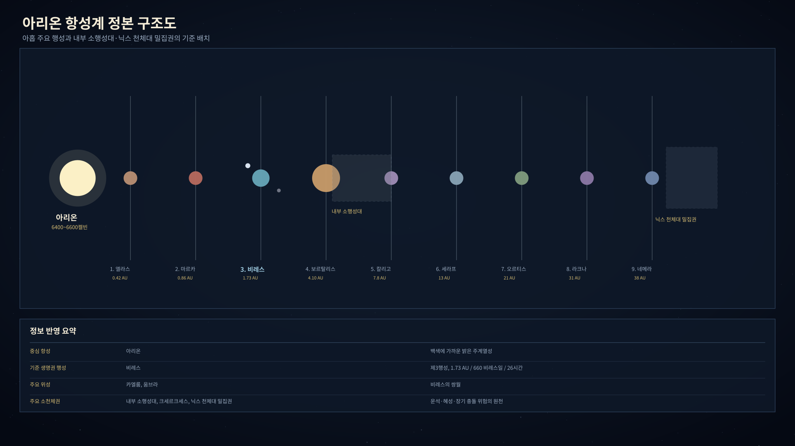
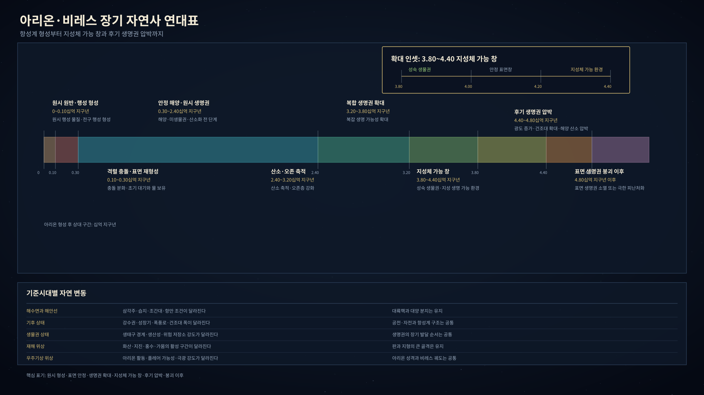
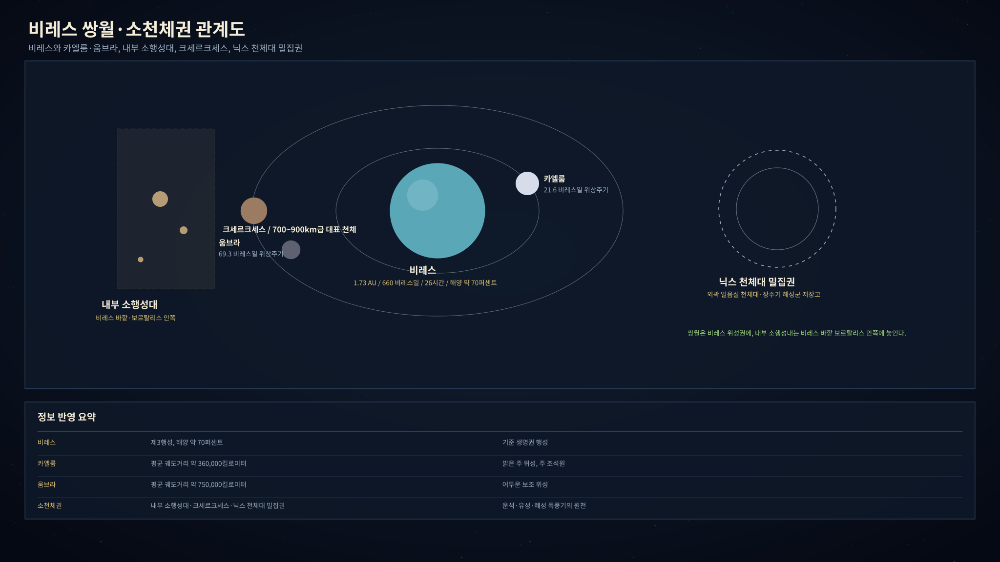
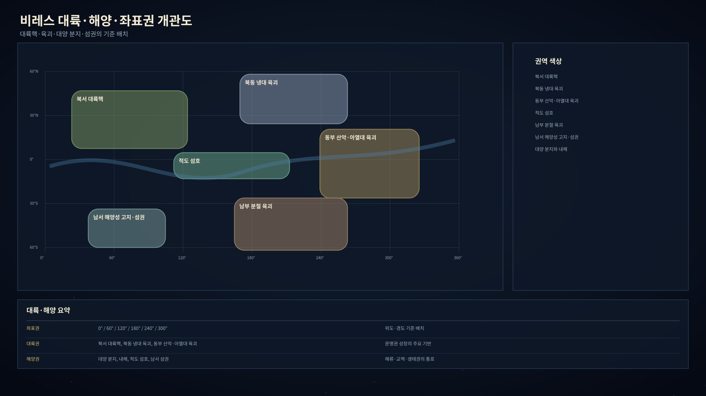
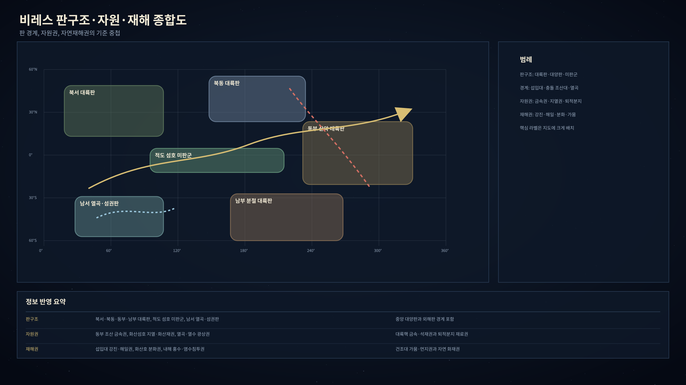
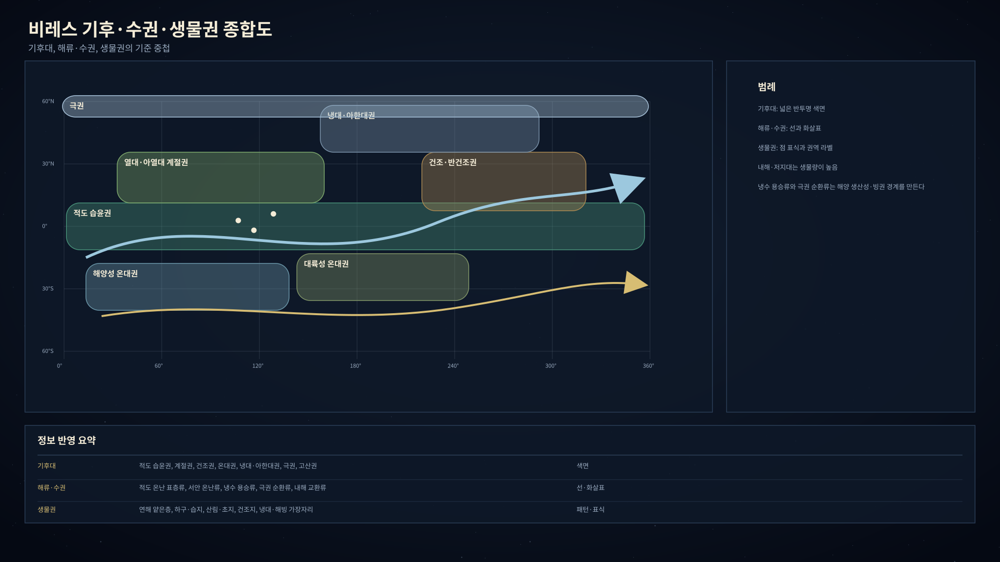
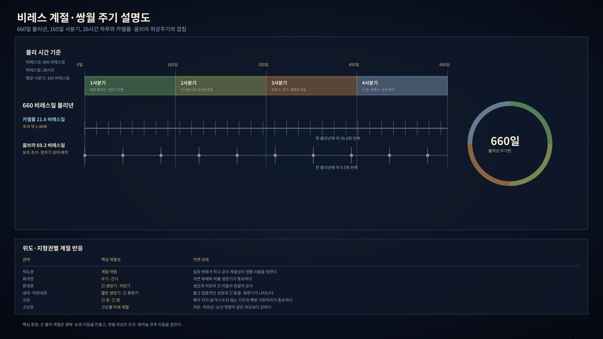

# 아르카디아 마스터 객관정보 정본 제2판

아르카디아의 자연사는 아리온 항성계와 비레스 행성을 공통 기반으로 삼는다. 별과 행성의 큰 구조, 대륙과 대양의 골격, 지질·기후·생물권의 기본 조건은 기준시대가 달라도 같은 자연사 위에 놓인다.

## 1. 아리온 항성계

### 1.1 항성계 개관

아리온 항성계는 백색에 가까운 밝은 주계열성 아리온을 중심으로 아홉 주요 행성, 내부 소행성대, 외곽 천체대가 놓인 체계다. 비레스는 제3행성이며, 생명권과 지성체 문명의 기준 행성이다.

| 항목 | 내용 |
|---|---|
| 중심 항성 | 아리온 |
| 항성 성격 | 태양보다 밝고 조금 더 푸른 에프형 주계열성 |
| 주요 행성 수 | 아홉 개 |
| 기준 생명권 행성 | 비레스 |
| 비레스의 공전 거리 | 약 1.73 천문단위 |
| 비레스의 1년 | 660 비레스일, 지구일 환산 약 715일 |
| 비레스의 1일 | 26시간 |
| 주요 위성 | 카엘룸, 움브라 |
| 주요 소천체권 | 내부 소행성대, 크세르크세스, 닉스 천체대 밀집권 |

아리온은 태양보다 광도가 높기 때문에 비레스는 지구보다 훨씬 먼 거리에서도 온화한 평균 환경을 얻는다. 그러나 그 빛은 더 강한 자외선과 항성풍을 동반한다. 비레스가 살아 있는 행성이 되려면 두꺼운 대기, 오존층, 해양 차폐, 자기권이 함께 필요하다.

### 1.2 아리온

| 항목 | 값 |
|---|---|
| 정본 한글명 | 아리온 |
| 항성 분류 | 에프오형에서 에프육형 사이의 백색 주계열성 |
| 질량 | 태양 대비 약 1.35배 |
| 광도 | 태양 대비 약 2.8배 |
| 표면 온도 | 약 6400~6600켈빈 |
| 비레스 위치 일사량 | 지구 대비 약 0.94배 |
| 활동 박동 | 약 5 비레스년 전후로 자기활동이 오르내린다. |
| 생명권 영향 | 비레스의 평균 기온, 오존층 요구 조건, 자기권 요구 조건, 극광과 플레어 위험을 결정한다. |

### 1.3 항성계 생몰

아리온 항성계의 장기 시간표는 행성 형성, 비레스 표면 안정, 산소·오존 축적, 지성체 가능 창, 후기 생명권 압박으로 이어지는 자연사 골격이다. 각 기준시대의 환경 차이는 이 장기 자연사 위에서 발생한다.

| 단계 | 아리온 형성 후 상대 구간 | 비레스 상태 | 세부도 |
|---|---:|---|---|
| 원시 성운 붕괴와 원반 | 0~0.01십억 지구년 | 원시 행성 물질 형성 | 개괄 |
| 초기 충돌·분화기 | 0.01~0.10십억 지구년 | 비레스 전구 행성의 충돌, 분화, 냉각 | 개괄 |
| 조기 안정화 | 0.10~0.30십억 지구년 | 초기 대기와 물 보유 가능성 형성 | 중간 |
| 안정 해양·원시 생명권 | 0.30~2.40십억 지구년 | 해양, 미생물권, 산소화 전 단계 | 중간 |
| 산소·오존 축적 | 2.40~3.20십억 지구년 | 산소 축적, 오존층 강화, 복잡 생명 가능 | 높음 |
| 지성체 가능 핵심 표면창 | 3.20~4.40십억 지구년 | 성숙 생물권과 지성 생명 가능 환경 | 높음 |
| 후기 생명권 압박 | 4.40~4.80십억 지구년 | 광도 증가, 건조대 확대, 해양 산소 압박 | 중간 |
| 표면 생명권 붕괴 이후 | 4.80십억 지구년 이후 | 표면 생명권 소멸 또는 극한 피난처화 | 개괄 |

### 1.4 행성 총람

그림: 아리온 항성계의 중심 항성, 주요 행성, 내부 소행성대, 닉스 천체대 밀집권을 한 장에 배치한 설정화다. 천체의 크기와 간격은 실제 축척이 아니라 종류와 외형을 구분하기 위한 문서용 배열이다.

| 순서 | 한글명 | 종류 | 평균 거리 | 공전주기 | 표면·구조 특징 |
|---:|---|---|---:|---:|---|
| 1 | 비렌티스 | 고온 암석형 내행성 | 약 0.42 천문단위 | 약 0.234 지구년 | 미약한 이산화탄소 대기, 고온 불모 지형 |
| 2 | 루멘 | 건조 암석형 행성 | 약 0.88 천문단위 | 약 0.710 지구년 | 희박한 질소 대기, 밝고 건조한 고반사 지형 |
| 3 | 비레스 | 거주 가능 암석형 행성 | 약 1.73 천문단위 | 660 비레스일, 약 1.958 지구년 | 해양, 대륙, 질소·산소 대기, 자기권, 쌍월 |
| - | 내부 소행성대 | 암석·금속질 소천체대 | 약 2.75~3.35 천문단위 | 천체별 상이 | 운석, 유성, 금속질 파편의 배경 |
| 4 | 보르탈리스 | 가스형 행성 | 약 4.10 천문단위 | 약 7.145 지구년 | 내부 소행성대의 주 섭동원, 희미한 고리 |
| 5 | 코로니스 | 대형 가스형 행성 | 약 6.80 천문단위 | 약 15.261 지구년 | 뚜렷한 얼음·먼지 고리 |
| 6 | 에란티스 | 변동성 큰 소형 가스형 행성 | 약 10.50 천문단위 | 약 29.283 지구년 | 궤도와 대기 변동성이 큰 외행성 |
| 7 | 글라시오르 | 얼음거대형 행성 | 약 15.80 천문단위 | 약 54.053 지구년 | 휘발성 대기와 얼음질 내부 |
| 8 | 카스마라 | 소형 얼음거대형 행성 | 약 24.00 천문단위 | 약 101.193 지구년 | 압축 얼음질 내부와 희박한 고리 가능성 |
| - | 닉스 천체대 밀집권 | 외곽 천체대 | 약 42~55 천문단위 | 천체별 상이 | 장주기 혜성군의 저장고 |
| 9 | 테르미누스 | 극외곽 암석형 행성 | 약 60.00 천문단위 | 약 400 지구년 | 대기 없는 극저온 크레이터 지형 |

### 1.5 행성 물리값

| 한글명 | 분류 | 질량 | 반지름 | 중력 | 대기 | 평균 온도 |
|---|---|---:|---:|---:|---|---:|
| 비렌티스 | 내행성 암석형 | 지구 대비 0.60배 | 지구 대비 0.85배 | 지구 대비 0.83배 | 미약한 이산화탄소 | 약 520켈빈 |
| 루멘 | 암석형 | 지구 대비 0.80배 | 지구 대비 0.93배 | 지구 대비 0.92배 | 희박한 질소 | 약 390켈빈 |
| 비레스 | 거주 가능 암석형 | 지구 대비 1.20배 | 지구 대비 1.05배 | 지구 대비 1.09배 | 질소·산소 기반 | 약 290켈빈 |
| 보르탈리스 | 가스형 | 지구 대비 50배 | 지구 대비 6.5배 | 지구 대비 1.18배 | 수소·헬륨 | 약 150켈빈 |
| 코로니스 | 대형 가스형 | 지구 대비 100배 | 지구 대비 9.5배 | 지구 대비 1.11배 | 수소·헬륨·메탄 | 약 130켈빈 |
| 에란티스 | 소형 가스형 | 지구 대비 30배 | 지구 대비 5.8배 | 지구 대비 0.89배 | 수소·메탄 | 약 120켈빈 |
| 글라시오르 | 얼음거대형 | 지구 대비 15배 | 지구 대비 4.0배 | 지구 대비 0.94배 | 휘발성 대기 | 약 70켈빈 |
| 카스마라 | 소형 얼음거대형 | 지구 대비 8배 | 지구 대비 2.7배 | 지구 대비 1.10배 | 휘발성 대기 | 약 50켈빈 |
| 테르미누스 | 극외곽 암석형 | 지구 대비 0.30배 | 지구 대비 0.70배 | 지구 대비 0.61배 | 없음 | 약 35켈빈 |

## 2. 비레스

### 2.1 행성 개관

비레스는 아리온 항성계의 주요 생명권 행성이다. 지구보다 조금 크고 무거우며, 하루가 26시간이고 1년이 660일이다. 표면의 약 70퍼센트가 바다이고, 넓은 해양은 긴 계절 변화와 아리온의 강한 빛을 완충한다.

그림: 비레스와 두 위성 카엘룸·움브라, 대표 소천체 크세르크세스를 한 시야에 둔 설정화다. 천체의 상대 위치와 크기는 실제 관측 축척이 아니라 문서 식별을 위한 구성이다.

| 항목 | 값 |
|---|---|
| 정본 한글명 | 비레스 |
| 분류 | 거주 가능 암석형 행성 |
| 공전 거리 | 약 1.73 천문단위 |
| 1년 | 660 비레스일 |
| 1일 | 26시간 |
| 질량 | 지구 대비 약 1.20배 |
| 반지름 | 지구 대비 약 1.05배 |
| 표면중력 | 지구 대비 약 1.09배 |
| 평균 기온 | 약 290켈빈 |
| 표면 해양 비율 | 약 70퍼센트 |
| 대기 | 질소·산소 기반, 지구보다 조금 두꺼운 편 |
| 자기권 | 아리온의 자외선과 항성풍을 완충할 만큼 강한 편 |
| 위성 | 카엘룸, 움브라 |

### 2.2 쌍월

| 위성 | 성격 | 평균 궤도거리 | 위상주기 | 조석력 | 관측 특징 |
|---|---|---:|---:|---:|---|
| 카엘룸 | 밝은 주 위성 | 약 360,000킬로미터 | 약 21.6 비레스일 | 지구 달 조석 대비 약 1.46배 | 높은 반사율, 밝은 달, 주 조석원 |
| 움브라 | 어두운 보조 위성 | 약 750,000킬로미터 | 약 69.3 비레스일 | 지구 달 조석 대비 약 0.034배 | 낮은 반사율, 어두운 위상, 장주기 상대 배치 |

카엘룸은 비레스의 해안, 항만, 갯벌, 내해, 밤길, 야행성 생태에 강한 리듬을 남긴다. 움브라는 더 약하지만 두 달의 상대 위치가 겹칠 때 조석과 식, 밤하늘의 예외적 변화를 만든다.

### 2.3 소천체권

| 한글명 | 위치 | 성격 | 비레스와의 관계 |
|---|---|---|---|
| 내부 소행성대 | 비레스와 보르탈리스 사이 | 암석·금속질 소천체대 | 운석, 유성, 금속질 파편, 장기 충돌 위험의 원천 |
| 크세르크세스 | 내부 소행성대 | 약 700~900킬로미터급 대표 천체 | 기준시대 문명에는 직접 식별되지 않으며, 검은 운석 전승은 이 천체권에서 유래한 운석 현상과 연결된다. |
| 닉스 천체대 밀집권 | 항성계 외곽 | 얼음질 외곽 천체대 | 장주기 혜성군과 혜성 폭풍기의 저장고 |

### 2.4 장주기 천문 현상

| 현상 | 객관 성격 | 비레스 효과 |
|---|---|---|
| 아리온 활동 극대기 | 약 5 비레스년 전후의 자기활동 상승기 | 플레어, 극광, 자외선·입자 사건 가능성이 높아진다. |
| 대형 플레어 | 활동 극대기 주변에서 확률이 올라가는 강한 항성 사건 | 고위도 극광, 오존층 일시 스트레스, 관측 이상 |
| 극광 대폭발기 | 아리온 활동과 비레스 자기권이 맞물리는 사건 | 고위도와 드문 중위도 극광, 항해·관측 교란 |
| 혜성 폭풍기 | 닉스 천체대와 거대 행성 섭동이 맞물리는 장주기 혜성 유입기 | 혜성 관측 증가, 미세먼지 유입, 드문 충돌 위험 상승 |
| 대공명기 | 외행성 장주기 섭동이 겹치는 시기 | 소천체 궤도와 혜성 유입률이 흔들린다. |
| 소행성대 불안정기 | 내부 소행성대 공명 틈과 보르탈리스 섭동이 강화되는 시기 | 유성우, 소형 운석, 금속질 파편 유입 가능성이 커진다. |

## 3. 비레스 표면 구조

### 3.1 대륙과 해양

비레스의 육지는 북반구 중위도권에 비교적 많이 모여 있다. 남반구는 대양 비중이 높고, 남부와 남서부에는 분절 육괴와 섬권이 흩어진다. 기준시대 문명권은 주로 북반구 대륙, 내해, 해안, 산맥, 항만을 중심으로 성장한다.

그림: 비레스의 주요 대륙권, 섬호, 내해, 대륙붕, 해양성 고지권을 대표 환경으로 나누어 그린 설정화다. 각 장면은 지형권의 전형적 인상을 보여주며, 실제 위치와 축척을 그대로 재현한 지도는 아니다.

| 자연권 | 중심 좌표권 | 성격 |
|---|---|---|
| 북서 대륙핵 | 북위 25~65도, 동경 300~60도 | 오래된 대륙핵, 온대 대륙붕, 큰 하천과 평야 |
| 북동 냉대 육괴 | 북위 45~75도, 동경 60~145도 | 냉대·아한대 고지, 빙권 경계, 산악 유역 |
| 동부 산악·아열대 육괴 | 북위 5~45도, 동경 145~240도 | 장산계, 큰 강 유역, 습윤 해안과 고원 |
| 적도 섬호·해협권 | 남위 10도~북위 20도, 동경 230~320도 | 섬호, 화산섬, 얕은 바다, 복잡한 해협 |
| 남부 분절 육괴 | 남위 55~15도, 동경 30~175도 | 분절 대륙핵, 바람받이 해안, 내륙 비그늘 고원 |
| 남서 해양성 고지·섬권 | 남위 45도~북위 5도, 동경 185~285도 | 해양성 고지, 섬열, 고립 생태구 |
| 북방 외해 분지 | 북위 20~70도, 동경 210~330도 | 차가운 외해, 대륙사면, 북방 냉류 |
| 중앙 대양 분지 | 남위 20도~북위 35도, 동경 60~210도 | 넓은 해류 통로와 심층 순환 |
| 남극권 대양 | 남위 70~35도, 전 경도 | 남반구 순환과 극권 폭풍대 |
| 서부 열대 대양 | 남위 20도~북위 25도, 동경 240~360도 | 온난 표층류, 적도 섬호 강수의 원천 |
| 내해·대륙붕 복합권 | 북위 10~55도, 동경 20~135도 | 얕은 바다, 내해, 해협, 삼각주 후보지 |

### 3.2 주요 지형권

| 지형권 | 중심 좌표권 | 특징 |
|---|---|---|
| 북서 내륙 안정대 | 북위 35~60도, 동경 315~50도 | 낮은 산지, 넓은 평원, 큰 하천의 발원 고지 |
| 북방 조산·빙권 경계 | 북위 55~75도, 동경 45~145도 | 산맥, 고원, 빙하 침식 지형 |
| 동부 장산계 | 북위 10~45도, 동경 150~235도 | 장거리 산맥, 고원, 협곡, 강수 그늘 |
| 적도 화산섬호 | 남위 10도~북위 15도, 동경 235~315도 | 화산섬, 해협, 산호·대륙붕성 얕은 바다 |
| 중앙 저지·내해권 | 북위 15~45도, 동경 30~130도 | 저지대, 내해 연안, 늪지와 삼각주 후보지 |
| 남부 분절 고원대 | 남위 50~20도, 동경 45~160도 | 습윤 사면, 절벽 해안, 내륙 비그늘 고원 |
| 남서 해양 열곡권 | 남위 35도~북위 5도, 동경 190~285도 | 섬열, 해저 산맥, 지열과 화산 활동 후보지 |
| 극권 해빙·대양 경계 | 남위 70~55도, 전 경도 | 해빙, 폭풍대, 빙산 유출 후보권 |

### 3.3 판구조와 지질

그림: 비레스의 조산대, 화산섬호, 열곡·열수 광상권, 오래된 대륙핵, 내해 퇴적분지, 섭입대 해일권, 고산 산사태·빙하호권을 대표 환경으로 나누어 그린 설정화다. 각 장면은 지질·자원·재해권의 전형적 인상을 보여주며, 실제 위치와 축척을 그대로 재현한 지도는 아니다.

| 판 또는 경계 | 성격 | 파생 지형·효과 |
|---|---|---|
| 북서 대륙판 | 오래된 안정 대륙핵 | 완만한 내륙, 오래된 광상, 깊은 풍화토 |
| 북동 대륙판 | 고위도 대륙판과 충돌 조산대 | 산악, 적설, 빙하호, 고위도 지진 |
| 동부 산악 대륙판 | 섭입과 충돌 영향을 받는 활동 대륙판 | 장거리 산맥, 화산호, 금속 광상 |
| 적도 섬호 미판군 | 섭입대 위의 섬호와 해협권 | 화산섬, 해협, 얕은 바다, 해일 위험 |
| 남부 분절 대륙판 | 오래된 크라톤과 절벽 해안 | 풍화토, 절벽 해안, 남부 고원 |
| 남서 열곡·섬권판 | 열곡과 해저 확장 복합판 | 지열, 해저 산맥, 열수 광상 |
| 중앙 대양판 | 활발한 대양저 확장과 주변 섭입 | 중앙 대양 분지와 동부 산맥 형성 |
| 서부 열대 대양판 | 적도 섬호 아래로 일부 섭입 | 온난 대양, 화산섬호 원천 |
| 남극권 대양판 | 고위도 변환·발산 경계 | 해저 산맥, 빙권 해역, 얕은 지진 |
| 북방 외해판 | 차가운 외해 대양판과 대륙사면 | 심해 퇴적, 북방 외해 지진대 |

## 4. 자연 자원과 재해

### 4.1 자연 자원권

| 자원권 | 중심 권역 | 주요 자원 |
|---|---|---|
| 동부 조산 금속권 | 동부 장산계 | 구리·철계 광상, 변성암, 산악 석재 |
| 화산섬호 지열·화산재권 | 적도 섬호 | 지열, 화산재 토양, 현무암, 흑요석성 암석 |
| 열곡·열수 광상권 | 남서 해양 열곡권 | 황화광물, 지열, 해저 열수성 금속 |
| 오래된 대륙핵 금속·석재권 | 북서·북동·남부 대륙핵 | 철계·니켈계 광상, 단단한 석재 |
| 내해·퇴적분지 재료권 | 중앙 저지·내해권 | 점토, 석회암, 사암, 염류, 충적토 |
| 남부 고원 석재·풍화토권 | 남부 분절 고원대 | 고원 석재, 철 산화 풍화토, 절벽 해안 암재 |
| 습윤 저지 유기질 퇴적권 | 중앙 저지대와 습지 | 이탄, 석탄 전구층, 갈대와 습지 생물질 |
| 극권·해양성 퇴적권 | 남극권 대양 | 빙산 기원 퇴적물, 인산염성 퇴적, 냉수 생물질 |

### 4.2 자연재해권

| 재해권 | 주 재해 | 중심 권역 | 재발 성격 |
|---|---|---|---|
| 섭입대 강진·해일권 | 강진, 해일 | 동부 장산계와 중앙 대양 경계 | 수십~수백 년 또는 그 이상 |
| 화산호 분화권 | 분화, 화산재, 화산가스 | 동부 산악대와 적도 섬호 | 수년~수백 년 |
| 적도 섬호 해저 사태권 | 해저 사태, 해일 | 적도 해협권 | 수년~수십 년 |
| 열곡 지열 위험권 | 지진, 가스, 지열수 오염 | 남서 해양 열곡권 | 수년~수십 년 |
| 고산 산사태·빙하호권 | 산사태, 빙하호 홍수 | 북방·동부 산악권 | 계절~수십 년 |
| 내해 홍수·염수침투권 | 홍수, 염수침투, 늪지 확장 | 중앙 저지·내해권 | 계절~수십 년 |
| 남부 절벽해안 폭풍권 | 폭풍, 해안 침식, 해일 | 남부 분절 육괴 해안 | 계절~수십 년 |
| 건조대 가뭄·먼지권 | 가뭄, 염류화, 먼지 | 폐쇄분지와 비그늘 고원 | 계절~수십 년 |
| 자연 화재권 | 낙뢰성 산불, 건기 화재 | 계절성 초원·개활림 | 계절~수년 |

## 5. 기후·수권·빙권·생물권

그림: 비레스의 주요 기후대, 연안 습지, 얕은 대륙붕, 해저 열수대를 대표 환경으로 나누어 그린 설정화다. 각 장면은 기후·수권·생물권의 전형적 인상을 보여주며, 실제 위치와 축척을 그대로 재현한 지도는 아니다.

### 5.1 기후대

| 기후대 | 중심 권역 | 특징 |
|---|---|---|
| 적도 습윤권 | 적도 저지와 해양성 섬권 | 높은 강수, 높은 생물량, 빠른 분해 |
| 열대·아열대 계절권 | 회귀권 주변 | 우기·건기, 자연 화재, 계절성 생장 |
| 건조·반건조권 | 비그늘 고원, 폐쇄분지 | 염류, 먼지, 물 부족 |
| 해양성 온대권 | 서안과 내해 주변 | 온화한 겨울, 습윤한 바람, 안정 농경 후보 |
| 대륙성 온대권 | 내륙 평야와 고원 | 큰 계절차, 저장과 겨울 대비 |
| 냉대·아한대권 | 북방 육괴와 고산 전이 | 짧은 생장기, 긴 휴면기 |
| 극권 | 극권 대양과 빙권 경계 | 해빙, 긴 낮과 긴 밤, 저온 생태 |
| 고산권 | 산악·고원 | 고도성 저온, 자외선, 빙하와 눈선 |

### 5.2 해류와 유역

| 해류·수권 | 연결 해역 | 효과 |
|---|---|---|
| 적도 온난 표층류 | 서부 열대 대양과 적도 섬호 | 열대 수증기와 폭풍 에너지 공급 |
| 서안 온난류 | 서부 열대 대양에서 북서 해안 | 북서 온대 해안 완충 |
| 냉수 용승류 | 중앙 대양 동부·남부 연안 | 연안 안개, 건조대 강화, 해양 생산성 |
| 남극권 순환류 | 남극권 대양 | 해빙 경계와 폭풍로 유지 |
| 북방 냉류 | 북방 외해 | 북방 안개와 냉수 어장 후보 |
| 내해 교환류 | 내해·대륙붕 복합권 | 얕은 바다 수온 완충, 조석 증폭 |
| 심층 열염 순환 | 전 대양 심층 | 산소·영양염 재분배 |
| 계절성 연안류 | 동부 산악·적도 섬호 연안 | 계절풍성 강수와 항로 난류 |

| 유역 | 연결 지형 | 수권 성격 |
|---|---|---|
| 북서 내륙 대하천 유역 | 북서 내륙 안정대 | 온대 대하천, 충적 평야, 지하수 |
| 내해·저지대 복합 유역 | 중앙 저지·내해권 | 내해, 삼각주, 늪지, 염호 후보 |
| 동부 산악 발원 유역 | 동부 장산계 | 산악 발원 대하천, 협곡, 충적지 |
| 적도 화산섬호 유역 | 적도 화산섬호 | 짧은 급류, 화산성 지하수, 해안 습지 |
| 남부 고원 유역 | 남부 분절 고원대 | 바람받이 강, 고원 습지, 절벽 폭포 |
| 남서 열곡·섬권 수권 | 남서 해양 열곡권 | 지열수, 화산호수, 해안 대수층 |
| 북동 적설·빙하 융해 유역 | 북동 냉대 육괴 | 적설·빙하 융해 유역 |
| 극권 해빙·빙산 유출권 | 극권 해양 | 해빙, 빙산, 냉수 혼합 |

### 5.3 생물권

| 생태구 | 주 권역 | 생태 성격 |
|---|---|---|
| 외해 유광층 | 외해 | 부유성 생산자와 회유성 소비자 |
| 대륙붕과 얕은 바다 | 내해와 대륙붕 | 고생산 저서 생태계 |
| 해저 열수대 | 열곡 해역 | 화학합성 생태계 |
| 하구·삼각주·연안 습지 | 내해·하천 말단 | 높은 유기물 생산, 저산소 위험 |
| 담수 하천·호수·습지 | 내륙 유역 | 담수 생산성, 병원체 저장소 |
| 습윤 열대·아열대 산림 | 저위도 습윤권 | 높은 생물량과 기생 압력 |
| 온대 산림·초지 모자이크 | 온대권 | 계절성 생산성, 대형 먹이망 |
| 계절성 초원·개활림 | 건기와 우기가 갈리는 권역 | 자연 화재와 건기 적응 |
| 건조지·염생지 | 폐쇄분지와 건조권 | 염분·가뭄 적응, 먼지 공급 |
| 냉대·툰드라·해빙 가장자리 | 고위도와 해빙 경계 | 짧은 성장기와 휴면 생물 저장소 |
| 고산·고원 생태권 | 산악과 고원 | 고도별 생태띠와 고립 진화 |
| 섬·지열·고립 생태권 | 화산섬과 고립 섬권 | 높은 고유성, 화산 교란 |

## 6. 시간과 계절

그림: 비레스의 긴 계절감, 쌍월 조석 해안, 적도권·온대권·냉대권·극권의 계절 차이를 한 장에 배치한 설정화다. 각 장면은 시간·계절·쌍월 현상의 전형적 인상을 보여주며, 실제 위치와 축척을 그대로 재현한 지도는 아니다.

### 6.1 물리 시간

| 단위 | 값 |
|---|---|
| 비레스일 | 26시간 |
| 비레스년 | 660 비레스일 |
| 지구일 환산 | 약 715일 |
| 평균 계절 사분기 | 약 165 비레스일 |

### 6.2 물리 계절

비레스의 계절은 660일의 긴 공전주기, 약 22도 자전축, 해양 열지연, 대륙 배치, 아리온 활동 위상이 함께 만든다. 평균 사분기는 165일이지만, 실제 체감 계절은 위도, 해류, 산맥, 내해, 고도에 따라 크게 달라진다.

| 위도·지형권 | 계절 특징 |
|---|---|
| 적도권 | 일장 변화가 작고, 강수 계절성이 생활 리듬을 정한다. |
| 회귀권 | 우기와 건기, 자연 화재, 작물 생장기가 중요하다. |
| 온대권 | 긴 생장기와 긴 저장기가 번갈아 온다. |
| 냉대·아한대권 | 짧고 집중적인 생장기와 긴 휴면기가 나타난다. |
| 극권 | 해가 지지 않거나 뜨지 않는 기간이 생기며 해빙 가장자리가 중요하다. |
| 고산권 | 고도 때문에 같은 위도보다 저온, 자외선, 눈선의 영향이 크다. |

## 7. 기준시대별 자연 변동

기준시대별 비레스는 같은 아리온 항성계와 행성 구조를 공유하면서도 해수면, 기후대 경계, 재해 위상, 생태구 강도, 소천체 활동 위상에서 서로 다른 자연 상태를 보인다.

| 항목 | 기준시대별 변동 양상 | 장기 자연사 기반 |
|---|---|---|
| 해수면과 해안선 | 삼각주, 습지, 조간대, 항만 조건은 기준시대별로 달라진다. | 대륙핵과 대양 분지는 장기 자연사 기반으로 유지된다. |
| 기후 상태 | 강수권, 성장기, 폭풍로, 건조대 폭은 기준시대별 자연 상태에 따라 달라진다. | 비레스의 공전·자전과 항성계 구조는 공통 기반이다. |
| 생물권 상태 | 생태구 경계, 생산성, 위험 저장소 강도는 기준시대별로 다르다. | 생명권의 장기 발달 순서는 공통 자연사에 속한다. |
| 재해 위상 | 화산·지진·홍수·가뭄의 활성 구간은 시대별로 달라진다. | 판과 지형의 큰 골격은 장기 지질 구조에 속한다. |
| 우주기상 위상 | 아리온 활동, 플레어 가능성, 극광 강도는 시대별 활동 위상에 따라 달라진다. | 아리온의 항성 성격과 비레스 궤도는 공통 천문 조건이다. |
