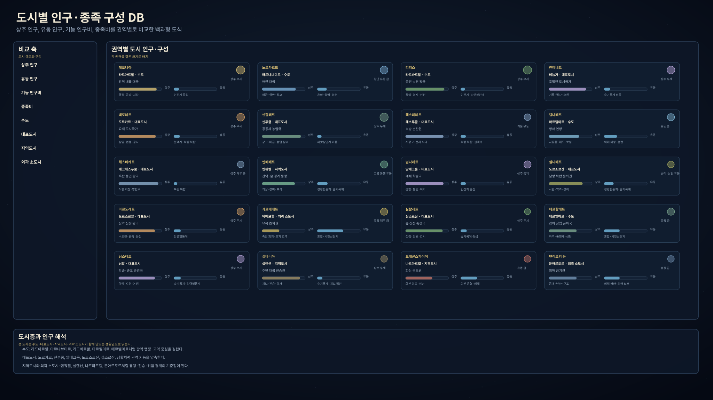
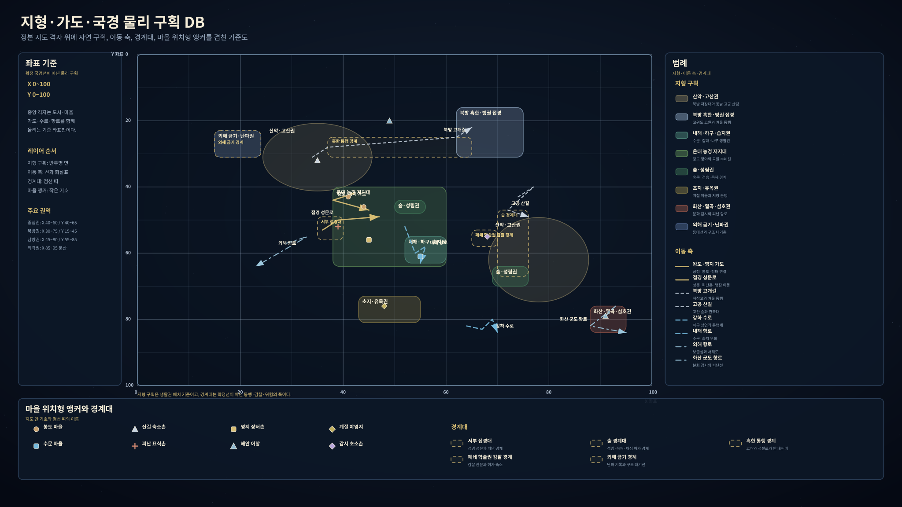

# 아르카디아 세계관 데이터베이스 통합정리 제1판

아르카디아 세계관은 아리온 항성계, 비레스 행성, 기준시대 5083년의 문명권을 한 틀 안에 둔다. 이 문서는 앞으로 국가, 도시, 마을, 종족, 언어, 달력, 신앙, 사건, 인물 데이터가 쌓이는 중심 백과 페이지다.

| 분류 | 핵심 문서 | 내용 |
|---|---|---|
| 자연사 정본 | [아르카디아 마스터 객관정보 정본 제2판](Arcadia_마스터_객관정보_정본_v2.md) | 항성계, 비레스, 대륙, 해양, 기후, 생물권, 물리 시간 |
| 기준시대 정본 | [아르카디아 기준시대 5083 객관정보 제2판](Arcadia_기준시대_5083_객관정보_v2.md) | 5083년의 국가, 도시, 종족, 언어, 달력, 사회, 법, 경제 |
| 검산 부록 | [아르카디아 객관정보 운용부록 제2판](Arcadia_객관정보_운용부록_v2.md) | 정본 작성 규칙, 자료 접근권, 충돌 검산 기준 |
| 해설본 | [아르카디아 쉬운해설본](Arcadia_쉬운해설본_v1.md) | 독자용 서술형 해설 |

## 1. 세계 골격

### 1.1 아리온 항성계

아리온 항성계는 백색에 가까운 밝은 에프형 주계열성 아리온을 중심으로 아홉 주요 행성, 내부 소행성대, 외곽 천체대가 놓인 체계다. 비레스는 제3행성이며, 생명권과 지성체 문명의 기준 행성이다.

| 항목 | 값 |
|---|---|
| 중심 항성 | 아리온 |
| 항성 성격 | 태양보다 밝고 조금 더 푸른 에프형 주계열성 |
| 주요 행성 | 비렌티스, 루멘, 비레스, 보르탈리스, 코로니스, 에란티스, 글라시오르, 카스마라, 테르미누스 |
| 기준 생명권 행성 | 비레스 |
| 주요 소천체권 | 내부 소행성대, 크세르크세스, 닉스 천체대 밀집권 |
| 장주기 천문 현상 | 아리온 활동 극대기, 대형 플레어, 극광 대폭발기, 혜성 폭풍기, 대공명기, 소행성대 불안정기 |

| 행성 | 종류 | 평균 거리 | 특징 |
|---|---|---:|---|
| 비렌티스 | 고온 암석형 내행성 | 약 0.42 천문단위 | 미약한 이산화탄소 대기, 고온 불모 지형 |
| 루멘 | 건조 암석형 행성 | 약 0.88 천문단위 | 희박한 질소 대기, 밝고 건조한 고반사 지형 |
| 비레스 | 거주 가능 암석형 행성 | 약 1.73 천문단위 | 해양, 대륙, 질소·산소 대기, 자기권, 쌍월 |
| 보르탈리스 | 가스형 행성 | 약 4.10 천문단위 | 내부 소행성대의 주 섭동원, 희미한 고리 |
| 코로니스 | 대형 가스형 행성 | 약 6.80 천문단위 | 뚜렷한 얼음·먼지 고리 |
| 에란티스 | 변동성 큰 소형 가스형 행성 | 약 10.50 천문단위 | 궤도와 대기 변동성이 큰 외행성 |
| 글라시오르 | 얼음거대형 행성 | 약 15.80 천문단위 | 휘발성 대기와 얼음질 내부 |
| 카스마라 | 소형 얼음거대형 행성 | 약 24.00 천문단위 | 압축 얼음질 내부와 희박한 고리 가능성 |
| 테르미누스 | 극외곽 암석형 행성 | 약 60.00 천문단위 | 대기 없는 극저온 크레이터 지형 |

### 1.2 비레스 행성

비레스는 지구보다 조금 크고 무거운 거주 가능 암석형 행성이다. 하루는 26시간, 1년은 660 비레스일이며, 표면의 약 70퍼센트가 해양이다. 긴 공전주기와 넓은 바다는 계절 변화를 완만하게 만들지만, 위도와 해류, 산맥, 내해, 고도에 따라 생활 환경은 크게 갈라진다.

| 항목 | 값 |
|---|---|
| 행성명 | 비레스 |
| 분류 | 거주 가능 암석형 행성 |
| 질량 | 지구 대비 약 1.20배 |
| 반지름 | 지구 대비 약 1.05배 |
| 표면중력 | 지구 대비 약 1.09배 |
| 1일 | 26시간 |
| 1년 | 660 비레스일, 지구일 환산 약 715일 |
| 평균 기온 | 약 290켈빈 |
| 대기 | 질소·산소 기반, 지구보다 조금 두꺼운 편 |
| 해양 비율 | 약 70퍼센트 |
| 주요 위성 | 카엘룸, 움브라 |

### 1.3 쌍월과 소천체권

| 대상 | 성격 | 주기·규모 | 세계관 영향 |
|---|---|---|---|
| 카엘룸 | 밝은 주 위성 | 위상주기 약 21.6 비레스일, 지구 달 대비 약 1.46배 조석력 | 해안, 항만, 갯벌, 내해, 밤길, 달빛 전승 |
| 움브라 | 어두운 보조 위성 | 위상주기 약 69.3 비레스일, 보조 조석 | 장주기 달 배치, 드문 밤하늘 변화, 보조 전승층 |
| 내부 소행성대 | 암석·금속질 소천체대 | 비레스와 보르탈리스 사이 | 운석, 유성, 금속질 파편, 장기 충돌 위험 |
| 크세르크세스 | 내부 소행성대 대표 천체 | 약 700~900킬로미터급 | 기준시대 문명에는 직접 식별되지 않으며 검은 운석 전승의 배경권 |
| 닉스 천체대 밀집권 | 외곽 얼음질 천체대 | 약 42~55 천문단위 | 장주기 혜성군과 혜성 폭풍기의 저장고 |

### 1.4 장기 자연사

아리온 항성계의 장기 자연사는 행성 형성, 비레스 표면 안정, 산소·오존 축적, 지성체 가능 창, 후기 생명권 압박으로 이어진다. 기준시대 5083년은 비레스의 성숙 생명권과 지성체 문명 가능 창 안에 놓인다.

| 단계 | 상대 구간 | 비레스 상태 |
|---|---:|---|
| 원시 성운 붕괴와 원반 | 0~0.01십억 지구년 | 원시 행성 물질 형성 |
| 초기 충돌·분화기 | 0.01~0.10십억 지구년 | 전구 행성 충돌, 분화, 냉각 |
| 조기 안정화 | 0.10~0.30십억 지구년 | 초기 대기와 물 보유 가능성 형성 |
| 안정 해양·원시 생명권 | 0.30~2.40십억 지구년 | 해양, 미생물권, 산소화 전 단계 |
| 산소·오존 축적 | 2.40~3.20십억 지구년 | 산소 축적, 오존층 강화 |
| 지성체 가능 핵심 표면창 | 3.20~4.40십억 지구년 | 성숙 생물권과 지성 생명 가능 환경 |
| 후기 생명권 압박 | 4.40~4.80십억 지구년 | 광도 증가, 건조대 확대, 해양 산소 압박 |
| 표면 생명권 붕괴 이후 | 4.80십억 지구년 이후 | 표면 생명권 소멸 또는 극한 피난처화 |

## 2. 비레스 자연 지리

### 2.1 대륙과 해양

비레스의 육지는 북반구 중위도권에 비교적 많이 모여 있고, 남반구는 대양 비중이 높다. 기준시대 문명권은 북반구 대륙, 내해, 해안, 산맥, 항만을 중심으로 성장한다.

| 자연권 | 중심 좌표권 | 성격 |
|---|---|---|
| 북서 대륙핵 | 북위 25~65도, 동경 300~60도 | 오래된 대륙핵, 온대 대륙붕, 큰 하천과 평야 |
| 북동 냉대 육괴 | 북위 45~75도, 동경 60~145도 | 냉대·아한대 고지, 빙권 경계, 산악 유역 |
| 동부 산악·아열대 육괴 | 북위 5~45도, 동경 145~240도 | 장산계, 큰 강 유역, 습윤 해안과 고원 |
| 적도 섬호·해협권 | 남위 10도~북위 20도, 동경 230~320도 | 섬호, 화산섬, 얕은 바다, 복잡한 해협 |
| 남부 분절 육괴 | 남위 55~15도, 동경 30~175도 | 분절 대륙핵, 바람받이 해안, 내륙 비그늘 고원 |
| 남서 해양성 고지·섬권 | 남위 45도~북위 5도, 동경 185~285도 | 해양성 고지, 섬열, 고립 생태구 |
| 내해·대륙붕 복합권 | 북위 10~55도, 동경 20~135도 | 얕은 바다, 내해, 해협, 삼각주 후보지 |

### 2.2 지형·판구조·자원

| 지형·지질권 | 특징 | 자원·재해 |
|---|---|---|
| 북서 내륙 안정대 | 낮은 산지, 넓은 평원, 큰 하천의 발원 고지 | 오래된 광상, 풍화토, 안정 농경 후보지 |
| 북방 조산·빙권 경계 | 산맥, 고원, 빙하 침식 지형 | 고위도 지진, 빙하호, 산사태 |
| 동부 장산계 | 장거리 산맥, 고원, 협곡 | 구리·철계 광상, 변성암, 화산호 |
| 적도 화산섬호 | 화산섬, 해협, 얕은 바다 | 지열, 화산재 토양, 분화, 해저 사태 |
| 중앙 저지·내해권 | 저지대, 내해 연안, 늪지와 삼각주 | 점토, 석회암, 염류, 홍수, 염수침투 |
| 남부 분절 고원대 | 습윤 사면, 절벽 해안, 내륙 비그늘 고원 | 고원 석재, 풍화토, 폭풍, 해안 침식 |
| 남서 해양 열곡권 | 섬열, 해저 산맥, 지열 활동 | 열수 광상, 지열수, 가스, 얕은 지진 |

### 2.3 기후·수권·생물권

| 생태·기후권 | 주 권역 | 생활 환경 |
|---|---|---|
| 적도 습윤권 | 적도 저지와 해양성 섬권 | 높은 강수, 높은 생물량, 빠른 분해 |
| 열대·아열대 계절권 | 회귀권 주변 | 우기·건기, 자연 화재, 계절성 생장 |
| 건조·반건조권 | 비그늘 고원, 폐쇄분지 | 염류, 먼지, 물 부족 |
| 해양성 온대권 | 서안과 내해 주변 | 온화한 겨울, 습윤한 바람, 안정 농경 후보 |
| 대륙성 온대권 | 내륙 평야와 고원 | 큰 계절차, 저장과 겨울 대비 |
| 냉대·아한대권 | 북방 육괴와 고산 전이 | 짧은 생장기, 긴 휴면기 |
| 극권 | 극권 대양과 빙권 경계 | 해빙, 긴 낮과 긴 밤, 저온 생태 |
| 고산권 | 산악과 고원 | 고도성 저온, 자외선, 빙하와 눈선 |
| 하구·삼각주·연안 습지 | 내해·하천 말단 | 높은 유기물 생산, 병원체 저장소 |
| 해저 열수대 | 열곡 해역 | 화학합성 생태계 |

### 2.4 물리 시간과 계절

| 단위 | 값 |
|---|---|
| 비레스일 | 26시간 |
| 비레스년 | 660 비레스일 |
| 지구일 환산 | 약 715일 |
| 평균 계절 사분기 | 약 165 비레스일 |
| 계절 차이의 원천 | 긴 공전주기, 약 22도 자전축, 해양 열지연, 대륙 배치, 아리온 활동 위상 |

## 3. 기준시대 5083 총람

### 3.1 5083년의 세계 표면

기준시대 5083년의 아르카디아권은 단일 국가가 아니라 북반구 문명권의 느슨한 연결망이다. 왕실, 영지, 항만, 장터, 신전, 성문, 공동 창고, 산길, 수로, 군항, 수도원, 상단이 서로 다른 속도로 움직인다.

| 항목 | 5083년 상태 |
|---|---|
| 기준 행성 | 비레스 |
| 기준 항성계 | 아리온 항성계 |
| 문명권 표면명 | 아르카디아권 |
| 통용 연도 | 에덴포르트 서력 5083년 |
| 중심 생활 무대 | 온대 대륙권, 내해, 북방 해안, 산악권, 남방 강하 교역권 |
| 주요 지식층 | 민간 경험, 장인 지식, 길드 장부, 신전 주석, 관청 기록, 학술 해석 |
| 주요 생활 단위 | 가구, 영지, 항만, 장터, 신전, 성문, 공동 창고, 산길, 수로 |

### 3.2 자연권과 생활권

| 생활권 | 자연 기반 | 주요 정착·생업 |
|---|---|---|
| 온대 농경·영지권 | 해양성·대륙성 온대권, 내륙 평야 | 곡물, 목축, 영지 장터, 수문, 공동 창고 |
| 항만·해양권 | 내해, 조석 해안, 대륙붕 | 항만세, 선박, 어항, 해도, 보험, 선원 숙박 |
| 북방 혹한·고산권 | 냉대·아한대권, 빙권 접경, 고산권 | 저장고, 방한구, 사냥, 고개 초소, 용병 계약 |
| 산악·수도원·약초권 | 장산계, 고산권, 산악 유역 | 관측대, 수도원, 약초 장터, 등정 허가 |
| 숲·성림·목재권 | 온대 산림, 습윤 산림, 숲 경계 | 목재 검사, 숲길 표식, 성림 의례, 채집 허가 |
| 초지·유목·폐쇄분지권 | 계절성 초원, 비그늘 고원, 건조권 | 계절 야영, 가축, 물권, 이동 장부 |
| 화산·열곡·섬호권 | 화산섬호, 열곡권, 해저 열수대 | 화산석, 지열, 항로 경고, 피난 표식 |
| 내해·하구·습지권 | 내해, 하구, 삼각주, 연안 습지 | 수로, 수문, 배급, 병원체 위험, 갈대·이탄 |

### 3.3 지식과 기록층

| 기록층 | 흔한 보유자 | 자료 성격 |
|---|---|---|
| 민간 경험 | 농민, 선원, 장인, 산길 안내자, 피난민 | 생활 경험, 소문, 속담, 목격담 |
| 장인 지식 | 대장장이, 목수, 선박공, 약초상, 석공 | 공구, 재료, 납품, 처방, 품질 기준 |
| 길드 장부 | 상인 길드, 항만세 서리, 공방 조합 | 가격, 세금, 보험, 출입 허가, 납품 |
| 신전 주석 | 신관, 수도원, 의례 기록자 | 절기, 금기, 장례, 의례, 도덕적 해석 |
| 관청 기록 | 왕실, 영지, 군항, 성문, 법정 | 세금, 판결, 동원, 통행, 억류 |
| 학술 해석 | 기록원, 학당, 관측자, 주석가 | 관측표, 비교 주석, 문헌 해석, 논쟁 기록 |

## 4. 대륙권·국가·문화권

### 4.1 대권역

| 대권역 | 포함 국가·권역 | 성격 |
|---|---|---|
| 에덴포르트 중심권 | 레오니아, 노르가르드, 티리스, 린레네트, 벡도레트, 센할레트 | 궁정, 항만, 농경, 학예, 요새, 공동 창고가 얽힌 중심 문명권 |
| 북방·외연권 | 헤스페레트, 켈나베트, 헤스베케트, 옌메베트, 님나레트 | 혹한, 원정, 산악 통행, 금기 학술, 해도, 용병 계약이 강한 권역 |
| 남방 복합권 | 실니메트, 아르도레트, 가르메베트, 실할레트, 메르할레트, 님소레트 | 수도원, 약초, 관측, 유목, 성림, 강하 교역, 철학 논쟁이 겹친 권역 |
| 주변 대륙·전승권 | 실바니아, 드래곤스파이어, 펜리르의 눈 | 고문서, 화산 군도, 외해 금기, 난파 전승, 항해담으로 알려진 주변 권역 |

### 4.2 국가·권역 핵심 DB

| 이름 | 분류 | 지리·환경 | 통치·제도 | 생업·물자 | 주요 장소 |
|---|---|---|---|---|---|
| 레오니아 | 중앙집권 왕국 | 온대 내륙, 궁정 도시권, 기사 봉토 | 왕권, 기사단, 서임문, 용 상징, 궁정 외교 | 궁정 공예, 의례 물자, 기사 장비 | 레오니아 궁정, 기사단 회랑, 왕실 법정 |
| 노르가르드 | 해군·철강 팽창 왕국 | 북방 해안, 군항, 철강 부두 | 왕권과 상인 길드의 이중 체제, 해상 법원 | 선박, 철강, 소금, 항만세, 보험 | 노르가르드 군항, 철강 부두, 해상 법정 |
| 티리스 | 농경·목축 군주국 | 온대 농경 영지, 숲 경계, 서부 접경 | 국왕, 귀족, 왕실 법정, 영지 재판, 낮은 율례 | 곡물, 양모, 목재, 채석재, 피난민 구휼 | 실버킵, 레이븐스톤, 하이가든, 그린할로우, 뉴할로우 |
| 린레네트 | 학예 공화 도시국가 | 도시·학술권, 극장과 기록원 | 선출 지도자, 도시 의회, 극장 기록자 | 필사본, 공연, 후원 경제, 공개 낭독 | 기록원, 극장, 학예 학교 |
| 벡도레트 | 요새 군사 도시국가 | 성문, 방벽, 병영, 군사지구 | 방어 평의회, 군법 재판, 성문 규칙 | 무기고, 방어 기술, 성벽 보수 | 벡도레트 성문, 방어 평의회 |
| 센할레트 | 공동체 농업 국가 | 수로, 공동 창고, 농경 저지대 | 대표 의회, 수로 회의, 공동 창고 규례 | 종자 보관, 배급, 수로 관리, 구휼 | 공동 창고, 종자 회의장, 수문 |
| 헤스페레트 | 북방 복합 권역 | 산악, 혹한, 광산, 고개 | 전사 서약권, 용병 계약, 맹세석 | 무기, 갑옷, 보존품, 모피, 용병 중개 | 저장고, 고개 초소, 맹세석 |
| 켈나베트 | 항해·탐험 연방 | 자유항, 외해 항로, 해도 보관소 | 연합 의회, 항해자 조합, 원정 허가 | 해도, 선박, 발견물 신고, 보험 | 자유항, 원정 허가소, 해도 창고 |
| 헤스베케트 | 혹한 생존 군주국 | 북방 고위도, 눈길, 빙권 접경 | 군주, 전사 회의, 저장 의무 | 방한구, 보존식, 저장고, 사냥 나눔 | 저장고, 혹한 통행소 |
| 옌메베트 | 고공·자연 동맹 군주국 | 산악 고공길, 숲 경계, 고지 | 기수단, 자연 동맹 기록, 경계 윤리 | 고공 통행, 산악 안내, 숲 경계 관리 | 고공 통행소, 기수단 둥지 |
| 님나레트 | 비밀 학술·연성 국가 | 북방 외연의 제한 학술권 | 연성 학술 의회, 폐쇄 군주제, 외부 감찰 | 연성 재료, 금기 학술 조사, 봉인 기록 | 금기 학술 보관소, 감찰실 |
| 실니메트 | 남방 복합 권역 | 산악, 숲, 강하 교역, 초지, 약초권 | 여러 국가와 생활권의 복합 권역 | 약초, 향, 관측표, 필사본, 유목 물자 | 약초 장터, 강하 항구, 산악 사원길 |
| 아르도레트 | 산악 신정 왕국 | 고산 수도원, 관측대, 봉우리 의례장 | 수도사, 산악 전사, 왕실 의례, 천상 법원 | 관측표, 광물, 약초, 필사본 | 산악 수도원, 관측대 |
| 가르메베트 | 유목 부족 연합 | 초지, 물가, 계절 이동로 | 족장 회의, 이동 규약, 혼인·가축 분쟁 | 가축, 젖, 양모, 가죽, 이동 장부 | 계절 야영지, 가축 분쟁장 |
| 실할레트 | 숲 신정 군주국 | 성림, 왕실 정원, 숲 경계 | 왕권, 자연 수호자, 성림 의례 | 목재 관리, 약초, 수공예, 정원 미술 | 성림, 왕실 정원, 숲 감시소 |
| 메르할레트 | 강하 상업 공화국 | 강하 항구, 수로, 하구 | 상인 의회, 통행세, 상업 법원 | 향, 직물, 진주, 강하 운송 | 강하 항구, 상인 의회장 |
| 님소레트 | 학문·종교 군주국 | 학당, 철학 회합장, 종교 후원지 | 왕권, 학자, 종교·철학 집단 | 서적, 향신료, 직물, 건축 후원 | 학당, 철학 회합장 |
| 실바니아 | 주변 대륙권 | 숲, 늪, 오래된 기록권 | 고문서와 전승으로 알려진 권역 | 탐사 기록, 계보 사본, 숲 전승 | 숲 전승지, 탐사 거점 |
| 드래곤스파이어 | 화산 군도권 | 화산섬, 외해 항로, 위험 해역 | 용 신화와 항해 보고가 겹친 권역 | 화산석, 항해 보고, 왕실 신화 유물 | 화산 항로, 항해 보고소 |
| 펜리르의 눈 | 외해 금기권 | 등대 소실 해역, 위험 항로 | 해양 전승과 항해 금기가 강한 권역 | 해도, 난파목, 보험, 항해 금기 | 등대권, 난파 기록소 |

### 4.3 자료 계보 보존 DB

구판 자료의 일부 이름은 5083년 정본명으로 흡수되거나 분리되었다. 이 계보는 자료 추적용이며, 본문 표기에서는 5083년 정본명을 우선한다.

| 구판명 | 5083년 정본 연결 | 흡수된 핵심 성격 |
|---|---|---|
| 엘리시움 | 린레네트 | 예술, 기록, 극장, 고통의 재현과 보존 |
| 아르고스 | 벡도레트 | 요새 도시국가, 방어 체계, 군사학 |
| 세레스 | 센할레트 | 지속 가능한 농업, 공동 창고, 종자 보존 |
| 발키리아 | 헤스페레트 일부 | 명예, 전사 서약, 북방 전투 문화 |
| 드라카르 | 켈나베트 일부 | 항해, 선박 계약, 원정과 자유항 |
| 프로스트가드 | 헤스베케트 | 혹한 생존, 저장고, 겨울 윤리 |
| 그리폰하임 | 옌메베트 | 자연 동맹, 고공길, 숲 경계 |
| 네뷸라 | 님나레트 | 제한 학술, 봉인 기록, 감찰 |
| 천산 | 아르도레트 | 산악 신정, 관측대, 천상 법원 |
| 녹원 | 가르메베트 | 초지, 대지 법정, 유목과 물권 |
| 센린 | 실할레트 | 성림, 숲 신정, 자연 수호 |
| 장하 | 메르할레트 | 강하 상업, 통행세, 상인 의회 |
| 아리안 | 님소레트와 실니메트 일부 | 학문, 종교 후원, 철학 논쟁 |

## 5. 도시·마을·물리 구획

### 5.1 정착지 계층

| 계층 | 설명 | 대표 예 |
|---|---|---|
| 대권역 | 여러 국가와 문화권을 묶는 광역 단위 | 에덴포르트 중심권, 북방·외연권 |
| 국가·권역 | 정치체, 복합 권역, 주변 대륙권 | 티리스, 노르가르드, 실니메트, 실바니아 |
| 내부 지역 | 국가 안의 행정·생활·자연 기능권 | 영지, 군항권, 수로권, 성림권, 고개권 |
| 중심 정착지 | 수도, 대표도시, 지역 도시 | 라드바르할, 마르나브미르, 도르소르할 |
| 하위 구역 | 성문, 항만, 장터, 신전, 창고, 병영 | 성문 구역, 항만 구역, 신전 구역 |
| 마을·구조물 | 봉토 마을, 숙소촌, 초소, 선착장, 공동 창고 | 라드가르가, 마르토르가, 베크벱가 |

### 5.2 도시 계층과 기능

| 도시 유형 | 기본 규모 | 흔한 시설 | 대표 권역 |
|---|---|---|---|
| 왕도·궁정도시 | 왕실, 귀족, 사절, 장인, 법정이 밀집한 중심도시 | 궁정청, 왕실 법정, 서임문, 장인 납품소, 신전 | 레오니아, 티리스, 실할레트 |
| 군항·상업항 | 선박, 창고, 항만세, 보험, 선원 숙소가 붙은 항구도시 | 항만세 관청, 선박 수리장, 보험소, 해도 창고 | 노르가르드, 켈나베트, 메르할레트 |
| 요새·관문도시 | 성문, 검문, 병영, 공사장, 피난 대기열이 붙은 방어도시 | 성문 검문소, 병영, 무기고, 공사장 | 벡도레트, 레이븐스톤, 헤스켈카르 |
| 학예·기록도시 | 기록원, 학당, 극장, 필사실, 후원자 저택이 모인 도시 | 기록원, 공개 낭독장, 필사실, 학당 | 린레네트, 님소레트, 님나레트 |
| 창고·배급도시 | 종자, 식량, 공동 노동, 저장 장부가 중심인 도시 | 공동 창고, 배급소, 종자 보관소, 저장고 | 센할레트, 헤스베케트, 헤스페레트 |
| 산악·수도원도시 | 고산 통행, 관측, 순례, 약초, 필사본이 붙은 도시 | 산길 허가소, 수도원, 관측 기록실, 순례 숙소 | 아르도레트, 실니메트, 옌메베트 |
| 성림·전승도시 | 숲길, 계보, 장례, 금기 장소, 자연 권위가 붙은 도시 | 성림 의례장, 숲 감시소, 사본 열람소 | 실할레트, 실바니아 |
| 외곽 소도시 | 지역 장터와 숙박, 세금, 초소 기능만 갖춘 낮은 도시 | 여관, 장터, 세무소, 마구간, 우물, 목패 게시판 | 모든 권역 |

### 5.3 주요 도시명

| 국가·권역 | 수도·중심도시 | 대표·지역 도시 |
|---|---|---|
| 레오니아 | 라드아르할 | 지르바르에트, 팔테쿰가, 렘다트움 |
| 노르가르드 | 마르나브미르 | 페르나브부두, 아르마르토르, 나브할가 |
| 티리스 | 라드바르할, 실버킵 | 베크켈카르, 레이븐스톤, 가르메브에트, 벨소르엘, 실테크에트, 소르이엘토르, 그린할로우, 뉴할로우 |
| 린레네트 | 레눔가 | 린산가, 님렌할, 다트킨할, 렘렌가 |
| 벡도레트 | 도르카르 | 켈카르, 베크할, 도르테쿰, 엔할가 |
| 센할레트 | 센푸쿰 | 벨바르, 센푸크에트, 가르센에트, 벱렌할 |
| 헤스페레트 | 헤스푸쿰 | 헤스켈카르, 페르바르, 람지르바르, 메브켈에트 |
| 켈나베트 | 마르켈미르 | 워크바르, 마르렌움, 나브할, 움마르켈 |
| 헤스베케트 | 베크헤스푸쿰 | 헤스워켈, 나르할, 메브헤스베크 |
| 옌메베트 | 옌워켈 | 옌베크할, 실베크에트, 실람렌움 |
| 님나레트 | 얄베크움 | 님나할, 푸크나움, 헤드렌움, 엔켈할 |
| 실니메트 | 도르소르산 | 실메르미르, 벨마르미르, 실소르켈, 메브메르켈 |
| 아르도레트 | 도르소르할 | 옌이엘토르, 아르소르산, 도르켈바르, 소르할 |
| 가르메베트 | 틱메브할 | 벨람바르, 메브바르, 벨베크엘, 워크렌움 |
| 실할레트 | 실소르산 | 라드실할, 실베크엘, 실테크엘, 실다트바르 |
| 메르할레트 | 메르벨마르 | 메르바르, 헤드켈바르, 푸크테쿰, 메르님바르 |
| 님소레트 | 님할 | 님렘할, 소르다트움, 렌테쿰, 렌메르미르 |
| 실바니아 | 실렌산 | 워크켈할, 렌얄움, 움켈산 |
| 드래곤스파이어 | 나르마르켈 | 나르베크토르, 나르마르렌움, 마르모스할 |
| 펜리르의 눈 | 둔아르토르 | 둔나브렌움, 움마르소르, 벱나브할 |

### 5.4 마을·가도·구조물 DB

| 분류 | 고유명 | 생활 설명명 | 성격 |
|---|---|---|---|
| 가도 | 라드가르길 | 왕도·영지 가도 | 궁정과 농경 영지를 잇는 내륙 간선 |
| 항로 | 마르워크항로 | 강하·해양 교역 항로 | 내해, 강하, 항만세를 잇는 물류 축 |
| 가도 | 소르도르길 | 산악 사원길 | 산악 수도원, 관측대, 순례 숙소 연결로 |
| 마을 | 라드가르가 | 봉토 마을 | 영지 장부, 농경, 세금, 공동 창고 |
| 마을 | 마르토르가 | 해안 어항 | 항만세, 조석, 어획, 선착장 |
| 마을 | 베크벱가 | 감시 초소촌 | 접경 감시, 통행 확인, 보증인 |
| 마을 | 소르산가 | 산길 숙소촌 | 순례, 등정 허가, 약초상 숙박 |
| 마을 | 나르모스가 | 피난 표식촌 | 화산·외해 위험 표식과 대기 창고 |
| 마을 | 둔푸크가 | 난파 유품 보관촌 | 난파 명부, 유품 보관, 구조 대기 |

## 6. 종족·집단

### 6.1 5083년 종족·집단 분류

| 종족·집단 | 한글 발음명 | 주 분포 | 사회적 접점 |
|---|---|---|---|
| 인간계 | 별도 외명 없음 | 거의 모든 국가와 도시권 | 행정, 군역, 농경, 상업, 신전, 왕실 |
| 철맥계 | 페르브루니르 | 헤스페레트 산악권, 노르가르드 철강권, 아이언포드, 도시 장인 거리 | 광물 계약, 병기 납품, 장인 길드, 장례 각문 |
| 숲기록계 | 실레니르 | 실니메트 학술권, 실할레트 성림권, 실바니아 전승권, 티리스 숲 경계 | 계보 필사, 숲길 표식, 장수 의례, 금기 장소 기록 |
| 씨앗상단계 | 메르세니르 | 티리스·센할레트 농경권, 장터, 이동 상단, 항만 소상권 | 종자 보관, 시장 계약, 농촌 장부, 이동 상단 |
| 정령혈통계 | 님소리르 | 실니메트 사원권, 산악 약초 교류권, 숲 의례권 | 혈통 의례, 신전 주석, 약초 교류, 산악 통역 |
| 북방 복합 집단 | 노스킨, 발카이트 계열 | 헤스페레트 혹한 생존권, 북방 용병·무기 문화권 | 부족 명부, 용병 계약, 맹세석, 장례 표식 |
| 혼합 거주 집단 | 지역별 상이 | 항만, 국경 도시, 병참지, 피난 공동체 | 항만 등록, 가문 장부, 혼인·상속, 이름패 |
| 실바니아 계보 집단 | 렌실리르 | 실바니아, 일부 숲기록계 고문서권 | 계보, 탐사 기록, 고문서 외명 |
| 실바니아 숲빛 집단 | 소르실리르 | 실바니아, 성림 전승권 | 의례 파편, 신전 주석, 구전 |
| 화산 용혈 집단 | 드라나리르 | 드래곤스파이어 | 왕실 신화, 항해 보고, 유물 주석 |
| 외해 해양 집단 | 벨마리르 | 펜리르의 눈 | 해도, 항해담, 신전 경고문 |
| 외해 노래 집단 | 린마리르 | 펜리르의 눈 주변 해역 | 선원 구전, 금기 표식, 항만 보고 |

### 6.2 종족별 특성

| 종족·집단 | 신체·생활 경향 | 사회 구조 | 신앙·금기 |
|---|---|---|---|
| 인간계 | 지역별 체격, 수명, 식습관 차이가 크며 거의 모든 생업을 포함한다. | 왕실, 영지, 길드, 신전, 상단, 부족 회의, 공동 창고, 학당 | 국가·권역 신앙, 가족 사당, 직능 금기 |
| 페르브루니르 | 작고 단단한 체형으로 기록되는 경우가 많고 금속·석재·공구와 가까운 생활을 한다. | 광맥 가문, 제련 서약단, 도시 장인 길드, 항만 철강 하청망 | 장례 각문 훼손, 광맥명 도용, 불량 합금 납품 금기 |
| 실레니르 | 길고 마른 체형, 느린 노화, 오래된 계보 기억으로 기록되는 경우가 많다. | 계보 공동체, 숲길 기록자, 성림 의례 집단, 학술 사본망 | 오래된 이름 축약, 숲길 표식 이동, 장례 목패 훼손 금기 |
| 메르세니르 | 작은 체격으로 기록되는 집단이 많고 씨앗, 장부, 상단, 약속이 정체성의 중심이다. | 가문 상단, 종자 보관가, 장터 중개인, 농촌 계약 증인 | 씨앗 봉인 파손, 저울 속임, 상단길 배신 금기 |
| 님소리르 | 신체 분류보다 혈통 의례와 신앙 주석으로 식별된다. | 사원 혈통 가문, 약초 통역자, 산악 의례 공동체 | 혈통 의례명 공개, 금기 장소명 오용, 처방 과장 금기 |
| 노스킨·발카이트 계열 | 혹한·고산 환경에 적응한 인간계와 주변 집단의 복합 분류다. | 전사 서약권, 저장고 공동체, 용병 가문, 고개 안내자 | 맹세석 모독, 장례 표식 훼손, 저장고 절도 금기 |

### 6.3 구판 종족 계보

| 구판 분류 | 5083년 정본 연결 | 보존된 성격 |
|---|---|---|
| 엘프 계열 | 숲기록계 실레니르, 실바니아 계보 집단 렌실리르, 실바니아 숲빛 집단 소르실리르 | 장수, 숲, 계보, 의례, 고문서 |
| 드워프 계열 | 철맥계 페르브루니르 | 광맥, 금속, 석재, 장례 각문, 장인 길드 |
| 하플링·상단계 계열 | 씨앗상단계 메르세니르 | 씨앗, 시장, 이동 상단, 약속, 장부 |
| 정령혈통·요정계 계열 | 정령혈통계 님소리르 | 혈통 의례, 약초, 사원 주석, 자연 금기 |
| 드라코니드 계열 | 화산 용혈 집단 드라나리르 | 화산 군도, 용혈 전승, 항해 보고 |
| 머폴리스 계열 | 외해 해양 집단 벨마리르, 외해 노래 집단 린마리르 | 외해, 해도, 난파, 선원 구전 |

## 7. 언어·문자·기록

### 7.1 언어층

5083년의 언어권은 생활어, 권역 공용어, 공용서기어, 종족어, 전승 외명이 함께 움직인다. 장거리 조약과 세금 장부에는 공용서기어가 쓰이고, 실제 말은 국가별 지역어, 도시어, 항만어, 신전어, 장인어, 종족어로 갈라진다.

| 층위 | 쓰임 | 예시 |
|---|---|---|
| 생활어 | 마을, 가문, 장터, 항구에서 쓰는 일상어 | 티리스 농경어, 노르가르드 항만어, 가르메베트 유목어 |
| 권역 공용어 | 국가와 권역 안의 행정·교역 언어 | 레오니아 궁정어, 센할레트 공동체 장부어 |
| 공용서기어 | 조약, 지도, 세금 장부, 항만 문서, 학술 주석의 공통 표기층 | 여러 지역명을 같은 대상으로 맞출 때 쓰인다. |
| 종족어 | 종족·가문·길드·의례 공동체가 보존한 말 | 철맥계 각문어, 숲기록계 계보어, 씨앗상단계 상단어 |
| 전승 외명 | 고문서, 항해담, 신전 주석에 남은 이름 | 실바니아 전승명, 펜리르의 눈 항해 금기명 |

### 7.2 공용서기어 핵심 어근

| 의미권 | 어근 발음 | 기본 의미 | 생산 예 |
|---|---|---|---|
| 해·빛·높은 질서 | 아르 | 해, 빛, 높은 질서 | 아르토르 |
| 밤·그늘·깊음 | 움 | 밤, 그늘, 심층 | 움마르켈 |
| 물·강·흐름 | 벨 | 물, 흐름, 강 | 벨렐 |
| 바다·항로 | 마르 | 바다, 조류, 항로 | 마르미르 |
| 불·열 | 나르 | 불, 열, 화덕 | 나르할 |
| 돌·산·성벽 | 도르 | 돌, 산, 성벽 | 도르카르 |
| 쇠·금속 | 페르 | 쇠, 금속, 단련 | 페르브루니르 |
| 밭·곡식 | 가르 | 밭, 곡식, 수확 | 가르할 |
| 숲·나무 | 실 | 숲, 나무, 그늘길 | 실소르산 |
| 기록·이름 | 렌 | 기록, 이름, 기억 | 레눔 |
| 법·맹세 | 바르 | 법, 맹세, 판결 | 바르오르 |
| 길·관문 | 켈 | 길, 통로, 관문 | 켈카르 |
| 통치·명령 | 라드 | 통치, 명령, 관직 | 라덴 |
| 의례·신전 | 소르 | 의례, 신전, 금기 | 소란 |
| 앎·판단 | 님 | 앎, 판단, 이해 | 님바르 |

### 7.3 기능어와 기록문

| 기능어 | 기능 | 예시 의미 |
|---|---|---|
| 미 | 나, 서명자 | 내가 기록한다. |
| 투 | 너, 수신자 | 네가 넘긴다. |
| 세 | 그 사람 또는 앞서 언급된 대상 | 그가 보았다. |
| 케 | 향함, 수신자, 목적지 | 서기에게 넘긴다. |
| 달 | 출처, 기원, 떠난 곳 | 돌 성채에서 떠난다. |
| 로 | 장소, 안, 때 | 곡식 회관에서 기록한다. |
| 민 | 함께, 도구, 동반 | 절단 도구로 자른다. |
| 에드 | 완료, 과거 | 기록했다. |
| 누 | 진행, 처리 중 | 계량 중이다. |
| 바르 | 의무, 법적 요구 | 넘길 의무가 있다. |
| 켄 | 허가, 가능 | 지나갈 수 있다. |

| 서식명 | 문서 기능 | 공용서기어 표면 | 뜻 |
|---|---|---|---|
| 레눔 | 기록소·기록됨 | 레눔, 레난 에드 헤도 가르 | 기록소: 서기가 곡식을 계량했다. |
| 얄렌 | 증언 기록 | 얄렌, 세 에드 얄로 다트 케 레난 | 증언 기록: 그는 서기에게 넘긴 일을 보았다. |
| 라드렌 | 명령 기록 | 라드렌, 라덴 바르 다토 헤드렌 | 명령 기록: 명령권자가 계량 장부 이관을 명했다. |
| 다트렌 | 봉납·납부 기록 | 다트렌, 투 에드 다토 가르 케 가르할 | 납부 기록: 네가 곡식을 곡식 회관에 넘겼다. |
| 나바르 | 금지 고지 | 나바르, 티르 나 켄 켈로 | 금지문: 너희의 통행 불가 |

### 7.4 문화권별 언어

| 문화권 | 언어 성격 | 기록 매체 |
|---|---|---|
| 에덴포르트 상급 서기 표준 | 외교·법정·대륙 간 장부 기준형 | 종이 장부, 양피지, 조약문 |
| 티리스 농경·법정권 | 농경 생활어와 왕실 법정어가 분리됨 | 창고 목패, 이름패, 영지 장부, 판결문 |
| 레오니아 궁정권 | 왕권, 의례, 기사 서약 중심 | 궁정 사본, 서임문, 왕실 기록 |
| 노르가르드 항만권 | 해군, 상인 길드, 항만세, 철강 장부가 갈라짐 | 해도, 선박 표식, 항만세 장부 |
| 린레네트 학예권 | 공연, 학술 발표, 후원 계약의 기록권 | 대본, 악보 주석, 후원 계약서 |
| 벡도레트 요새권 | 군사 정부, 성문, 방어 기술의 기록권 | 성문 각문, 병영 장부, 군법 판결문 |
| 센할레트 공동체권 | 배분, 씨앗, 수로, 공동 창고 중심 | 목패, 배급표, 수로 회의록 |
| 헤스페레트 북방권 | 혹한 생존, 무기, 용병, 전사 서약이 겹침 | 맹세석, 용병 명부, 저장 장부 |
| 실니메트 남방권 | 산악 관측, 수도원 필사, 숲 의례, 약초, 유목, 교역이 겹침 | 필사본, 약초 주석, 상단 장부 |

## 8. 달력·절기

### 8.1 물리 시간과 문화 달력

비레스의 물리적 1년은 660일이다. 5083년의 각 문화권은 660일을 다른 주기로 나눈다. 달력은 농사, 항해, 보초, 법정, 장례, 구휼, 저장고, 의례, 장터를 맞추는 생활 기술이다.

| 권역 | 달력 계열 | 한 주기 | 한 해 주기 수 |
|---|---|---:|---:|
| 에덴포르트 행정권 | 10일 주기력 | 10일 | 66주기 |
| 북방 명예권 | 12일 명예력 | 12일 | 55주기 |
| 항로권 | 11일 해도력 | 11일 | 60주기 |
| 북방 생존권 | 15일 저장력 | 15일 | 44주기 |
| 숲·자연권 | 20일 생태력 | 20일 | 33주기 |
| 학술·관측권 | 11일 관측력 | 11일 | 60주기 |
| 유목권 | 12일 이동력 | 12일 | 55주기 |
| 강하 상업권 | 10일 시장력 | 10일 | 66주기 |
| 화산·외해 특수권 | 기준력에 지역 주석을 덧붙임 | 불규칙 | 지역별 |

### 8.2 에덴포르트 10일 공통 골격

| 일차 | 공통 행정명 | 기본 기능 |
|---:|---|---|
| 1일 | 첫날 | 주기 개시, 장부 기입, 새 지시 전달 |
| 2일 | 둘날 | 준비, 도구 점검, 길드 소집 |
| 3일 | 셋날 | 작은 장터, 마을 회의, 단거리 거래 |
| 4일 | 넷날 | 공방, 수리, 관개, 선박 손질 |
| 5일 | 가운데날 | 검열, 중간 보고, 성벽·창고 점검 |
| 6일 | 여섯날 | 이동, 운송, 전갈 발송 |
| 7일 | 일곱날 | 재판 예비, 신전 상담, 길흉 확인 |
| 8일 | 여덟날 | 큰 장터, 세금·계약, 공개 의례 |
| 9일 | 아홉날 | 정리, 귀환, 채무 확인, 장례 준비 |
| 10일 | 끝날 | 봉인, 보고 마감, 의례 마감 |

### 8.3 문화권별 대표 절기

| 권역 | 대표 일명 | 쓰임 |
|---|---|---|
| 티리스 녹지절력 | 첫흙 열림, 씨앗 세는 날, 물길 부르는 날, 양털 첫가위, 곡식문 열림, 씨잠의 밤, 묵은밭 침묵 | 농경, 목축, 수로, 저장, 봉납 |
| 레오니아 용관력 | 용관 개시, 첫비늘 세움, 왕혈 낭독일, 용심 서약일, 닫힌 눈의 밤 | 궁정 의례, 기사 서약, 왕실 낭독 |
| 노르가르드 조류력 | 첫등대 점화, 흰등 항해일, 밧줄 세는 날, 첫조류 장부일, 마지막 등불 | 출항, 항만세, 선박 계약, 등대 기록 |
| 린레네트 예술력 | 빈무대, 반론일, 관객날, 막내림 | 극장 편성표, 공개 낭독, 후원 계약 |
| 벡도레트 철문력 | 문여는 날, 검열일, 병기날, 문닫는 날 | 성문 개폐, 병영 검열, 군법 일정 |
| 센할레트 공동력 | 첫밭, 씨나눔, 큰나눔, 창고닫음 | 공동 창고, 수로 회의, 배급 순서 |
| 헤스페레트 명예력 | 칼날, 방패, 피, 이름, 결투, 맹세, 칼집 | 결투, 장례, 복수권, 보호 맹세 |
| 켈나베트 해도력 | 해도, 얕은항, 바람, 금기, 난파목, 닻 | 항로 확인, 출항 판단, 자유항 거래 |
| 헤스베케트 저장력 | 불씨, 덫, 뿌리, 말린고기, 닫힌길, 마지막불씨 | 저장고, 사냥, 길 폐쇄, 겨울 생존 |
| 숲·자연권 생태력 | 잎듣기, 둥지, 사냥길, 뿌리잠, 길닫음 | 숲길, 사냥, 벌목, 장례, 생태 변화 |
| 아르도레트·님소레트 관측력 | 첫그림자, 낮은구름, 산법, 별주석, 여백주석 | 관측표, 수도원 주석, 학술 논쟁 |
| 가르메베트 이동력 | 첫풀, 물가, 새끼끈, 큰이동, 젖나눔, 천막접음 | 목축 이동, 물권, 계절 야영 |
| 메르할레트 시장력 | 장부띄움, 물가보기, 작은장, 큰장, 도장닫음 | 강하 시장, 통행세, 상단 장부 |
| 님나레트 은성력 | 은표, 유리, 검은잉크, 봉인문, 흰불, 여백 | 암호 갱신, 재료 봉인, 제한 관측 |

## 9. 사회생활·경제·기술

### 9.1 가구와 생활 표면

| 영역 | 5083년 생활 표면 |
|---|---|
| 가구 | 혈연, 하인, 견습, 동거 노동자, 피난민, 단기 동행자가 섞인다. |
| 신분 | 왕실, 귀족, 자유민, 길드민, 농민, 하층 노동자, 피난민, 외부자, 보증인 없는 사람이 서로 다른 접근권을 가진다. |
| 물질 생활 | 목재, 석재, 철, 양모, 가죽, 곡물, 소금, 말린 식량, 약초, 조명 연료가 생활 격차를 만든다. |
| 가치관 | 각 권역은 비슷한 생활 압력을 공유하지만, 모든 사람이 같은 가치관을 갖지는 않는다. |
| 하루 표면 | 물 긷기, 장터 이동, 세금 확인, 신전 낭독, 성문 통과, 창고 배급, 병자 돌봄이 실제 하루를 이룬다. |

### 9.2 권역별 경제

| 권역 | 강한 물자 | 경제 표면 |
|---|---|---|
| 레오니아 | 의례 물자, 기사 장비, 궁정 공예 | 납품장, 추천장, 외교 선물, 왕실 품질 검사 |
| 노르가르드 | 선박, 철강, 소금, 보험 | 항만세, 선박 징발, 해상 법정, 철강 부두 |
| 티리스 | 곡물, 양모, 목재, 채석재 | 영지 장터, 수문, 곡물세, 피난민 구휼 |
| 린레네트 | 사본, 공연, 후원 계약 | 기록원, 극장, 공개 낭독, 후원자 저택 |
| 벡도레트 | 방어 공사, 병기, 성벽 보수 | 검문소, 병영, 무기고, 공사 동원 |
| 센할레트 | 종자, 배급, 수로 노동 | 공동 창고, 종자 회의, 수문 장부 |
| 헤스페레트 | 무기, 갑옷, 보존품, 모피 | 저장고, 용병 중개, 맹세석, 고개 통행료 |
| 켈나베트 | 해도, 선박, 발견물, 보험 | 자유항, 원정 허가, 해도 창고 |
| 헤스베케트 | 방한구, 보존식, 사냥 물자 | 저장고, 겨울 통행소, 장작 배분 |
| 실니메트 | 약초, 향, 관측표, 필사본 | 사원길, 약초 장터, 강하 항구 |
| 메르할레트 | 향, 직물, 진주, 운송 | 통행세 관청, 창고, 상업 법정 |

### 9.3 기술·공예 수준

| 분야 | 5083년 상태 |
|---|---|
| 금속·병기 | 철강과 청동계 공예가 함께 쓰이며, 권역별 제련·수리 능력 차이가 크다. |
| 건축·토목 | 성벽, 수문, 항만, 창고, 수도원, 산길 보수가 발달했다. |
| 선박·항해 | 내해와 연안 항해는 상용화되어 있고, 외해 항해는 해도, 보험, 금기, 경험에 크게 의존한다. |
| 보존식·저장 | 저장고, 염장, 건조, 말린 뿌리, 공동 창고가 생존 기술의 중심이다. |
| 의술·약초 | 약초, 경험 처방, 신전 돌봄, 수도원 주석이 공존한다. 현대적 병인론은 아니다. |
| 기록·계량 | 세금 장부, 항만세, 배급표, 이름패, 목패, 판결문이 발달했다. |
| 냉장·위생 | 자연 냉지, 지하 저장, 수문 관리, 연기와 식초, 격리 관습이 쓰인다. |

## 10. 법·신앙·전승

### 10.1 국가별 신앙과 사법

| 국가·권역 | 주 신앙·권위 | 사법 표면 |
|---|---|---|
| 레오니아 | 용 상징, 왕혈 낭독, 기사 서약 | 왕실 법정, 서임문, 궁정 증언 |
| 노르가르드 | 해양 신앙, 항만세 질서, 길드 보증 | 해상 법원, 항만세 재판, 보험 분쟁 |
| 티리스 | 녹색 신앙, 가르실렌 의례, 낮은 율례 | 왕실 법정, 영지 재판, 접경 법정 |
| 린레네트 | 기록 윤리, 공개 낭독, 후원 계약 | 도시 의회, 기록원 증언, 후원 계약 분쟁 |
| 벡도레트 | 방어 의례, 철문력, 군사법 | 군법 재판, 성문 규칙, 통행 제한 |
| 센할레트 | 공동 창고 규례, 수로 회의, 씨앗 의례 | 배급 순서, 수로 분쟁, 공동 노동 판정 |
| 헤스페레트 | 전사 명예, 맹세석, 장례 각문 | 결투 중재, 용병 보증, 저장고 분쟁 |
| 켈나베트 | 항해자 조합, 자유항 법정, 해도 증언 | 출항 허가, 발견물 신고, 보험 분쟁 |
| 헤스베케트 | 생존 규약, 저장고 회의, 공동 불씨 | 식량 배분, 방한구 수리, 통행 허가 |
| 아르도레트 | 천상 의례, 관측표, 수도원 중재 | 천상 법원, 등정 허가, 관측표 해석 |
| 가르메베트 | 평원 신앙, 대지 법정, 장로 회의 | 물권, 가축 표식, 혼인 증언 |
| 실할레트 | 숲 신정, 성림 의례, 숲의 법정 | 벌목 허가, 숲길 증언, 사냥권 |
| 메르할레트 | 세속 상업 질서, 계약 낭독 | 상업 법원, 보관 손실, 통행세 |
| 님소레트 | 지혜의 법정, 학당 논쟁, 종교 후원 | 후원 경쟁, 공개 논쟁, 강론 검열 |

### 10.2 신명·신앙 자료 계보

| 구판 신앙명 | 연결 권역 | 5083년 정본 처리 |
|---|---|---|
| 세라피스 | 레오니아 용 상징 왕권 | 용 상징과 왕혈 낭독의 자료 계보로 보존 |
| 마레나 | 노르가르드 해양 신앙 | 해양 신앙과 항만세 질서의 자료 계보로 보존 |
| 실바나 | 실할레트 숲 신정 | 성림 의례와 숲의 법정의 자료 계보로 보존 |
| 천상 수호자 계열 | 아르도레트 산악 신정 | 관측표, 천상 법원, 봉우리 의례의 자료 계보로 보존 |
| 대지 어머니 계열 | 가르메베트 평원 신앙 | 물권, 초지, 가축, 장로 회의의 자료 계보로 보존 |

### 10.3 전승과 장기 기억

| 전승권 | 작동 장소 | 내용 |
|---|---|---|
| 그린할로우 상실 기억 | 티리스, 레이븐스톤, 뉴할로우 | 접경 영지 상실, 피난민 명부, 낮은 율례, 마지막 씨앗 전승 |
| 노르가르드 검은 조서 | 노르가르드, 티리스 접경 | 항만·철강·군수 보급이 접경 침공 명분과 얽힌 문서군 |
| 실바니아 계보 전승 | 실바니아, 실할레트, 린레네트 기록권 | 숲기록계, 계보명, 안개길, 사본 차이 |
| 드래곤스파이어 용혈 전승 | 화산 군도, 레오니아 궁정 신화권 | 화산 항로, 용혈 집단, 화산석 봉인, 분화 감시 |
| 펜리르의 눈 외해 금기 | 켈나베트, 노르가르드, 외해 항만 | 등대 소실, 난파 명부, 금기 해도, 선원 노래 |

## 11. 역사·사건 닻

### 11.1 광역 역사 닻

| 사건·흐름 | 관련 권역 | 백과적 의미 |
|---|---|---|
| 아르카디아권 형성 | 에덴포르트 중심권, 북방·외연권, 남방 복합권 | 교역로, 귀족 혼인, 용병 계약, 철기, 신앙, 학술 교류가 느슨하게 묶은 문명권 |
| 에덴포르트 중심권 분화 | 레오니아, 노르가르드, 티리스, 린레네트, 벡도레트, 센할레트 | 궁정, 항만, 농경, 학예, 요새, 공동 창고가 별도 국가 기능으로 굳어진 흐름 |
| 북방·외연권 팽창 | 헤스페레트, 켈나베트, 헤스베케트, 옌메베트, 님나레트 | 혹한 생존, 외해 탐험, 용병 경제, 제한 학술이 중심권과 충돌한 흐름 |
| 남방 복합권 교류 | 실니메트, 아르도레트, 가르메베트, 실할레트, 메르할레트, 님소레트 | 산악 관측, 약초, 성림, 유목, 강하 교역, 철학 논쟁의 교차권 |
| 주변 대륙권 기록 유입 | 실바니아, 드래곤스파이어, 펜리르의 눈 | 고문서, 화산 항해담, 외해 금기, 난파 기록이 중심권 지식에 들어온 흐름 |

### 11.2 티리스 서부 사건 닻

| 사건·장소 | 시기층 | 내용 |
|---|---|---|
| 그린할로우 함락 | 5068년 전후 사건층 | 노르가르드 남서부 압력, 목재·곡물·양모·숲길 확보, 티리스 방어 의지 시험이 얽힌 접경 영지 상실 사건 |
| 실버킵 재판 | 그린할로우 함락 이후 | 피난민 보호, 영주 책임, 국경 방위 실패, 전시 지휘권을 둘러싼 왕실 법정 선례 |
| 뉴할로우 형성 | 5069년 이후 | 그린할로우 피난민이 레이븐스톤 외곽에 세운 재정착 공동체 |
| 뉴할로우 첫 겨울 | 재정착 초기 | 공동 창고, 회색 판석 지붕, 이름패, 기침, 배급, 차별이 결합한 피난민 생활 기억 |
| 낮은 율례 | 실버킵 재판 이후 민간 윤리층 | 공식 법전이 아닌 민간 윤리 조항으로, 피난민 공동체와 일부 영지에서 회자된다. |

### 11.3 인물 문서로 넘겨진 닻

| 닻 | 객관 DB 위치 | 인물·관계 문서에서 다룰 내용 |
|---|---|---|
| 그린할로우 생존 아동 | 티리스 서부 사건 닻 | 개인 생존, 양육, 정체성, 관계망 |
| 해로몬트 가문 | 실버킵 재판, 뉴할로우 형성 | 책임, 강등, 보호, 정치적 고립 |
| 발레몬트 권력권 | 레이븐스톤, 뉴할로우 | 배급, 차별, 병참, 지방 권력 |
| 리안 사류 계열 약초 지식 | 실니메트·티리스 접촉 | 질병, 약초, 이단 시비, 신앙과 학술의 충돌 |
| 아이린 조사 기록 | 뉴할로우, 선스파이어 논쟁 | 배급량과 실제 굶주림의 차이, 기록 윤리 |

## 12. 문서용 이미지 연결

### 12.1 마스터 객관정보 도식

| 이미지 | 연결 영역 |
|---|---|
| [아리온 항성계 정본 구조도](assets/images/arion-system-canon-schematic-v2.svg) | 항성계와 행성 총람 |
| [비레스 쌍월·소천체권 관계도](assets/images/vireth-planet-moons-smallbodies-schematic-v3.svg) | 비레스, 카엘룸, 움브라, 크세르크세스 |
| [비레스 대륙·해양·좌표권 개관도](assets/images/vireth-continents-oceans-geodesy-v2.svg) | 대륙권, 해양권, 좌표권 |
| [비레스 판구조·자원·재해 종합도](assets/images/vireth-tectonics-resources-hazards-v1.svg) | 지질, 자원, 자연재해 |
| [비레스 기후·수권·생물권 종합도](assets/images/vireth-climate-hydro-biosphere-v1.svg) | 기후, 해류, 유역, 생태구 |
| [비레스 계절·쌍월 주기 설명도](assets/images/vireth-seasons-twinmoon-cycle-v1.svg) | 물리 시간, 계절, 쌍월 주기 |
| [아리온·비레스 장기 자연사 연대표](assets/images/arion-vireth-natural-history-timeline-v1.svg) | 항성계 생몰과 생명권 가능 창 |

### 12.2 기준시대 5083 도식

| 이미지 | 연결 영역 |
|---|---|
| [5083년 세계 총람 생활권 도식](assets/images/ck5083-world-overview-life-zones-v1.svg) | 세계 총람, 생활 표면 |
| [5083년 자연 생활권 도식](assets/images/ck5083-natural-life-zones-v1.svg) | 자연권과 생활권 |
| [5083년 대권역·국가·문화권 관계도](assets/images/ck5083-regions-nations-culture-zones-v1.svg) | 국가·문화권 총람 |
| [5083년 내부 지역·정착지 계층도](assets/images/ck5083-internal-regions-settlements-hierarchy-v1.svg) | 행정·정착지 계층 |
| [5083년 도시·마을 좌표와 규모 격자](assets/images/ck5083-settlement-coordinate-scale-grid-v1.svg) | 도시·마을 좌표 |
| [5083년 지형·가도·국경·마을 앵커](assets/images/ck5083-terrain-routes-borders-village-anchors-v1.svg) | 지형, 가도, 국경, 마을 앵커 |
| [5083년 지명·가도·마을 라벨 레이어](assets/images/ck5083-named-regions-routes-villages-label-layer-v1.svg) | 지도 라벨과 고유명 |
| [5083년 마을별 인구·생업·시설 DB](assets/images/ck5083-village-population-livelihood-facility-db-v1.svg) | 마을 DB |
| [5083년 마을별 쟁점·소문·권위·물자 흐름 DB](assets/images/ck5083-village-issue-rumor-authority-flow-db-v1.svg) | 마을 생활 사건 표면 |
| [5083년 도시별 인구·종족 구성 DB](assets/images/ck5083-city-population-species-composition-v1.svg) | 도시 인구와 종족 구성 |
| [5083년 도시 내부 구역·배후망·현안 DB](assets/images/ck5083-city-district-hinterland-issues-v1.svg) | 도시 내부 구역과 현안 |
| [5083년 문명·기술 기능 매트릭스](assets/images/ck5083-civilization-technology-capability-matrix-v1.svg) | 문명·기술 발전도 |

## 13. 세부 DB 누적 슬롯

### 13.1 국가별 세부 DB 슬롯

| 대상 | 축적 항목 |
|---|---|
| 모든 국가·권역 | 건국 기억, 영토권, 내부 지역, 수도, 대표도시, 지역 도시, 주요 마을, 지배층, 하층민, 종족비, 신앙, 법정, 경제 물자, 의례일 |
| 주변 대륙·전승권 | 관측 가능한 항구·거점, 고문서 계보, 탐사 기록, 항해 보고, 외부자 접근권 |
| 자료 계보권 | 구판명, 정본명, 흡수 성격, 남은 미분류 소재 |

### 13.2 도시·마을 세부 DB 슬롯

| 대상 | 축적 항목 |
|---|---|
| 수도·중심도시 | 인구, 종족비, 내부 구역, 권력 기관, 공공시설, 배후 마을, 세금, 치안, 주요 소문 |
| 대표·지역 도시 | 기능, 교역 물자, 주변 지형, 가까운 도시, 가도·하천·항로, 법정·신전·길드 |
| 이름 있는 마을 | 인구, 종족비, 생업, 시설, 가까운 도시, 거리, 길·하천·국경 소속, 발발 가능 쟁점, 해소 가능 쟁점 |
| 구조물 | 초소, 창고, 선착장, 수문, 등대, 신전, 수도원, 장터, 숙소, 피난 표식 |

### 13.3 종족·언어·달력 세부 DB 슬롯

| 대상 | 축적 항목 |
|---|---|
| 종족·집단 | 신체 경향, 수명, 생활 습성, 사회 구조, 신앙·금기, 역사 기억, 5083년 분포 |
| 언어 | 음운, 어근, 접사, 기능어, 예문, 기록문, 지역 변이, 종족어 대응 |
| 달력 | 주기명, 일명, 절기, 장부일, 의례일, 농경·항해·저장·장례 연동 |

### 13.4 역사·인물 진입 슬롯

| 대상 | 객관 DB에 남는 정보 | 별도 역사·인물 문서에서 확장되는 정보 |
|---|---|---|
| 광역 역사 | 국가 형성, 전쟁 압력, 교역망 변화, 법정 선례 | 장면, 원인 논쟁, 지휘관, 사적 증언 |
| 사건 | 장소, 시기층, 제도 결과, 물자 흐름 | 현장 서사, 인물 감정, 책임 공방 |
| 인물 | 소속, 직위, 활동 장소, 사건 연결 | 관계, 선택, 성장, 대화, 성격 |
